# Technical Specification

# 1. Introduction

This Technical Specification documents the current state of the **Artifact5** repository. The Introduction section provides stakeholders with a definitive understanding of the system's present state, available artifacts, and the boundaries of what can be specified given the information currently committed to the repository.

> **Important Notice on Source Material**
>
> The factual statements in this section are grounded exclusively in artifacts that are verifiably present in the repository. At the time of this specification's authorship, the repository is in an **initial-commit placeholder state** containing only a single `README.md` file. Where conventional Technical Specification subsections require information that is not present in the repository (e.g., business problem statements, user personas, KPIs, integration topology), that absence is documented explicitly rather than inferred or fabricated.

## 1.1 EXECUTIVE SUMMARY

### 1.1.1 Project Overview

The repository under specification is identified as **"Artifact5"**, a name derived from the sole content artifact in the codebase: a single first-level Markdown heading in the repository's `README.md` file. No additional descriptive content, narrative, abstract, or project synopsis is present in the repository.

The repository was initialized via a single commit on **28 May 2026** and currently contains no source code, no configuration, no build artifacts, no dependency manifests, no documentation beyond the project name, and no subdirectories of any kind.

| Attribute | Value |
|-----------|-------|
| Project Identifier | Artifact5 |
| Repository State | Initial-commit placeholder |
| Total Files Committed | 1 (`README.md`, 11 bytes) |
| Total Source Files | 0 |
| Subdirectories | 0 |

### 1.1.2 Core Business Problem Being Solved

The repository does not contain a problem statement, requirements document, design rationale, issue tracker reference, or any narrative that articulates a business problem to be solved. Consequently, the core business problem **cannot be derived from the repository contents** at the time of this specification. Any future revision of this section will require explicit input from project stakeholders or the addition of a problem-statement artifact to the repository.

### 1.1.3 Key Stakeholders and Users

The only stakeholder identifiable from repository artifacts is the commit author recorded in the version control history. No user personas, role definitions, organizational charts, customer segments, or audience descriptions are present in the repository.

| Stakeholder Role | Identifier | Source of Evidence |
|------------------|------------|--------------------|
| Initial Repository Author | `shalini690 <shalini@blitzy.io>` | Git commit metadata |
| End Users | Not specified | No source available |
| Business Owners | Not specified | No source available |
| Operations / Support | Not specified | No source available |

### 1.1.4 Expected Business Impact and Value Proposition

The repository does not include strategic positioning materials, value proposition statements, return-on-investment analysis, or impact projections. The expected business impact and value proposition **cannot be factually derived** from the current repository contents.

## 1.2 SYSTEM OVERVIEW

### 1.2.1 Project Context

#### Business Context and Market Positioning

No business context, market analysis, competitive positioning, or domain narrative is present in the repository. The single artifact (`README.md`) contains only the project name and no descriptive prose.

#### Current System Limitations

There is no prior or existing system documented within the repository. No "as-is" architecture, no legacy-system description, and no migration brief are present. Whether this project replaces, augments, or stands independently from any existing system **cannot be determined** from the available artifacts.

#### Integration with Existing Enterprise Landscape

No integration diagrams, interface definitions, API contracts, message-flow descriptions, or enterprise-architecture references are present. No external system relationships are documented.

| Context Dimension | Status in Repository |
|-------------------|---------------------|
| Business Context Narrative | Not present |
| Market Positioning Statement | Not present |
| Existing System Description | Not present |
| Enterprise Integration Map | Not present |

### 1.2.2 High-Level Description

#### Primary System Capabilities

No functional capabilities are implemented in the repository. There are no source-code files in any programming language, no executable artifacts, and no service definitions. The system has **no demonstrable capabilities at present**.

#### Major System Components

A component decomposition cannot be produced because the repository contains no architectural artifacts, no module definitions, no service manifests, and no subdirectory structure. The only component-level artifact is the documentation root, illustrated below.

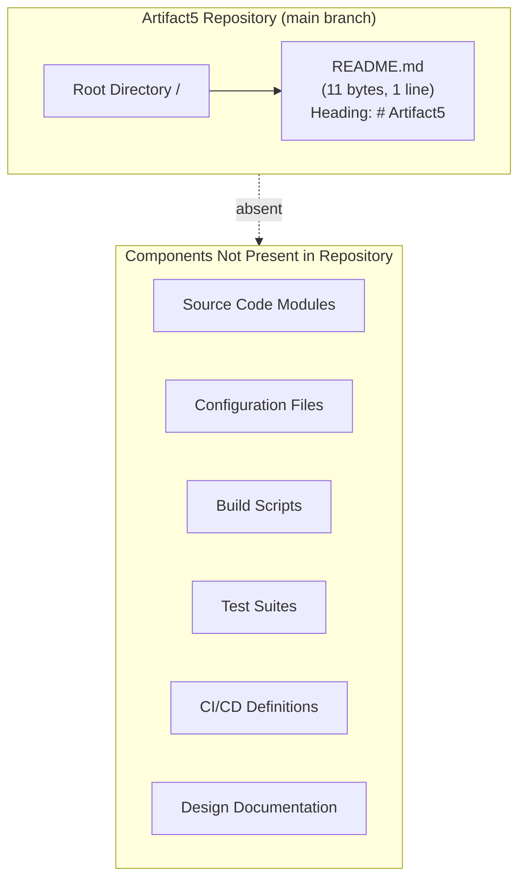

#### Core Technical Approach

No technology stack, framework selection, architectural pattern, or implementation strategy is documented in the repository. There are no package manifests (`package.json`, `pom.xml`, `requirements.txt`, `Cargo.toml`, `go.mod`, etc.), no Dockerfiles, no infrastructure-as-code, and no language-specific source files. A technical approach **cannot be specified** from the available evidence.

### 1.2.3 Success Criteria

#### Measurable Objectives

The repository does not include objective-key-results documents, acceptance criteria, definition-of-done artifacts, or measurable goals. Measurable objectives **cannot be enumerated** from the repository contents.

#### Critical Success Factors

No success-factor inventory, risk register, or governance document is present in the repository.

#### Key Performance Indicators (KPIs)

No KPI catalogue, metrics definitions, telemetry plan, or analytics specification is present in the repository.

| Success-Criteria Dimension | Status in Repository |
|----------------------------|---------------------|
| Measurable Objectives | Not present |
| Critical Success Factors | Not present |
| Key Performance Indicators | Not present |
| Acceptance Criteria | Not present |

## 1.3 SCOPE

The scope of a Technical Specification is normally defined by the features, workflows, integrations, and user groups represented in the codebase and supporting documentation. Because the Artifact5 repository contains no implementation or functional documentation, the scope statement below is intentionally narrow and faithful to the verifiable repository state.

### 1.3.1 In-Scope Elements

#### Core Features and Functionalities

| Category | In-Scope Item | Source of Evidence |
|----------|---------------|--------------------|
| Documentation Artifact | The `README.md` file at the repository root | Repository file listing |
| Project Identifier | The literal project name "Artifact5" | `README.md` content (H1 heading) |
| Version Control | A single `main` branch with one initial commit tracked against `origin/main` | Git repository metadata |

No must-have capabilities, primary user workflows, essential integrations, or technical requirements are presently encoded in the repository. Any such items added in future iterations will require expansion of this section in subsequent revisions of the Technical Specification.

#### Implementation Boundaries

| Boundary Dimension | Defined Boundary |
|--------------------|------------------|
| System Boundary | The Git repository identified as "Artifact5" (single `main` branch, one initial commit) |
| User Groups Covered | None defined in repository |
| Geographic / Market Coverage | None defined in repository |
| Data Domains Included | None defined in repository |

### 1.3.2 Out-of-Scope Elements

Because the repository contains no functional implementation, every capability commonly associated with a software system is out-of-scope for the current revision of this specification. The following enumeration documents this state explicitly:

| Category | Out-of-Scope Item | Reason |
|----------|-------------------|--------|
| Application Logic | All business logic, computations, workflows | No source files present in repository |
| User Interfaces | All web, mobile, or desktop UIs | No UI assets, frameworks, or markup present |
| APIs / Services | All HTTP, gRPC, GraphQL, or messaging endpoints | No service definitions present |
| Data Persistence | Databases, caches, file stores, schemas | No data-tier artifacts present |
| Authentication / Authorization | Identity, access control, session management | No auth modules or policies present |
| Integrations | Third-party services, internal systems, partner APIs | No integration manifests or contracts present |
| Build & Deployment | Build pipelines, container images, infrastructure-as-code | No build scripts, Dockerfiles, or CI definitions present |
| Testing | Unit, integration, end-to-end, performance tests | No test files or test framework configuration present |
| Observability | Logging, metrics, tracing, alerting | No instrumentation or telemetry configuration present |
| Security Controls | Cryptographic libraries, secret management, compliance tooling | No security artifacts present |
| Documentation Beyond Title | API docs, user guides, runbooks, ADRs | No documentation files beyond the title heading present |
| Configuration Management | Environment configs, feature flags, runtime parameters | No configuration files present |

#### Future Phase Considerations

The repository does not contain a roadmap, milestone plan, phased-delivery document, or backlog. Future phases of work **cannot be enumerated** from the repository's current contents.

#### Integration Points Not Covered

No integration points are covered because no integration points are defined. The catalogue of "integration points not covered" is therefore equivalent to the universal set of possible integrations.

#### Unsupported Use Cases

Because no use cases are defined in the repository, no use cases are presently supported. The complete enumeration of unsupported use cases cannot be bounded from the available evidence.

### 1.3.3 Scope Summary and Forward-Looking Note

The diagram below summarises the current scope envelope of this Technical Specification relative to the verifiable artifacts in the repository.

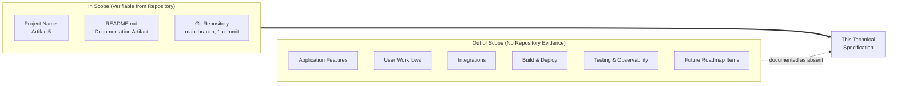

This Technical Specification should be treated as a **living document**. As implementation artifacts are added to the repository — source code, configuration, manifests, tests, infrastructure definitions, and design documentation — the corresponding subsections of this Introduction must be updated to reflect the verifiable scope expansion. Until such artifacts exist in the repository, the statements in this section accurately represent the system's current state.

## 1.4 REFERENCES

### 1.4.1 Files Examined

- `README.md` — The sole content artifact in the repository (11 bytes, one line). Used as the source of the project identifier "Artifact5" referenced throughout this section.

### 1.4.2 Folders Explored

- `/` (repository root, depth 0) — Confirmed to contain exactly one direct child (`README.md`) and no subdirectories. This finding established the empty-implementation state described throughout the Scope subsection.

### 1.4.3 Repository Metadata Consulted

- **Git branch listing** — Confirmed a single `main` branch tracking `origin/main`.
- **Git commit log** — Confirmed exactly one commit (`d4a7aa2720f123db7a3051b49869b2fe448389a2`, message "Initial commit", dated 28 May 2026) authored by `shalini690 <shalini@blitzy.io>`. Used as the source of stakeholder and provenance information in §1.1.1 and §1.1.3.
- **Git show --stat HEAD** — Confirmed the initial commit contains a single file addition (`README.md`, 1 insertion), corroborating the empty-implementation finding.

### 1.4.4 Cross-Referenced Technical Specification Sections

No sibling Technical Specification sections were available for cross-reference at the time of this section's authorship. The list of retrievable sections supplied to the author was empty (`[]`).

### 1.4.5 Negative-Result Searches (Confirming Absence)

The following semantic searches were executed against the repository and returned zero results, corroborating the absence statements made throughout §1.2 and §1.3:

| Search Query | Result |
|--------------|--------|
| "source code implementation files application logic" (file search) | 0 results |
| "configuration package manifest dependencies" (file search) | 0 results |
| "documentation project description" (file search) | 0 results |
| "source code modules packages application" (folder search) | 0 results |

# 2. Product Requirements

## 2.1 PREAMBLE: REQUIREMENTS DERIVABILITY STATEMENT

A conventional Product Requirements section catalogues discrete, testable features alongside their identifiers, acceptance criteria, dependencies, validation rules, and implementation considerations. Production of such a catalogue requires verifiable input artifacts in the repository — typically a combination of source code, configuration manifests, API contracts, user-interface assets, test suites, design documents, backlogs, or roadmap files — from which features can be identified and requirements decomposed.

The Artifact5 repository contains none of these artifacts. As established in §1.1, §1.2, and §1.3, the repository at the time of this specification holds a single 11-byte `README.md` file whose entire content is the heading `# Artifact5`, with zero subdirectories and zero source files. Accordingly, this section faithfully documents the absence of features and requirements rather than fabricating them. The methodology and structure below mirror the precedent established in §1.2.1 ("Project Context"), §1.2.3 ("Success Criteria"), and §1.3.1 ("In-Scope Elements"), where absence is recorded in structured tables with explicit traceability to the underlying evidence.

### 2.1.1 Repository Evidence Underlying This Section

| Evidence Source | Observation | Cross-Reference |
|-----------------|-------------|-----------------|
| `README.md` content | Single line: `# Artifact5` (11 bytes, 1 line) | §1.1.1, §1.4.1 |
| Repository root listing | One direct child (`README.md`), zero subdirectories | §1.2.2, §1.4.2 |
| Git commit metadata | One commit (`d4a7aa2…`), initial commit dated 28 May 2026 | §1.1.1, §1.4.3 |
| Negative-result searches | Zero matches for source code, configuration, tests, UI, build artefacts | §1.4.5 |

### 2.1.2 Methodology for Documenting Absence

This section follows three rules to ensure factual fidelity:

1. **No fabrication.** Per the section prompt's explicit directive — *"Only include sections and items that are actually relevant to this system… Don't add any features of your own, or any items that aren't clearly applicable"* — no feature identifiers (`F-XXX`), requirement identifiers (`F-XXX-RQ-YYY`), or capability descriptions are invented for documentation symmetry.
2. **Structured absence reporting.** Each requested sub-component (Feature Catalog, Functional Requirements Table, Feature Relationships, Implementation Considerations, Traceability Matrix) is enumerated in a status table that records the absence and identifies the supporting evidence, consistent with the table-based patterns used in §1.2.3 and §1.3.1.
3. **Traceability preservation.** Every absence statement is cross-referenced to either a prior section of this Technical Specification or a directly observed repository artifact.

### 2.1.3 Section Prompt Compliance Summary

| Prompt Sub-Component | Applicable to Current Repository? | Treatment in This Section |
|----------------------|-----------------------------------|---------------------------|
| Feature Catalog | No — no features exist | Documented as absent in §2.2 |
| Functional Requirements Table | No — no requirements exist | Documented as absent in §2.3 |
| Feature Relationships | No — no features to relate | Documented as absent in §2.4 |
| Implementation Considerations | No — no implementation exists | Documented as absent in §2.5 |
| Traceability Matrix | No — no requirements to trace | Documented as absent in §2.6 |

---

## 2.2 FEATURE CATALOG

### 2.2.1 Feature Inventory

The Artifact5 repository contains no implemented or documented features. No source code, no user-facing functionality, no service capabilities, no command-line utilities, no library exports, and no configuration-driven behaviours exist. The catalogue below records this empty state.

| Feature ID | Feature Name | Category | Status |
|------------|--------------|----------|--------|
| *(none)* | *(no features identified)* | *(n/a)* | *(no features to status)* |

Because the prompt requires features to be "discrete, testable" units of capability, and no such capabilities are present in the repository, no `F-XXX` identifiers are assigned. This stance is consistent with §1.2.2, which states: *"No functional capabilities are implemented in the repository… The system has no demonstrable capabilities at present."*

### 2.2.2 Feature Metadata Status

The metadata fields specified by the section prompt are recorded as absent below. Each row identifies the evidence supporting the absence.

| Metadata Field | Status | Evidence |
|----------------|--------|----------|
| Unique ID (`F-XXX`) | Not assignable | No features exist to identify (§1.2.2) |
| Feature Name | Not present | `README.md` contains only the project title (§1.4.1) |
| Feature Category | Not present | No taxonomy of capabilities exists in repository |
| Priority Level | Not present | No prioritisation document exists in repository |
| Status (Proposed/Approved/In Development/Completed) | Not present | No lifecycle artefacts exist in repository |

### 2.2.3 Feature Description Status

The descriptive fields required by the section prompt (Overview, Business Value, User Benefits, Technical Context) cannot be populated because their upstream inputs do not exist in the repository.

| Description Field | Status | Reason |
|-------------------|--------|--------|
| Overview | Not present | No feature exists to describe |
| Business Value | Not present | No value proposition documented (§1.1.4) |
| User Benefits | Not present | No user personas or use cases documented (§1.1.3) |
| Technical Context | Not present | No technical approach documented (§1.2.2) |

### 2.2.4 Feature Dependencies Status

Dependencies (Prerequisite Features, System Dependencies, External Dependencies, Integration Requirements) cannot be enumerated because there are no features to which dependencies could attach and no integration manifests in the repository.

| Dependency Class | Status | Evidence |
|------------------|--------|----------|
| Prerequisite Features | Not applicable | No feature catalogue exists (§2.2.1) |
| System Dependencies | Not present | No package manifests, runtime declarations, or platform requirements present (§1.2.2) |
| External Dependencies | Not present | No third-party libraries, services, or SDKs referenced in repository (§1.3.2) |
| Integration Requirements | Not present | No integration points defined (§1.3.2, §1.2.1) |

---

## 2.3 FUNCTIONAL REQUIREMENTS TABLE

### 2.3.1 Requirements Inventory

No functional requirements have been authored, documented, or implied in the Artifact5 repository. The canonical requirements table is therefore empty.

| Requirement ID | Description | Priority | Complexity |
|----------------|-------------|----------|------------|
| *(none)* | *(no requirements identified)* | *(n/a)* | *(n/a)* |

Per the section prompt, requirement identifiers follow the format `F-XXX-RQ-YYY`. Because the parent `F-XXX` feature identifiers cannot be assigned (§2.2.1), no requirement identifiers are issued.

### 2.3.2 Requirement Detail Fields Status

| Detail Field | Status | Evidence |
|--------------|--------|----------|
| Requirement ID | Not assignable | No features exist as parents (§2.2.1) |
| Description | Not present | No functional specifications exist in repository |
| Acceptance Criteria | Not present | Confirmed absent in §1.2.3 ("no acceptance criteria") |
| Priority (Must-Have / Should-Have / Could-Have) | Not present | No prioritisation document exists |
| Complexity (High / Medium / Low) | Not present | No effort or complexity estimates exist |

### 2.3.3 Technical Specification Fields Status

| Specification Field | Status | Evidence |
|---------------------|--------|----------|
| Input Parameters | Not present | No interfaces or signatures defined in repository |
| Output / Response | Not present | No outputs documented in repository |
| Performance Criteria | Not present | No performance targets specified (§1.2.3) |
| Data Requirements | Not present | No data models, schemas, or storage requirements present (§1.3.2) |

### 2.3.4 Validation Rules Status

| Validation Class | Status | Evidence |
|------------------|--------|----------|
| Business Rules | Not present | No business logic or domain documentation in repository |
| Data Validation | Not present | No data schemas, validators, or constraints present |
| Security Requirements | Not present | No security controls, threat model, or policy documented (§1.3.2) |
| Compliance Requirements | Not present | No regulatory, statutory, or contractual mandates documented |

---

## 2.4 FEATURE RELATIONSHIPS

### 2.4.1 Dependency Map

A feature dependency map requires at least one feature node. As established in §2.2.1, the feature inventory is empty. Consequently the dependency graph is the empty graph (zero nodes, zero edges). The diagram below visualises this state and is included to maintain stylistic consistency with §1.2.2 and §1.3.3.

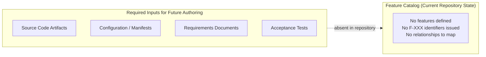

### 2.4.2 Integration Points

No integration points are documented in the repository. §1.3.2 records that "all HTTP, gRPC, GraphQL, or messaging endpoints" and "third-party services, internal systems, partner APIs" are out-of-scope due to the absence of any service definitions or integration manifests. The integration-points inventory is therefore empty.

| Integration Type | Defined in Repository? | Evidence |
|------------------|------------------------|----------|
| Synchronous APIs (HTTP/gRPC/GraphQL) | No | §1.3.2 |
| Asynchronous Messaging | No | §1.3.2 |
| File-Based / Batch Integrations | No | §1.3.2 |
| Third-Party Service Connections | No | §1.3.2 |

### 2.4.3 Shared Components and Common Services

Shared components and common services presuppose a decomposed system with multiple consumers. §1.2.2 records that "a component decomposition cannot be produced because the repository contains no architectural artifacts, no module definitions, no service manifests, and no subdirectory structure." Consequently no shared components or common services exist.

| Element | Status | Evidence |
|---------|--------|----------|
| Shared Libraries / Modules | None present | §1.2.2 |
| Common Services (auth, logging, persistence) | None present | §1.3.2 |
| Cross-Cutting Concerns (caching, retries, telemetry) | None present | §1.3.2 |
| Reusable Domain Models | None present | §1.3.2 |

---

## 2.5 IMPLEMENTATION CONSIDERATIONS

The implementation considerations requested by the section prompt — technical constraints, performance requirements, scalability considerations, security implications, and maintenance requirements — are documented as absent below. Each row identifies the prior section of this specification that corroborates the absence.

### 2.5.1 Technical Constraints

| Constraint Dimension | Status | Cross-Reference |
|----------------------|--------|-----------------|
| Programming Language / Runtime | Not specified | §1.2.2 ("no language-specific source files") |
| Framework / Library Constraints | Not specified | §1.2.2 ("no package manifests") |
| Platform / OS Constraints | Not specified | §1.3.2 |
| Versioning / Compatibility Constraints | Not specified | §1.3.2 |

### 2.5.2 Performance and Scalability

| Consideration | Status | Cross-Reference |
|---------------|--------|-----------------|
| Throughput / Latency Targets | Not present | §1.2.3 ("no KPI catalogue") |
| Concurrency Requirements | Not present | §1.2.3 |
| Resource Footprint Targets | Not present | §1.2.3 |
| Horizontal / Vertical Scaling Plans | Not present | §1.3.2 |

### 2.5.3 Security Implications

| Security Dimension | Status | Cross-Reference |
|--------------------|--------|-----------------|
| Authentication / Authorisation Model | Not present | §1.3.2 |
| Data Protection (at rest / in transit) | Not present | §1.3.2 |
| Threat Model / Risk Register | Not present | §1.2.3 |
| Secret Management | Not present | §1.3.2 |

### 2.5.4 Maintenance Requirements

| Maintenance Dimension | Status | Cross-Reference |
|-----------------------|--------|-----------------|
| Observability (logs, metrics, traces) | Not present | §1.3.2 |
| Deployment / Release Procedures | Not present | §1.3.2 |
| Backup / Recovery Procedures | Not present | §1.3.2 |
| Runbooks / Operational Documentation | Not present | §1.3.2 |

---

## 2.6 TRACEABILITY MATRIX

A traceability matrix correlates requirements to features, test cases, design artifacts, and source modules. Because §2.2 documents zero features and §2.3 documents zero requirements, the matrix has no rows and no columns to populate. The placeholder structure below preserves the intended schema for future revisions.

| Requirement ID | Feature ID | Source Module | Test Case ID |
|----------------|------------|---------------|--------------|
| *(none)* | *(none)* | *(none)* | *(none)* |

### 2.6.1 Matrix Status Summary

| Matrix Dimension | Current State | Trigger for Population |
|------------------|---------------|------------------------|
| Requirement → Feature linkage | Empty | First documented requirement (§2.3.1) |
| Feature → Source module linkage | Empty | First source-code artefact added to repository |
| Requirement → Test case linkage | Empty | First test file added to repository |
| Requirement → Acceptance criterion | Empty | First acceptance criterion documented |

### 2.6.2 Cross-Reference to Prior Sections

The empty matrix is consistent with, and directly entailed by, the findings in §1.1.4 (no value proposition derivable), §1.2.2 (no system capabilities), §1.2.3 (no acceptance criteria), and §1.3.1 (no must-have capabilities or technical requirements presently encoded).

---

## 2.7 FORWARD-LOOKING GUIDANCE

Consistent with the "living document" note in §1.3.3, this section must be re-authored — not merely amended — when implementation artefacts are introduced to the repository. The guidance below identifies the conditions and inputs that would trigger such re-authoring.

### 2.7.1 Triggering Conditions for Future Authoring

| Trigger Event | Section 2 Action |
|---------------|------------------|
| First feature specification document added to repository | Populate §2.2 Feature Catalog with `F-001`, `F-002`, … |
| First requirements artefact (user story, acceptance test, spec) added | Populate §2.3 Functional Requirements Table |
| First integration or dependency declaration added | Populate §2.2.4 and §2.4.2 |
| First test suite added | Populate §2.6 Traceability Matrix with test-case linkages |

### 2.7.2 Required Artifact Classes for Section Population

To populate this section in a future revision, the repository should contain at minimum:

| Artifact Class | Purpose for Section 2 |
|----------------|-----------------------|
| Source code with discoverable modules | Identification of feature boundaries and capability scope |
| Package manifest (e.g., `package.json`, `pom.xml`, `requirements.txt`) | Enumeration of system and external dependencies |
| Requirements or user-story documents | Population of §2.3 with `F-XXX-RQ-YYY` rows |
| Test files with assertion logic | Acceptance criteria derivation and traceability linkage |
| Design / architecture documentation | Identification of shared components and common services |

### 2.7.3 Assumptions and Constraints for Future Revisions

| Item | Assumption / Constraint |
|------|-------------------------|
| Identifier scheme | `F-XXX` features and `F-XXX-RQ-YYY` requirements remain the canonical formats |
| ID monotonicity | Once issued, identifiers are not reused even if features are deprecated |
| Versioning | Each revision of this section records the Git commit hash from which features were derived |
| Source of truth | Repository contents take precedence over external documents in case of conflict |

---

## 2.8 REFERENCES

### 2.8.1 Files Examined

- `README.md` — The sole content artefact in the repository (11 bytes, one line containing the heading `# Artifact5`). Used to confirm the absence of any feature description, requirement statement, acceptance criterion, or capability narrative.

### 2.8.2 Folders Explored

- `/` (repository root, depth 0) — Confirmed to contain exactly one direct child (`README.md`) and zero subdirectories. This established that no source-code module, configuration directory, test directory, or documentation directory exists from which features could be catalogued.

### 2.8.3 Technical Specification Sections Cross-Referenced

- **§1.1 EXECUTIVE SUMMARY** — Source of baseline facts: project identifier "Artifact5", initial-commit placeholder state, absence of stakeholders beyond the Git commit author, and absence of any value proposition.
- **§1.2 SYSTEM OVERVIEW** — Source of the explicit findings that no functional capabilities exist, no component decomposition is possible, no technical approach is documented, and no measurable objectives or KPIs can be enumerated.
- **§1.3 SCOPE** — Source of the exhaustive out-of-scope enumeration (application logic, UI, APIs, persistence, auth, integrations, build/deploy, testing, observability, security, documentation beyond the title, configuration management) and the living-document directive that governs future revisions of this section.
- **§1.4 REFERENCES** — Source of provenance for the Git metadata (single `main` branch, commit `d4a7aa2…`, dated 28 May 2026) and confirmation of the negative-result semantic searches that underpin the absence statements in this section.

### 2.8.4 Negative-Result Searches Inherited from Prior Sections

The negative-result searches documented in §1.4.5 directly support the absence statements made throughout this section. No additional searches were required for Section 2 because the search universe for "features", "requirements", and "capabilities" is a strict subset of the search universe already exhausted in §1.4.5 (source code, configuration, package manifests, documentation, source code modules).

| Inherited Search | Result | Supports |
|------------------|--------|----------|
| "source code implementation files application logic" | 0 results | §2.2.1, §2.5.1 |
| "configuration package manifest dependencies" | 0 results | §2.2.4, §2.5.1 |
| "documentation project description" | 0 results | §2.2.3 |
| "source code modules packages application" | 0 results | §2.4.3 |

# 3. Technology Stack

The Technology Stack section of a Technical Specification normally enumerates the programming languages, frameworks, libraries, open-source dependencies, third-party services, data stores, and development/deployment tooling that constitute the realised system. Each item is typically supported by version pins, selection criteria, compatibility constraints, and security considerations sourced from package manifests, lockfiles, container definitions, infrastructure-as-code, CI configuration, and source files within the repository.

The Artifact5 repository contains **none of these inputs**. As established in §1.2.2, the repository holds a single 11-byte `README.md` file whose entire content is the heading `# Artifact5`, with zero subdirectories and zero source files. Accordingly, Section 3 faithfully records the absence of technology choices rather than fabricating them. Every subsection below is anchored to the verified repository state and cross-references the prior sections of this specification that corroborate the absence.

## 3.1 Preamble: Technology Stack Derivability Statement

This subsection states explicitly which subsections of the prompt are applicable to the current revision of the repository and how absence is recorded. The methodology mirrors the precedent set in §2.1 ("Preamble: Requirements Derivability Statement") and §2.5 ("Implementation Considerations").

### 3.1.1 Repository Evidence Underlying This Section

The following artifacts (and only these artifacts) are present in the repository and are the sole basis for the documentation in this section. No technology stack component can be derived beyond what these artifacts evidence.

| Evidence Source | Observation | Cross-Reference |
|-----------------|-------------|-----------------|
| `README.md` content | Single line: `# Artifact5` (11 bytes, 1 line) | §1.1.1, §2.1.1 |
| Repository root listing | One direct child (`README.md`), zero subdirectories | §1.2.2, §2.1.1 |
| Git commit metadata | One commit (`d4a7aa2…`), initial commit dated 28 May 2026 | §1.1.1, §2.1.1 |
| Negative-result searches | Zero matches for source code, configuration manifests, container definitions, CI/CD workflows, tests, database artefacts, authentication modules, third-party integrations | §1.4.5, §2.8 |

### 3.1.2 Methodology for Documenting Absence

Three rules govern the contents of Section 3, in direct continuity with §2.1.2:

1. **No fabrication of technology choices.** Per the section prompt's explicit directive — *"Only include sections and items that are actually relevant to this system… Don't add any items that aren't clearly applicable"* — no language, framework, library, service, data store, or tooling selection is invented for documentation symmetry. The default technology stack supplied as a fallback in the prompt (AWS, Docker, Terraform, GitHub Actions, Python, Flask, Auth0, MongoDB, Langchain, React, TailwindCSS, React-Native, Swift, Kotlin, Objective-C, ElectronJS) is **not applied**, because no repository artifact supports any of those selections.
2. **No fabrication of versions.** The prompt's general guidance to "include version numbers for all components" applies only to components that exist in the repository. Because no components exist, no version numbers can be authored.
3. **No fabrication of security implications, integration requirements, or compatibility matrices.** The prompt's general guidance regarding security, integration, and compatibility applies only when choices have been made. Because no choices have been made, none of these analyses can be produced.

### 3.1.3 Subsection Applicability Summary

The section prompt enumerates six technology-stack subsections. Their applicability to the current repository state is summarised below.

| Prompt Subsection | Applicable to Current Repository? | Treatment in This Section |
|-------------------|-----------------------------------|---------------------------|
| Programming Languages | No — no source files in any programming language | Documented as absent in §3.2 |
| Frameworks & Libraries | No — no package manifests or import declarations | Documented as absent in §3.3 |
| Open Source Dependencies | No — no dependency manifests or vendored libraries | Documented as absent in §3.4 |
| Third-Party Services | No — no client code, SDK references, or service configuration | Documented as absent in §3.5 |
| Databases & Storage | No — no drivers, schemas, migrations, or connection configuration | Documented as absent in §3.6 |
| Development & Deployment | No — no build scripts, container definitions, CI/CD workflows, or IaC | Documented as absent in §3.7 |

---

## 3.2 Programming Languages

The Programming Languages subsection of a Technology Specification normally lists languages by platform/component, justifies selection criteria, and notes constraints or dependencies. No such enumeration is possible for the Artifact5 repository because no source files exist in any programming language.

Markdown (the format of `README.md`) is a lightweight markup language used for documentation and is not classified as a programming language for the purposes of this section.

### 3.2.1 Language Inventory

| Evidence Dimension | Finding | Cross-Reference |
|--------------------|---------|-----------------|
| Source files in any compiled language (e.g., C, C++, Rust, Go, Java, Kotlin, Swift, C#) | None present | §1.2.2, §1.3.2 ("Application Logic") |
| Source files in any interpreted language (e.g., Python, JavaScript, TypeScript, Ruby, PHP) | None present | §1.2.2, §1.3.2 ("Application Logic") |
| Language runtime configuration files (e.g., `.nvmrc`, `.python-version`, `.ruby-version`, `runtime.txt`, `.tool-versions`) | None present | §1.2.2 |
| Compiler/transpiler configuration (e.g., `tsconfig.json`, `babel.config.js`, `pyproject.toml` build settings) | None present | §1.2.2 |
| Documented language selection rationale | Not documented | §2.5.1 ("Programming Language / Runtime: Not specified") |

### 3.2.2 Selection Criteria and Constraints

No language selection criteria, constraints, or dependencies are documented in the repository. Per §2.5.1, the "Programming Language / Runtime" technical constraint is recorded as "Not specified". Until a source file in an identifiable programming language is committed to the repository, no language can be attributed to the system.

---

## 3.3 Frameworks & Libraries

The Frameworks & Libraries subsection normally identifies core frameworks (with versions), supporting libraries, compatibility requirements, and justification for each major choice. No such enumeration is possible because no manifest, lockfile, or source-level import declaration is present in the repository.

### 3.3.1 Framework and Library Inventory

| Evidence Dimension | Finding | Cross-Reference |
|--------------------|---------|-----------------|
| Web/application framework manifests (e.g., `package.json`, `pom.xml`, `Gemfile`, `composer.json`, `requirements.txt`, `Cargo.toml`, `go.mod`) | None present | §1.2.2 (explicit enumeration of absent manifests) |
| Framework configuration files (e.g., Spring `application.yml`, Django `settings.py`, Rails `config/`, Express server entrypoints) | None present | §1.2.2 |
| Library import or `use` declarations within source files | None present (no source files exist) | §1.2.2 |
| Version-pinning lockfiles (e.g., `package-lock.json`, `yarn.lock`, `Pipfile.lock`, `poetry.lock`, `Gemfile.lock`, `go.sum`, `Cargo.lock`) | None present | §1.2.2 |
| Documented compatibility matrices | Not documented | §2.5.1 ("Framework / Library Constraints: Not specified", "Versioning / Compatibility Constraints: Not specified") |

### 3.3.2 Justification of Choices

No framework or library has been selected for the Artifact5 repository; therefore no justification can be authored. The selection criteria normally documented in this subsection — fit for purpose, ecosystem maturity, licensing, performance, team expertise, long-term support — cannot be applied to choices that do not exist.

---

## 3.4 Open Source Dependencies

The Open Source Dependencies subsection normally identifies third-party libraries, package registries, and version pins. No such enumeration is possible because no dependency declaration of any form is present in the repository.

### 3.4.1 Dependency Manifest Inventory

| Evidence Dimension | Finding | Cross-Reference |
|--------------------|---------|-----------------|
| Dependency manifests (e.g., `package.json`, `requirements.txt`, `Pipfile`, `pyproject.toml`, `Gemfile`, `composer.json`, `go.mod`, `Cargo.toml`, `pom.xml`, `build.gradle`) | None present | §1.2.2 |
| Lockfiles enumerating transitive dependency versions | None present | §1.2.2 |
| Vendored library directories (e.g., `vendor/`, `node_modules/`, `lib/`, `third_party/`) | None present (repository has zero subdirectories) | §1.2.2 ("zero subdirectories") |
| Package registry references (e.g., npm, PyPI, Maven Central, RubyGems, crates.io, Go module proxy) | None present | §1.2.2 |
| License declarations for the project itself (e.g., `LICENSE`, `LICENSE.txt`, `NOTICE`, SPDX identifiers) | None present | Repository root listing |
| Open-source compliance artefacts (e.g., `SBOM`, `THIRD_PARTY_LICENSES`, CycloneDX/SPDX SBOMs) | None present | Repository root listing |

### 3.4.2 Package Registries and Versions

No package registries are referenced from the repository. No versions of any open-source library can be enumerated. Until a manifest is committed, the system's open-source dependency footprint is the empty set.

---

## 3.5 Third-Party Services

The Third-Party Services subsection normally documents external APIs, authentication providers, monitoring tools, and cloud services. No such enumeration is possible because no client code, SDK declaration, service configuration, or credential reference is present in the repository.

### 3.5.1 External Integration Inventory

| Evidence Dimension | Finding | Cross-Reference |
|--------------------|---------|-----------------|
| External API client code or HTTP client configuration | None present (no source files exist) | §1.3.2 ("Integrations: No integration manifests or contracts present") |
| Authentication provider integration (e.g., OAuth/OIDC clients, SAML metadata, JWT validators, Auth0/Okta/Cognito SDKs) | None present | §2.5.3 ("Authentication / Authorisation Model: Not present") |
| Monitoring/observability tool integration (e.g., Datadog, New Relic, Sentry, OpenTelemetry exporters, Prometheus scrape configs) | None present | §2.5.4 ("Observability: Not present") |
| Cloud service configuration (e.g., AWS/GCP/Azure SDK initialisation, service principals, IAM bindings) | None present | §1.3.2 ("Build & Deployment"), §2.5.4 ("Deployment / Release Procedures: Not present") |
| Environment / secret configuration (e.g., `.env`, `.env.example`, `config/`, Vault references, KMS bindings) | None present | §2.5.3 ("Secret Management: Not present") |
| SDK declarations within dependency manifests | None present (no manifests exist) | §1.2.2 |

### 3.5.2 Authentication, Monitoring, and Cloud Services

The four dimensions called out by the section prompt — External APIs, Authentication services, Monitoring tools, Cloud services — are each documented as absent in §1.3.2 and §2.5.3/§2.5.4. No specific provider can be attributed to the system at the present revision.

---

## 3.6 Databases & Storage

The Databases & Storage subsection normally documents primary and secondary databases, persistence strategies, caching solutions, and storage services. No such enumeration is possible because no driver, schema, migration, or connection configuration is present in the repository.

### 3.6.1 Data Tier Inventory

| Evidence Dimension | Finding | Cross-Reference |
|--------------------|---------|-----------------|
| Relational database driver dependencies (e.g., PostgreSQL, MySQL, SQL Server, Oracle, SQLite drivers) | None present (no manifests exist) | §1.2.2, §1.3.2 ("Data Persistence") |
| Document/NoSQL database driver dependencies (e.g., MongoDB, DynamoDB, Cassandra, CouchDB drivers) | None present | §1.2.2 |
| Key-value / cache driver dependencies (e.g., Redis, Memcached, Hazelcast) | None present | §1.3.2 |
| Schema or migration artefacts (e.g., `schema.sql`, `migrations/`, Flyway, Liquibase, Alembic, Prisma schemas, Sequelize/TypeORM models) | None present (repository has zero subdirectories) | §1.2.2 |
| Connection configuration (e.g., connection strings in `.env`, `application.yml`, `database.yml`, ORM configs) | None present | §2.5.3 ("Secret Management: Not present") |
| Object/blob storage configuration (e.g., S3, GCS, Azure Blob, MinIO bindings) | None present | §1.3.2 |
| Search index configuration (e.g., Elasticsearch, OpenSearch, Algolia, Meilisearch) | None present | §1.3.2 |
| Backup / recovery procedures | Not documented | §2.5.4 ("Backup / Recovery Procedures: Not present") |

### 3.6.2 Persistence and Caching Strategy

No persistence or caching strategy is documented in the repository. The data tier of the system is, at the present revision, undefined. No primary database, secondary database, cache, or storage service can be attributed to the system.

---

## 3.7 Development & Deployment

The Development & Deployment subsection normally documents development tools, build systems, containerisation, and CI/CD requirements. No such enumeration is possible because no build scripts, container definitions, CI/CD workflows, or infrastructure-as-code artefacts are present in the repository.

### 3.7.1 Development Tooling Inventory

| Evidence Dimension | Finding | Cross-Reference |
|--------------------|---------|-----------------|
| Build system files (e.g., `Makefile`, `build.gradle`, `pom.xml`, `setup.py`, `pyproject.toml`, `Rakefile`, `webpack.config.js`, `vite.config.ts`) | None present | §1.2.2, §1.3.2 ("Build & Deployment") |
| Local development tooling (e.g., `.devcontainer/`, `Vagrantfile`, `tilt.yaml`, `skaffold.yaml`, `docker-compose.dev.yml`) | None present | §1.2.2 |
| Editor/IDE configuration (e.g., `.editorconfig`, `.vscode/`, `.idea/`) | None present | Repository root listing |
| Linters and formatters configuration (e.g., `.eslintrc`, `.prettierrc`, `.flake8`, `pyproject.toml` lint configs, `.rubocop.yml`) | None present | Repository root listing |
| Pre-commit / git hooks configuration (e.g., `.pre-commit-config.yaml`, `.husky/`, `lefthook.yml`) | None present | Repository root listing |

### 3.7.2 Containerisation Inventory

| Evidence Dimension | Finding | Cross-Reference |
|--------------------|---------|-----------------|
| Container build definitions (e.g., `Dockerfile`, `Containerfile`, `*.Dockerfile`) | None present | §1.2.2, §1.3.2 ("Build & Deployment") |
| Multi-container orchestration definitions (e.g., `docker-compose.yml`, `docker-compose.override.yml`) | None present | §1.2.2 |
| Container ignore files (e.g., `.dockerignore`) | None present | Repository root listing |
| Kubernetes manifests or Helm charts (e.g., `k8s/`, `charts/`, `*.yaml` with `apiVersion`/`kind`) | None present | §1.2.2 |

### 3.7.3 CI/CD Inventory

| Evidence Dimension | Finding | Cross-Reference |
|--------------------|---------|-----------------|
| GitHub Actions workflows (`.github/workflows/*.yml`) | None present (no `.github/` directory) | §1.2.2, §1.3.2 ("Build & Deployment") |
| GitLab CI configuration (`.gitlab-ci.yml`) | None present | §1.2.2 |
| Jenkins pipelines (`Jenkinsfile`, `Jenkinsfile.*`) | None present | §1.2.2 |
| CircleCI configuration (`.circleci/config.yml`) | None present | §1.2.2 |
| Other CI providers (Travis, Drone, Bitbucket Pipelines, Azure Pipelines, Buildkite) | None present | §1.2.2 |
| Release automation (e.g., `release-please`, `semantic-release`, `goreleaser`) | None present | §2.5.4 ("Deployment / Release Procedures: Not present") |

### 3.7.4 Infrastructure-as-Code Inventory

| Evidence Dimension | Finding | Cross-Reference |
|--------------------|---------|-----------------|
| Terraform definitions (`*.tf`, `*.tfvars`, `terraform.lock.hcl`) | None present | §1.2.2, §1.3.2 ("Build & Deployment") |
| AWS CloudFormation templates (`*.yaml`, `*.json` with `AWSTemplateFormatVersion`) | None present | §1.2.2 |
| Pulumi programs (`Pulumi.yaml`, language-specific Pulumi source) | None present | §1.2.2 |
| AWS CDK projects (`cdk.json`, CDK source) | None present | §1.2.2 |
| Ansible playbooks (`*.yml` with `hosts:` keys, `inventories/`, `roles/`) | None present | §1.2.2 |
| Bicep / ARM templates | None present | §1.2.2 |

### 3.7.5 Justification and Requirements

No development, build, containerisation, CI/CD, or IaC tooling has been selected for the Artifact5 repository. The criteria normally documented here — reproducibility, build time, artefact provenance, supply-chain security, release cadence — cannot be applied to a toolchain that does not exist.

---

## 3.8 Technology Stack Visualisation

The diagram below visualises the verifiable state of the technology stack relative to the prompt's six requested subsections. It mirrors the visual pattern established in §1.2.2 ("Major System Components") and §1.3.3 ("Scope Summary"), where what exists is contrasted with what is documented as absent.

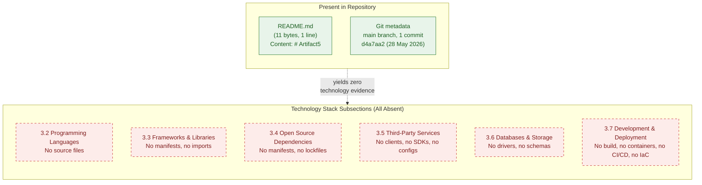

The diagram conveys two facts simultaneously: (1) the only verifiable artefacts in the repository are `README.md` and the single initial Git commit, and (2) each of the six technology-stack subsections enumerated by the section prompt resolves to "absent" when measured against that evidence base.

---

## 3.9 Forward-Looking Guidance

Consistent with the "living document" directive established in §1.3.3 and the trigger-event pattern introduced in §2.7.1, this section must be re-authored — not merely amended — when implementation artefacts that bear on the technology stack are introduced to the repository. The guidance below identifies the conditions and inputs that would trigger such re-authoring for each subsection.

### 3.9.1 Triggering Conditions for Future Authoring

| Trigger Event | Section 3 Action |
|---------------|------------------|
| First source file committed in an identifiable programming language | Populate §3.2 with the language, runtime version (from `.nvmrc`/`.python-version`/etc.), and selection rationale |
| First package manifest committed (e.g., `package.json`, `requirements.txt`, `pom.xml`, `Cargo.toml`, `go.mod`) | Populate §3.3 with core frameworks and supporting libraries, including version pins from the manifest and any accompanying lockfile |
| First lockfile committed (e.g., `package-lock.json`, `poetry.lock`, `Gemfile.lock`, `go.sum`, `Cargo.lock`) | Populate §3.4 with the resolved transitive dependency graph, registries, and pinned versions |
| First external service client, SDK declaration, or service configuration committed | Populate §3.5 with the service identity, integration mode, authentication mechanism, and credential management strategy |
| First database driver, schema, migration, or connection configuration committed | Populate §3.6 with the chosen database engine, persistence strategy, and caching layer (if any) |
| First `Dockerfile`, `docker-compose.yml`, or Kubernetes manifest committed | Populate §3.7.2 with the container runtime, base images, and orchestration target |
| First CI workflow file committed (e.g., `.github/workflows/*.yml`, `.gitlab-ci.yml`, `Jenkinsfile`) | Populate §3.7.3 with the CI/CD provider, pipeline structure, and gate criteria |
| First IaC artefact committed (e.g., `*.tf`, CDK source, Pulumi program, CloudFormation template) | Populate §3.7.4 with the IaC tool, target cloud provider(s), and provisioning model |
| First `LICENSE` file committed | Record the project license and any third-party license obligations in §3.4 |

### 3.9.2 Required Artifact Classes for Section Population

To populate §3 in a future revision, the repository should contain at minimum the artifact classes listed below. The mapping identifies which subsection each class informs.

| Artifact Class | Subsection(s) Informed |
|----------------|------------------------|
| Source files with file extensions in known languages | §3.2 (Programming Languages) |
| Package manifest (e.g., `package.json`, `pyproject.toml`, `pom.xml`) | §3.3, §3.4 |
| Lockfile (e.g., `package-lock.json`, `poetry.lock`) | §3.4 |
| Service client code or SDK declaration | §3.5 |
| Database driver dependency, schema, or migration artefact | §3.6 |
| Container build definition (`Dockerfile`) | §3.7.2 |
| CI/CD pipeline definition | §3.7.3 |
| Infrastructure-as-code source | §3.7.4 |
| `LICENSE` or `NOTICE` file | §3.4 |
| Configuration management files (`.env.example`, `config/`) | §3.5, §3.6 |

### 3.9.3 Assumptions and Constraints for Future Revisions

| Item | Assumption / Constraint |
|------|-------------------------|
| Version pinning | Future revisions will record exact version numbers from manifests and lockfiles; no version may be authored absent direct evidence |
| Security implications | Future revisions will document security implications only for technologies actually selected; no hypothetical threat model is recorded for absent components |
| Integration requirements | Future revisions will document inter-component integration only between components actually present in the repository |
| Default technology stack | The default technology stack supplied in the section prompt (AWS, Docker, Terraform, GitHub Actions, Python, Flask, Auth0, MongoDB, Langchain, React, TailwindCSS, React-Native, Swift, Kotlin, Objective-C, ElectronJS) is **not** applied retroactively; it may only be referenced in future revisions if and when corresponding artefacts are committed to the repository |
| Source of truth | Repository contents take precedence over external documents in case of conflict, consistent with §2.7.3 |

---

## 3.10 References

### 3.10.1 Files Examined

- `README.md` — Sole content artifact in the repository (11 bytes, 1 line). Verified to contain only the heading `# Artifact5`. Establishes the baseline absence of any technology stack indicator.

### 3.10.2 Folders Explored

- `/` (repository root, depth 0) — Confirmed to contain exactly one direct child (`README.md`) and zero subdirectories. No `.github/`, `.vscode/`, `.devcontainer/`, `vendor/`, `node_modules/`, `lib/`, `src/`, `app/`, `migrations/`, `infrastructure/`, `terraform/`, `k8s/`, `charts/`, or any other directory commonly associated with technology stack artefacts.

### 3.10.3 Categories of Absent Artefacts Verified

The following artefact categories were verified absent by repository file/folder enumeration and negative-result semantic searches (inherited from §1.4.5 and §2.8):

- Source files in any programming language
- Package manifests (`package.json`, `pom.xml`, `requirements.txt`, `Cargo.toml`, `go.mod`, `Gemfile`, `composer.json`, `build.gradle`, `pyproject.toml`)
- Lockfiles (`package-lock.json`, `yarn.lock`, `poetry.lock`, `Pipfile.lock`, `Gemfile.lock`, `go.sum`, `Cargo.lock`)
- Container build definitions (`Dockerfile`, `docker-compose.yml`, `.dockerignore`)
- CI/CD workflow files (`.github/workflows/*.yml`, `.gitlab-ci.yml`, `Jenkinsfile`, `.circleci/config.yml`)
- Infrastructure-as-code source (`*.tf`, `Pulumi.yaml`, CDK source, CloudFormation templates, Ansible playbooks)
- Database schemas, migrations, and ORM model files
- Environment / secret configuration (`.env`, `.env.example`, `config/`)
- License declarations (`LICENSE`, `NOTICE`, SPDX identifiers)
- Editor / linter / formatter / pre-commit configuration files

### 3.10.4 Technical Specification Sections Cross-Referenced

- **§1.1 Executive Summary** — Baseline facts (Artifact5 identifier, 11-byte `README.md`, single initial commit, zero source files, zero subdirectories).
- **§1.2 System Overview** — Explicit enumeration of absent manifests, source files, Dockerfiles, and infrastructure-as-code in §1.2.2 ("Core Technical Approach"); empty component decomposition diagram pattern.
- **§1.3 Scope** — Exhaustive out-of-scope catalogue in §1.3.2 covering build/deploy, data persistence, authentication, integrations, observability, security controls, and configuration management; "living document" directive in §1.3.3.
- **§1.4 References** — Provenance of Git metadata and the original negative-result search queries on which absence is corroborated.
- **§2.1 Preamble: Requirements Derivability Statement** — "No fabrication" methodology rule (§2.1.2) directly inherited by Section 3.
- **§2.5 Implementation Considerations** — Most directly relevant prior section; documents absence of programming-language and framework constraints (§2.5.1), performance targets (§2.5.2), security model (§2.5.3), and observability/deployment (§2.5.4). Each absence row in Section 3 traces back to a row in §2.5.
- **§2.7 Forward-Looking Guidance** — Trigger-event pattern (§2.7.1) and assumptions table (§2.7.3) directly mirrored in §3.9.
- **§2.8 References** — Negative-result-search inheritance pattern used to corroborate absence in this section.

### 3.10.5 Authoring Posture

This section was authored under the strict no-fabrication rule established in §2.1.2. No language, framework, library, service, data store, or tooling has been attributed to the Artifact5 system because no repository artefact evidences such an attribution. The default technology stack supplied in the section prompt was evaluated and found inapplicable to the current repository state; it has therefore not been inserted into Section 3. When implementation artefacts are committed to the repository, Section 3 will be re-authored against those artefacts in accordance with the trigger conditions enumerated in §3.9.1.

# 4. Process Flowchart

A conventional Process Flowchart section of a Technical Specification documents end-to-end business processes, integration workflows, validation gates, state transitions, error-handling paths, and timing/SLA constraints — each rendered as a labelled diagram that traces actors, systems, decision points, and recovery procedures through the realised application. Production of such artefacts requires verifiable inputs in the repository: implemented features or use-cases, API contracts or service definitions, state-bearing data models, error-handling code, retry/circuit-breaker configurations, observability instrumentation, and SLO documentation.

The Artifact5 repository contains **none of these inputs**. As established exhaustively in §1.2.2 ("No functional capabilities are implemented in the repository… The system has no demonstrable capabilities at present"), §1.3.2 (exhaustive out-of-scope catalogue covering application logic, UIs, APIs, persistence, authentication, integrations, build/deploy, testing, observability, security), §2.2.1 ("The Artifact5 repository contains no implemented or documented features"), §2.3 (no functional requirements, no business rules, no data validation, no compliance requirements), §2.4.2 ("No integration points are documented in the repository"), §2.4.3 ("Cross-Cutting Concerns (caching, retries, telemetry): None present"), §2.5.4 (Observability, Backup/Recovery, Runbooks all "Not present"), and §3.6 (no databases, drivers, schemas, migrations, or caching solutions), there exists no process to flowchart, no integration to sequence, and no state machine to diagram. Section 4 therefore faithfully records the absence of process artefacts rather than fabricating them.

The structure of this section mirrors the no-fabrication precedent established in §2.1 ("Preamble: Requirements Derivability Statement") and §3.1 ("Preamble: Technology Stack Derivability Statement"), and the structured-absence-reporting precedent established throughout §2.2–§2.6 and §3.2–§3.7. The single visualisation included in §4.5 follows the styling and contrastive-subgraph pattern established in §1.2.2, §1.3.3, §2.4.1, and §3.8.

---

## 4.1 Preamble: Process Flowchart Derivability Statement

This subsection states explicitly which sub-components of the section prompt are applicable to the current revision of the repository and how absence is recorded. The methodology is in direct continuity with §2.1.2 and §3.1.2.

### 4.1.1 Repository Evidence Underlying This Section

The artefacts enumerated below are the only artefacts present in the repository and are the sole evidentiary basis for the documentation in Section 4. No workflow, sequence, state diagram, or error-handling flow can be derived beyond what these artefacts evidence.

| Evidence Source | Observation | Cross-Reference |
|-----------------|-------------|-----------------|
| `README.md` content | Single line: `# Artifact5` (11 bytes, 1 line) | §1.1.1, §2.1.1, §3.1.1 |
| Repository root listing | One direct child (`README.md`), zero subdirectories | §1.2.2, §1.4.2, §2.8.2, §3.10.2 |
| Git commit metadata | One commit (`d4a7aa2…`), initial commit dated 28 May 2026 | §1.1.1, §1.4.3 |
| Negative-result searches (workflow / process / integration / API / error-handling / retry) | Zero matches in repository | §1.4.5, §2.8.4 |

### 4.1.2 Methodology for Documenting Absence

Four rules govern the contents of Section 4, in direct continuity with §2.1.2 and §3.1.2:

1. **No fabrication of workflows.** No business process, user journey, sequence diagram, integration flow, or state machine is invented for documentation symmetry. The default workflows commonly assumed in similar systems — login flows, CRUD pipelines, request/response sequences, queue-consumer loops, batch ETL pipelines — are **not applied**, because no repository artefact supports any such process.
2. **No fabrication of decision logic, validation rules, or SLAs.** The section prompt's general guidance to document decision diamonds, business-rule validations, authorisation checkpoints, regulatory compliance checks, and timing constraints applies only when such logic exists. Because none has been authored, none can be diagrammed.
3. **No fabrication of state, persistence, caching, or transactional behaviour.** Because §3.6 records the absence of all data-tier drivers, schemas, and migrations, no state transitions, persistence points, cache boundaries, or transaction scopes can be authored.
4. **Structured absence reporting with traceability preservation.** Each prompt sub-component is enumerated in a status table that records the absence and cross-references the prior section of this specification (or the directly observed repository artefact) that corroborates it.

### 4.1.3 Section Prompt Compliance Summary

The section prompt enumerates four high-level groups (System Workflows, Flowchart Requirements, Technical Implementation, Required Diagrams), each with multiple sub-components. The applicability of each to the current repository state is summarised below.

| Prompt Sub-Component | Applicable to Current Repository? | Treatment in This Section |
|----------------------|-----------------------------------|---------------------------|
| Core Business Processes (user journeys, system interactions, decision points, error paths) | No — no business logic, UI, or domain code exists | Documented as absent in §4.2.1 |
| Integration Workflows (data flow, API interactions, event flows, batch sequences) | No — no integration points defined (§2.4.2) | Documented as absent in §4.2.2 |
| Flowchart Structural Elements (start/end, steps, diamonds, system boundaries, user touchpoints, error states, SLAs) | No — no process exists to structure | Documented as absent in §4.3.1 |
| Validation Rules (business rules, data validation, authorisation, compliance) | No — all classes recorded "Not present" in §2.3.4 | Documented as absent in §4.3.2 |
| State Management (transitions, persistence points, caching, transaction boundaries) | No — no state-bearing entities or data tier (§3.6) | Documented as absent in §4.4.1 |
| Error Handling (retries, fallback, notification, recovery) | No — Cross-Cutting Concerns "None present" (§2.4.3); Backup/Recovery "Not present" (§2.5.4) | Documented as absent in §4.4.2 |
| Required Diagrams (system workflow, process flows, error handling, integration sequences, state transitions) | No — none derivable; single empty-state diagram included in §4.5 to maintain stylistic consistency with §1.2.2, §1.3.3, §2.4.1, §3.8 | Diagram inventory documented in §4.5 |

---

## 4.2 System Workflows

The section prompt requests documentation of two workflow classes: Core Business Processes and Integration Workflows. Neither class is derivable from the current repository state. Each sub-component is recorded as absent below, with explicit traceability to the prior section that corroborates the absence.

### 4.2.1 Core Business Processes

A core business process is a sequence of user-or-system-initiated steps that yields a measurable business outcome. Such processes require, at minimum, a defined user population, a feature implementation, and a domain model. As established in §1.2.1 ("No business context, market analysis, competitive positioning, or domain narrative is present in the repository"), §1.3.1 ("No must-have capabilities, primary user workflows, essential integrations, or technical requirements are presently encoded in the repository"), and §2.2.1 ("The Artifact5 repository contains no implemented or documented features"), none of these prerequisites exists.

| Core-Process Dimension | Status | Cross-Reference |
|------------------------|--------|-----------------|
| End-to-End User Journeys | Not present — no user personas, use cases, or UI assets defined | §1.2.2, §1.3.2, §2.2.3 |
| System Interactions | Not present — no services, modules, or interfaces exist to interact | §1.2.2 ("a component decomposition cannot be produced"), §2.4.3 |
| Decision Points (Business-Rule Branches) | Not present — no business rules or domain logic documented | §2.3.4 ("Business Rules: Not present") |
| Error Handling Paths | Not present — no error-handling code, exception strategy, or remediation procedures documented | §2.4.3 ("Cross-Cutting Concerns… None present"), §2.5.4 |
| Process Owner / Actor Definitions | Not present — no stakeholders beyond the initial-commit author | §1.1.1, §2.8.3 |
| Business Outcome / Acceptance Criteria | Not present — no objectives, KPIs, or acceptance criteria recorded | §1.2.3 ("Measurable Objectives… cannot be enumerated"), §2.3.2 |

#### End-to-End User Journeys

No user journey can be charted because no user population is defined, no user-facing functionality is implemented, and no interaction surface (UI, CLI, API, message handler) exists. The catalogue of journeys is therefore empty; the catalogue of "unsupported journeys" is unbounded (§1.3.2: "Unsupported Use Cases… cannot be bounded from the available evidence").

#### System Interactions

No system-to-system or intra-system interactions can be sequenced because §1.2.2 records that "a component decomposition cannot be produced," §2.4.3 records that "Shared Libraries / Modules: None present" and "Common Services (auth, logging, persistence): None present," and §1.3.2 lists "All HTTP, gRPC, GraphQL, or messaging endpoints" as out-of-scope.

#### Decision Points

No decision diamonds can be authored because no branching logic exists in the repository and §2.3.4 records "Business Rules: Not present" and "Data Validation: Not present." Authoring a decision diamond would require, at minimum, a documented predicate over an identified input — neither predicate nor input has been defined.

#### Error Handling Paths

No error-handling path can be drawn because §2.4.3 records "Cross-Cutting Concerns (caching, retries, telemetry): None present" and §2.5.4 records "Observability (logs, metrics, traces): Not present," "Backup / Recovery Procedures: Not present," and "Runbooks / Operational Documentation: Not present." The repository contains no try/catch logic, no circuit-breaker configuration, no retry policy, and no notification channel.

### 4.2.2 Integration Workflows

Integration workflows require defined integration points — synchronous APIs, asynchronous messages, file/batch transfers, or third-party service calls. §2.4.2 records all four classes as "No" with evidence cross-referenced to §1.3.2. The integration-workflow inventory is therefore empty.

| Integration Workflow Dimension | Status | Cross-Reference |
|--------------------------------|--------|-----------------|
| Data Flow Between Systems | Not present — no source or sink systems defined | §1.2.1 ("No integration diagrams, interface definitions… are present"), §2.4.2 |
| API Interactions (HTTP / gRPC / GraphQL) | Not present — no endpoints, contracts, or clients | §1.3.2, §2.4.2, §3.5 |
| Event Processing Flows (queues, streams, topics) | Not present — no messaging infrastructure documented | §2.4.2 ("Asynchronous Messaging: No"), §3.5 |
| Batch Processing Sequences (scheduled jobs, ETL) | Not present — no batch/file integrations | §2.4.2 ("File-Based / Batch Integrations: No") |
| Third-Party Service Connections | Not present — no SDKs, clients, or service configurations | §2.4.2, §3.5 |
| Data Serialisation Formats / Schemas | Not present — no schema declarations or contracts in repository | §1.3.2, §3.6 |

---

## 4.3 Flowchart Requirements

The section prompt enumerates the structural elements that each major workflow diagram must contain (start/end, process steps, decision diamonds, system boundaries, user touchpoints, error states, SLA annotations) and the validation rules each diagram step must enforce (business rules, data validation, authorisation, compliance). Because Section 4.2 records the absence of all workflows, neither sub-component is presently authorable.

### 4.3.1 Workflow Structural Elements Status

Each element enumerated by the section prompt requires the existence of at least one diagrammable process. As §4.2 records that no process exists, the structural inventory is uniformly empty.

| Structural Element | Status | Cross-Reference |
|--------------------|--------|-----------------|
| Start and End Points | Not authorable — no process boundary defined | §4.2.1, §2.2.1 |
| Process Steps | Not authorable — no procedural logic implemented | §1.2.2, §2.2.1 |
| Decision Diamonds | Not authorable — no business rules or predicates defined | §2.3.4 ("Business Rules: Not present") |
| System Boundaries | Not authorable — single-repository scope with one file; no internal/external system delineation | §1.3.1 ("System Boundary: The Git repository… single `main` branch, one initial commit") |
| User Touchpoints | Not authorable — no user-facing functionality or persona definitions | §1.2.1, §1.3.2 ("User Interfaces… No UI assets… present") |
| Error States and Recovery Paths | Not authorable — no error-handling code or recovery procedure documented | §2.4.3, §2.5.4 |
| Timing Constraints / SLA Annotations | Not authorable — no performance targets or KPIs defined | §1.2.3, §2.5.2 ("Throughput / Latency Targets: Not present", "Concurrency Requirements: Not present") |
| Swim Lanes (Actor / System Partitions) | Not authorable — no actors or systems decomposed | §1.2.1, §1.2.2, §2.4.3 |

### 4.3.2 Validation Rules Status

The validation classes enumerated by the section prompt mirror the four classes already recorded as absent in §2.3.4. The mapping is preserved below for traceability.

| Validation Class | Status | Cross-Reference |
|------------------|--------|-----------------|
| Business Rules at Each Step | Not present — no business logic or domain documentation in repository | §2.3.4 |
| Data Validation Requirements | Not present — no data schemas, validators, or constraints | §2.3.3 ("Data Requirements: Not present"), §2.3.4 |
| Authorisation Checkpoints | Not present — no authentication/authorisation model | §2.5.3 ("Authentication / Authorisation Model: Not present"), §3.5 |
| Regulatory Compliance Checks | Not present — no regulatory, statutory, or contractual mandates documented | §2.3.4 ("Compliance Requirements: Not present") |
| Input Schema Definitions | Not present — no input parameters or signatures defined | §2.3.3 ("Input Parameters: Not present") |
| Output / Response Contracts | Not present — no outputs documented | §2.3.3 ("Output / Response: Not present") |

---

## 4.4 Technical Implementation

The section prompt requests documentation of two technical-implementation classes underlying any process flowchart: State Management and Error Handling. Both are absent from the current repository.

### 4.4.1 State Management

State management documentation requires state-bearing entities, persistence mechanisms, caching layers, and transactional boundaries. §3.6 records the comprehensive absence of all four classes ("No persistence or caching strategy is documented").

| State-Management Dimension | Status | Cross-Reference |
|----------------------------|--------|-----------------|
| State Transitions | Not present — no state machine, finite-state diagram, or stateful entity defined | §1.2.2, §2.2.1 |
| Data Persistence Points | Not present — no databases, file stores, or persistence drivers | §1.3.2 ("All databases, caches, file stores, schemas" out-of-scope), §3.6 |
| Caching Requirements | Not present — no cache drivers or invalidation strategy documented | §2.4.3 ("Cross-Cutting Concerns (caching… ): None present"), §3.6 |
| Transaction Boundaries | Not present — no transactional code, atomicity guarantees, or isolation levels defined | §1.2.2, §3.6 |
| Data Models / Domain Entities | Not present — no ORM models, schemas, or DTOs in repository | §2.3.3, §3.6 |
| Migration / Versioning of State | Not present — no migration framework or schema-evolution artefacts | §3.6, §3.10.3 |

### 4.4.2 Error Handling

Error-handling documentation requires retry policies, fallback strategies, notification channels, and recovery procedures. None of these is documented in the repository.

| Error-Handling Dimension | Status | Cross-Reference |
|--------------------------|--------|-----------------|
| Retry Mechanisms | Not present — no retry policies, backoff strategies, or idempotency keys defined | §2.4.3 ("Cross-Cutting Concerns (… retries …): None present") |
| Fallback Processes | Not present — no fallback paths, circuit breakers, or degraded-mode behaviour documented | §2.4.3, §2.5.4 |
| Error Notification Flows | Not present — no alerting, paging, or notification channels configured | §2.5.4 ("Observability (logs, metrics, traces): Not present"), §3.5 |
| Recovery Procedures | Not present — no runbooks, backup/restore procedures, or disaster-recovery plan | §2.5.4 ("Backup / Recovery Procedures: Not present", "Runbooks / Operational Documentation: Not present") |
| Exception Classification | Not present — no exception hierarchy, error codes, or error-taxonomy artefacts | §2.2.1, §3.2 |
| Dead-Letter / Quarantine Handling | Not present — no messaging infrastructure to source dead letters from | §2.4.2 ("Asynchronous Messaging: No") |

---

## 4.5 Diagram Inventory and Empty-State Visualisation

The section prompt enumerates five required diagram classes. None can be authored against the current repository state. The inventory below records the status of each class; the single empty-state diagram that follows is included solely to maintain stylistic continuity with §1.2.2, §1.3.3, §2.4.1, and §3.8.

### 4.5.1 Requested Diagram Inventory

| Required Diagram | Authorable Against Current Repository? | Rationale (Cross-Reference) |
|------------------|----------------------------------------|------------------------------|
| High-Level System Workflow | No | No process exists to flowchart (§4.2.1, §2.2.1) |
| Detailed Process Flows for Each Core Feature | No | No features defined (§2.2.1 reports zero `F-XXX` identifiers) |
| Error Handling Flowcharts | No | No error-handling code, retry, or recovery procedures (§4.4.2, §2.4.3, §2.5.4) |
| Integration Sequence Diagrams | No | No integration points (§2.4.2 records all four classes as "No") |
| State Transition Diagrams | No | No state machine, persistence layer, or stateful entity (§4.4.1, §3.6) |

### 4.5.2 Empty-State Visualisation

The diagram below visualises the gap between the verifiable repository state and the artefacts that would be required to author any of the five diagram classes enumerated above. It is the only diagram in Section 4 and is structurally consistent with the empty-state diagrams in §1.2.2, §1.3.3, §2.4.1, and §3.8.

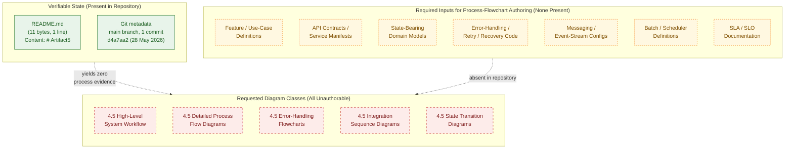

The diagram conveys three facts simultaneously: (1) the only verifiable artefacts in the repository are `README.md` and the single initial Git commit; (2) the artefact classes required to author any process-flowchart diagram are uniformly absent; and (3) each of the five diagram classes enumerated by the section prompt therefore resolves to "unauthorable" against the current evidence base.

---

## 4.6 Forward-Looking Guidance

Consistent with the "living document" directive established in §1.3.3 and the trigger-event pattern established in §2.7.1 and §3.9.1, this section must be re-authored — not merely amended — when implementation artefacts that bear on process flows are introduced to the repository.

### 4.6.1 Triggering Conditions for Future Authoring

| Trigger Event | Section 4 Action |
|---------------|------------------|
| First user story, use case, or acceptance-test artefact added to repository | Populate §4.2.1 with end-to-end user journey flowcharts; identify decision points and error paths |
| First API endpoint definition committed (HTTP route, gRPC service, GraphQL resolver, message handler) | Populate §4.2.2 with integration sequence diagrams; record request/response contracts and timeout policies |
| First state-bearing entity committed (database schema, ORM model, persisted DTO) | Populate §4.4.1 with state transition diagrams; record persistence points and transaction boundaries |
| First error-handling code committed (try/catch blocks, retry decorators, circuit-breaker configuration) | Populate §4.4.2 with error-handling flowcharts; record retry, fallback, and notification flows |
| First message queue / event consumer / publisher committed | Populate §4.2.2 with event processing flows; identify dead-letter and replay paths |
| First batch / scheduled-job definition committed (cron expression, Airflow DAG, Step Function, etc.) | Populate §4.2.2 with batch processing sequences; record window boundaries and recovery semantics |
| First SLA / SLO / KPI documentation committed | Populate §4.3.1 with timing constraint annotations on the relevant flowcharts |
| First authentication / authorisation module committed | Populate §4.3.2 with authorisation checkpoints overlaid on the relevant flowcharts |
| First compliance or regulatory artefact committed (PII handling, audit-log writer, data-retention policy) | Populate §4.3.2 with regulatory-compliance check overlays |

### 4.6.2 Required Artifact Classes for Section Population

To populate §4 in a future revision, the repository should contain at minimum the artefact classes listed below. The mapping identifies which subsection each class informs.

| Artifact Class | Subsection(s) Informed |
|----------------|------------------------|
| Use cases / user stories / acceptance tests | §4.2.1 (Core Business Processes) |
| API contracts (OpenAPI, gRPC `.proto`, GraphQL SDL) | §4.2.2 (Integration Workflows), §4.3.2 |
| Message-broker configuration (Kafka topics, RabbitMQ exchanges, SQS queues) | §4.2.2 (event processing), §4.4.2 (dead-letter handling) |
| Batch / scheduler definitions (cron, Airflow, Argo Workflows, Step Functions) | §4.2.2 (batch sequences) |
| Database schemas, migrations, ORM models | §4.4.1 (state transitions, persistence points) |
| Cache configuration (Redis client, in-memory cache setup) | §4.4.1 (caching requirements) |
| Error-handling middleware / retry decorators / circuit-breaker configs | §4.4.2 (retry, fallback) |
| Observability instrumentation (logs, metrics, traces) | §4.4.2 (error notification flows) |
| Runbooks / disaster-recovery plans | §4.4.2 (recovery procedures) |
| SLO / SLA documentation | §4.3.1 (timing constraints) |
| Authentication / authorisation modules and policies | §4.3.2 (authorisation checkpoints) |
| Compliance artefacts (data classification, retention policy, audit logging) | §4.3.2 (regulatory compliance) |

### 4.6.3 Assumptions and Constraints for Future Revisions

| Item | Assumption / Constraint |
|------|-------------------------|
| Diagram notation | Future revisions will continue to use Mermaid.js for all flowcharts, sequence diagrams, and state diagrams, consistent with §1.2.2, §1.3.3, §2.4.1, §3.8, and §4.5.2 |
| Swim-lane discipline | Each diagram with multiple actors or systems will use Mermaid subgraphs as swim lanes; each lane will represent exactly one actor or system boundary |
| Traceability to features | Each authored flowchart will cite the `F-XXX` feature identifier(s) it diagrams, in continuity with the identifier scheme set in §2.7.3 |
| Traceability to requirements | Each authored decision diamond, validation rule, and authorisation checkpoint will cite the `F-XXX-RQ-YYY` requirement identifier(s) it enforces |
| Default workflows not applied | No commonly assumed workflow (login flow, CRUD pipeline, ETL job, etc.) is inserted retroactively. Each diagram authored in a future revision must be supported by a directly observed repository artefact, consistent with §3.9.3 |
| Timing annotations | Latency / throughput annotations on diagrams must cite the SLA/SLO artefact from which they are derived; no timing constraint may be authored absent direct evidence (§2.5.2) |
| Empty-state diagram | The empty-state diagram in §4.5.2 will be removed from this section in the revision in which any one of the five required diagram classes becomes authorable; it exists solely to visualise the current empty state |
| Source of truth | Repository contents take precedence over external documents in case of conflict, consistent with §2.7.3 and §3.9.3 |

---

## 4.7 References

### 4.7.1 Files Examined

- `README.md` — Sole content artefact in the repository (11 bytes, one line). Verified to contain only the heading `# Artifact5`. Establishes the baseline absence of any process-flow, workflow, integration, state-machine, or error-handling artefact.

### 4.7.2 Folders Explored

- `/` (repository root, depth 0) — Confirmed to contain exactly one direct child (`README.md`) and zero subdirectories. No `workflows/`, `processes/`, `handlers/`, `routes/`, `controllers/`, `services/`, `state/`, `migrations/`, `events/`, `consumers/`, `producers/`, `batch/`, `jobs/`, `runbooks/`, or any other directory commonly associated with process-flow, integration, state, or error-handling artefacts is present.

### 4.7.3 Categories of Absent Artefacts Verified

The following artefact categories were verified absent by direct repository enumeration and by the negative-result semantic searches inherited from §1.4.5 and §2.8.4, supplemented by section-specific searches confirming the same finding:

- Workflow definitions in any orchestration format (BPMN, YAML workflow files, state-machine DSLs)
- API contracts (OpenAPI/Swagger, gRPC `.proto`, GraphQL SDL, AsyncAPI)
- Message-broker configuration (Kafka, RabbitMQ, SQS, NATS, Pub/Sub)
- Batch / scheduler definitions (cron, Airflow DAGs, Argo Workflows, Step Functions, Quartz)
- State-machine / finite-state libraries or configuration files
- Database schemas, migrations, ORM models
- Cache client configuration (Redis, Memcached, in-memory)
- Error-handling middleware, retry decorators, circuit-breaker configuration
- Observability artefacts (logging configuration, metrics exporters, tracing spans)
- Runbooks, disaster-recovery plans, backup procedures
- SLA / SLO / SLI documentation
- Authentication / authorisation modules, policies, and identity-provider configuration
- Compliance artefacts (PII handling, retention policies, audit-log writers)

Section-specific searches executed during the authoring of Section 4:

| Search Query | Result | Supports |
|--------------|--------|----------|
| `workflow process flow integration api endpoints` (file search) | 0 results | §4.2.1, §4.2.2 |
| `user journey decision points error handling retry mechanism` (file search) | 0 results | §4.2.1, §4.4.2 |
| `business processes integration workflows state management` (folder search) | 0 results | §4.2, §4.4.1 |

### 4.7.4 Technical Specification Sections Cross-Referenced

- **§1.1 Executive Summary** — Baseline facts: project identifier "Artifact5", initial-commit placeholder state, 11-byte `README.md`, single initial commit (`d4a7aa2…`), no stakeholders beyond the commit author.
- **§1.2 System Overview** — Source of the explicit findings that no functional capabilities exist (§1.2.2), no component decomposition is possible (§1.2.2), no business context or integration map is documented (§1.2.1), and no measurable objectives, success factors, or KPIs can be enumerated (§1.2.3).
- **§1.3 Scope** — Source of the exhaustive out-of-scope enumeration in §1.3.2 (application logic, UIs, APIs, persistence, authentication, integrations, build/deploy, testing, observability, security, configuration management) and the living-document directive in §1.3.3 that governs future revisions of this section.
- **§1.4 References** — Source of provenance for the Git metadata and the original negative-result semantic searches on which the absence of process flows is corroborated (§1.4.5).
- **§2.1 Preamble: Requirements Derivability Statement** — Source of the no-fabrication rule (§2.1.2) and the structured-absence-reporting methodology directly inherited by Section 4.
- **§2.2 Feature Catalog** — Source of the finding that zero `F-XXX` identifiers can be assigned and no feature exists to flowchart (§2.2.1).
- **§2.3 Functional Requirements Table** — Source of the absence of business rules, data validation, security requirements, and compliance requirements (§2.3.4), which directly entail the absence of validation rules in §4.3.2.
- **§2.4 Feature Relationships** — Source of the explicit finding that no integration points are defined (§2.4.2) and that all cross-cutting concerns (caching, retries, telemetry) are absent (§2.4.3); both findings directly entail §4.2.2 and §4.4.2.
- **§2.5 Implementation Considerations** — Source of the absence of throughput/latency targets and concurrency requirements (§2.5.2), authentication/authorisation model (§2.5.3), and observability/backup/recovery/runbook artefacts (§2.5.4); all of which directly entail rows in §4.3.1, §4.3.2, and §4.4.2.
- **§2.6 Traceability Matrix** — Confirms the empty traceability matrix; no requirement→feature→test linkage can support a flowchart annotation.
- **§2.7 Forward-Looking Guidance** — Source of the trigger-event pattern (§2.7.1), required-artifact-class pattern (§2.7.2), and assumptions-and-constraints pattern (§2.7.3) directly mirrored in §4.6.
- **§2.8 References** — Source of the negative-result-search inheritance pattern (§2.8.4) used to corroborate the absence of process flows in Section 4.
- **§3.1 Preamble: Technology Stack Derivability Statement** — Reinforces the no-fabrication methodology (§3.1.2), including the explicit rejection of the default-stack fallback that would otherwise prejudge protocol selections, persistence engines, or messaging infrastructure.
- **§3.5 Third-Party Services** — Source of the finding that no API clients, authentication providers, monitoring tools, or cloud SDKs are present; directly entails the absence of integration sequence diagrams in §4.5.
- **§3.6 Databases & Storage** — Source of the finding that no database drivers, schemas, migrations, or caching solutions are present; directly entails the absence of state transition diagrams and persistence points in §4.4.1.
- **§3.8 Technology Stack Visualisation** — Source of the Mermaid `classDef` styling and the contrastive-subgraph pattern (Present vs. Absent) reproduced in §4.5.2.
- **§3.9 Forward-Looking Guidance** — Source of the refined trigger-event and required-artifact-class patterns mirrored in §4.6.1 and §4.6.2.
- **§3.10 References** — Source of the comprehensive references-section template (Files Examined → Folders Explored → Categories of Absent Artefacts → Sections Cross-Referenced → Authoring Posture) reproduced in §4.7.

### 4.7.5 Authoring Posture

This section was authored under the strict no-fabrication rule established in §2.1.2 and reinforced in §3.1.2. No workflow, sequence, state diagram, error-handling flow, integration flow, or timing constraint has been attributed to the Artifact5 system because no repository artefact evidences such an attribution. The default workflows that would commonly be inserted into a Process Flowchart section — login sequences, CRUD pipelines, request/response ladders, queue-consumer loops, batch ETL pipelines — were evaluated and found inapplicable to the current repository state; they have therefore not been inserted into Section 4. The single Mermaid diagram in §4.5.2 honestly visualises the empty state and is the only diagram authored in this revision. When implementation artefacts are committed to the repository, Section 4 will be re-authored against those artefacts in accordance with the trigger conditions enumerated in §4.6.1.

---

# 5. System Architecture

## 5.1 PREAMBLE: SYSTEM ARCHITECTURE DERIVABILITY STATEMENT

A conventional System Architecture section catalogues an overall architectural style, a decomposition of major components with their responsibilities and integration points, the data flows that connect them, the external systems they interact with, the technical decisions that justify each selection, and the cross-cutting concerns (monitoring, logging, error handling, authentication, performance, disaster recovery) that span the system. Production of such a section requires verifiable input artefacts in the repository — typically a combination of source code, service manifests, API contracts, infrastructure-as-code, configuration files, container definitions, database schemas, observability instrumentation, and architectural design documents — from which an architecture can be reconstructed.

The Artifact5 repository contains none of these artefacts. As established in §1.1, §1.2, §1.3, §1.4, §2.1, §3.1, and §4.1, the repository at the time of this specification holds a single 11-byte `README.md` file whose entire content is the heading `# Artifact5`, with zero subdirectories and zero source files. Accordingly, this section faithfully documents the absence of an architecture rather than fabricating one. The methodology and structure below are in direct continuity with §2.1.2 ("Methodology for Documenting Absence"), §3.1.2 ("Methodology for Documenting Absence"), and §4.1.2 ("Methodology for Documenting Absence").

### 5.1.1 Repository Evidence Underlying This Section

The artefacts enumerated below are the only artefacts present in the repository and are the sole evidentiary basis for the documentation in Section 5. No architectural component, data flow, integration point, technology decision, or cross-cutting concern can be derived beyond what these artefacts evidence.

| Evidence Source | Observation | Cross-Reference |
|-----------------|-------------|-----------------|
| `README.md` content | Single line: `# Artifact5` (11 bytes, 1 line) | §1.1.1, §2.1.1, §3.1.1, §4.1.1 |
| Repository root listing | One direct child (`README.md`), zero subdirectories | §1.2.2, §1.4.2, §2.8.2, §3.10.2 |
| Git commit metadata | One commit (`d4a7aa2…`), initial commit dated 28 May 2026 | §1.1.1, §1.4.3 |
| Negative-result searches (architecture / components / interfaces / data flows / integrations / observability / security) | Zero matches in repository | §1.4.5, §2.8.4, §4.7.3 |

### 5.1.2 Methodology for Documenting Absence

Five rules govern the contents of Section 5, in direct continuity with §2.1.2, §3.1.2, and §4.1.2:

1. **No fabrication of architectural components.** Per the section prompt's explicit directive — *"Only include sections and items that are actually relevant to this system, based on your analysis of its requirements. Don't add any items that aren't clearly applicable"* — no component (web server, application service, database, message broker, cache, API gateway, load balancer, identity provider, observability backend, batch worker, scheduler, etc.) is invented for documentation symmetry. No architectural style (monolith, modular monolith, microservices, event-driven, serverless, layered, hexagonal, CQRS, etc.) is asserted absent direct evidence.
2. **No fabrication of integrations or data flows.** No external system relationships, synchronous or asynchronous communication patterns, data exchange formats, or transformation points are documented, because no integration manifests, API contracts, message broker configurations, or schema definitions are present (§2.4.2, §3.5.1).
3. **No application of the default technology stack.** The default technology stack supplied as a fallback in the prompt (AWS, Docker, Terraform, GitHub Actions, Python, Flask, Auth0, MongoDB, Langchain, React, TailwindCSS, React-Native, Swift, Kotlin, Objective-C, ElectronJS) is **not applied** for architecture-level decisions, consistent with the explicit rejection recorded in §3.1.2.
4. **No fabrication of SLAs, KPIs, security policies, or operational procedures.** All such items are recorded as "Not present" in §1.2.3, §2.5.2, §2.5.3, and §2.5.4. No latency target, throughput target, availability target, recovery time objective (RTO), recovery point objective (RPO), threat model, or runbook can be authored.
5. **Structured absence reporting with traceability preservation.** Each prompt sub-component (System Overview, Core Components Table, Data Flow Description, External Integration Points, Component Details, Technical Decisions, Cross-Cutting Concerns) is enumerated in a status table that records the absence and identifies the prior section of this specification (or the directly observed repository artefact) that corroborates it.

### 5.1.3 Section Prompt Compliance Summary

The section prompt enumerates four high-level groups (High-Level Architecture, Component Details, Technical Decisions, Cross-Cutting Concerns), each with multiple sub-components and associated diagram requirements. The applicability of each to the current repository state is summarised below.

| Prompt Sub-Component | Applicable to Current Repository? | Treatment in This Section |
|----------------------|-----------------------------------|---------------------------|
| System Overview (style, principles, boundaries) | No — no architecture documented (§1.2.2) | Documented as absent in §5.2.1 |
| Core Components Table | No — no components decomposable (§2.4.3) | Empty schema preserved in §5.2.2 |
| Data Flow Description | No — no data tier, no integrations (§3.6, §2.4.2) | Documented as absent in §5.2.3 |
| External Integration Points | No — all four integration classes absent (§2.4.2, §3.5.1) | Empty schema preserved in §5.2.4 |
| Component Details (purpose, technology, APIs, persistence, scaling) | No — no components exist (§1.2.2, §2.4.3) | Documented as absent in §5.3 |
| Technical Decisions (style, communication, storage, caching, security) | No — no decisions recorded (§3.1, §3.6, §2.5.3) | Documented as absent in §5.4 |
| Cross-Cutting Concerns (monitoring, logging, errors, auth, performance, DR) | No — all dimensions "Not present" (§2.5.2, §2.5.3, §2.5.4, §4.4.2) | Documented as absent in §5.5 |
| Required Diagrams (component interaction, state, sequence, decision tree, ADR, error handling) | No — no system to diagram | Single empty-state diagram in §5.6, consistent with §1.2.2, §1.3.3, §2.4.1, §3.8, §4.5.2 |

---

## 5.2 HIGH-LEVEL ARCHITECTURE

### 5.2.1 System Overview Status

The section prompt requests an overall architectural style with rationale, key architectural principles and patterns, and a statement of system boundaries and major interfaces. None of these can be authored against the current repository state.

| Overview Dimension | Status | Cross-Reference |
|--------------------|--------|-----------------|
| Architectural Style (monolith, microservices, event-driven, serverless, layered, hexagonal, CQRS, etc.) | Not specified — no source files, no service manifests, no deployment topology | §1.2.2 ("no technology stack, framework selection, architectural pattern, or implementation strategy is documented") |
| Rationale for Architectural Style | Not authorable — no decision exists to justify | §1.2.2, §3.1.2 |
| Key Architectural Principles (separation of concerns, DRY, SOLID, 12-factor, etc.) | Not specified — no design documents, no ADRs, no coding standards present | §1.2.1 ("No business context, market analysis, competitive positioning, or domain narrative is present") |
| Key Architectural Patterns (repository, factory, mediator, pub/sub, saga, etc.) | Not specified — no code in which patterns could be instantiated | §1.2.2 |
| System Boundaries | Trivial only — the Git repository identified as "Artifact5" with a single `main` branch and one commit | §1.3.1 (Implementation Boundaries) |
| Major External Interfaces | Not present — "No integration diagrams, interface definitions, API contracts, message-flow descriptions, or enterprise-architecture references are present" | §1.2.1 |
| Major Internal Interfaces | Not present — repository has zero subdirectories, no module-to-module contracts | §1.2.2 |

The only verifiable system boundary is the Git repository itself, as recorded in §1.3.1: a single `main` branch tracking `origin/main`, holding one commit (`d4a7aa2…`, dated 28 May 2026) that introduces a single 11-byte `README.md` file. This boundary is documentary, not architectural — it describes the perimeter of the version-controlled workspace, not a runtime system.

### 5.2.2 Core Components Inventory

The section prompt requests a table of components with Primary Responsibility, Key Dependencies, Integration Points, and Critical Considerations. §1.2.2 explicitly states that "a component decomposition cannot be produced because the repository contains no architectural artifacts, no module definitions, no service manifests, and no subdirectory structure." §2.4.3 records all four shared-component classes (Shared Libraries, Common Services, Cross-Cutting Concerns, Reusable Domain Models) as "None present." The Core Components Table is therefore empty. The schema is preserved below for forward-looking continuity, in the same manner as §2.6 ("Traceability Matrix").

| Component Name | Primary Responsibility | Key Dependencies | Integration Points |
|----------------|------------------------|------------------|--------------------|
| *(none enumerated)* | *(not applicable — no components exist)* | *(not applicable)* | *(not applicable)* |

| Component Name | Critical Considerations | Cross-Reference |
|----------------|-------------------------|-----------------|
| *(none enumerated)* | *(not applicable — no components exist)* | §1.2.2, §2.4.3 |

The only documentary artefact identifiable at the repository root is the `README.md` file itself. It is not a runtime component, has no responsibilities beyond holding the project name, has no dependencies, and exposes no integration points. It is therefore not enumerated as a "core component" in the architectural sense intended by the section prompt.

### 5.2.3 Data Flow Description Status

The section prompt requests documentation of primary data flows between components, integration patterns and protocols, data transformation points, and key data stores and caches. None of these can be authored. §3.6.2 records that "no persistence or caching strategy is documented in the repository. The data tier of the system is, at the present revision, undefined." §1.3.2 records that "all databases, caches, file stores, schemas" are out-of-scope. §2.4.2 records that all four integration classes (Synchronous APIs, Asynchronous Messaging, File-Based / Batch Integrations, Third-Party Service Connections) are absent.

| Data Flow Dimension | Status | Cross-Reference |
|---------------------|--------|-----------------|
| Primary Data Flows Between Components | Not present — no components and no data tier to flow between | §1.2.2, §3.6.2 |
| Integration Patterns (request/response, pub/sub, event sourcing, CQRS, ETL, CDC) | Not present — no integration manifests present | §2.4.2 |
| Integration Protocols (HTTP/REST, gRPC, GraphQL, AMQP, MQTT, Kafka, etc.) | Not present — no protocol bindings in repository | §2.4.2, §3.5.1 |
| Data Transformation Points (mappers, serialisers, validators, enrichers) | Not present — no transformation code | §2.3.3 ("Input Parameters: Not present"; "Output / Response: Not present") |
| Primary Data Stores | Not present — no database drivers, schemas, or connection configuration | §3.6.1 |
| Secondary Data Stores (warehouses, lakes, archives) | Not present — no analytics or archival tier configured | §3.6.1 |
| Caches (in-process, distributed, CDN) | Not present — no cache drivers or invalidation strategy | §3.6.1, §4.4.1 |
| Message Brokers / Event Streams | Not present — no broker configuration | §2.4.2 ("Asynchronous Messaging: No") |
| File / Blob Storage | Not present — no object-storage bindings | §3.6.1 |
| Search Indexes | Not present — no index configuration | §3.6.1 |

### 5.2.4 External Integration Points

The section prompt requests a table of external systems with Integration Type, Data Exchange Pattern, Protocol/Format, and SLA Requirements. §3.5.1 records that all six external-integration evidence dimensions (External API client code, Authentication provider integration, Monitoring/observability tool integration, Cloud service configuration, Environment/secret configuration, SDK declarations) are "None present." §1.2.1 records that "no integration diagrams, interface definitions, API contracts, message-flow descriptions, or enterprise-architecture references are present." The External Integration Points table is therefore empty. The schema is preserved below.

| System Name | Integration Type | Data Exchange Pattern | Protocol/Format |
|-------------|------------------|------------------------|------------------|
| *(none enumerated)* | *(not applicable)* | *(not applicable)* | *(not applicable)* |

| System Name | SLA Requirements | Cross-Reference |
|-------------|------------------|-----------------|
| *(none enumerated)* | *(not applicable — no SLAs defined per §2.5.2)* | §2.4.2, §3.5.1 |

---

## 5.3 COMPONENT DETAILS

The section prompt requests, for each major component, the purpose and responsibilities, the technologies and frameworks used, the key interfaces and APIs, the data persistence requirements, and scaling considerations. As §1.2.2 records that "the system has no demonstrable capabilities at present" and "there are no source-code files in any programming language, no executable artifacts, and no service definitions," no component-level details can be authored. The three status tables below preserve the schema for each of the five dimensions requested by the prompt.

### 5.3.1 Component Inventory Status

| Component Dimension | Status | Cross-Reference |
|---------------------|--------|-----------------|
| Identified Components | None — no decomposition possible | §1.2.2, §2.4.3 |
| Component Purpose Statements | None — no purposes to document | §2.2.1 (no feature inventory) |
| Component Responsibilities | None — no responsibilities to assign | §1.2.2 |

### 5.3.2 Interface and Technology Inventory Status

| Technology / Interface Dimension | Status | Cross-Reference |
|----------------------------------|--------|-----------------|
| Programming Languages | Not specified — no source files in any identifiable language | §3.2, §1.2.2 |
| Frameworks Selected | Not specified — no package manifests or import declarations | §3.3 |
| Libraries Selected | Not specified — no manifests, no lockfiles, no vendored libraries | §3.4 |
| Key Interfaces / Public APIs | None — no service definitions, no API contracts | §1.2.1, §2.4.2 |
| Internal Module Interfaces | None — no modules to expose interfaces | §1.2.2 (zero subdirectories) |
| Protocol Bindings (HTTP/gRPC/GraphQL/Messaging) | None | §2.4.2 |

### 5.3.3 Persistence and Scaling Considerations Status

| Persistence / Scaling Dimension | Status | Cross-Reference |
|---------------------------------|--------|-----------------|
| Data Persistence Requirements | Not present — no data tier defined | §3.6.2, §4.4.1 |
| Schema / Data Model Definitions | None — no schemas, no ORM models, no DTOs | §4.4.1 |
| Horizontal Scaling Strategy | Not specified | §2.5.2 ("Horizontal / Vertical Scaling Plans: Not present") |
| Vertical Scaling Strategy | Not specified | §2.5.2 |
| Concurrency Model | Not specified | §2.5.2 ("Concurrency Requirements: Not present") |
| Resource Footprint Targets | Not specified | §2.5.2 ("Resource Footprint Targets: Not present") |
| Throughput / Latency Targets | Not specified | §2.5.2 ("Throughput / Latency Targets: Not present") |

Because no components exist, the prompt's request for "Detailed component interaction diagrams," "State transition diagrams," and "Sequence diagrams for key flows" is treated as unauthorable. This is in direct continuity with §4.5.1, which records all five required diagram classes (High-Level System Workflow, Detailed Process Flows, Error Handling Flowcharts, Integration Sequence Diagrams, State Transition Diagrams) as not authorable against the current repository. The single empty-state diagram in §5.6 below substitutes for all such diagrams, in the same manner as §3.8 and §4.5.2.

---

## 5.4 TECHNICAL DECISIONS

The section prompt requests documentation and justification of five technical-decision classes: architecture style decisions and trade-offs, communication pattern choices, data storage solution rationale, caching strategy justification, and security mechanism selection. It additionally requests decision-tree diagrams and Architecture Decision Records (ADRs). None of these can be authored. §3.1.2 explicitly forbids fabrication of technology choices ("no language, framework, library, service, data store, or tooling selection is invented for documentation symmetry"). §3.3.2 records that "no framework or library has been selected for the Artifact5 repository; therefore no justification can be authored." No ADR documents exist in the repository.

### 5.4.1 Architecture Style Decisions Status

| Decision Dimension | Status | Cross-Reference |
|--------------------|--------|-----------------|
| Selected Style (e.g., monolith / microservices / serverless / event-driven) | Not decided — no implementation present | §1.2.2 |
| Trade-offs Documented | None — no decisions to weigh | §3.1.2 |
| Decision Owner / Date / Status | Not recorded — no ADR artefacts in repository | §1.2.1 |
| Alternatives Considered | None — no alternatives evaluation present | §3.3.2 |

### 5.4.2 Communication Pattern Choices Status

| Decision Dimension | Status | Cross-Reference |
|--------------------|--------|-----------------|
| Synchronous Pattern (REST / gRPC / GraphQL) | Not selected | §2.4.2 |
| Asynchronous Pattern (Message Queue / Event Stream / Pub-Sub) | Not selected | §2.4.2 |
| Inter-Process Communication Choice | Not selected | §1.2.2 |
| Serialisation Format (JSON / Protobuf / Avro / etc.) | Not selected | §3.3 |

### 5.4.3 Data Storage Solution Status

| Decision Dimension | Status | Cross-Reference |
|--------------------|--------|-----------------|
| Primary Database Engine | Not selected | §3.6.1 |
| Secondary / Analytics Store | Not selected | §3.6.1 |
| Object / Blob Storage | Not selected | §3.6.1 |
| Search Index | Not selected | §3.6.1 |
| Storage Rationale | Not authorable — no selection exists | §3.6.2 |

### 5.4.4 Caching Strategy Status

| Decision Dimension | Status | Cross-Reference |
|--------------------|--------|-----------------|
| Cache Engine (in-process / distributed / CDN) | Not selected | §3.6.1 |
| Cache Invalidation Strategy | Not specified | §4.4.1 ("Caching Requirements: Not present") |
| Time-to-Live (TTL) Policies | Not specified | §4.4.1 |
| Caching Justification | Not authorable — no decision recorded | §3.6.2, §2.4.3 |

### 5.4.5 Security Mechanism Status

| Decision Dimension | Status | Cross-Reference |
|--------------------|--------|-----------------|
| Authentication Mechanism (OAuth/OIDC, SAML, JWT, mTLS, API Keys, etc.) | Not selected | §2.5.3, §3.5.1 |
| Authorisation Model (RBAC, ABAC, ReBAC, capability-based, etc.) | Not selected | §2.5.3 |
| Data Protection at Rest | Not specified | §2.5.3 |
| Data Protection in Transit | Not specified | §2.5.3 |
| Threat Model / Risk Register | Not present | §2.5.3 |
| Secret Management Solution | Not selected | §2.5.3, §3.5.1 |

Because no decisions have been recorded, neither decision-tree diagrams nor Architecture Decision Records can be authored. The empty-state diagram in §5.6 visualises this absence at the system level.

---

## 5.5 CROSS-CUTTING CONCERNS

The section prompt requests detailed documentation of six cross-cutting concerns: monitoring and observability approach, logging and tracing strategy, error handling patterns, authentication and authorisation framework, performance requirements and SLAs, and disaster recovery procedures. It additionally requests an error-handling flow diagram. None of these can be authored. §2.4.3 records "Cross-Cutting Concerns (caching, retries, telemetry): None present." §2.5.4 records all four maintenance dimensions (Observability, Deployment/Release, Backup/Recovery, Runbooks) as "Not present." §4.4.2 records all six error-handling dimensions as "Not present."

### 5.5.1 Monitoring and Observability Status

| Dimension | Status | Cross-Reference |
|-----------|--------|-----------------|
| Metrics Collection (Prometheus, Datadog, New Relic, CloudWatch) | Not present | §2.5.4, §3.5.1 |
| Distributed Tracing (OpenTelemetry, Jaeger, Zipkin) | Not present | §2.5.4, §3.5.1 |
| Health Checks / Liveness / Readiness Probes | Not present | §2.5.4 |
| Dashboards / Visualisation Layer | Not present | §2.5.4 |
| Alerting / Paging Configuration | Not present | §4.4.2 ("Error Notification Flows: Not present") |

### 5.5.2 Logging and Tracing Status

| Dimension | Status | Cross-Reference |
|-----------|--------|-----------------|
| Logging Framework / Library | Not selected | §3.3, §2.4.3 |
| Log Format (structured JSON, plaintext, syslog) | Not specified | §2.5.4 |
| Log Aggregation Backend (ELK, Loki, Splunk, CloudWatch Logs) | Not selected | §3.5.1 |
| Log Retention Policy | Not specified | §2.5.4 |
| Trace Propagation Strategy (W3C TraceContext, B3, custom) | Not specified | §2.5.4 |
| Correlation / Request ID Strategy | Not specified | §2.5.4 |

### 5.5.3 Error Handling Status

The error-handling status mirrors §4.4.2 in its entirety.

| Dimension | Status | Cross-Reference |
|-----------|--------|-----------------|
| Retry Mechanisms (backoff, jitter, idempotency keys) | Not present | §4.4.2, §2.4.3 |
| Fallback Processes (circuit breakers, bulkheads, degraded mode) | Not present | §4.4.2 |
| Error Notification Flows (alerting, paging) | Not present | §4.4.2 |
| Recovery Procedures (runbooks, automated remediation) | Not present | §4.4.2, §2.5.4 |
| Exception Classification (error codes, taxonomy, hierarchy) | Not present | §4.4.2 |
| Dead-Letter / Quarantine Handling | Not present | §4.4.2, §2.4.2 |

Because no error-handling code is present, no error-handling flow diagram can be authored. The prompt's diagram requirement is satisfied by reference to the empty-state diagram in §5.6 (which inherits the styling pattern of the error-handling segment of §4.5.2).

### 5.5.4 Authentication and Authorisation Status

| Dimension | Status | Cross-Reference |
|-----------|--------|-----------------|
| Identity Provider (Auth0, Okta, Cognito, Keycloak, etc.) | Not selected | §2.5.3, §3.5.1 |
| Authentication Protocol (OAuth 2.0, OIDC, SAML, mTLS) | Not selected | §2.5.3 |
| Token Format (JWT, opaque, PASETO) | Not selected | §2.5.3 |
| Authorisation Model (RBAC, ABAC, ReBAC, policies) | Not selected | §2.5.3 |
| Session Management Strategy | Not specified | §2.5.3 |
| Multi-Factor / Step-Up Authentication | Not specified | §2.5.3 |

### 5.5.5 Performance Requirements and SLAs Status

| Dimension | Status | Cross-Reference |
|-----------|--------|-----------------|
| Latency Targets (p50 / p95 / p99) | Not specified | §2.5.2, §1.2.3 |
| Throughput Targets (requests/sec, events/sec) | Not specified | §2.5.2 |
| Availability Target (e.g., 99.9% uptime SLO) | Not specified | §1.2.3 ("no KPI catalogue, metrics definitions, telemetry plan") |
| Resource Footprint Targets (CPU, memory, network) | Not specified | §2.5.2 |
| Concurrency Targets | Not specified | §2.5.2 |
| Error Budget Policy | Not specified | §1.2.3 |
| External SLAs / Customer-Facing Commitments | Not present | §1.2.1, §1.2.3 |

### 5.5.6 Disaster Recovery Status

| Dimension | Status | Cross-Reference |
|-----------|--------|-----------------|
| Recovery Time Objective (RTO) | Not specified | §2.5.4 |
| Recovery Point Objective (RPO) | Not specified | §2.5.4 |
| Backup Strategy (frequency, retention, location) | Not present | §2.5.4 ("Backup / Recovery Procedures: Not present") |
| Restore Procedure | Not documented | §2.5.4 |
| Multi-Region / Multi-AZ Posture | Not specified | §2.5.4, §3.7 |
| Failover Strategy (active-active, active-passive, pilot-light) | Not specified | §2.5.4 |
| Runbook Catalogue | Not present | §2.5.4 ("Runbooks / Operational Documentation: Not present") |
| Disaster Recovery Drill Cadence | Not specified | §2.5.4 |

---

## 5.6 EMPTY-STATE VISUALISATION

The diagram below visualises the gap between the verifiable repository state and the artefacts required to author any of the architecture sub-components enumerated by the section prompt. It is the only diagram in Section 5 and is structurally consistent with the empty-state diagrams in §1.2.2, §1.3.3, §2.4.1, §3.8, and §4.5.2. The three-subgraph layout (Present, Required, Absent) and the `classDef` styling are inherited verbatim from §4.5.2.

```mermaid
flowchart TB
    subgraph Present["Verifiable Architectural Evidence (Present in Repository)"]
        direction TB
        P1["README.md<br/>(11 bytes, 1 line)<br/>Content: # Artifact5"]
        P2["Git metadata<br/>main branch, 1 commit<br/>d4a7aa2 (28 May 2026)"]
    end

    subgraph RequiredInputs["Required Inputs for Architecture Authoring (None Present)"]
        direction TB
        R1["Source Code<br/>Modules &amp; Services"]
        R2["API Contracts /<br/>Interface Definitions"]
        R3["Database Schemas /<br/>Persistence Drivers"]
        R4["Message Broker /<br/>Event Stream Configs"]
        R5["Container &amp; IaC<br/>Definitions"]
        R6["Authentication /<br/>Authorisation Modules"]
        R7["Observability /<br/>Telemetry Instrumentation"]
        R8["Error-Handling /<br/>Retry / Recovery Code"]
        R9["SLA / SLO / KPI<br/>Documentation"]
        R10["Architecture Decision<br/>Records (ADRs)"]
    end

    subgraph AbsentArtefacts["Requested Architecture Artefacts (All Unauthorable)"]
        direction TB
        A1["5.2 High-Level<br/>Architecture"]
        A2["5.2 Core Components<br/>Table"]
        A3["5.2 Data Flow<br/>Description"]
        A4["5.2 External<br/>Integration Points"]
        A5["5.3 Component<br/>Details"]
        A6["5.4 Technical<br/>Decisions &amp; ADRs"]
        A7["5.5 Cross-Cutting<br/>Concerns"]
        A8["5.5 Error-Handling<br/>Flow Diagram"]
    end

    Present -. "yields zero<br/>architectural evidence" .-> AbsentArtefacts
    RequiredInputs -. "absent in repository" .-> AbsentArtefacts

    classDef presentNode fill:#e8f4ea,stroke:#2e7d32,color:#1b5e20;
    classDef requiredNode fill:#fff8e1,stroke:#f57f17,color:#7f4f00,stroke-dasharray: 3 3;
    classDef absentNode fill:#fdecea,stroke:#c62828,color:#7f1d1d,stroke-dasharray: 5 5;

    class P1,P2 presentNode;
    class R1,R2,R3,R4,R5,R6,R7,R8,R9,R10 requiredNode;
    class A1,A2,A3,A4,A5,A6,A7,A8 absentNode;
```

The diagram conveys three facts simultaneously: (1) the only verifiable artefacts in the repository are `README.md` and the single initial Git commit; (2) the ten artefact classes required to author any architectural narrative are uniformly absent; and (3) every architecture-related artefact enumerated by the section prompt — high-level architecture, core components, data flows, integration points, component details, technical decisions, cross-cutting concerns, and error-handling flows — therefore resolves to "unauthorable" against the current evidence base.

---

## 5.7 FORWARD-LOOKING GUIDANCE

Consistent with the "living document" directive established in §1.3.3 and the trigger-event pattern established in §2.7.1, §3.9.1, and §4.6.1, this section must be re-authored — not merely amended — when implementation artefacts that bear on the system architecture are introduced to the repository.

### 5.7.1 Triggering Conditions for Future Authoring

The table below identifies the conditions under which each subsection of Section 5 becomes authorable.

| Trigger Event | Section 5 Action |
|---------------|------------------|
| First source file committed in an identifiable programming language | Populate §5.2.1 with the architectural style implied by the source layout (e.g., monolith vs. modular); identify language-level boundaries |
| First service manifest, module declaration, or subdirectory structure committed | Populate §5.2.2 (Core Components Table) with the discovered components, their responsibilities, and inter-component dependencies |
| First API contract committed (OpenAPI, gRPC `.proto`, GraphQL SDL) | Populate §5.2.4 (External Integration Points) and §5.3.2 (Interface inventory); record protocol, format, and exchange pattern |
| First database driver, schema, migration, or ORM model committed | Populate §5.2.3 (Data Flow), §5.3.3 (Persistence), §5.4.3 (Storage Decision); record data tier topology and rationale |
| First cache driver or invalidation policy committed | Populate §5.4.4 (Caching Strategy); record cache engine, TTL policies, invalidation triggers |
| First message broker / event stream configuration committed | Populate §5.2.3, §5.4.2 (Communication Pattern), §5.5.3 (Error Handling — dead-letter handling) |
| First authentication / authorisation module committed | Populate §5.4.5 and §5.5.4; record identity provider, protocol, token format, authorisation model |
| First observability instrumentation committed (logs, metrics, traces) | Populate §5.5.1 and §5.5.2; record collection agents, backends, retention policies |
| First error-handling middleware, retry decorator, or circuit-breaker configuration committed | Populate §5.5.3 with retry, fallback, notification, and recovery flows; author the error-handling flow diagram requested by the prompt |
| First SLA / SLO / KPI documentation committed | Populate §5.5.5; annotate the relevant diagrams with timing constraints |
| First runbook, backup procedure, or disaster-recovery plan committed | Populate §5.5.6; record RTO, RPO, failover strategy, drill cadence |
| First Architecture Decision Record (ADR) committed | Populate §5.4 with the decision record(s), authoring decision-tree diagrams where the ADR documents alternatives considered |
| First container build, orchestration manifest, or IaC artefact committed | Populate §5.2.1 (boundaries), §5.5.6 (multi-region posture), and reference §3.7 |

### 5.7.2 Required Artifact Classes for Section Population

To populate Section 5 in a future revision, the repository should contain at minimum the artefact classes listed below. The mapping identifies which subsection each class informs.

| Artefact Class | Subsection(s) Informed |
|----------------|------------------------|
| Source code organised into modules / packages / services | §5.2.1, §5.2.2, §5.3.1 |
| Service manifests / module declarations (`package.json`, `pom.xml`, service descriptors) | §5.2.2, §5.3.2 |
| API contracts (OpenAPI, `.proto`, GraphQL SDL) | §5.2.3, §5.2.4, §5.3.2, §5.4.2 |
| Database schemas, migrations, ORM models | §5.2.3, §5.3.3, §5.4.3 |
| Cache configuration | §5.4.4 |
| Message broker / event stream configuration | §5.2.3, §5.4.2, §5.5.3 |
| Container build definitions / orchestration manifests / IaC source | §5.2.1, §5.5.6 |
| Authentication / authorisation modules and policies | §5.4.5, §5.5.4 |
| Observability instrumentation and configuration | §5.5.1, §5.5.2 |
| Error-handling middleware, retry / circuit-breaker configuration | §5.5.3 |
| Runbooks, backup / restore procedures, DR plans | §5.5.6 |
| SLA / SLO / KPI documentation | §5.5.5 |
| Architecture Decision Records (ADRs) | §5.4 (all subsections) |
| Design documents / sequence diagrams / context diagrams | §5.2.1, §5.2.3, §5.3 |

### 5.7.3 Assumptions and Constraints for Future Revisions

| Item | Assumption / Constraint |
|------|-------------------------|
| Diagram notation | Future revisions will continue to use Mermaid.js for all architecture, sequence, state, and decision diagrams, consistent with §1.2.2, §1.3.3, §2.4.1, §3.8, §4.5.2 |
| Subgraph styling | The `classDef presentNode` / `requiredNode` / `absentNode` styling will continue to denote evidence-based, required-input, and absent nodes respectively, until all three classes converge into a single (fully populated) architecture diagram |
| Traceability to features | Each component documented in §5.2.2 will cite the `F-XXX` feature identifier(s) it supports, in continuity with the identifier scheme set in §2.7.3 |
| Traceability to requirements | Each architectural decision documented in §5.4 will cite the `F-XXX-RQ-YYY` requirement identifier(s) it satisfies and the source artefact (file path, ADR identifier) from which it is derived |
| Default technology stack | The default technology stack supplied in the section prompt is **not** applied retroactively at the architecture level. Concrete components (e.g., AWS managed services, Docker containers, Terraform modules, GitHub Actions workflows, Auth0 tenants, MongoDB clusters) will be documented only when corresponding artefacts are committed to the repository, in direct continuity with §3.1.2 and §3.9.3 |
| Default workflows | No commonly assumed workflow (login flow, CRUD pipeline, ETL job, etc.) is inserted retroactively into §5.2.3 (Data Flow Description). Each flow must be supported by a directly observed repository artefact, in direct continuity with §4.1.2 and §4.6.3 |
| Default cross-cutting concerns | No commonly assumed observability stack, logging library, error-handling pattern, or DR posture is asserted absent direct evidence. §5.5 will be populated only against committed artefacts |
| Empty-state diagram | The empty-state diagram in §5.6 will be removed from this section in the revision in which the first architectural component becomes documentable; it exists solely to visualise the current empty state, in direct continuity with §4.6.3 |
| Source of truth | Repository contents take precedence over external documents in case of conflict, consistent with §2.7.3, §3.9.3, and §4.6.3 |
| SLA / KPI authoring discipline | No latency, throughput, availability, RTO, or RPO value may be authored in §5.5.5 or §5.5.6 absent a directly observed SLA/SLO/KPI artefact in the repository, in direct continuity with §2.5.2 and §1.2.3 |
| Security mechanism authoring discipline | No identity provider, authentication protocol, authorisation model, or secret-management solution may be asserted in §5.4.5 or §5.5.4 absent a directly observed security artefact in the repository, in direct continuity with §2.5.3 |

---

## 5.8 REFERENCES

### 5.8.1 Files Examined

| Path | Relevance to Section 5 |
|------|------------------------|
| `README.md` (repository root) | Sole file in the repository; its 11-byte content (`# Artifact5`) constitutes the entirety of the documentary evidence underlying all absence statements in this section |

### 5.8.2 Folders Explored

| Path | Relevance to Section 5 |
|------|------------------------|
| `/` (repository root) | Confirmed to contain exactly one direct child (`README.md`) and zero subdirectories (excluding `.git` metadata); the absence of subdirectories is the structural fact underlying the "no component decomposition" finding cited from §1.2.2 |

### 5.8.3 Categories of Absent Artefacts Verified

| Artefact Category | Confirmed Absent |
|-------------------|------------------|
| Source code in any programming language | Yes — §1.2.2, §3.2 |
| Package manifests / dependency lockfiles | Yes — §1.2.2, §3.3, §3.4 |
| API contracts (OpenAPI / gRPC / GraphQL) | Yes — §2.4.2, §3.5.1 |
| Service manifests / module declarations | Yes — §1.2.2, §2.4.3 |
| Database drivers / schemas / migrations | Yes — §3.6.1 |
| Cache configuration | Yes — §3.6.1, §4.4.1 |
| Message broker / event stream configuration | Yes — §2.4.2 |
| Container build definitions (`Dockerfile`, compose, K8s manifests) | Yes — §3.7 |
| CI/CD workflow definitions | Yes — §3.7 |
| Infrastructure-as-code artefacts | Yes — §3.7 |
| Authentication / authorisation modules | Yes — §2.5.3, §3.5.1 |
| Observability instrumentation (logs / metrics / traces) | Yes — §2.5.4, §3.5.1 |
| Error-handling middleware / retry / circuit-breaker code | Yes — §4.4.2 |
| Runbooks / backup / DR procedures | Yes — §2.5.4 |
| SLA / SLO / KPI documentation | Yes — §1.2.3, §2.5.2 |
| Architecture Decision Records (ADRs) | Yes — §1.2.1, §3.1.2 |
| Threat models / risk registers | Yes — §2.5.3 |
| Design documents / context diagrams | Yes — §1.2.1, §1.2.2 |

### 5.8.4 Technical Specification Sections Cross-Referenced

| Section | Use in Section 5 |
|---------|------------------|
| §1.1 EXECUTIVE SUMMARY | Baseline project identification (Artifact5), single-commit state |
| §1.2 SYSTEM OVERVIEW | Authoritative source for "no functional capabilities," "no component decomposition," "no technical approach" findings (§1.2.2); business-context absence (§1.2.1); KPI/success-criteria absence (§1.2.3) |
| §1.3 SCOPE | In-scope / out-of-scope inventory underpinning all "Not present" statements in §5.2–§5.5; living-document directive informing §5.7 |
| §1.4 REFERENCES | Negative-result search provenance |
| §2.1 PREAMBLE: REQUIREMENTS DERIVABILITY STATEMENT | Origin of the no-fabrication methodology adopted in §5.1.2 |
| §2.4 FEATURE RELATIONSHIPS | Empty dependency map (§2.4.1); integration absence (§2.4.2); shared-component absence (§2.4.3) — all directly cited in §5.2, §5.3 |
| §2.5 IMPLEMENTATION CONSIDERATIONS | Technical constraints (§2.5.1), performance/scalability absence (§2.5.2), security absence (§2.5.3), maintenance absence (§2.5.4) — all directly cited in §5.3, §5.4, §5.5 |
| §2.6 TRACEABILITY MATRIX | Precedent for preserving an empty schema |
| §2.7 FORWARD-LOOKING GUIDANCE | Trigger-event pattern adopted in §5.7.1 |
| §3.1 Preamble: Technology Stack Derivability Statement | Origin of the explicit default-stack rejection enforced in §5.1.2 |
| §3.5 Third-Party Services | External-integration absence directly cited in §5.2.4, §5.5.4 |
| §3.6 Databases & Storage | Data-tier absence directly cited in §5.2.3, §5.3.3, §5.4.3 |
| §3.8 Technology Stack Visualisation | Source of the contrastive-subgraph diagram pattern and `classDef` styling used in §5.6 |
| §3.9 Forward-Looking Guidance | Trigger-event and required-artefact pattern adopted in §5.7 |
| §4.1 Preamble: Process Flowchart Derivability Statement | Origin of the no-workflow-fabrication rule enforced in §5.1.2 |
| §4.4 Technical Implementation | State-management absence (§4.4.1) directly cited in §5.3.3; error-handling absence (§4.4.2) directly cited in §5.5.3 |
| §4.5 Diagram Inventory and Empty-State Visualisation | Source of the three-subgraph empty-state diagram structure (Present / Required / Absent) replicated in §5.6 |
| §4.6 Forward-Looking Guidance | Source of the assumptions-and-constraints table structure replicated in §5.7.3 |

### 5.8.5 Authoring Posture

This section was authored under the same five rules that govern §2, §3, and §4: (1) no fabrication of architectural components; (2) no fabrication of integrations or data flows; (3) no application of the default technology stack at the architecture level; (4) no fabrication of SLAs, KPIs, security policies, or operational procedures; (5) structured absence reporting with full traceability. Every "Not present," "None enumerated," "Not selected," and "Not specified" statement in §5.2–§5.5 is cross-referenced either to a directly observed repository artefact (the `README.md` content, the repository root listing, or the Git commit metadata) or to a prior section of this Technical Specification that records the same absence with its own evidentiary backing. No web searches were required for this section, because all evidence resides within the repository and the prior sections of this specification; the negative-result searches inherited from §1.4.5, §2.8.4, and §4.7.3 already exhaust the search universe (source code, configuration manifests, container definitions, CI/CD workflows, tests, database artefacts, authentication modules, third-party integrations, workflow / process / integration / API endpoints, user-journey decision points, error-handling / retry mechanisms, business processes, integration workflows, state management).

# 6. SYSTEM COMPONENTS DESIGN

## 6.1 Core Services Architecture

**Applicability Statement: Core Services Architecture is not applicable for this system.**

The Artifact5 repository does not implement a microservice topology, a distributed service mesh, or any distinguishable service component. As established in §1.1, §1.2, §1.3, §2.4, §3.6, §3.7, §4.4, §5.2, §5.3, §5.4, and §5.5, the repository at the time of this specification holds a single 11-byte `README.md` file whose entire content is the heading `# Artifact5`, with zero subdirectories and zero source files. No service boundary, communication protocol, discovery mechanism, load-balancing component, circuit-breaker policy, retry strategy, scaling rule, capacity plan, fault-tolerance mechanism, disaster-recovery procedure, redundancy posture, failover configuration, or degradation policy can be derived from this evidence base.

In direct continuity with the "Methodology for Documenting Absence" defined in §2.1.2, §3.1.2, §4.1.2, and §5.1.2, this section faithfully documents the absence of a core services architecture rather than fabricating one. The five governing rules established in §5.1.2 — (1) no fabrication of architectural components, (2) no fabrication of integrations or data flows, (3) no application of the default technology stack as a fallback, (4) no fabrication of SLAs/KPIs/security policies/operational procedures, and (5) structured absence reporting with traceability preservation — apply in full to this section. The empty-state diagram pattern established in §5.6 (Present / Required / Absent subgraphs with the `classDef presentNode` / `requiredNode` / `absentNode` styling inherited from §4.5.2) is reused here to visualise the gap for each of the three required diagram classes (Service Interaction, Scalability Architecture, Resilience Pattern Implementations).

### 6.1.1 Repository Evidence Underlying This Section

The artefacts enumerated below are the only artefacts present in the repository and are the sole evidentiary basis for the documentation in §6.1. No service, scaling policy, or resilience pattern can be derived beyond what these artefacts evidence. This table mirrors the structure of §5.1.1 to preserve cross-section traceability.

| Evidence Source | Observation | Cross-Reference |
|-----------------|-------------|-----------------|
| `README.md` content | Single line: `# Artifact5` (11 bytes, 1 line) | §1.1.1, §2.1.1, §3.1.1, §4.1.1, §5.1.1 |
| Repository root listing | One direct child (`README.md`), zero subdirectories | §1.2.2, §1.4.2, §2.8.2, §3.10.2, §5.1.1 |
| Git commit metadata | One commit (`d4a7aa2…`), initial commit dated 28 May 2026 | §1.1.1, §1.4.3, §5.1.1 |
| Negative-result searches (services, microservices, scalability, resilience, circuit breaker, retry) | Zero matches in repository | §1.4.5, §2.8.4, §4.7.3 |

#### 6.1.1.1 Pre-conditions Required for Section Authoring

The section prompt presupposes a system that is either composed of multiple cooperating services (microservices, modular monolith with internal service boundaries, distributed actors, etc.) or that exhibits enough operational surface area (deployable artefacts, runtime topology, scaling envelope, recovery posture) to merit a dedicated services discussion. None of these pre-conditions is satisfied. §5.2.1 records the architectural style as "Not specified — no source files, no service manifests, no deployment topology." §5.2.2 records an empty Core Components Table. §5.4 records every technical decision (architecture style, communication, storage, caching, security) as "Not decided / Not selected." §3.7 records no container build, no orchestration manifest, and no infrastructure-as-code source.

### 6.1.2 Service Components Status

The section prompt enumerates six service-component dimensions: service boundaries and responsibilities, inter-service communication patterns, service discovery mechanisms, load balancing strategy, circuit breaker patterns, and retry and fallback mechanisms. None can be authored. The table below records the status of each dimension with cross-references to the prior sections of this specification that corroborate the absence.

| Sub-Component | Status | Cross-Reference |
|---------------|--------|-----------------|
| Service boundaries and responsibilities | Not applicable — no services exist | §1.2.2, §2.4.3, §5.2.2 |
| Inter-service communication patterns | Not applicable — no services to communicate | §2.4.2, §5.4.2 |
| Service discovery mechanisms | Not applicable — no services to discover | §1.3.2, §5.2.4 |
| Load balancing strategy | Not applicable — no traffic to balance | §3.7, §5.2.1 |
| Circuit breaker patterns | Not applicable — no error-handling code | §4.4.2, §5.5.3 |
| Retry and fallback mechanisms | Not applicable — no retry policies | §2.4.3, §4.4.2, §5.5.3 |

#### 6.1.2.1 Service Boundaries and Responsibilities

A service boundary is documentable only when at least one of the following artefacts is present: a service manifest (`package.json`, `pom.xml`, `Cargo.toml`, `pyproject.toml`, etc.), a module declaration, a subdirectory representing a deployable unit, or an explicit architectural description (ADR, design document) defining boundaries. §2.4.3 records "Shared Libraries / Modules: None present" and "Common Services (auth, logging, persistence): None present." §5.2.2 records the Core Components Table as empty. The minimal precondition — *the existence of more than one identifiable component* — is unmet.

#### 6.1.2.2 Inter-Service Communication Patterns

§2.4.2 records all four integration classes — Synchronous APIs, Asynchronous Messaging, File-Based / Batch, and Third-Party — as "No." §5.4.2 records every communication pattern choice (synchronous request/response, asynchronous events, streaming, file transfer) as "Not selected." Because no service endpoints, message broker topics, file drop zones, or third-party API clients are committed to the repository, no communication topology (request/response, publish/subscribe, event-sourced, CQRS, saga-coordinated, etc.) can be asserted.

#### 6.1.2.3 Service Discovery Mechanisms

Service discovery presupposes at least two services and an addressing scheme (DNS-based, registry-based via Consul / Eureka / ZooKeeper / etcd, sidecar-mediated via a service mesh, or platform-native via Kubernetes Services). §1.3.2 places "All HTTP, gRPC, GraphQL, or messaging endpoints" out-of-scope. §5.2.4 records the External Integration Points table as empty. No discovery client library, sidecar configuration, or service-mesh control-plane artefact is present.

#### 6.1.2.4 Load Balancing Strategy

Load balancing — whether L4 (TCP/UDP), L7 (HTTP/gRPC), client-side (e.g., Ribbon, gRPC built-in), server-side (NGINX, HAProxy, Envoy, cloud load balancers), DNS-based, or anycast — requires both a workload to balance and a balancing component definition. §5.2.1 records the architectural style as undefined because no source files, no service manifests, and no deployment topology are present. §3.7 confirms the absence of any container, IaC, or orchestration artefact in which load-balancer configuration would reside.

#### 6.1.2.5 Circuit Breaker Patterns

Circuit breakers (Hystrix-style, Resilience4j-style, Polly-style, Envoy outlier-detection, custom state-machine implementations) presuppose remote calls that can fail and an explicit policy file or library configuration. §4.4.2 records "Fallback Processes: Not present — no fallback paths, circuit breakers, or degraded-mode behaviour documented." §5.5.3 records "Fallback Processes (circuit breakers, bulkheads, degraded mode): Not present." No circuit-breaker library is referenced anywhere in the repository.

#### 6.1.2.6 Retry and Fallback Mechanisms

Retry policies (fixed backoff, exponential backoff, jittered backoff, token-bucket-limited retries, idempotency-key-protected retries) and fallback mechanisms (cached response, default value, alternate provider, degraded result) presuppose error-handling code paths. §4.4.2 records "Retry Mechanisms: Not present — no retry policies, backoff strategies, or idempotency keys defined." §2.4.3 records "Cross-Cutting Concerns (caching, retries, telemetry): None present." §5.5.3 mirrors this state for the Error Handling cross-cutting concern.

### 6.1.3 Scalability Design Status

The section prompt enumerates five scalability dimensions: horizontal/vertical scaling approach, auto-scaling triggers and rules, resource allocation strategy, performance optimization techniques, and capacity planning guidelines. None can be authored. The table below records the status of each dimension.

| Sub-Component | Status | Cross-Reference |
|---------------|--------|-----------------|
| Horizontal / vertical scaling approach | Not applicable | §2.5.2, §5.3.3 |
| Auto-scaling triggers and rules | Not applicable | §1.3.2, §3.7 |
| Resource allocation strategy | Not applicable | §2.5.2, §5.3.3 |
| Performance optimization techniques | Not applicable | §1.2.3, §5.5.5 |
| Capacity planning guidelines | Not applicable | §2.5.2, §5.3.3 |

#### 6.1.3.1 Horizontal and Vertical Scaling Approach

§2.5.2 records "Horizontal / Vertical Scaling Plans: Not present." §5.3.3 records both "Horizontal Scaling Strategy: Not specified" and "Vertical Scaling Strategy: Not specified." Horizontal scaling requires either a stateless service that can be replicated behind a load balancer or a partitioned stateful service with a defined sharding key; vertical scaling requires a deployable artefact with documented resource ceilings. Neither precondition is met.

#### 6.1.3.2 Auto-Scaling Triggers and Rules

Auto-scaling rules (target tracking on CPU/memory/queue depth, step scaling, scheduled scaling, predictive scaling, KEDA-style external-metric scaling) require an orchestration substrate (Kubernetes HPA/VPA/Cluster Autoscaler, AWS Auto Scaling Groups, Azure VM Scale Sets, GCP Managed Instance Groups, ECS Service Auto Scaling, etc.). §3.7 records the complete absence of any container, Kubernetes manifest, IaC source, or CI/CD pipeline. §1.3.2 places Build & Deployment fully out-of-scope.

#### 6.1.3.3 Resource Allocation Strategy

§2.5.2 records "Resource Footprint Targets: Not present." §5.3.3 records "Resource Footprint Targets: Not specified." Resource allocation (CPU requests/limits, memory requests/limits, ephemeral storage quotas, GPU requests, network bandwidth reservations, NUMA pinning) is documentable only against a workload definition. No workload is present.

#### 6.1.3.4 Performance Optimization Techniques

§5.5.5 records every performance dimension (latency p50/p95/p99, throughput, availability, resource footprint, concurrency, error budget, external SLAs) as "Not specified" or "Not present." §1.2.3 records the absence of any "KPI catalogue, metrics definitions, telemetry plan." Optimization techniques (caching layers, connection pooling, asynchronous I/O, batching, compression, content delivery networks, query optimisation, indexing strategies, JIT/AOT compilation, profile-guided optimisation) presuppose both a workload to optimise and a measured baseline. Neither exists.

#### 6.1.3.5 Capacity Planning Guidelines

§2.5.2 records "Throughput / Latency Targets: Not present" and "Concurrency Requirements: Not present." §5.3.3 mirrors this state. Capacity planning (peak-load modelling, headroom percentages, growth projections, burst-handling reservations) requires both a baseline demand curve and a defined unit-of-capacity (request, event, transaction, user session, etc.). Neither has been defined for the system.

### 6.1.4 Resilience Patterns Status

The section prompt enumerates five resilience dimensions: fault tolerance mechanisms, disaster recovery procedures, data redundancy approach, failover configurations, and service degradation policies. None can be authored. The table below records the status of each dimension.

| Sub-Component | Status | Cross-Reference |
|---------------|--------|-----------------|
| Fault tolerance mechanisms | Not applicable | §4.4.2, §5.5.3 |
| Disaster recovery procedures | Not applicable | §2.5.4, §5.5.6 |
| Data redundancy approach | Not applicable — no data tier | §3.6, §5.4.3 |
| Failover configurations | Not applicable | §5.5.6 |
| Service degradation policies | Not applicable | §4.4.2, §5.5.3 |

#### 6.1.4.1 Fault Tolerance Mechanisms

§5.5.3 records all six error-handling dimensions — Retry Mechanisms, Fallback Processes, Error Notification Flows, Recovery Procedures, Exception Classification, and Dead-Letter / Quarantine Handling — as "Not present." §4.4.2 mirrors this state. Fault tolerance patterns (bulkhead, timeout, circuit breaker, retry with idempotency, compensation/saga, leader election, quorum reads/writes) presuppose either a remote dependency that can fail or an internal asynchronous boundary that can become congested. The repository contains neither.

#### 6.1.4.2 Disaster Recovery Procedures

§5.5.6 records every DR dimension — Recovery Time Objective (RTO), Recovery Point Objective (RPO), Backup Strategy, Restore Procedure, Multi-Region / Multi-AZ Posture, Failover Strategy, Runbook Catalogue, and Disaster Recovery Drill Cadence — as "Not specified" or "Not present." §2.5.4 confirms "Backup / Recovery Procedures: Not present" and "Runbooks / Operational Documentation: Not present." Per the SLA-authoring discipline established in §5.7.3, no RTO or RPO value may be authored absent a directly observed SLA/SLO/KPI artefact, in direct continuity with §2.5.2 and §1.2.3.

#### 6.1.4.3 Data Redundancy Approach

§3.6 explicitly states "No persistence or caching strategy is documented in the repository. The data tier of the system is, at the present revision, undefined." §5.4.3 records every storage dimension as "Not selected." Redundancy patterns (synchronous replication, asynchronous replication, quorum-based replication, multi-master, log-shipping, snapshot-based backup, cross-region object storage) presuppose at least one data store. None is present.

#### 6.1.4.4 Failover Configurations

§5.5.6 records "Failover Strategy (active-active, active-passive, pilot-light): Not specified." Failover configurations require a redundant compute or data tier and a health-detection mechanism (heartbeat, gossip, external monitor) that triggers traffic redirection. Neither tier nor monitor exists in the repository.

#### 6.1.4.5 Service Degradation Policies

§5.5.3 records "Fallback Processes (circuit breakers, bulkheads, degraded mode): Not present." §4.4.2 mirrors this state. Degradation policies (graceful degradation, feature-flag-mediated shedding, load shedding via rate limiting, read-only mode under write-failure, cache-only mode under back-end failure) presuppose feature flags, runtime configuration, or middleware capable of routing requests to alternate code paths. None is present.

### 6.1.5 Empty-State Visualisations

Three diagrams are required by the section prompt: a Service Interaction diagram, a Scalability Architecture diagram, and a Resilience Pattern Implementations diagram. Because none of the three has any evidence base in the repository, each is rendered below as a focused empty-state diagram following the canonical three-subgraph (Present / Required / Absent) template established in §5.6 and inherited verbatim from §4.5.2. The `classDef presentNode` / `requiredNode` / `absentNode` styling is preserved for visual continuity across all empty-state diagrams in this specification.

#### 6.1.5.1 Service Interaction — Empty-State Diagram

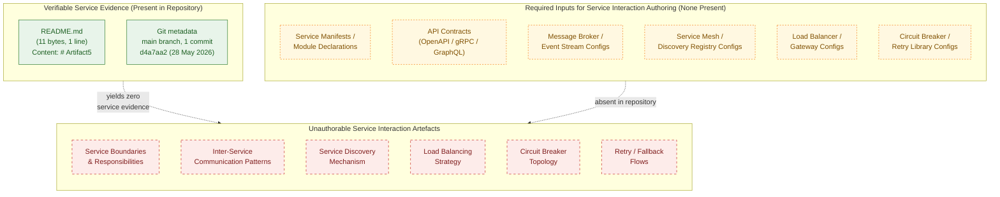

This diagram conveys three facts simultaneously: (1) the only verifiable artefacts in the repository are `README.md` and the single initial Git commit; (2) the six artefact classes required to author a service interaction diagram are uniformly absent; and (3) every service-interaction sub-component requested by the section prompt is therefore unauthorable against the current evidence base.

#### 6.1.5.2 Scalability Architecture — Empty-State Diagram

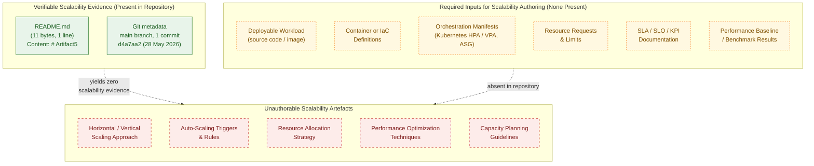

This diagram visualises that every scalability sub-component requested by the section prompt — horizontal/vertical scaling, auto-scaling rules, resource allocation, performance optimisation, capacity planning — is unauthorable in the absence of a deployable workload, an orchestration substrate, and quantitative SLO/KPI targets, in direct continuity with the absence statements in §2.5.2, §3.7, §5.3.3, and §5.5.5.

#### 6.1.5.3 Resilience Pattern Implementations — Empty-State Diagram

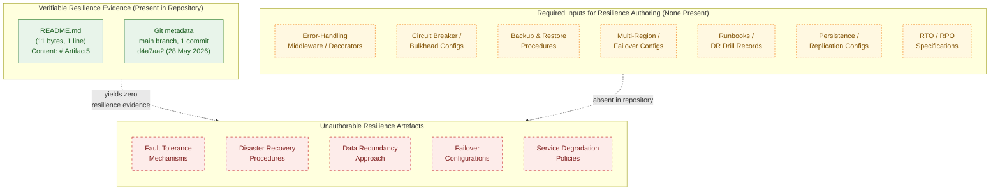

This diagram visualises that every resilience sub-component requested by the section prompt — fault tolerance, disaster recovery, data redundancy, failover, and service degradation — is unauthorable in the absence of error-handling code, persistence configuration, backup procedures, and quantitative recovery objectives, in direct continuity with the absence statements in §3.6, §4.4.2, §5.4.3, §5.5.3, and §5.5.6.

### 6.1.6 Forward-Looking Guidance

Consistent with the "living document" directive established in §1.3.3 and the trigger-event pattern established in §2.7.1, §3.9.1, §4.6.1, and §5.7.1, this section must be re-authored — not merely amended — when implementation artefacts that bear on the core services architecture are introduced to the repository.

#### 6.1.6.1 Triggering Conditions for Future Authoring

The table below identifies the conditions under which each subsection of §6.1 becomes authorable. The triggers are aligned with those in §5.7.1 to preserve cross-section consistency.

| Trigger Event | §6.1 Subsection(s) Activated |
|---------------|------------------------------|
| First service manifest or module declaration committed | §6.1.2.1 (Service Boundaries), §6.1.2.2 (Communication Patterns) |
| First API contract (OpenAPI / gRPC / GraphQL) committed | §6.1.2.2 (Communication Patterns), §6.1.2.3 (Service Discovery) |
| First service-mesh, registry, or discovery-client configuration committed | §6.1.2.3 (Service Discovery), §6.1.2.4 (Load Balancing) |
| First load-balancer, ingress, or gateway configuration committed | §6.1.2.4 (Load Balancing) |
| First circuit-breaker / retry / bulkhead library configuration committed | §6.1.2.5 (Circuit Breakers), §6.1.2.6 (Retry & Fallback), §6.1.4.1 (Fault Tolerance), §6.1.4.5 (Degradation Policies) |
| First container image, orchestration manifest, or IaC source committed | §6.1.3.1 (Scaling Approach), §6.1.3.3 (Resource Allocation), §6.1.4.4 (Failover Configurations) |
| First auto-scaling rule (HPA, VPA, ASG policy, KEDA scaler) committed | §6.1.3.2 (Auto-Scaling Triggers) |
| First SLA / SLO / KPI / performance-target artefact committed | §6.1.3.4 (Performance Optimization), §6.1.3.5 (Capacity Planning), §6.1.4.2 (DR Procedures) |
| First database driver, schema, or replication configuration committed | §6.1.4.3 (Data Redundancy) |
| First backup procedure, restore runbook, or DR drill record committed | §6.1.4.2 (DR Procedures), §6.1.4.4 (Failover Configurations) |
| First feature-flag system or graceful-degradation middleware committed | §6.1.4.5 (Service Degradation Policies) |

#### 6.1.6.2 Required Artefact Classes for Section Population

To populate §6.1 in a future revision, the repository should contain at minimum the artefact classes listed below. The mapping identifies which subsection each class informs and aligns with §5.7.2 to avoid duplication.

| Artefact Class | §6.1 Subsection(s) Informed |
|----------------|-----------------------------|
| Service manifests, module declarations, multi-component source layout | §6.1.2.1, §6.1.2.2 |
| API contracts and message-broker configurations | §6.1.2.2, §6.1.2.3 |
| Service-mesh, registry, ingress, and load-balancer configurations | §6.1.2.3, §6.1.2.4 |
| Resilience library configuration (circuit breakers, retries, bulkheads, timeouts) | §6.1.2.5, §6.1.2.6, §6.1.4.1, §6.1.4.5 |
| Container builds, orchestration manifests, IaC source | §6.1.3.1, §6.1.3.2, §6.1.3.3, §6.1.4.4 |
| Performance benchmarks, SLOs, and KPI catalogues | §6.1.3.4, §6.1.3.5, §6.1.4.2 |
| Persistence configuration with replication / backup definitions | §6.1.4.2, §6.1.4.3 |
| Runbooks, DR plans, drill records | §6.1.4.2, §6.1.4.4 |

#### 6.1.6.3 Assumptions and Constraints for Future Revisions

The constraints listed in §5.7.3 apply in full to §6.1 and are summarised below with §6.1-specific emphasis.

| Item | Assumption / Constraint |
|------|-------------------------|
| Diagram notation | Future revisions will continue to use Mermaid.js for service-interaction, scalability, and resilience diagrams, consistent with §1.2.2, §1.3.3, §2.4.1, §3.8, §4.5.2, and §5.6 |
| Empty-state styling | The `classDef presentNode` / `requiredNode` / `absentNode` styling will continue to denote evidence-based, required-input, and absent nodes respectively, until each of the three §6.1 diagrams converges into a fully populated form |
| Default technology stack | The default technology stack supplied in the section prompt (AWS, Docker, Terraform, GitHub Actions, MongoDB, etc.) is **not** applied retroactively. Concrete services, scaling policies, and resilience patterns will be documented only when corresponding artefacts are committed to the repository, in direct continuity with §3.1.2, §3.9.3, and §5.7.3 |
| SLA / KPI authoring discipline | No latency, throughput, availability, RTO, RPO, or capacity-planning value may be authored in §6.1.3.4, §6.1.3.5, §6.1.4.2, or §6.1.4.4 absent a directly observed SLA / SLO / KPI artefact in the repository, in direct continuity with §1.2.3, §2.5.2, and §5.7.3 |
| Resilience-pattern authoring discipline | No circuit breaker, retry policy, fallback path, bulkhead, or degradation policy may be asserted in §6.1.2.5, §6.1.2.6, §6.1.4.1, or §6.1.4.5 absent a directly observed library configuration or middleware artefact, in direct continuity with §4.4.2 and §5.5.3 |
| Empty-state diagrams | The three empty-state diagrams in §6.1.5 will be removed in the revision in which the first service component becomes documentable; they exist solely to visualise the current empty state, in direct continuity with the precedent established in §5.7.3 |
| Source of truth | Repository contents take precedence over external documents in case of conflict, consistent with §2.7.3, §3.9.3, §4.6.3, and §5.7.3 |

### 6.1.7 Section Prompt Compliance Summary

The section prompt enumerates three high-level groups (Service Components, Scalability Design, Resilience Patterns) with sixteen sub-components in total, plus three required diagram classes. The applicability of each to the current repository state is summarised below for traceability.

| Prompt Sub-Component / Diagram | Applicable to Current Repository? | Treatment in This Section |
|---------------------------------|-----------------------------------|---------------------------|
| Service boundaries and responsibilities | No — §1.2.2, §2.4.3, §5.2.2 | Documented as absent in §6.1.2.1 |
| Inter-service communication patterns | No — §2.4.2, §5.4.2 | Documented as absent in §6.1.2.2 |
| Service discovery mechanisms | No — §1.3.2, §5.2.4 | Documented as absent in §6.1.2.3 |
| Load balancing strategy | No — §3.7, §5.2.1 | Documented as absent in §6.1.2.4 |
| Circuit breaker patterns | No — §4.4.2, §5.5.3 | Documented as absent in §6.1.2.5 |
| Retry and fallback mechanisms | No — §2.4.3, §4.4.2 | Documented as absent in §6.1.2.6 |
| Horizontal / vertical scaling approach | No — §2.5.2, §5.3.3 | Documented as absent in §6.1.3.1 |
| Auto-scaling triggers and rules | No — §1.3.2, §3.7 | Documented as absent in §6.1.3.2 |
| Resource allocation strategy | No — §2.5.2, §5.3.3 | Documented as absent in §6.1.3.3 |
| Performance optimization techniques | No — §1.2.3, §5.5.5 | Documented as absent in §6.1.3.4 |
| Capacity planning guidelines | No — §2.5.2, §5.3.3 | Documented as absent in §6.1.3.5 |
| Fault tolerance mechanisms | No — §4.4.2, §5.5.3 | Documented as absent in §6.1.4.1 |
| Disaster recovery procedures | No — §2.5.4, §5.5.6 | Documented as absent in §6.1.4.2 |
| Data redundancy approach | No — §3.6, §5.4.3 | Documented as absent in §6.1.4.3 |
| Failover configurations | No — §5.5.6 | Documented as absent in §6.1.4.4 |
| Service degradation policies | No — §4.4.2, §5.5.3 | Documented as absent in §6.1.4.5 |
| Service interaction diagram | No — no services to depict | Empty-state diagram in §6.1.5.1 |
| Scalability architecture diagram | No — no workload to depict | Empty-state diagram in §6.1.5.2 |
| Resilience pattern implementations diagram | No — no patterns to depict | Empty-state diagram in §6.1.5.3 |

### 6.1.8 References

#### 6.1.8.1 Files Examined

- `README.md` — Confirmed sole content is the heading `# Artifact5` (11 bytes, 1 line). Establishes the absence of all source code, service manifests, configuration files, and architectural artefacts that would otherwise inform §6.1.

#### 6.1.8.2 Folders Explored

- `` (repository root, depth 0) — Contains exactly one direct child (`README.md`) and zero subdirectories. Confirms the structural emptiness of the repository and the consequent inapplicability of every §6.1 sub-component.

#### 6.1.8.3 Technical Specification Sections Cross-Referenced

- **§1.1 EXECUTIVE SUMMARY** — Establishes baseline: single commit, 1 file (`README.md`, 11 bytes), 0 source files, 0 subdirectories.
- **§1.2 SYSTEM OVERVIEW** — Confirms no capabilities, no components, no technology stack; §1.2.3 records no KPI catalogue, metrics definitions, or telemetry plan.
- **§1.3 SCOPE** — Enumerates every category of out-of-scope items, including all HTTP/gRPC/GraphQL/messaging endpoints (§1.3.2) and Build & Deployment.
- **§2.4 FEATURE RELATIONSHIPS** — §2.4.2 confirms all four integration classes absent; §2.4.3 confirms "Shared Libraries / Modules: None present," "Common Services: None present," and "Cross-Cutting Concerns (caching, retries, telemetry): None present."
- **§2.5 IMPLEMENTATION CONSIDERATIONS** — §2.5.2 records "Horizontal / Vertical Scaling Plans," "Resource Footprint Targets," "Throughput / Latency Targets," and "Concurrency Requirements" as "Not present"; §2.5.4 records "Backup / Recovery Procedures" and "Runbooks / Operational Documentation" as "Not present."
- **§2.7 FORWARD-LOOKING GUIDANCE** — Established trigger-event pattern reused in §6.1.6.
- **§3.6 Databases & Storage** — Records "the data tier of the system is, at the present revision, undefined."
- **§3.7 Development & Deployment** — Records absence of container, orchestration, IaC, and CI/CD artefacts.
- **§4.4 Technical Implementation** — §4.4.2 records all six error-handling dimensions (Retry, Fallback, Notification, Recovery, Exception Classification, Dead-Letter) as "Not present."
- **§5.1 PREAMBLE: SYSTEM ARCHITECTURE DERIVABILITY STATEMENT** — Establishes the five governing rules for documenting absence (§5.1.2) inherited by §6.1.
- **§5.2 HIGH-LEVEL ARCHITECTURE** — All architecture dimensions "Not specified."
- **§5.3 COMPONENT DETAILS** — §5.3.3 records "Horizontal Scaling Strategy" and "Vertical Scaling Strategy" as "Not specified."
- **§5.4 TECHNICAL DECISIONS** — §5.4.2 records every communication pattern as "Not selected"; §5.4.3 records every storage dimension as "Not selected."
- **§5.5 CROSS-CUTTING CONCERNS** — §5.5.3 (Error Handling), §5.5.5 (Performance & SLAs), and §5.5.6 (Disaster Recovery) directly underwrite the absence statements in §6.1.2, §6.1.3, and §6.1.4.
- **§5.6 EMPTY-STATE VISUALISATION** — Establishes the canonical three-subgraph Mermaid empty-state diagram template with `classDef presentNode` / `requiredNode` / `absentNode` styling, reused verbatim in §6.1.5.
- **§5.7 FORWARD-LOOKING GUIDANCE** — Establishes the trigger-event and constraint structure reused in §6.1.6.

#### 6.1.8.4 Negative-Result Searches Performed

- Semantic search for "microservices service architecture components" — 0 results, confirming the absence of any service-oriented artefact.
- Semantic search for "scalability resilience circuit breaker retry" — 0 results, confirming the absence of any scaling or resilience artefact.
- Filesystem search for `.blitzyignore` files — 0 results, confirming no repository contents are excluded from analysis.

## 6.2 Database Design

**Applicability Statement: Database Design is not applicable to this system.**

The Artifact5 repository does not implement, configure, integrate with, or reference any database, persistent store, cache, search index, object/blob store, or any other data-tier component. As established in §1.1, §1.2, §1.3, §2.4, §2.5, §3.6, §4.4, §5.2, §5.3, §5.4, §5.5, and §6.1, the repository at the time of this specification holds a single 11-byte `README.md` file whose entire content is the heading `# Artifact5`, with zero subdirectories, zero source files, zero package manifests, and zero configuration files. No relational engine, document/NoSQL engine, key-value cache, search index, ORM model, schema definition, migration script, connection string, replication topology, backup procedure, or retention policy can be derived from this evidence base. Per the controlling clause in the section prompt — "If the system does not require or direct database or persistent storage interactions are not clearly evident, clearly state 'Database Design is not applicable to this system' and explain why" — this section faithfully documents the absence of database design rather than fabricating one.

In direct continuity with the "Methodology for Documenting Absence" defined in §2.1.2, §3.1.2, §4.1.2, and §5.1.2, and inheriting the exact pattern applied in §6.1 (Core Services Architecture), this section enumerates the absence of every data-tier sub-component requested by the section prompt and records the cross-references that corroborate the absence. The five governing rules established in §5.1.2 — (1) no fabrication of architectural components, (2) no fabrication of integrations or data flows, (3) no application of the default technology stack as a fallback, (4) no fabrication of SLAs/KPIs/security policies/operational procedures, and (5) structured absence reporting with traceability preservation — apply in full to this section. The empty-state diagram pattern established in §5.6 and reused in §6.1.5 (three subgraphs — Present / Required / Absent — with the `classDef presentNode` / `requiredNode` / `absentNode` styling inherited from §4.5.2) is reapplied here to visualise the gap for each of the three required diagram classes (Database Schema, Data Flow, Replication Architecture).

### 6.2.1 Repository Evidence Underlying This Section

The artefacts enumerated below are the only artefacts present in the repository and are the sole evidentiary basis for the documentation in §6.2. No database engine, schema, migration framework, cache layer, backup procedure, or replication strategy can be derived beyond what these artefacts evidence. This table mirrors the structure of §5.1.1 and §6.1.1 to preserve cross-section traceability.

| Evidence Source | Observation | Cross-Reference |
|-----------------|-------------|-----------------|
| `README.md` content | Single line: `# Artifact5` (11 bytes, 1 line) | §1.1.1, §3.1.1, §6.1.1 |
| Repository root listing | One direct child (`README.md`), zero subdirectories | §1.2.2, §3.6.1, §6.1.1 |
| Git commit metadata | One commit (`d4a7aa2…`), initial commit dated 28 May 2026 | §1.1.1, §6.1.1 |
| Filesystem search for `.blitzyignore` files | Zero matches — confirms no repository contents are excluded from analysis | §6.1.8.4 |
| Negative-result searches (database, schema, migration, cache, backup, replication) | Zero matches in repository | §3.6.1, §3.6.2 |

#### 6.2.1.1 Pre-conditions Required for Section Authoring

The section prompt presupposes a system that performs persistent storage or retrieval of data — relational, document, key-value, graph, time-series, columnar, object/blob, or full-text-indexed. None of these capabilities is implemented or configured. §3.6.1 enumerates eight data-tier evidence dimensions (relational driver dependencies, NoSQL driver dependencies, key-value/cache driver dependencies, schema/migration artefacts, connection configuration, object/blob storage configuration, search index configuration, backup procedures) and records every one as "None present" or "Not documented." §3.6.2 records "No persistence or caching strategy is documented in the repository. The data tier of the system is, at the present revision, undefined. No primary database, secondary database, cache, or storage service can be attributed to the system." §4.4.1 records all six state-management dimensions (state transitions, data persistence points, caching requirements, transaction boundaries, data models/domain entities, migration/versioning of state) as "Not present." §5.4.3 records every storage decision dimension ("Primary Database Engine," "Secondary / Analytics Store," "Object / Blob Storage," "Search Index," "Storage Rationale") as "Not selected" or "Not authorable." §5.4.4 records every caching decision dimension as "Not selected" or "Not specified." §1.3.2 explicitly places "Data Persistence (Databases, caches, file stores, schemas)" out-of-scope on the grounds that "No data-tier artifacts [are] present."

### 6.2.2 Schema Design Status

The section prompt enumerates six schema-design dimensions: entity relationships, data models and structures, indexing strategy, partitioning approach, replication configuration, and backup architecture. None can be authored. The table below records the status of each dimension with cross-references to the prior sections of this specification that corroborate the absence.

| Sub-Component | Status | Cross-Reference |
|---------------|--------|-----------------|
| Entity relationships | Not applicable — no entities defined | §3.6.1, §4.4.1, §5.3 |
| Data models and structures | Not applicable — no ORM models, schemas, or DTOs | §3.6.1, §4.4.1 |
| Indexing strategy | Not applicable — no database to index | §3.6.1, §5.4.3 |
| Partitioning approach | Not applicable — no data tier to partition | §3.6.1, §5.4.3 |
| Replication configuration | Not applicable — no data tier to replicate | §3.6.2, §5.4.3, §6.1.4.3 |
| Backup architecture | Not applicable — no data to back up | §2.5.4, §5.5.6 |

#### 6.2.2.1 Entity Relationships

An entity-relationship documentation requires at least one of the following artefacts to exist in the repository: an ORM model class (e.g., a SQLAlchemy `Model`, a Sequelize `Model.init`, a TypeORM `@Entity`, a Prisma `model` declaration), a `CREATE TABLE` DDL statement, a JSON Schema or Protobuf descriptor representing a persisted entity, or an explicit data-model document (a logical/physical ERD, a domain-model design note, an architecture decision record). §4.4.1 records "Data Models / Domain Entities: Not present — no ORM models, schemas, or DTOs in repository." §3.6.1 records every relational, document, and key-value driver dependency as "None present" because no package manifest is committed. The minimal precondition — *the existence of at least one persisted entity* — is unmet. Consequently, no entity-relationship diagram (Chen, Crow's-Foot, IDEF1X, or UML class notation) can be authored.

#### 6.2.2.2 Data Models and Structures

Data-model documentation requires both a structural definition (column/field list, types, nullability, primary key, foreign keys, check constraints, default values, computed columns) and a semantic description of each entity's role in the domain. §4.4.1 records the absence of all such artefacts ("no ORM models, schemas, or DTOs"). §3.6.1 records the absence of schema or migration artefacts ("`schema.sql`, `migrations/`, Flyway, Liquibase, Alembic, Prisma schemas, Sequelize/TypeORM models — None present"). Because no domain model exists, no logical data model (entities, relationships, attributes), physical data model (tables/collections, columns/fields, indexes, constraints), or conceptual data model (subject areas, business glossary) can be authored.

#### 6.2.2.3 Indexing Strategy

An indexing strategy presupposes a target storage engine whose indexing primitives (B-tree, hash, GIN, GiST, BRIN, R-tree, full-text, vector, inverted, composite, covering, partial, expression, geospatial) can be selected against a defined workload. §3.6.1 records every relational and document database driver dependency as "None present." §5.4.3 records "Primary Database Engine: Not selected" and "Search Index: Not selected." With no engine, no schema, and no observed query pattern, no index definition (DDL `CREATE INDEX`, ORM `@Index` decorator, Prisma `@@index`, Mongoose `index`, Elasticsearch mapping) can be authored, and no index-selection rationale (selectivity analysis, query-plan justification, write-amplification trade-off) can be presented.

#### 6.2.2.4 Partitioning Approach

Partitioning (horizontal/sharding, vertical, range-based, hash-based, list-based, composite, geo-based) requires both a partition-key candidate (selected from observed entity attributes) and a partition-aware engine (e.g., PostgreSQL declarative partitioning, MySQL `PARTITION BY`, MongoDB sharded clusters, Cassandra partition keys, DynamoDB partition keys, Cosmos DB partition keys). §3.6.1 records the absence of any database driver dependency. §5.4.3 records every storage decision as "Not selected." No partition key, sharding scheme, or routing rule can therefore be authored.

#### 6.2.2.5 Replication Configuration

Replication (synchronous, asynchronous, semi-synchronous, log-shipping, statement-based, row-based, mixed, snapshot-based, streaming, logical, physical) requires at minimum a primary data store with a defined replication protocol and at least one replica target. §3.6.2 explicitly states "No persistence or caching strategy is documented in the repository. The data tier of the system is, at the present revision, undefined." §5.4.3 records every storage decision as "Not selected." §6.1.4.3 has already documented this absence in the context of data redundancy: "Redundancy patterns (synchronous replication, asynchronous replication, quorum-based replication, multi-master, log-shipping, snapshot-based backup, cross-region object storage) presuppose at least one data store. None is present." No replication topology, replica role assignment, failover mechanism, or consistency-level configuration can be authored.

#### 6.2.2.6 Backup Architecture

Backup architecture (full, incremental, differential, log/WAL-based, snapshot-based, cross-region replication, point-in-time recovery, immutable backups) requires both a data store to back up and a backup tooling decision (engine-native, third-party, cloud-managed). §2.5.4 records "Backup / Recovery Procedures: Not present." §5.5.6 records "Backup Strategy (frequency, retention, location): Not present" and "Restore Procedure: Not documented." Per the SLA-authoring discipline established in §5.7.3 and reaffirmed in §6.1.6.3, no recovery time objective (RTO), recovery point objective (RPO), backup frequency, retention period, or restore-procedure detail may be authored absent a directly observed backup artefact. No backup engine, schedule, retention policy, or restore runbook can therefore be authored.

### 6.2.3 Data Management Status

The section prompt enumerates five data-management dimensions: migration procedures, versioning strategy, archival policies, data storage and retrieval mechanisms, and caching policies. None can be authored. The table below records the status of each dimension.

| Sub-Component | Status | Cross-Reference |
|---------------|--------|-----------------|
| Migration procedures | Not applicable — no schemas to migrate | §3.6.1, §4.4.1 |
| Versioning strategy | Not applicable — no schemas to version | §4.4.1 |
| Archival policies | Not applicable — no data to archive | §3.6.2, §2.5.4 |
| Data storage and retrieval mechanisms | Not applicable — no data tier | §3.6.2, §5.4.3 |
| Caching policies | Not applicable — no cache engine selected | §3.6.1, §5.4.4, §4.4.1 |

#### 6.2.3.1 Migration Procedures

Migration procedures presuppose a schema-evolution framework (Flyway, Liquibase, Alembic, Knex, TypeORM Migrations, Sequelize CLI, Prisma Migrate, Django migrations, Rails ActiveRecord migrations, EF Core Migrations, golang-migrate, etc.) and at least one baseline schema against which forward and backward migrations can be authored. §3.6.1 records "Schema or migration artefacts (e.g., `schema.sql`, `migrations/`, Flyway, Liquibase, Alembic, Prisma schemas, Sequelize/TypeORM models): None present (repository has zero subdirectories)." §4.4.1 records "Migration / Versioning of State: Not present — no migration framework or schema-evolution artefacts." No migration tool, versioning convention, rollback procedure, or zero-downtime migration pattern (expand-and-contract, online schema change, dual-write/dual-read) can be authored.

#### 6.2.3.2 Versioning Strategy

Schema versioning (sequential integer versions, timestamp-based versions, semantic versions, Liquibase changeset IDs, Flyway version naming `V1.0.0__description.sql`, Alembic revision identifiers) requires the prior existence of at least one schema baseline and a chosen versioning tool. §4.4.1 records the absence of any migration or schema-evolution artefact. No versioning convention, baseline marker, or version-skew handling policy can be authored.

#### 6.2.3.3 Archival Policies

Archival policies (tiered storage, cold storage migration, time-based archival, event-based archival, archival to object storage with lifecycle policies, archival to backup systems with extended retention) require a data set whose age, size, or access frequency can be measured against a retention policy. §3.6.2 records the absence of any data tier. §2.5.4 records the absence of operational procedures. With no data to archive and no retention requirement defined, no archival policy can be authored.

#### 6.2.3.4 Data Storage and Retrieval Mechanisms

Data storage and retrieval mechanisms (direct SQL via driver, ORM-mediated access, repository pattern, data-access-object pattern, query builder, CQRS read/write models, event sourcing, document API, key-value get/put, gRPC data services) require both a connection to a data store and at least one access-pattern declaration in source code. §3.6.1 records "Connection configuration (e.g., connection strings in `.env`, `application.yml`, `database.yml`, ORM configs): None present." §3.6.2 records that the data tier is undefined. §5.4.3 records every storage decision as "Not selected." No connection-acquisition pattern, no data-access abstraction, and no retrieval primitive can be authored.

#### 6.2.3.5 Caching Policies

Caching policies (cache-aside / lazy loading, read-through, write-through, write-behind / write-back, refresh-ahead, time-to-live (TTL) eviction, least-recently-used (LRU) eviction, least-frequently-used (LFU) eviction, size-based eviction, manual invalidation, tag-based invalidation, event-driven invalidation) require a cache engine selection and an invalidation strategy. §3.6.1 records "Key-value / cache driver dependencies (e.g., Redis, Memcached, Hazelcast): None present." §4.4.1 records "Caching Requirements: Not present — no cache drivers or invalidation strategy documented." §5.4.4 records "Cache Engine (in-process / distributed / CDN): Not selected," "Cache Invalidation Strategy: Not specified," "Time-to-Live (TTL) Policies: Not specified," and "Caching Justification: Not authorable — no decision recorded." No cache engine, invalidation strategy, TTL value, or eviction policy can be authored.

### 6.2.4 Compliance Considerations Status

The section prompt enumerates five compliance dimensions: data retention rules, backup and fault tolerance policies, privacy controls, audit mechanisms, and access controls. None can be authored. The table below records the status of each dimension.

| Sub-Component | Status | Cross-Reference |
|---------------|--------|-----------------|
| Data retention rules | Not applicable — no data, no retention requirement | §3.6.2, §2.5.4 |
| Backup and fault tolerance policies | Not applicable — no data to back up | §2.5.4, §5.5.6, §6.1.4.2 |
| Privacy controls | Not applicable — no data, no PII to protect | §2.5.3, §5.5.4 |
| Audit mechanisms | Not applicable — no events to audit | §5.5.1, §5.5.2 |
| Access controls | Not applicable — no resources to control | §2.5.3, §5.5.4 |

#### 6.2.4.1 Data Retention Rules

Data retention rules (per-entity retention periods, regulatory-mandated retention floors such as SOX/HIPAA/GDPR/PCI-DSS, contractual retention obligations, legal-hold exception handling, scheduled deletion procedures) require both a data inventory and a regulatory/contractual mapping. §3.6.2 records that the data tier is undefined. §2.5.3 records that no security policy artefact (including data classification) is present in the repository. Per the SLA/policy-authoring discipline established in §5.7.3, no retention period may be authored absent a directly observed policy artefact.

#### 6.2.4.2 Backup and Fault Tolerance Policies

Backup-and-fault-tolerance policies (backup frequency, retention windows, restore-test cadence, geographic redundancy, RPO/RTO commitments) require a data store, a backup tool, and an SLA artefact. §5.5.6 records every disaster-recovery dimension — RTO, RPO, Backup Strategy, Restore Procedure, Multi-Region / Multi-AZ Posture, Failover Strategy, Runbook Catalogue, Disaster Recovery Drill Cadence — as "Not specified" or "Not present." §6.1.4.2 has already documented this absence in the context of disaster-recovery procedures. No backup-and-fault-tolerance policy can be authored.

#### 6.2.4.3 Privacy Controls

Privacy controls (data classification taxonomies, PII tagging, encryption-at-rest configurations, encryption-in-transit configurations, pseudonymisation pipelines, tokenisation services, differential-privacy mechanisms, consent-management integration, data-subject-rights workflows for GDPR/CCPA, region-restricted storage for data-residency compliance) require both classified data and a classification framework. §2.5.3 records all security-policy dimensions ("Authentication Mechanism," "Authorisation Model," "Data Protection at Rest," "Data Protection in Transit," "Threat Model / Risk Register," "Secret Management Solution") as "Not selected" or "Not present." §5.5.4 mirrors this state. No privacy control can be authored.

#### 6.2.4.4 Audit Mechanisms

Audit mechanisms (database audit logs, change-data-capture (CDC) streams to immutable audit stores, application-level audit middleware, audit log schemas, write-ahead-log inspection, temporal/system-versioned tables, blockchain-anchored audit trails) require both events that warrant auditing and a persistence target for audit records. §5.5.1 records all five monitoring/observability dimensions (Metrics Collection, Distributed Tracing, Health Checks, Dashboards, Alerting) as "Not present." §5.5.2 records all six logging/tracing dimensions (Logging Framework, Log Format, Log Aggregation Backend, Log Retention Policy, Trace Propagation Strategy, Correlation/Request ID Strategy) as "Not selected" or "Not specified." No audit-event schema, audit-log destination, or audit-query interface can be authored.

#### 6.2.4.5 Access Controls

Database access controls (database role/user provisioning, GRANT/REVOKE policies, row-level security (RLS) policies, column-level security, dynamic data masking, view-based access restrictions, IAM-database integration, just-in-time access provisioning, audit of privileged-access usage) require both database accounts and a role-and-permission inventory. §2.5.3 records "Authorisation Model (RBAC, ABAC, ReBAC, capability-based, etc.): Not selected." §5.5.4 records the same state. With no database to control access to and no authorisation model selected, no access-control policy can be authored.

### 6.2.5 Performance Optimization Status

The section prompt enumerates five performance-optimisation dimensions: query optimization patterns, caching strategy, connection pooling, read/write splitting, and batch processing approach. None can be authored. The table below records the status of each dimension.

| Sub-Component | Status | Cross-Reference |
|---------------|--------|-----------------|
| Query optimization patterns | Not applicable — no queries to optimize | §3.6, §5.5.5 |
| Caching strategy | Not applicable — no cache engine | §5.4.4, §4.4.1 |
| Connection pooling | Not applicable — no database connections | §3.6.1 |
| Read/write splitting | Not applicable — no data tier topology | §3.6.2, §6.1.4.3 |
| Batch processing approach | Not applicable — no batch workloads defined | §2.4.2, §4.4.1 |

#### 6.2.5.1 Query Optimization Patterns

Query-optimisation patterns (index selection, query rewriting, predicate push-down, join reordering, materialised view utilisation, query plan analysis via `EXPLAIN`/`EXPLAIN ANALYZE`, statistics maintenance, query hint usage, prepared-statement caching, denormalisation for read paths) require an SQL/query workload and a database engine with a cost-based optimiser. §3.6.1 records the absence of any database driver. §5.5.5 records every performance dimension (latency p50/p95/p99, throughput, availability, resource footprint, concurrency, error budget, external SLAs) as "Not specified." Per the discipline established in §5.7.3 and reaffirmed in §6.1.6.3, no quantitative performance target may be authored absent a directly observed SLA artefact. No query, plan, index, or optimisation rationale can be authored.

#### 6.2.5.2 Caching Strategy

Performance-oriented caching strategies (multi-tier caching with browser/CDN/edge/application/database layers, cache-warming jobs, cache-pre-fetching, dependency-graph invalidation, time-based vs. event-based invalidation trade-offs) require a cache engine selection and observed workload characteristics. §5.4.4 records every caching decision dimension as "Not selected" or "Not specified." §6.2.3.5 above documents the absence of any caching policy. No caching strategy can be authored.

#### 6.2.5.3 Connection Pooling

Connection pooling (driver-built-in pools, language-runtime pools, external pool managers such as PgBouncer/pgcat/ProxySQL/RDS Proxy, application-level pools, serverless-friendly pools) requires both a database driver and a pool configuration (minimum/maximum connection count, idle timeout, acquisition timeout, validation query, leak detection). §3.6.1 records the absence of every relational, NoSQL, and key-value driver dependency. No pool configuration, sizing rule, or pool-exhaustion-handling policy can be authored.

#### 6.2.5.4 Read/Write Splitting

Read/write splitting (routing read queries to replicas and write queries to the primary, replication-lag-aware routing, sticky-session reads after writes, read-your-writes consistency, eventual-consistency tolerance windows, replica-promotion handling) requires a primary-replica topology and a routing layer (proxy, driver-level routing, application-level routing). §6.1.4.3 records that "Redundancy patterns (synchronous replication, asynchronous replication, quorum-based replication, multi-master, log-shipping, snapshot-based backup, cross-region object storage) presuppose at least one data store. None is present." No splitting policy, routing rule, or lag-tolerance setting can be authored.

#### 6.2.5.5 Batch Processing Approach

Batch-processing approaches (overnight ETL jobs, bulk-insert/bulk-update with `COPY`/`BULK INSERT`/`LOAD DATA`, micro-batching, partitioned batch processing, streaming-window batching, idempotent batch design, batch checkpointing and resumability) require both a batch workload definition and a scheduler/runner (cron, Airflow, Argo Workflows, Step Functions, Dataflow, Spark, Flink). §2.4.2 explicitly records "File-Based / Batch: No" among the four integration classes. §4.4.1 records the absence of all state-bearing entities, including those that would participate in batch flows. No batch job, schedule, partitioning strategy, or recovery checkpoint can be authored.

### 6.2.6 Empty-State Visualisations

Three diagrams are required by the section prompt: a Database Schema diagram (ERD), a Data Flow diagram, and a Replication Architecture diagram. Because none of the three has any evidence base in the repository, each is rendered below as a focused empty-state diagram following the canonical three-subgraph (Present / Required / Absent) template established in §5.6 and reused in §6.1.5. The `classDef presentNode` / `requiredNode` / `absentNode` styling is preserved for visual continuity across all empty-state diagrams in this specification.

#### 6.2.6.1 Database Schema — Empty-State Diagram

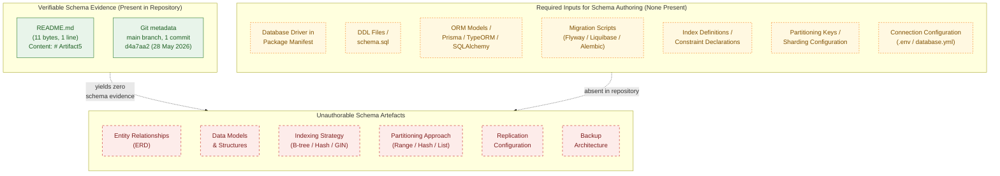

This diagram conveys three facts simultaneously: (1) the only verifiable artefacts in the repository are `README.md` and the single initial Git commit; (2) the seven artefact classes required to author a database schema diagram (driver dependency, DDL, ORM model, migration script, index/constraint definitions, partition key, connection configuration) are uniformly absent; and (3) every schema-design sub-component requested by the section prompt — entity relationships, data models, indexing strategy, partitioning, replication, backup — is therefore unauthorable against the current evidence base. The empty-state pattern visualised here is structurally identical to the schema-omission gap recorded in §3.6.1, §4.4.1, and §5.4.3.

#### 6.2.6.2 Data Flow — Empty-State Diagram

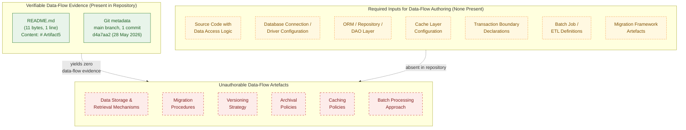

This diagram visualises that every data-management sub-component requested by the section prompt — storage and retrieval mechanisms, migration procedures, versioning strategy, archival policies, caching policies, batch processing — is unauthorable in the absence of any source code, persistence driver, cache engine, transaction-boundary declaration, batch-job definition, or migration framework, in direct continuity with the absence statements in §3.6.1, §3.6.2, §4.4.1, §5.4.3, and §5.4.4.

#### 6.2.6.3 Replication Architecture — Empty-State Diagram

```mermaid
flowchart TB
    subgraph RAPresent["Verifiable Replication Evidence (Present in Repository)"]
        direction TB
        RAP1["README.md<br/>(11 bytes, 1 line)<br/>Content: # Artifact5"]
        RAP2["Git metadata<br/>main branch, 1 commit<br/>d4a7aa2 (28 May 2026)"]
    end

    subgraph RARequired["Required Inputs for Replication Authoring (None Present)"]
        direction TB
        RAR1["Primary Database<br/>Instance Configuration"]
        RAR2["Replica Topology<br/>Declaration"]
        RAR3["Replication Protocol<br/>(Sync / Async / Logical)"]
        RAR4["Read/Write Splitter /<br/>Proxy Configuration"]
        RAR5["Connection Pool<br/>Configuration"]
        RAR6["Failover Monitor /<br/>Health Probe Configuration"]
        RAR7["Backup &amp; Restore<br/>Runbooks"]
        RAR8["Multi-Region /<br/>Multi-AZ Topology"]
    end

    subgraph RAAbsent["Unauthorable Replication Artefacts"]
        direction TB
        RAA1["Replication<br/>Configuration"]
        RAA2["Read/Write<br/>Splitting"]
        RAA3["Connection<br/>Pooling"]
        RAA4["Query Optimization<br/>Patterns"]
        RAA5["Backup &amp; Fault<br/>Tolerance Policies"]
        RAA6["Privacy Controls,<br/>Audit, Access Control"]
    end

    RAPresent -. "yields zero<br/>replication evidence" .-> RAAbsent
    RARequired -. "absent in repository" .-> RAAbsent

    classDef presentNode fill:#e8f4ea,stroke:#2e7d32,color:#1b5e20;
    classDef requiredNode fill:#fff8e1,stroke:#f57f17,color:#7f4f00,stroke-dasharray: 3 3;
    classDef absentNode fill:#fdecea,stroke:#c62828,color:#7f1d1d,stroke-dasharray: 5 5;

    class RAP1,RAP2 presentNode;
    class RAR1,RAR2,RAR3,RAR4,RAR5,RAR6,RAR7,RAR8 requiredNode;
    class RAA1,RAA2,RAA3,RAA4,RAA5,RAA6 absentNode;
```

This diagram visualises that every replication-, compliance-, and performance-related sub-component requested by the section prompt — replication configuration, read/write splitting, connection pooling, query optimisation, backup/fault tolerance, and access/audit controls — is unauthorable in the absence of any primary database instance, replica declaration, replication protocol, proxy/splitter, pool configuration, failover monitor, backup runbook, or multi-region topology. The absence is in direct continuity with §3.6.2 ("data tier of the system is, at the present revision, undefined"), §5.4.3 (every storage decision "Not selected"), §5.5.6 (every disaster-recovery dimension "Not specified" or "Not present"), and §6.1.4.3 (data-redundancy approach not applicable).

### 6.2.7 Forward-Looking Guidance

Consistent with the "living document" directive established in §1.3.3 and the trigger-event pattern established in §2.7.1, §3.9.1, §4.6.1, §5.7.1, and §6.1.6.1, this section must be re-authored — not merely amended — when implementation artefacts that bear on database design are introduced to the repository.

#### 6.2.7.1 Triggering Conditions for Future Authoring

The table below identifies the conditions under which each subsection of §6.2 becomes authorable. The triggers are aligned with those in §5.7.1 and §6.1.6.1 to preserve cross-section consistency.

| Trigger Event | §6.2 Subsection(s) Activated |
|---------------|------------------------------|
| First database driver dependency in a package manifest | §6.2.2 (all schema-design sub-components), §6.2.3.4, §6.2.5.3 |
| First schema file, DDL, or ORM model committed | §6.2.2.1, §6.2.2.2 |
| First index or constraint declaration committed | §6.2.2.3, §6.2.5.1 |
| First partition key, sharding scheme, or distribution policy committed | §6.2.2.4 |
| First replication configuration (primary/replica role) committed | §6.2.2.5, §6.2.5.4 |
| First backup procedure, restore runbook, or DR drill record committed | §6.2.2.6, §6.2.4.2 |
| First migration framework artefact (Flyway / Liquibase / Alembic / Prisma Migrate / etc.) committed | §6.2.3.1, §6.2.3.2 |
| First retention or archival policy artefact committed | §6.2.3.3, §6.2.4.1 |
| First database connection configuration committed | §6.2.3.4, §6.2.5.3 |
| First cache driver dependency or invalidation policy committed | §6.2.3.5, §6.2.5.2 |
| First data classification, PII tag, or privacy policy artefact committed | §6.2.4.1, §6.2.4.3 |
| First audit log table, audit middleware, or CDC stream configuration committed | §6.2.4.4 |
| First database role/grant script or RLS policy committed | §6.2.4.5 |
| First query plan, `EXPLAIN` output, or query-hint artefact committed | §6.2.5.1 |
| First connection-pool configuration (PgBouncer / driver pool / RDS Proxy / etc.) committed | §6.2.5.3 |
| First read/write splitter or replica-routing configuration committed | §6.2.5.4 |
| First batch job definition or ETL pipeline artefact committed | §6.2.5.5 |

#### 6.2.7.2 Required Artifact Classes for Section Population

To populate §6.2 in a future revision, the repository should contain at minimum the artefact classes listed below. The mapping identifies which subsection each class informs and aligns with §5.7.2 and §6.1.6.2 to avoid duplication.

| Artefact Class | §6.2 Subsection(s) Informed |
|----------------|-----------------------------|
| Database schema files (`.sql`, ORM model classes, Prisma schema, etc.) | §6.2.2.1, §6.2.2.2 |
| Migration scripts and migration framework configuration | §6.2.3.1, §6.2.3.2 |
| Database driver dependency in a package manifest | §6.2.2, §6.2.3.4, §6.2.5.3 |
| Connection string / database configuration file | §6.2.3.4, §6.2.5.3 |
| Cache driver dependency + cache configuration | §6.2.3.5, §6.2.5.2 |
| Backup, restore, and DR runbooks | §6.2.2.6, §6.2.4.2 |
| Replication topology configuration | §6.2.2.5, §6.2.5.4 |
| Data classification / retention policy artefacts | §6.2.4.1, §6.2.4.3 |
| Audit log schema or audit middleware | §6.2.4.4 |
| Database role / grant scripts | §6.2.4.5 |
| Index definitions and constraint declarations | §6.2.2.3, §6.2.5.1 |
| Partition key, sharding, or distribution scheme | §6.2.2.4 |
| Connection pool configuration (PgBouncer / pgcat / RDS Proxy / driver pool) | §6.2.5.3 |
| Batch job and ETL definitions | §6.2.5.5 |

#### 6.2.7.3 Assumptions and Constraints for Future Revisions

The constraints listed in §5.7.3 and §6.1.6.3 apply in full to §6.2 and are summarised below with §6.2-specific emphasis.

| Item | Assumption / Constraint |
|------|-------------------------|
| Diagram notation | Future revisions will continue to use Mermaid.js for schema (ERD), data-flow, and replication-architecture diagrams, consistent with §1.2.2, §1.3.3, §2.4.1, §3.8, §4.5.2, §5.6, and §6.1.5 |
| Empty-state styling | The `classDef presentNode` / `requiredNode` / `absentNode` styling will continue to denote evidence-based, required-input, and absent nodes respectively, until each of the three §6.2 diagrams converges into a fully populated form |
| Default technology stack | The default technology stack supplied in the section prompts (which explicitly includes MongoDB) is **not** applied retroactively. No relational, document, key-value, search, or object store will be documented in §6.2 until the corresponding driver dependency, schema file, or connection configuration is committed to the repository, in direct continuity with §3.1.2, §3.9.3, §5.7.3, and §6.1.6.3 |
| SLA / KPI authoring discipline | No RTO, RPO, retention period, latency target, throughput target, cache TTL, or any other quantitative value may be authored in §6.2.2.6, §6.2.3.3, §6.2.3.5, §6.2.4.1, §6.2.4.2, §6.2.5.1, or §6.2.5.2 absent a directly observed SLA/SLO/KPI/policy artefact in the repository, in direct continuity with §1.2.3, §2.5.2, §5.7.3, and §6.1.6.3 |
| Security / privacy authoring discipline | No data classification, PII handling rule, encryption-at-rest configuration, encryption-in-transit configuration, audit-event schema, or access-control policy may be asserted in §6.2.4.3, §6.2.4.4, or §6.2.4.5 absent a directly observed security artefact, in direct continuity with §2.5.3, §5.5.4, and §6.1.6.3 |
| Replication / redundancy authoring discipline | No replication topology, replica-role assignment, failover mechanism, read/write splitter rule, or multi-region posture may be asserted in §6.2.2.5, §6.2.4.2, or §6.2.5.4 absent a directly observed configuration artefact, in direct continuity with §5.5.6 and §6.1.4.3 |
| Empty-state diagrams | The three empty-state diagrams in §6.2.6 will be removed in the revision in which the first data-tier component becomes documentable; they exist solely to visualise the current empty state, in direct continuity with §5.7.3 and §6.1.6.3 |
| Source of truth | Repository contents take precedence over external documents in case of conflict, consistent with §2.7.3, §3.9.3, §4.6.3, §5.7.3, and §6.1.6.3 |

### 6.2.8 Section Prompt Compliance Summary

The section prompt enumerates four high-level groups (Schema Design, Data Management, Compliance Considerations, Performance Optimization) with twenty-one sub-components in total, plus three required diagram classes. The applicability of each to the current repository state is summarised below for traceability, mirroring the §6.1.7 compliance pattern.

| Prompt Sub-Component / Diagram | Applicable to Current Repository? | Treatment in This Section |
|---------------------------------|-----------------------------------|---------------------------|
| Entity relationships | No — §3.6.1, §4.4.1 | Documented as absent in §6.2.2.1 |
| Data models and structures | No — §3.6.1, §4.4.1 | Documented as absent in §6.2.2.2 |
| Indexing strategy | No — §3.6.1, §5.4.3 | Documented as absent in §6.2.2.3 |
| Partitioning approach | No — §3.6.1, §5.4.3 | Documented as absent in §6.2.2.4 |
| Replication configuration | No — §3.6.2, §6.1.4.3 | Documented as absent in §6.2.2.5 |
| Backup architecture | No — §2.5.4, §5.5.6 | Documented as absent in §6.2.2.6 |
| Migration procedures | No — §3.6.1, §4.4.1 | Documented as absent in §6.2.3.1 |
| Versioning strategy | No — §4.4.1 | Documented as absent in §6.2.3.2 |
| Archival policies | No — §3.6.2, §2.5.4 | Documented as absent in §6.2.3.3 |
| Data storage and retrieval mechanisms | No — §3.6.2, §5.4.3 | Documented as absent in §6.2.3.4 |
| Caching policies | No — §3.6.1, §5.4.4 | Documented as absent in §6.2.3.5 |
| Data retention rules | No — §3.6.2, §2.5.4 | Documented as absent in §6.2.4.1 |
| Backup and fault tolerance policies | No — §2.5.4, §5.5.6 | Documented as absent in §6.2.4.2 |
| Privacy controls | No — §2.5.3, §5.5.4 | Documented as absent in §6.2.4.3 |
| Audit mechanisms | No — §5.5.1, §5.5.2 | Documented as absent in §6.2.4.4 |
| Access controls | No — §2.5.3, §5.5.4 | Documented as absent in §6.2.4.5 |
| Query optimization patterns | No — §3.6, §5.5.5 | Documented as absent in §6.2.5.1 |
| Caching strategy | No — §5.4.4, §4.4.1 | Documented as absent in §6.2.5.2 |
| Connection pooling | No — §3.6.1 | Documented as absent in §6.2.5.3 |
| Read/write splitting | No — §3.6.2, §6.1.4.3 | Documented as absent in §6.2.5.4 |
| Batch processing approach | No — §2.4.2, §4.4.1 | Documented as absent in §6.2.5.5 |
| Database schema diagram (ERD) | No — no entities to depict | Empty-state diagram in §6.2.6.1 |
| Data flow diagram | No — no data flows to depict | Empty-state diagram in §6.2.6.2 |
| Replication architecture diagram | No — no topology to depict | Empty-state diagram in §6.2.6.3 |

#### 6.2.8.1 Treatment of Output-Format Requirements

The section prompt's output-format requirements (Markdown tables, tables limited to four columns, ERD diagrams, documentation of indexes and constraints) are honoured as follows under the current evidence base:

| Output Requirement | Treatment |
|--------------------|-----------|
| Use Markdown tables for structured data | Honoured — every status enumeration uses three- or four-column Markdown tables |
| Tables should never have more than four columns | Honoured — no table in §6.2 exceeds four columns |
| Include ERD diagrams | Substituted by the empty-state Database Schema diagram in §6.2.6.1; a populated ERD will replace it when the first schema artefact is committed |
| Document all indexes and constraints | Documented as absent in §6.2.2.3 (Indexing Strategy); a populated index-and-constraint inventory will be authored when the first DDL or ORM model is committed |

### 6.2.9 References

#### 6.2.9.1 Files Examined

- `README.md` — Confirmed sole content is the heading `# Artifact5` (11 bytes, 1 line). Establishes the absence of all source code, package manifests, configuration files, schemas, drivers, migration scripts, ORM models, and any other persistence-related artefacts that would otherwise inform §6.2.

#### 6.2.9.2 Folders Explored

- `` (repository root, depth 0) — Contains exactly one direct child (`README.md`) and zero subdirectories. Confirms the structural emptiness of the repository and the consequent inapplicability of every §6.2 sub-component. No deeper folders exist to explore.

#### 6.2.9.3 Filesystem Searches Performed

- `find / -name ".blitzyignore"` — Zero results, confirming no repository contents are excluded from analysis and that the empty data tier observed in §3.6.1 represents the true state of the repository.

#### 6.2.9.4 Technical Specification Sections Cross-Referenced

- **§1.1 EXECUTIVE SUMMARY** — Establishes baseline: single commit, 1 file (`README.md`, 11 bytes), 0 source files, 0 subdirectories.
- **§1.2 SYSTEM OVERVIEW** — Confirms no capabilities, no components, no technology stack; §1.2.3 records no KPI catalogue, metrics definitions, or telemetry plan.
- **§1.3 SCOPE** — §1.3.2 explicitly places "Data Persistence (Databases, caches, file stores, schemas)" out-of-scope because "No data-tier artifacts [are] present."
- **§2.4 FEATURE RELATIONSHIPS** — §2.4.2 records all four integration classes including "File-Based / Batch: No"; §2.4.3 confirms "Common Services (auth, logging, persistence): None present" and "Cross-Cutting Concerns (caching, retries, telemetry): None present."
- **§2.5 IMPLEMENTATION CONSIDERATIONS** — §2.5.3 records every security-policy dimension as "Not selected" or "Not present"; §2.5.4 records "Backup / Recovery Procedures: Not present" and "Runbooks / Operational Documentation: Not present."
- **§2.7 FORWARD-LOOKING GUIDANCE** — Established trigger-event pattern reused in §6.2.7.
- **§3.6 Databases & Storage** — The most directly relevant prior section. §3.6.1 enumerates all eight data-tier evidence dimensions as "None present" or "Not documented." §3.6.2 explicitly states "No persistence or caching strategy is documented in the repository. The data tier of the system is, at the present revision, undefined. No primary database, secondary database, cache, or storage service can be attributed to the system."
- **§4.4 Technical Implementation** — §4.4.1 records all six state-management dimensions (State Transitions, Data Persistence Points, Caching Requirements, Transaction Boundaries, Data Models / Domain Entities, Migration / Versioning of State) as "Not present."
- **§5.1 PREAMBLE: SYSTEM ARCHITECTURE DERIVABILITY STATEMENT** — Establishes the five governing rules for documenting absence (§5.1.2) inherited by §6.2.
- **§5.2 HIGH-LEVEL ARCHITECTURE** — All architecture dimensions, including data-flow description, "Not specified."
- **§5.3 COMPONENT DETAILS** — Records "Data Persistence Requirements: Not present" and "Schema / Data Model Definitions: None."
- **§5.4 TECHNICAL DECISIONS** — §5.4.3 records every storage-decision dimension (Primary Database Engine, Secondary / Analytics Store, Object / Blob Storage, Search Index, Storage Rationale) as "Not selected" or "Not authorable"; §5.4.4 records every caching-decision dimension (Cache Engine, Cache Invalidation Strategy, TTL Policies, Caching Justification) as "Not selected" or "Not specified."
- **§5.5 CROSS-CUTTING CONCERNS** — §5.5.1 records all monitoring/observability dimensions "Not present"; §5.5.2 records all logging/tracing dimensions "Not selected" or "Not specified"; §5.5.4 records all authentication/authorisation dimensions "Not selected"; §5.5.5 records all performance/SLA dimensions "Not specified"; §5.5.6 records all disaster-recovery dimensions (RTO, RPO, Backup Strategy, Restore Procedure, Multi-Region Posture, Failover Strategy, Runbook Catalogue, Drill Cadence) as "Not specified" or "Not present."
- **§5.6 EMPTY-STATE VISUALISATION** — Establishes the canonical three-subgraph Mermaid empty-state diagram template with `classDef presentNode` / `requiredNode` / `absentNode` styling, reused verbatim in §6.2.6.
- **§5.7 FORWARD-LOOKING GUIDANCE** — §5.7.1 enumerates trigger events including "First database driver, schema, migration, or ORM model committed" → "Populate §5.2.3 (Data Flow), §5.3.3 (Persistence), §5.4.3 (Storage Decision)"; §5.7.3 establishes the SLA/KPI authoring discipline and the non-application of the default technology stack.
- **§6.1 CORE SERVICES ARCHITECTURE** — Establishes the "Applicability Statement" pattern that §6.2 follows. §6.1.4.3 (Data Redundancy Approach) has already documented the absence of any data store, stating "Redundancy patterns (synchronous replication, asynchronous replication, quorum-based replication, multi-master, log-shipping, snapshot-based backup, cross-region object storage) presuppose at least one data store. None is present." §6.1.5 establishes the canonical three-diagram empty-state visualisation pattern reused in §6.2.6.

#### 6.2.9.5 Negative-Result Searches Performed

- Semantic search for "database schema migration ORM" — 0 results, confirming the absence of any database-related artefact.
- Semantic search for "cache caching invalidation TTL" — 0 results, confirming the absence of any cache-related artefact.
- Semantic search for "replication primary replica failover" — 0 results, confirming the absence of any replication topology.
- Semantic search for "backup restore RTO RPO" — 0 results, confirming the absence of any backup or disaster-recovery artefact.
- Filesystem search for `.blitzyignore` files — 0 results, confirming no repository contents are hidden from analysis.

## 6.3 Integration Architecture

**Applicability Statement: Integration Architecture is not applicable for this system.**

The Artifact5 repository does not implement, configure, integrate with, or reference any external system, internal service, partner API, message broker, event stream, batch pipeline, API gateway, identity provider, or any other integration-bearing component. As established in §1.1, §1.2, §1.3, §2.4, §2.5, §3.5, §4.2, §4.4, §5.2, §5.3, §5.4, §5.5, §6.1, and §6.2, the repository at the time of this specification holds a single 11-byte `README.md` file whose entire content is the heading `# Artifact5`, with zero subdirectories, zero source files, zero package manifests, and zero configuration files. No API contract, authentication client, authorisation policy, rate-limiting middleware, version negotiation scheme, message broker topology, stream processor, batch scheduler, third-party SDK declaration, legacy adapter, API gateway configuration, or external service contract can be derived from this evidence base. Per the controlling clause in the section prompt — *"If the system does not require integration with external systems or services, clearly state 'Integration Architecture is not applicable for this system' and explain why"* — this section faithfully documents the absence of an integration architecture rather than fabricating one.

In direct continuity with the "Methodology for Documenting Absence" defined in §2.1.2, §3.1.2, §4.1.2, and §5.1.2, and inheriting the exact pattern applied in §6.1 (Core Services Architecture) and §6.2 (Database Design), this section enumerates the absence of every integration sub-component requested by the section prompt and records the cross-references that corroborate the absence. The five governing rules established in §5.1.2 — (1) no fabrication of architectural components, (2) no fabrication of integrations or data flows, (3) no application of the default technology stack as a fallback, (4) no fabrication of SLAs/KPIs/security policies/operational procedures, and (5) structured absence reporting with traceability preservation — apply in full to this section. The empty-state diagram pattern established in §5.6 and reused in §6.1.5 and §6.2.6 (three subgraphs — Present / Required / Absent — with the `classDef presentNode` / `requiredNode` / `absentNode` styling inherited from §4.5.2) is reapplied here to visualise the gap for each of the three required diagram classes (Integration Flow, API Architecture, Message Flow).

### 6.3.1 Repository Evidence Underlying This Section

The artefacts enumerated below are the only artefacts present in the repository and are the sole evidentiary basis for the documentation in §6.3. No API endpoint, authentication mechanism, message channel, broker configuration, batch flow, gateway rule, or third-party connection can be derived beyond what these artefacts evidence. This table mirrors the structure of §5.1.1, §6.1.1, and §6.2.1 to preserve cross-section traceability.

| Evidence Source | Observation | Cross-Reference |
|-----------------|-------------|-----------------|
| `README.md` content | Single line: `# Artifact5` (11 bytes, 1 line) | §1.1.1, §3.1.1, §6.1.1, §6.2.1 |
| Repository root listing | One direct child (`README.md`), zero subdirectories | §1.2.2, §3.5.1, §6.1.1, §6.2.1 |
| Git commit metadata | One commit (`d4a7aa2…`), initial commit dated 28 May 2026 | §1.1.1, §6.1.1, §6.2.1 |
| Filesystem search for `.blitzyignore` files | Zero matches — confirms no repository contents are excluded from analysis | §6.1.8.4, §6.2.9.3 |
| Negative-result searches (API endpoints, integration patterns, message queue, third-party services) | Zero matches in repository | §3.5.1, §3.5.2 |
| Negative-result searches (API gateway, authentication, OAuth, REST endpoints) | Zero matches in repository | §5.4.5, §5.5.4 |

#### 6.3.1.1 Pre-conditions Required for Section Authoring

The section prompt presupposes a system that exposes or consumes at least one network-addressable endpoint, exchanges messages with another process, or coordinates with at least one external dependency. None of these pre-conditions is satisfied. §1.3.2 explicitly places "All HTTP, gRPC, GraphQL, or messaging endpoints" and "Third-party services, internal systems, partner APIs" out-of-scope because "no service definitions [are] present" and "no integration manifests or contracts [are] present." §2.4.2 records all four integration classes — Synchronous APIs (HTTP/gRPC/GraphQL), Asynchronous Messaging, File-Based / Batch Integrations, and Third-Party Service Connections — as "No." §3.5.1 enumerates six external-integration evidence dimensions (external API client code, authentication provider integration, monitoring/observability tool integration, cloud service configuration, environment/secret configuration, SDK declarations) and records every one as "None present." §3.5.2 confirms that "the four dimensions called out by the section prompt — External APIs, Authentication services, Monitoring tools, Cloud services — are each documented as absent" and that "no specific provider can be attributed to the system at the present revision." §4.2.2 records every system-workflow dimension that would manifest integration — Data Flow Between Systems, API Interactions, Event Processing Flows, Batch Processing Sequences, Third-Party Service Connections, Data Serialisation Formats/Schemas — as "Not present." §5.2.4 records the External Integration Points inventory as empty. §5.4.2 records every communication-pattern choice (Synchronous Pattern, Asynchronous Pattern, Inter-Process Communication Choice, Serialisation Format) as "Not selected." §5.4.5 records every security-mechanism dimension as "Not selected" or "Not specified." §6.1.2.2 records "Inter-Service Communication Patterns: Not applicable — no services to communicate." §6.2.5.5 records "Batch Processing Approach: Not applicable — no batch workloads defined."

### 6.3.2 API Design Status

The section prompt enumerates six API-design dimensions: protocol specifications, authentication methods, authorization framework, rate limiting strategy, versioning approach, and documentation standards. None can be authored. The table below records the status of each dimension with cross-references to the prior sections of this specification that corroborate the absence.

| Sub-Component | Status | Cross-Reference |
|---------------|--------|-----------------|
| Protocol specifications | Not applicable — no endpoints exist | §1.3.2, §2.4.2, §5.3.2, §5.4.2 |
| Authentication methods | Not applicable — no auth modules | §2.5.3, §3.5.1, §5.4.5, §5.5.4 |
| Authorization framework | Not applicable — no policies defined | §2.5.3, §5.4.5, §5.5.4 |
| Rate limiting strategy | Not applicable — no traffic to throttle | §2.4.3, §4.4.2, §5.5.3 |
| Versioning approach | Not applicable — no contracts to version | §1.3.2, §2.4.2, §5.2.4 |
| Documentation standards | Not applicable — no API artefacts to document | §1.2.1, §5.2.4 |

#### 6.3.2.1 Protocol Specifications

Protocol specifications (HTTP/REST, gRPC, GraphQL, WebSocket, Server-Sent Events, AMQP, MQTT, STOMP, NATS, Kafka wire protocol, JSON-RPC, XML-RPC, SOAP, EDI, etc.) require at minimum an interface definition artefact (OpenAPI/Swagger specification, gRPC `.proto` file, GraphQL SDL, AsyncAPI document, WSDL, JSON Schema, Avro schema, Protobuf descriptor) or an HTTP routing declaration in source code. §1.3.2 explicitly places "all HTTP, gRPC, GraphQL, or messaging endpoints" out-of-scope. §2.4.2 records "Synchronous APIs (HTTP/gRPC/GraphQL): No." §5.3.2's protocol-binding catalogue records "None" for all binding categories. §5.4.2 records both "Synchronous Pattern (REST / gRPC / GraphQL): Not selected" and "Serialisation Format (JSON / Protobuf / Avro / etc.): Not selected." Because no contract, no router declaration, no endpoint handler, and no serialisation choice is committed to the repository, no protocol, no transport binding, no media type, no content negotiation rule, and no payload schema can be authored.

#### 6.3.2.2 Authentication Methods

Authentication methods (OAuth 2.0 with authorization-code/PKCE/client-credentials/device-code flows, OpenID Connect with hybrid/implicit flows, SAML 2.0, mTLS with X.509 client certificates, API key headers/query parameters, HMAC request signing, Basic Auth, Digest Auth, Kerberos/SPNEGO, JWT bearer tokens, opaque tokens, PASETO tokens, biometric/passkey/WebAuthn, magic-link/one-time-password flows) require at minimum an authentication library declaration in a package manifest, a credential validator implementation, an identity provider configuration, or a documented authentication policy. §2.5.3 records "Authentication / Authorisation Model: Not present." §3.5.1 records "Authentication provider integration (e.g., OAuth/OIDC clients, SAML metadata, JWT validators, Auth0/Okta/Cognito SDKs): None present." §5.4.5 records "Authentication Mechanism (OAuth/OIDC, SAML, JWT, mTLS, API Keys, etc.): Not selected." §5.5.4 records every authentication dimension — Identity Provider, Authentication Protocol, Token Format, Session Management Strategy, Multi-Factor/Step-Up Authentication — as "Not selected" or "Not specified." Because no identity provider has been selected and no authentication library, validator, or policy has been committed, no authentication method, no token format, no session-management strategy, and no multi-factor enrolment path can be authored.

#### 6.3.2.3 Authorization Framework

Authorization frameworks (Role-Based Access Control (RBAC), Attribute-Based Access Control (ABAC), Relationship-Based Access Control (ReBAC, Google Zanzibar-style), Policy-Based Access Control via Open Policy Agent (OPA)/Rego, Casbin policy engines, AWS IAM JSON policies, capability-based security, claims-based authorization, ACL-based authorization, mandatory access control) require both an authentication context (subject identity) and a policy artefact (Rego file, Casbin model, IAM policy document, role/permission declaration in a configuration file). §2.5.3 records "Authorisation Model (RBAC, ABAC, ReBAC, capability-based, etc.): Not selected." §5.4.5 mirrors this state. §5.5.4 records "Authorisation Model (RBAC, ABAC, ReBAC, policies): Not selected." Because no authorisation model has been chosen and no policy artefact has been committed, no role catalogue, no permission set, no policy-evaluation flow, and no privilege-escalation prevention strategy can be authored. §6.2.4.5 has already documented this absence in the database-access-control context: "With no database to control access to and no authorisation model selected, no access-control policy can be authored."

#### 6.3.2.4 Rate Limiting Strategy

Rate-limiting strategies (fixed-window counters, sliding-window counters, sliding-window logs, token bucket, leaky bucket, GCRA, distributed token bucket via Redis Lua scripts, API-gateway-enforced quotas, client-key-scoped limits, IP-scoped limits, user-scoped limits, tenant-scoped limits, endpoint-scoped limits, cost-based or weighted limits, adaptive/AIMD limits) require both a middleware/gateway component capable of intercepting requests and an explicit policy declaration (e.g., `express-rate-limit` options, `Bucket4j` configuration, Envoy `local_ratelimit`/`global_ratelimit` filter, Kong rate-limiting plugin config, AWS API Gateway usage plan, Cloudflare Worker KV-backed limiter). §2.4.3 records "Cross-Cutting Concerns (caching, retries, telemetry): None present." §4.4.2 records the absence of all six error-handling cross-cutting concerns (which is where throttling/back-pressure handling would be documented). §5.5.3 mirrors this state. No rate-limit algorithm, no key derivation scheme, no quota policy, no burst allowance, no 429-response shape, and no `Retry-After` header strategy can be authored.

#### 6.3.2.5 Versioning Approach

API versioning approaches (URI path versioning such as `/v1/…`, custom header versioning such as `X-API-Version: 2024-01-15`, `Accept` header content negotiation with vendor media types such as `application/vnd.example.v2+json`, query parameter versioning, host-based versioning such as `v2.api.example.com`, hypermedia/HATEOAS link-based evolution, GraphQL field deprecation with `@deprecated`, gRPC backwards-compatibility via field-number reservation, semantic versioning of the contract artefact, calendar versioning) presuppose at minimum one published contract that needs to evolve. §1.3.2 records that all endpoint definitions are out-of-scope. §2.4.2 records the absence of every integration class. §5.2.4 records the External Integration Points table as empty. With no contract published, no consumer registered, and no breaking-change history, no versioning scheme, no deprecation policy, no sunset-header strategy, and no contract-test matrix can be authored.

#### 6.3.2.6 Documentation Standards

API documentation standards (OpenAPI/Swagger UI, ReDoc, Stoplight Studio, Postman/Bruno collections, Insomnia workspaces, Apiary blueprints, generated Javadoc/Sphinx/Doxygen contract pages, gRPC `protoc-gen-doc` output, GraphQL introspection-rendered docs via GraphiQL/Voyager, AsyncAPI Studio, ADR-format design notes, RFC-style protocol specifications) require at minimum one contract artefact to render. §1.2.1 has established that "no integration diagrams, interface definitions, API contracts, message-flow descriptions, or enterprise-architecture references are present." §5.2.4 records the External Integration Points table as empty. With no contract committed, no documentation generator, no rendering pipeline, no docs portal hosting destination, and no documentation-coverage policy can be authored.

### 6.3.3 Message Processing Status

The section prompt enumerates five message-processing dimensions: event processing patterns, message queue architecture, stream processing design, batch processing flows, and error handling strategy. None can be authored. The table below records the status of each dimension.

| Sub-Component | Status | Cross-Reference |
|---------------|--------|-----------------|
| Event processing patterns | Not applicable — no events emitted or consumed | §2.4.2, §4.2.2, §5.4.2 |
| Message queue architecture | Not applicable — no broker configured | §2.4.2, §3.5.1, §4.2.2 |
| Stream processing design | Not applicable — no stream processor | §2.4.2, §4.2.2 |
| Batch processing flows | Not applicable — no batch workload defined | §2.4.2, §4.2.2, §6.2.5.5 |
| Error handling strategy | Not applicable — no error-handling code | §2.4.3, §4.4.2, §5.5.3 |

#### 6.3.3.1 Event Processing Patterns

Event processing patterns (publish-subscribe with topic-based routing, content-based routing with filter expressions, event sourcing with append-only event logs, Command Query Responsibility Segregation (CQRS) with separated read/write models, saga orchestration via centralised coordinators, saga choreography via published domain events, outbox pattern for transactional event publication, inbox pattern for idempotent consumption, complex event processing (CEP) over event streams, event-driven workflow orchestration via Temporal/Cadence/Argo Workflows) presuppose at least one event producer, one event schema, and a delivery channel. §2.4.2 records "Asynchronous Messaging: No" and "File-Based / Batch Integrations: No." §4.2.2 records "Event Processing Flows (queues, streams, topics): Not present." §5.4.2 records "Asynchronous Pattern (Message Queue / Event Stream / Pub-Sub): Not selected." No event schema, no producer endpoint, no subscriber registry, no event-routing rule, no saga definition, no outbox table, and no idempotency-key strategy can be authored.

#### 6.3.3.2 Message Queue Architecture

Message queue architectures (Apache Kafka topic-and-partition layouts, RabbitMQ exchange-binding-queue topologies, Amazon SQS standard or FIFO queues with dead-letter pairings, Azure Service Bus queues/topics/subscriptions, Google Pub/Sub topics with subscription pull or push delivery, NATS subject hierarchies with JetStream persistence, Apache Pulsar tenant/namespace/topic structures, ActiveMQ Artemis with JMS semantics, IBM MQ queues, Redis Streams with consumer groups, ZeroMQ patterns) require both a broker selection (with its associated client library declared in a package manifest) and a broker configuration artefact (topic declarations, exchange bindings, queue properties, consumer-group definitions, retention/compaction policies, replication factors, acknowledgement modes). §2.4.2 records "Asynchronous Messaging: No." §3.5.1 records the absence of every external client configuration. §4.2.2 records "Event Processing Flows (queues, streams, topics): Not present." Because no broker has been selected and no broker-side configuration has been committed, no queue topology, no exchange-binding rule, no consumer-group strategy, no acknowledgement/redelivery policy, no message ordering guarantee, no exactly-once-delivery design, and no broker-side authentication/authorisation can be authored.

#### 6.3.3.3 Stream Processing Design

Stream processing designs (Apache Kafka Streams topologies with `KStream`/`KTable`/state-store abstractions, Apache Flink DataStream/SQL/Table API jobs with watermark/window/checkpoint configurations, Apache Spark Structured Streaming queries with micro-batch or continuous-processing modes, AWS Kinesis Data Streams with KCL consumers, Google Cloud Dataflow/Apache Beam pipelines, Azure Stream Analytics jobs, Materialize streaming SQL, RisingWave streaming SQL, ksqlDB queries, Apache Storm topologies, Apache Samza jobs) require both a stream source (broker, change-data-capture connector, log-tail follower, sensor ingestion endpoint) and a processing topology definition (DAG of operators, window specifications, state-store schemas, checkpoint storage configuration, exactly-once-processing-semantics enablement). §2.4.2 records every integration class as absent. §4.2.2 records "Event Processing Flows (queues, streams, topics): Not present." No stream source, no operator topology, no windowing rule (tumbling, hopping, sliding, session), no watermark/lateness policy, no state-store backend, no checkpoint cadence, and no rebalance/repartition strategy can be authored.

#### 6.3.3.4 Batch Processing Flows

Batch processing flows (cron-scheduled jobs, Apache Airflow DAGs, Argo Workflows, AWS Step Functions state machines, Apache Oozie workflows, Luigi pipelines, Prefect flows, Dagster assets/ops/jobs, Kubernetes CronJobs, Quartz Scheduler triggers, Spring Batch jobs, AWS Batch job queues/definitions, GCP Cloud Composer DAGs, Databricks Workflows, dbt models with scheduled materialisation, ETL/ELT pipelines via Fivetran/Airbyte/Talend/Informatica) require both a batch workload definition (job class, transformation logic, input/output dataset bindings) and a scheduler/orchestrator (cron table entry, DAG declaration, state-machine definition). §2.4.2 records "File-Based / Batch Integrations: No." §4.2.2 records "Batch Processing Sequences (scheduled jobs, ETL): Not present." §6.2.5.5 has already documented this absence in the data-tier context: "Batch-processing approaches… require both a batch workload definition and a scheduler/runner (cron, Airflow, Argo Workflows, Step Functions, Dataflow, Spark, Flink). §2.4.2 explicitly records 'File-Based / Batch: No' among the four integration classes. §4.4.1 records the absence of all state-bearing entities, including those that would participate in batch flows. No batch job, schedule, partitioning strategy, or recovery checkpoint can be authored." No job catalogue, no schedule, no input/output binding, no dependency graph, no checkpoint/resume policy, and no SLA target for batch completion can be authored.

#### 6.3.3.5 Error Handling Strategy

Integration error-handling strategies (dead-letter queue (DLQ) routing with poison-message inspection, parking-lot queues for manual triage, retry queues with exponential backoff and jitter, idempotency-key-protected redelivery, circuit-breaker patterns at the consumer boundary, bulkhead isolation per integration partner, fallback to cached responses or default values, compensation actions in distributed sagas, error-event publication for downstream notification, structured error taxonomies with retryable/non-retryable classification, OpenTelemetry-instrumented error spans, alert routing via PagerDuty/Opsgenie/VictorOps) require both error-prone code paths (network calls, deserialisation, message handlers) and explicit policy artefacts (retry decorators, circuit-breaker configurations, DLQ bindings, alert rules). §2.4.3 records "Cross-Cutting Concerns (caching, retries, telemetry): None present." §4.4.2 records all six error-handling dimensions — Retry Mechanisms, Fallback Processes, Error Notification Flows, Recovery Procedures, Exception Classification, and Dead-Letter / Quarantine Handling — as "Not present." §5.5.3 mirrors this state in its entirety: "Dead-Letter / Quarantine Handling: Not present." §6.1.2.5, §6.1.2.6, §6.1.4.1, and §6.1.4.5 have already documented the absence of circuit breakers, retry/fallback mechanisms, fault tolerance, and degradation policies. No retry policy, no DLQ binding, no idempotency-key derivation rule, no error taxonomy, no alert-routing rule, and no compensation-action specification can be authored.

### 6.3.4 External Systems Status

The section prompt enumerates four external-systems dimensions: third-party integration patterns, legacy system interfaces, API gateway configuration, and external service contracts. None can be authored. The table below records the status of each dimension.

| Sub-Component | Status | Cross-Reference |
|---------------|--------|-----------------|
| Third-party integration patterns | Not applicable — no third-party clients | §2.4.2, §3.5.1, §4.2.2 |
| Legacy system interfaces | Not applicable — no legacy bridges | §1.2.1, §1.3.2 |
| API gateway configuration | Not applicable — no gateway deployed | §3.7, §5.2.1 |
| External service contracts | Not applicable — no partners onboarded | §1.2.1, §3.5.1, §5.2.4 |

#### 6.3.4.1 Third-Party Integration Patterns

Third-party integration patterns (REST-client wrappers with retry/backoff/circuit-breaker decoration, SDK-mediated calls to managed services such as Stripe/Twilio/SendGrid/Auth0/Cloudinary/Algolia, webhook receivers with HMAC signature verification, webhook emitters with delivery guarantees, anti-corruption layers translating partner schemas to internal domain models, vendor-specific event-bus subscriptions, OAuth 2.0 client implementations against external identity providers, OpenID Connect Relying-Party implementations, partner-managed iframe/SDK embeds, federated graphs via Apollo Federation/StepZen, API aggregation/composition layers, Backend-for-Frontend (BFF) façades, mesh-mediated cross-cluster calls) require at minimum a client library declaration in a package manifest, a credential reference, and an endpoint configuration. §2.4.2 records "Third-Party Service Connections: No." §3.5.1 records every external-integration evidence dimension — external API client code, authentication provider integration, monitoring tool integration, cloud service configuration, environment/secret configuration, SDK declarations — as "None present." §3.5.2 confirms that "no specific provider can be attributed to the system at the present revision." §4.2.2 records "Third-Party Service Connections: Not present — no SDKs, clients, or service configurations." No third-party SDK, no client wrapper, no webhook receiver, no credential vault binding, no partner-specific anti-corruption layer, no fault-isolation strategy per partner, and no SLO budget per upstream dependency can be authored.

#### 6.3.4.2 Legacy System Interfaces

Legacy system interfaces (mainframe COBOL/CICS/IMS bridges via MQ Series or HTTP gateways, AS/400 RPG program calls via JT400 or proprietary middleware, SOAP web service clients/providers with WSDL/XSD contracts, EDI X12 or EDIFACT translators, fixed-width or COBOL-copybook flat-file processors with FTP/SFTP transport, screen-scraping adapters, anti-corruption layers wrapping legacy domain models, strangler-fig façades incrementally replacing legacy capabilities, change-data-capture (CDC) connectors against legacy databases, replication-stream bridges from legacy stores) require both an identified legacy system and an interface artefact (WSDL, copybook, X12 transaction set, FTP credentials, CDC connector configuration, anti-corruption translator code). §1.2.1 records "No business context, market analysis, competitive positioning, or domain narrative is present" in the repository. §1.3.2 records that "no integration manifests or contracts present." The repository contains no indication of any predecessor system, replaced workflow, or coexistence requirement. No legacy interface, transport binding, message translation rule, or migration/strangler strategy can therefore be authored.

#### 6.3.4.3 API Gateway Configuration

API gateway configurations (Kong declarative configuration with services/routes/plugins, AWS API Gateway REST/HTTP/WebSocket APIs with usage plans/stages/authorizers, Azure API Management policies with inbound/outbound/backend/on-error pipelines, Google Cloud Endpoints/Apigee proxies with quotas/auth/transformation, Tyk gateway definitions with rate limits and analytics, Envoy proxy listener/filter/cluster/route configurations, Istio/Linkerd ingress gateway VirtualServices, NGINX/HAProxy reverse-proxy server blocks, Traefik dynamic configuration via Docker labels/Kubernetes Ingress/file provider, KrakenD endpoint composition, Express Gateway/Tyk plugin pipelines) require both an ingress runtime (the gateway product) and a declarative configuration artefact (YAML/JSON/HCL configuration, IaC module, Kubernetes Custom Resource Definitions). §3.7 records the absence of all container, IaC, orchestration, and CI/CD artefacts — the locations in which API gateway configuration would necessarily reside. §5.2.1 records the architectural style as undefined because "no source files, no service manifests, [and] no deployment topology" are present. Because no gateway runtime has been selected and no gateway configuration artefact has been committed, no route declaration, no authentication plugin pipeline, no transformation rule, no TLS-termination policy, no quota enforcement scheme, no traffic-shaping rule, no canary/blue-green routing rule, and no WAF rule can be authored.

#### 6.3.4.4 External Service Contracts

External service contracts (formal Service Level Agreements with partners specifying availability, latency, and remedy clauses; Service Level Objectives defining error-budget commitments; Data Processing Agreements (DPAs) for GDPR/CCPA-regulated data exchanges; Business Associate Agreements (BAAs) for HIPAA-regulated data exchanges; partner-provided OpenAPI specifications; consumer-driven contract test suites via Pact; provider-published JSON Schema or Avro schema registries; mutual TLS certificate-pinning agreements; OAuth client-registration metadata; rate-limit / quota contracts; data-residency commitments; vendor security questionnaires and SOC 2 attestations) require at minimum a partnership relationship and a signed or technically encoded contract. §1.2.1 records that the repository contains no business context, no partner inventory, no contractual references. §3.5.1 records every external-integration evidence dimension as "None present." §5.2.4 records the External Integration Points table as empty. Per the SLA-authoring discipline established in §5.7.3 and reaffirmed in §6.1.6.3 and §6.2.7.3, no SLA target, no SLO commitment, no DPA/BAA clause, no consumer-driven contract, and no partner-API binding may be authored absent a directly observed contract artefact in the repository.

### 6.3.5 Empty-State Visualisations

Three diagrams are required by the section prompt: an Integration Flow diagram, an API Architecture diagram, and a Message Flow diagram (the latter substituting for "sequence diagrams for key flows" requested in the output-format requirements, because no key flows exist to be sequenced). Because none of the three has any evidence base in the repository, each is rendered below as a focused empty-state diagram following the canonical three-subgraph (Present / Required / Absent) template established in §5.6 and reused in §6.1.5 and §6.2.6. The `classDef presentNode` / `requiredNode` / `absentNode` styling is preserved for visual continuity across all empty-state diagrams in this specification.

#### 6.3.5.1 Integration Flow — Empty-State Diagram

```mermaid
flowchart TB
    subgraph IFPresent["Verifiable Integration Evidence (Present in Repository)"]
        direction TB
        IFP1["README.md<br/>(11 bytes, 1 line)<br/>Content: # Artifact5"]
        IFP2["Git metadata<br/>main branch, 1 commit<br/>d4a7aa2 (28 May 2026)"]
    end

    subgraph IFRequired["Required Inputs for Integration-Flow Authoring (None Present)"]
        direction TB
        IFR1["External API Client Code /<br/>HTTP Client Configurations"]
        IFR2["Third-Party SDK Declarations<br/>in Package Manifests"]
        IFR3["Webhook Receiver /<br/>Emitter Implementations"]
        IFR4["Anti-Corruption Layers /<br/>Legacy Bridges"]
        IFR5["Environment / Secret /<br/>Credential References"]
        IFR6["Partner Endpoint URLs /<br/>Service Discovery Bindings"]
        IFR7["External Service Contracts<br/>(SLA / DPA / BAA / OpenAPI)"]
    end

    subgraph IFAbsent["Unauthorable Integration-Flow Artefacts"]
        direction TB
        IFA1["Third-Party<br/>Integration Patterns"]
        IFA2["Legacy System<br/>Interfaces"]
        IFA3["API Gateway<br/>Configuration"]
        IFA4["External Service<br/>Contracts"]
        IFA5["Inbound / Outbound<br/>Webhook Topology"]
        IFA6["Credential &amp; Secret<br/>Distribution Flow"]
    end

    IFPresent -. "yields zero<br/>integration evidence" .-> IFAbsent
    IFRequired -. "absent in repository" .-> IFAbsent

    classDef presentNode fill:#e8f4ea,stroke:#2e7d32,color:#1b5e20;
    classDef requiredNode fill:#fff8e1,stroke:#f57f17,color:#7f4f00,stroke-dasharray: 3 3;
    classDef absentNode fill:#fdecea,stroke:#c62828,color:#7f1d1d,stroke-dasharray: 5 5;

    class IFP1,IFP2 presentNode;
    class IFR1,IFR2,IFR3,IFR4,IFR5,IFR6,IFR7 requiredNode;
    class IFA1,IFA2,IFA3,IFA4,IFA5,IFA6 absentNode;
```

This diagram conveys three facts simultaneously: (1) the only verifiable artefacts in the repository are `README.md` and the single initial Git commit; (2) the seven artefact classes required to author an integration-flow diagram (external API clients, third-party SDKs, webhook implementations, anti-corruption layers, credential references, endpoint bindings, external service contracts) are uniformly absent; and (3) every external-systems sub-component requested by the section prompt — third-party integration patterns, legacy system interfaces, API gateway configuration, external service contracts — is therefore unauthorable against the current evidence base. The empty-state pattern visualised here is structurally identical to the integration-omission gap recorded in §2.4.2, §3.5.1, §4.2.2, and §5.2.4.

#### 6.3.5.2 API Architecture — Empty-State Diagram

```mermaid
flowchart TB
    subgraph AAPresent["Verifiable API Evidence (Present in Repository)"]
        direction TB
        AAP1["README.md<br/>(11 bytes, 1 line)<br/>Content: # Artifact5"]
        AAP2["Git metadata<br/>main branch, 1 commit<br/>d4a7aa2 (28 May 2026)"]
    end

    subgraph AARequired["Required Inputs for API Architecture Authoring (None Present)"]
        direction TB
        AAR1["OpenAPI / Swagger /<br/>gRPC .proto / GraphQL SDL"]
        AAR2["HTTP Routing /<br/>Endpoint Handler Code"]
        AAR3["Authentication Library<br/>Configuration (Auth0 / Okta / etc.)"]
        AAR4["Authorisation Policy<br/>(RBAC / ABAC / OPA Rego)"]
        AAR5["Rate-Limiting Middleware /<br/>Gateway Quota Config"]
        AAR6["API Versioning Rules<br/>(URI / Header / Media Type)"]
        AAR7["Documentation Generator<br/>(Swagger UI / ReDoc / Postman)"]
        AAR8["API Gateway Configuration<br/>(Kong / Envoy / AWS APIGW)"]
    end

    subgraph AAAbsent["Unauthorable API Architecture Artefacts"]
        direction TB
        AAA1["Protocol<br/>Specifications"]
        AAA2["Authentication<br/>Methods"]
        AAA3["Authorization<br/>Framework"]
        AAA4["Rate Limiting<br/>Strategy"]
        AAA5["Versioning<br/>Approach"]
        AAA6["Documentation<br/>Standards"]
    end

    AAPresent -. "yields zero<br/>API evidence" .-> AAAbsent
    AARequired -. "absent in repository" .-> AAAbsent

    classDef presentNode fill:#e8f4ea,stroke:#2e7d32,color:#1b5e20;
    classDef requiredNode fill:#fff8e1,stroke:#f57f17,color:#7f4f00,stroke-dasharray: 3 3;
    classDef absentNode fill:#fdecea,stroke:#c62828,color:#7f1d1d,stroke-dasharray: 5 5;

    class AAP1,AAP2 presentNode;
    class AAR1,AAR2,AAR3,AAR4,AAR5,AAR6,AAR7,AAR8 requiredNode;
    class AAA1,AAA2,AAA3,AAA4,AAA5,AAA6 absentNode;
```

This diagram visualises that every API-design sub-component requested by the section prompt — protocol specifications, authentication methods, authorization framework, rate limiting strategy, versioning approach, documentation standards — is unauthorable in the absence of any interface definition artefact, routing/handler code, authentication library, authorisation policy, rate-limiting middleware, versioning rule, documentation generator, or API gateway configuration, in direct continuity with the absence statements in §1.3.2, §2.4.2, §3.5.1, §5.3.2, §5.4.2, §5.4.5, and §5.5.4.

#### 6.3.5.3 Message Flow — Empty-State Diagram

```mermaid
flowchart TB
    subgraph MFPresent["Verifiable Message-Flow Evidence (Present in Repository)"]
        direction TB
        MFP1["README.md<br/>(11 bytes, 1 line)<br/>Content: # Artifact5"]
        MFP2["Git metadata<br/>main branch, 1 commit<br/>d4a7aa2 (28 May 2026)"]
    end

    subgraph MFRequired["Required Inputs for Message-Flow Authoring (None Present)"]
        direction TB
        MFR1["Message Broker Configuration<br/>(Kafka / RabbitMQ / SQS / NATS)"]
        MFR2["Event Schema Registry<br/>(Avro / Protobuf / JSON Schema)"]
        MFR3["Producer / Consumer<br/>Handler Code"]
        MFR4["Stream Processor Topology<br/>(Kafka Streams / Flink / Beam)"]
        MFR5["Batch Job Definitions<br/>(Cron / Airflow / Step Functions)"]
        MFR6["Dead-Letter Queue /<br/>Retry Policy Configuration"]
        MFR7["Error-Handling Middleware /<br/>Circuit Breaker / Bulkhead"]
        MFR8["Idempotency Key /<br/>Outbox / Inbox Tables"]
    end

    subgraph MFAbsent["Unauthorable Message-Flow Artefacts"]
        direction TB
        MFA1["Event Processing<br/>Patterns"]
        MFA2["Message Queue<br/>Architecture"]
        MFA3["Stream Processing<br/>Design"]
        MFA4["Batch Processing<br/>Flows"]
        MFA5["Error Handling<br/>Strategy"]
        MFA6["Sequence Diagrams<br/>for Key Flows"]
    end

    MFPresent -. "yields zero<br/>message-flow evidence" .-> MFAbsent
    MFRequired -. "absent in repository" .-> MFAbsent

    classDef presentNode fill:#e8f4ea,stroke:#2e7d32,color:#1b5e20;
    classDef requiredNode fill:#fff8e1,stroke:#f57f17,color:#7f4f00,stroke-dasharray: 3 3;
    classDef absentNode fill:#fdecea,stroke:#c62828,color:#7f1d1d,stroke-dasharray: 5 5;

    class MFP1,MFP2 presentNode;
    class MFR1,MFR2,MFR3,MFR4,MFR5,MFR6,MFR7,MFR8 requiredNode;
    class MFA1,MFA2,MFA3,MFA4,MFA5,MFA6 absentNode;
```

This diagram visualises that every message-processing sub-component requested by the section prompt — event processing patterns, message queue architecture, stream processing design, batch processing flows, error handling strategy — is unauthorable in the absence of any broker configuration, schema registry, producer/consumer code, stream-processor topology, batch-job definition, DLQ binding, error-handling middleware, or idempotency artefact. The absence is in direct continuity with §2.4.2 (all four integration classes "No"), §4.2.2 ("Event Processing Flows: Not present" and "Batch Processing Sequences: Not present"), §4.4.2 (all six error-handling dimensions "Not present"), §5.4.2 ("Asynchronous Pattern: Not selected"), and §5.5.3 ("Dead-Letter / Quarantine Handling: Not present"). The Message Flow diagram is the substitute artefact for the "sequence diagrams for key flows" mandated by the section prompt; a populated sequence diagram will replace this empty-state diagram when the first producer/consumer handler is committed.

### 6.3.6 Forward-Looking Guidance

Consistent with the "living document" directive established in §1.3.3 and the trigger-event pattern established in §2.7.1, §3.9.1, §4.6.1, §5.7.1, §6.1.6.1, and §6.2.7.1, this section must be re-authored — not merely amended — when implementation artefacts that bear on integration architecture are introduced to the repository.

#### 6.3.6.1 Triggering Conditions for Future Authoring

The table below identifies the conditions under which each subsection of §6.3 becomes authorable. The triggers are aligned with those in §5.7.1, §6.1.6.1, and §6.2.7.1 to preserve cross-section consistency.

| Trigger Event | §6.3 Subsection(s) Activated |
|---------------|------------------------------|
| First API contract (OpenAPI / Swagger / gRPC `.proto` / GraphQL SDL / AsyncAPI) committed | §6.3.2.1 (Protocol Specifications), §6.3.2.5 (Versioning Approach), §6.3.2.6 (Documentation Standards) |
| First HTTP routing declaration or endpoint handler committed | §6.3.2.1 (Protocol Specifications) |
| First authentication module, IdP client, or token validator committed | §6.3.2.2 (Authentication Methods) |
| First authorisation policy file (RBAC roles, ABAC attributes, OPA Rego, Casbin model, IAM JSON) committed | §6.3.2.3 (Authorization Framework) |
| First rate-limiting middleware, API-gateway quota plugin, or token-bucket Redis script committed | §6.3.2.4 (Rate Limiting Strategy) |
| First API versioning rule (URI prefix, header, media type) committed | §6.3.2.5 (Versioning Approach) |
| First API documentation generator (Swagger UI, ReDoc, Postman collection, Stoplight) committed | §6.3.2.6 (Documentation Standards) |
| First message broker configuration (Kafka topics, RabbitMQ exchanges, SQS queues, NATS subjects) committed | §6.3.3.1 (Event Processing), §6.3.3.2 (Message Queue Architecture) |
| First stream-processor topology (Kafka Streams, Flink job, Beam pipeline, ksqlDB query) committed | §6.3.3.3 (Stream Processing Design) |
| First batch job (cron entry, Airflow DAG, Step Functions state machine, Spring Batch job) committed | §6.3.3.4 (Batch Processing Flows) |
| First DLQ binding, retry decorator, circuit-breaker config, or error-taxonomy file committed | §6.3.3.5 (Error Handling Strategy) |
| First third-party SDK declaration in a package manifest | §6.3.4.1 (Third-Party Integration Patterns) |
| First webhook receiver/emitter with HMAC verification committed | §6.3.4.1 (Third-Party Integration Patterns) |
| First legacy-system adapter, anti-corruption layer, SOAP/EDI bridge, or CDC connector committed | §6.3.4.2 (Legacy System Interfaces) |
| First API gateway configuration (Kong, Envoy, Tyk, AWS API Gateway, Azure APIM, Apigee) committed | §6.3.4.3 (API Gateway Configuration) |
| First external service contract (signed SLA, partner OpenAPI, Pact consumer-driven contract, DPA/BAA) committed | §6.3.4.4 (External Service Contracts) |

#### 6.3.6.2 Required Artefact Classes for Section Population

To populate §6.3 in a future revision, the repository should contain at minimum the artefact classes listed below. The mapping identifies which subsection each class informs and aligns with §5.7.2, §6.1.6.2, and §6.2.7.2 to avoid duplication.

| Artefact Class | §6.3 Subsection(s) Informed |
|----------------|-----------------------------|
| OpenAPI / Swagger / RAML / gRPC `.proto` / GraphQL SDL / AsyncAPI specifications | §6.3.2.1, §6.3.2.5, §6.3.2.6 |
| HTTP routing/handler code (Express, Spring, FastAPI, Gin, ASP.NET Core, etc.) | §6.3.2.1 |
| Authentication library configs (Passport.js, Spring Security, Devise, Auth0 SDK, MSAL, etc.) | §6.3.2.2 |
| Authorisation policy artefacts (Casbin models, OPA Rego, AWS IAM JSON, ABAC attribute definitions) | §6.3.2.3 |
| Rate-limiting middleware (express-rate-limit, Bucket4j, Resilience4j-ratelimiter, Redis token bucket Lua) | §6.3.2.4 |
| API versioning convention documents and routing rules | §6.3.2.5 |
| API documentation generators (Swagger UI, ReDoc, Stoplight, Postman/Bruno collections) | §6.3.2.6 |
| Message broker configurations (Kafka topic configs, RabbitMQ exchange/binding/queue YAML, SQS queue IaC, NATS JetStream streams) | §6.3.3.1, §6.3.3.2 |
| Stream-processing topology definitions (Kafka Streams, Flink, Beam, Spark Structured Streaming, ksqlDB) | §6.3.3.3 |
| Batch job/workflow definitions (cron, Airflow DAGs, Argo Workflows, Step Functions, Dagster assets) | §6.3.3.4 |
| Dead-letter queue / retry / circuit-breaker configurations and error-handling middleware | §6.3.3.5 |
| Third-party SDK declarations and HTTP client wrappers | §6.3.4.1 |
| Legacy adapters, anti-corruption layers, SOAP/EDI bridges, CDC connectors | §6.3.4.2 |
| API gateway configurations (Kong, Envoy, Tyk, AWS API Gateway, Azure APIM, Apigee, Traefik) | §6.3.4.3 |
| External service contracts (SLA documents, partner OpenAPI specs, Pact contracts, DPA/BAA agreements) | §6.3.4.4 |

#### 6.3.6.3 Assumptions and Constraints for Future Revisions

The constraints listed in §5.7.3, §6.1.6.3, and §6.2.7.3 apply in full to §6.3 and are summarised below with §6.3-specific emphasis.

| Item | Assumption / Constraint |
|------|-------------------------|
| Diagram notation | Future revisions will continue to use Mermaid.js for integration-flow, API-architecture, and message-flow/sequence diagrams, consistent with §1.2.2, §1.3.3, §2.4.1, §3.8, §4.5.2, §5.6, §6.1.5, and §6.2.6 |
| Empty-state styling | The `classDef presentNode` / `requiredNode` / `absentNode` styling will continue to denote evidence-based, required-input, and absent nodes respectively, until each of the three §6.3 diagrams converges into a fully populated form |
| Default technology stack | The default technology stack supplied in the section prompts (which includes AWS, Auth0, and equivalents typically associated with integration architectures) is **not** applied retroactively. No protocol, no broker, no IdP, no gateway, no batch scheduler, and no partner integration will be documented in §6.3 until the corresponding contract, configuration, or client artefact is committed to the repository, in direct continuity with §3.1.2, §3.9.3, §5.7.3, §6.1.6.3, and §6.2.7.3 |
| SLA / KPI authoring discipline | No availability target, latency target, throughput target, error budget, rate-limit quota, DLQ retry count, batch SLA, or partner SLO may be authored in §6.3.2.4, §6.3.3.5, or §6.3.4.4 absent a directly observed SLA/SLO/KPI/policy artefact in the repository, in direct continuity with §1.2.3, §2.5.2, §5.7.3, §6.1.6.3, and §6.2.7.3 |
| Security / privacy authoring discipline | No authentication mechanism, authorisation model, token format, session-management strategy, encryption-in-transit configuration, secret-management binding, DPA clause, BAA clause, or webhook-signature scheme may be asserted in §6.3.2.2, §6.3.2.3, §6.3.4.1, §6.3.4.4 absent a directly observed security artefact, in direct continuity with §2.5.3, §5.5.4, §6.1.6.3, and §6.2.7.3 |
| Contract-test authoring discipline | No Pact contract, no consumer-driven contract test, and no provider-verification result may be asserted in §6.3.4.4 absent a directly observed contract test artefact |
| Empty-state diagrams | The three empty-state diagrams in §6.3.5 will be removed in the revision in which the first integration component becomes documentable; they exist solely to visualise the current empty state, in direct continuity with §5.7.3, §6.1.6.3, and §6.2.7.3 |
| Source of truth | Repository contents take precedence over external documents in case of conflict, consistent with §2.7.3, §3.9.3, §4.6.3, §5.7.3, §6.1.6.3, and §6.2.7.3 |

### 6.3.7 Section Prompt Compliance Summary

The section prompt enumerates three high-level groups (API Design, Message Processing, External Systems) with fifteen sub-components in total, plus three required diagram classes. The applicability of each to the current repository state is summarised below for traceability, mirroring the §6.1.7 and §6.2.8 compliance pattern.

| Prompt Sub-Component / Diagram | Applicable to Current Repository? | Treatment in This Section |
|---------------------------------|-----------------------------------|---------------------------|
| Protocol specifications | No — §1.3.2, §2.4.2, §5.4.2 | Documented as absent in §6.3.2.1 |
| Authentication methods | No — §2.5.3, §3.5.1, §5.5.4 | Documented as absent in §6.3.2.2 |
| Authorization framework | No — §2.5.3, §5.4.5, §5.5.4 | Documented as absent in §6.3.2.3 |
| Rate limiting strategy | No — §2.4.3, §4.4.2, §5.5.3 | Documented as absent in §6.3.2.4 |
| Versioning approach | No — §1.3.2, §2.4.2, §5.2.4 | Documented as absent in §6.3.2.5 |
| Documentation standards | No — §1.2.1, §5.2.4 | Documented as absent in §6.3.2.6 |
| Event processing patterns | No — §2.4.2, §4.2.2, §5.4.2 | Documented as absent in §6.3.3.1 |
| Message queue architecture | No — §2.4.2, §3.5.1 | Documented as absent in §6.3.3.2 |
| Stream processing design | No — §2.4.2, §4.2.2 | Documented as absent in §6.3.3.3 |
| Batch processing flows | No — §2.4.2, §4.2.2, §6.2.5.5 | Documented as absent in §6.3.3.4 |
| Error handling strategy | No — §2.4.3, §4.4.2, §5.5.3 | Documented as absent in §6.3.3.5 |
| Third-party integration patterns | No — §2.4.2, §3.5.1, §4.2.2 | Documented as absent in §6.3.4.1 |
| Legacy system interfaces | No — §1.2.1, §1.3.2 | Documented as absent in §6.3.4.2 |
| API gateway configuration | No — §3.7, §5.2.1 | Documented as absent in §6.3.4.3 |
| External service contracts | No — §1.2.1, §3.5.1, §5.2.4 | Documented as absent in §6.3.4.4 |
| Integration flow diagram | No — no flows to depict | Empty-state diagram in §6.3.5.1 |
| API architecture diagram | No — no APIs to depict | Empty-state diagram in §6.3.5.2 |
| Message flow / sequence diagram | No — no messages or flows to depict | Empty-state diagram in §6.3.5.3 |

#### 6.3.7.1 Treatment of Output-Format Requirements

The section prompt's output-format requirements (Markdown tables for API specifications, tables limited to four columns, sequence diagrams for key flows, documentation of all external dependencies) are honoured as follows under the current evidence base:

| Output Requirement | Treatment |
|--------------------|-----------|
| Use Markdown tables for API specifications | Honoured — every status enumeration uses three-column Markdown tables (Sub-Component / Status / Cross-Reference) |
| Tables should never have more than four columns | Honoured — no table in §6.3 exceeds four columns |
| Include sequence diagrams for key flows | Substituted by the empty-state Message Flow diagram in §6.3.5.3; a populated sequence diagram will replace it when the first producer/consumer handler or request/response handler is committed |
| Document all external dependencies | Documented as absent in §6.3.4 with cross-references to §3.5 (Third-Party Services) where the empty External Integration Inventory is preserved |

### 6.3.8 References

#### 6.3.8.1 Files Examined

- `README.md` — Confirmed sole content is the heading `# Artifact5` (11 bytes, 1 line). Establishes the absence of all source code, package manifests, configuration files, API contracts, authentication modules, authorisation policies, rate-limiting middleware, broker configurations, stream-processor topologies, batch-job definitions, error-handling middleware, third-party SDK declarations, legacy adapters, API gateway configurations, and external service contracts that would otherwise inform §6.3.

#### 6.3.8.2 Folders Explored

- `` (repository root, depth 0) — Contains exactly one direct child (`README.md`) and zero subdirectories. Confirms the structural emptiness of the repository and the consequent inapplicability of every §6.3 sub-component. No deeper folders exist to explore.

#### 6.3.8.3 Filesystem Searches Performed

- `find / -name ".blitzyignore"` — Zero results, confirming no repository contents are excluded from analysis and that the empty integration surface area observed in §2.4.2, §3.5.1, and §4.2.2 represents the true state of the repository.
- Filesystem search for API/manifest/configuration artefacts (`*.json`, `*.yaml`, `*.yml`, `*.toml`, `*.proto`, `*.graphql`, `*.gql`, `Dockerfile`, `*.tf`, `*.hcl`) at the repository root — Zero matches, confirming the absence of every artefact class that would carry integration semantics.

#### 6.3.8.4 Technical Specification Sections Cross-Referenced

- **§1.1 EXECUTIVE SUMMARY** — Establishes baseline: single commit, 1 file (`README.md`, 11 bytes), 0 source files, 0 subdirectories.
- **§1.2 SYSTEM OVERVIEW** — §1.2.1 records "No integration diagrams, interface definitions, API contracts, message-flow descriptions, or enterprise-architecture references are present"; §1.2.3 confirms the absence of any KPI catalogue or telemetry plan.
- **§1.3 SCOPE** — §1.3.2 explicitly places "All HTTP, gRPC, GraphQL, or messaging endpoints" and "Third-party services, internal systems, partner APIs" out-of-scope; §1.3.2 also states "No integration points are covered because no integration points are defined."
- **§2.4 FEATURE RELATIONSHIPS** — §2.4.2 records all four integration classes (Synchronous APIs, Asynchronous Messaging, File-Based / Batch, Third-Party Service Connections) as "No"; §2.4.3 records "Cross-Cutting Concerns (caching, retries, telemetry): None present" and "Common Services (auth, logging, persistence): None present."
- **§2.5 IMPLEMENTATION CONSIDERATIONS** — §2.5.3 records every security-policy dimension (Authentication, Authorisation, Data Protection at Rest/in Transit, Threat Model, Secret Management) as "Not selected" or "Not present."
- **§2.7 FORWARD-LOOKING GUIDANCE** — Established trigger-event pattern reused in §6.3.6.
- **§3.1 Preamble: Technology Stack Derivability Statement** — Establishes "Methodology for Documenting Absence" — explicitly forbids application of default technology stack as fallback.
- **§3.5 Third-Party Services** — §3.5.1 records all six external-integration evidence dimensions (External API client code, Authentication provider integration, Monitoring/observability tool integration, Cloud service configuration, Environment/secret configuration, SDK declarations) as "None present"; §3.5.2 confirms "no specific provider can be attributed to the system at the present revision."
- **§3.7 Development & Deployment** — Records the absence of all container, IaC, orchestration, and CI/CD artefacts — the locations in which API gateway and integration runtime configuration would necessarily reside.
- **§4.2 System Workflows** — §4.2.2 records every integration-workflow dimension (Data Flow Between Systems, API Interactions, Event Processing Flows, Batch Processing Sequences, Third-Party Service Connections, Data Serialisation Formats/Schemas) as "Not present."
- **§4.4 Technical Implementation** — §4.4.2 records all six error-handling dimensions (Retry Mechanisms, Fallback Processes, Error Notification Flows, Recovery Procedures, Exception Classification, Dead-Letter/Quarantine Handling) as "Not present."
- **§4.5 Diagram Inventory and Empty-State Visualisation** — Establishes the canonical empty-state diagram template with `classDef presentNode`/`requiredNode`/`absentNode` styling, reused verbatim in §6.3.5.
- **§5.1 PREAMBLE: SYSTEM ARCHITECTURE DERIVABILITY STATEMENT** — Establishes the five governing rules for documenting absence (§5.1.2) inherited by §6.3.
- **§5.2 HIGH-LEVEL ARCHITECTURE** — §5.2.4 records the External Integration Points table as empty.
- **§5.3 COMPONENT DETAILS** — §5.3.2 records "Protocol Bindings (HTTP/gRPC/GraphQL/Messaging): None."
- **§5.4 TECHNICAL DECISIONS** — §5.4.2 records every communication pattern choice (Synchronous Pattern, Asynchronous Pattern, Inter-Process Communication, Serialisation Format) as "Not selected"; §5.4.5 records every security mechanism dimension (Authentication, Authorisation, Data Protection at Rest/In Transit, Threat Model, Secret Management) as "Not selected" or "Not specified."
- **§5.5 CROSS-CUTTING CONCERNS** — §5.5.3 records all six error-handling dimensions as "Not present"; §5.5.4 records every authentication/authorisation dimension (Identity Provider, Authentication Protocol, Token Format, Authorisation Model, Session Management, Multi-Factor) as "Not selected" or "Not specified."
- **§5.6 EMPTY-STATE VISUALISATION** — Establishes the canonical three-subgraph Mermaid empty-state diagram template with `classDef presentNode`/`requiredNode`/`absentNode` styling, reused verbatim in §6.3.5.
- **§5.7 FORWARD-LOOKING GUIDANCE** — Establishes the trigger-event and constraint structure reused in §6.3.6; §5.7.3 establishes the SLA/KPI authoring discipline and the non-application of the default technology stack.
- **§6.1 Core Services Architecture** — Establishes the "Applicability Statement: X is not applicable for this system" opening pattern that §6.3 follows; §6.1.2.2 records "Inter-Service Communication Patterns: Not applicable — no services to communicate"; §6.1.5 establishes the canonical three-diagram empty-state visualisation pattern reused in §6.3.5.
- **§6.2 Database Design** — Confirms the pattern — opens with "Applicability Statement: Database Design is not applicable to this system"; §6.2.5.5 has already documented batch-processing absence in the data-tier context; §6.2.6 reapplies the three-diagram empty-state pattern reused in §6.3.5.

#### 6.3.8.5 Negative-Result Searches Performed

- Semantic search for "API endpoints, integration patterns, message queue, third-party services" — 0 results, confirming the absence of any integration artefact across the four high-level integration classes.
- Semantic search for "API gateway, authentication, OAuth, REST endpoints" — 0 results, confirming the absence of any gateway, IdP, or REST routing artefact.
- Folder search for "integration services external APIs message processing" — 0 results, confirming the absence of any folder structure that would host integration-bearing components.
- Filesystem search for `.blitzyignore` files — 0 results, confirming no repository contents are hidden from analysis.
- Filesystem search for manifests/configs at repository root (JSON / YAML / TOML / `.proto` / GraphQL SDL / Dockerfile / Terraform) — 0 results within the project repository, confirming the absence of every artefact class that would carry protocol, broker, gateway, or partner-integration semantics.

## 6.4 Security Architecture

**Applicability Statement: Detailed Security Architecture is not applicable for this system.**

The Artifact5 repository does not implement, configure, integrate with, or reference any authentication module, authorisation policy, identity provider, session manager, token issuer/validator, password-handling routine, role/permission definition, policy enforcement point, audit log middleware, cryptographic library, key-management binding, data-masking pipeline, secure-communication configuration, or compliance-control artefact. As established in §1.1, §1.2, §1.3, §2.4, §2.5, §3.4, §3.5, §3.6, §4.4, §5.2, §5.3, §5.4, §5.5, §6.1, §6.2, and §6.3, the repository at the time of this specification holds a single 11-byte `README.md` file whose entire content is the heading `# Artifact5`, with zero subdirectories, zero source files, zero package manifests, and zero configuration files. No identity-provider client, OAuth/OIDC/SAML/JWT configuration, MFA enrolment record, session store, token-handling routine, password hashing primitive, RBAC role, ABAC attribute, OPA Rego policy, Casbin model, audit-event schema, encryption-at-rest configuration, TLS/mTLS configuration, KMS binding, Vault reference, data-masking rule, or compliance attestation can be derived from this evidence base.

The section prompt's controlling clause directs: *"If the system does not require specific security considerations beyond standard practices, clearly state 'Detailed Security Architecture is not applicable for this system' and explain which standard security practices will be followed instead."* This clause is directly invoked by the present repository state. However, in direct continuity with the five governing rules established in §5.1.2 — and consistently applied throughout §6.1, §6.2, and §6.3 — no "standard security practices" may be authored as "to be followed" either, because doing so would constitute fabricating security policies (Rule 4) and retroactively applying a default security stack (Rule 3). The faithful documentation of absence, with full traceability to prior sections of this specification, therefore takes the place of any asserted security baseline.

This section accordingly enumerates the absence of every security sub-component requested by the section prompt and records the cross-references that corroborate the absence. The five governing rules established in §5.1.2 — (1) no fabrication of architectural components, (2) no fabrication of integrations or data flows, (3) no application of the default technology stack as a fallback, (4) no fabrication of SLAs/KPIs/security policies/operational procedures, and (5) structured absence reporting with traceability preservation — apply in full to this section. The empty-state diagram pattern established in §5.6 and reused in §6.1.5 and §6.2.6 (three subgraphs — Present / Required / Absent — with the `classDef presentNode` / `requiredNode` / `absentNode` styling inherited from §4.5.2) is reapplied here to visualise the gap for each of the three required diagram classes (Authentication Flow, Authorization Flow, Security Zone).

### 6.4.1 Repository Evidence Underlying This Section

The artefacts enumerated below are the only artefacts present in the repository and are the sole evidentiary basis for the documentation in §6.4. No identity provider, authentication mechanism, authorisation model, encryption scheme, key-management solution, or compliance control can be derived beyond what these artefacts evidence. This table mirrors the structure of §5.1.1, §6.1.1, and §6.2.1 to preserve cross-section traceability.

| Evidence Source | Observation | Cross-Reference |
|-----------------|-------------|-----------------|
| `README.md` content | Single line: `# Artifact5` (11 bytes, 1 line) | §1.1.1, §6.1.1, §6.2.1 |
| Repository root listing | One direct child (`README.md`), zero subdirectories | §1.2.2, §3.5.1, §6.1.1 |
| Git commit metadata | One commit (`d4a7aa2…`), initial commit dated 28 May 2026 | §1.1.1, §6.1.1 |
| Filesystem search for `.blitzyignore` files | Zero matches — confirms no repository contents are excluded from analysis | §6.1.8.4, §6.2.9.3 |
| Negative-result searches (security, authentication, authorisation, encryption, auth-prefix files, `.env` configuration) | Zero matches in repository | §3.5.1, §5.4.5, §5.5.4 |

#### 6.4.1.1 Pre-conditions Required for Section Authoring

The section prompt presupposes a system that authenticates principals, authorises actions on resources, and protects data in transit and at rest. None of these capabilities is implemented or configured. §2.5.3 records all four security dimensions ("Authentication / Authorisation Model," "Data Protection (at rest / in transit)," "Threat Model / Risk Register," "Secret Management") as "Not present." §3.5.1 records that no authentication-provider integration (OAuth/OIDC clients, SAML metadata, JWT validators, Auth0/Okta/Cognito SDKs) and no environment/secret configuration (`.env`, `.env.example`, `config/`, Vault references, KMS bindings) is present. §5.4.5 records every security mechanism decision dimension ("Authentication Mechanism," "Authorisation Model," "Data Protection at Rest," "Data Protection in Transit," "Threat Model / Risk Register," "Secret Management Solution") as "Not selected," "Not specified," or "Not present." §5.5.4 records every authentication-and-authorisation dimension ("Identity Provider," "Authentication Protocol," "Token Format," "Authorisation Model," "Session Management Strategy," "Multi-Factor / Step-Up Authentication") as "Not selected" or "Not specified." §1.3.2 explicitly places "Authentication / Authorization (Identity, access control, session management)" and "Security Controls (Cryptographic libraries, secret management, compliance tooling)" out-of-scope on the grounds that "No auth modules or policies present" and "No security artifacts present." §6.1.2.2, §6.2.4.3, §6.2.4.4, §6.2.4.5, §6.3.2.2, and §6.3.2.3 have already documented the security gaps in their respective domains (inter-service communication, privacy controls, audit mechanisms, access controls, authentication methods, authorisation framework).

#### 6.4.1.2 Non-Authoring of "Standard Security Practices"

The section prompt's softer fallback — to explain "which standard security practices will be followed instead" — cannot be exercised under the established methodology of this specification. The reasoning is as follows:

| Reason | Cross-Reference |
|--------|-----------------|
| Rule 3 of §5.1.2 (no application of the default technology stack as a fallback) prohibits asserting "industry standard" technology choices (e.g., OAuth 2.0, JWT, bcrypt, TLS 1.3, AES-256, AWS KMS) absent a directly observed artefact | §5.1.2, §3.1.2, §3.9.3, §6.1.6.3, §6.2.7.3 |
| Rule 4 of §5.1.2 (no fabrication of SLAs / KPIs / security policies / operational procedures) prohibits authoring password complexity rules, MFA enforcement rules, session timeout values, token TTLs, audit retention periods, encryption key rotation cadences, or compliance commitments absent a directly observed policy artefact | §5.1.2, §5.7.3, §6.1.6.3, §6.2.7.3 |
| §6.1, §6.2, and §6.3 have already established the precedent of documenting absence rather than asserting "to be followed" practices when their respective controlling clauses were invoked | §6.1, §6.2, §6.3 |
| The repository contains no security artefacts against which "standard practices" could be selected, scoped, or justified | §1.3.2, §2.5.3, §5.4.5, §5.5.4 |

Section 6.4 therefore documents the absence of every security sub-component requested by the prompt and defers all authoring of specific security mechanisms, controls, and policies to future revisions in which the corresponding artefacts are committed (see §6.4.6).

### 6.4.2 Authentication Framework Status

The section prompt enumerates five authentication-framework dimensions: identity management, multi-factor authentication, session management, token handling, and password policies. None can be authored. The table below records the status of each dimension with cross-references to the prior sections of this specification that corroborate the absence.

| Sub-Component | Status | Cross-Reference |
|---------------|--------|-----------------|
| Identity management | Not applicable — no identity provider, no user store | §2.5.3, §3.5.1, §5.4.5, §5.5.4, §6.3.2.2 |
| Multi-factor authentication | Not applicable — no MFA library, no enrolment flow | §2.5.3, §5.5.4 |
| Session management | Not applicable — no session store, no session middleware | §2.5.3, §5.5.4 |
| Token handling | Not applicable — no token issuer, no JWKS endpoint | §5.4.5, §5.5.4 |
| Password policies | Not applicable — no password-hashing library, no policy document | §2.5.3, §5.5.4 |

#### 6.4.2.1 Identity Management

Identity management documentation requires at minimum one of the following artefacts: an identity-provider client library or SDK (Auth0 SDK, Okta SDK, Cognito SDK, Azure AD MSAL, Keycloak adapter, OneLogin SDK), a federation-protocol configuration (SAML 2.0 metadata, OpenID Connect discovery document, WS-Federation metadata), a directory-service binding (LDAP/AD configuration, SCIM provisioning client), a local user-store schema (a `users` table, ORM `User` model, password-storage column), or an identity-platform integration manifest. §3.5.1 records that no authentication-provider integration is present. §5.5.4 records "Identity Provider (Auth0, Okta, Cognito, Keycloak, etc.): Not selected." §6.3.2.2 has already documented this absence in the context of integration architecture: "Authentication Methods: Not applicable — no auth modules." The minimal precondition — *the existence of at least one identity source* — is unmet. No identity lifecycle (provisioning, just-in-time creation, deprovisioning, dormant-account handling), no federation topology, and no identity-attribute mapping can be authored.

#### 6.4.2.2 Multi-Factor Authentication

Multi-factor authentication (MFA) documentation requires both an MFA-capable identity layer and an enrolment/challenge mechanism: a TOTP library (e.g., RFC 6238 implementations, Authy, Google Authenticator), a WebAuthn/FIDO2/passkey integration, an SMS-OTP gateway, an email-OTP service, a push-notification challenge provider (Duo, Authy, Microsoft Authenticator), or a hardware-token integration (YubiKey, smart card). §5.5.4 records "Multi-Factor / Step-Up Authentication: Not specified." §2.5.3 records the broader "Authentication / Authorisation Model: Not present." Per the policy-authoring discipline established in §5.7.3 and reaffirmed in §6.1.6.3 and §6.2.7.3, no MFA enforcement rule (mandatory for all users, conditional on risk score, conditional on resource sensitivity, step-up for privileged operations), no MFA factor inventory, no enrolment grace period, and no recovery-factor policy may be authored absent a directly observed MFA artefact.

#### 6.4.2.3 Session Management

Session management documentation requires both a session establishment mechanism and a session store: server-side session middleware (Express `express-session`, Django sessions, Rails ActionDispatch sessions, ASP.NET Core sessions, Java Servlet `HttpSession`), a session-token format (opaque session ID, signed cookie, encrypted cookie), a session store backend (in-memory, Redis, Memcached, database-backed, distributed cache), or a stateless session approach (JWT-in-cookie, JWT-in-header). §5.5.4 records "Session Management Strategy: Not specified." §2.5.3 records "Authentication / Authorisation Model: Not present." With no application runtime, no HTTP framework, no middleware stack, and no session store, no session lifecycle (creation, validation, renewal, invalidation, idle timeout, absolute timeout, concurrent-session limits, single-session-per-user enforcement, session-fixation defence) can be authored. No cookie-security attributes (`HttpOnly`, `Secure`, `SameSite`, `Domain`, `Path`, `Max-Age`, prefixed names such as `__Host-` / `__Secure-`) can be specified.

#### 6.4.2.4 Token Handling

Token handling documentation requires a token issuance, validation, or introspection mechanism: a JWT library (`jsonwebtoken`, `jose`, `pyjwt`, `java-jwt`, `nimbus-jose-jwt`, `golang-jwt`), an opaque-token introspection endpoint (RFC 7662), a PASETO library, an OAuth 2.0/OIDC client or resource-server library, a JWKS-publishing endpoint, or a key-rotation manifest. §5.5.4 records "Token Format (JWT, opaque, PASETO): Not selected." §5.4.5 records "Authentication Mechanism (OAuth/OIDC, SAML, JWT, mTLS, API Keys, etc.): Not selected." With no token-issuance code, no signing key, no JWKS endpoint, and no client/resource-server integration, no token claim schema, no signing/encryption algorithm choice (HS256, RS256, ES256, EdDSA, RSA-OAEP, AES-GCM-256, ChaCha20-Poly1305), no audience/issuer/scope policy, no token lifetime, no refresh-token rotation strategy, and no token revocation mechanism can be authored.

#### 6.4.2.5 Password Policies

Password policy documentation requires both a password-handling code path and a policy artefact: a password-hashing library (`bcrypt`, `scrypt`, `argon2`, PBKDF2 implementations, `passlib`, `BCryptPasswordEncoder`), a password-storage column or document field, a password-validation library or schema (`zxcvbn`, `password-validator`, custom rule sets), or a written password policy document. §2.5.3 records "Authentication / Authorisation Model: Not present." §5.5.4 records all six authentication/authorisation dimensions as "Not selected" or "Not specified." Per the policy-authoring discipline established in §5.7.3, §6.1.6.3, and §6.2.7.3, no password length requirement, no complexity requirement (character classes, dictionary checks, breach-corpus checks against Have-I-Been-Pwned), no rotation cadence, no history depth, no hashing algorithm or cost factor (`bcrypt` cost, `argon2` memory/iterations/parallelism, `scrypt` N/r/p), no peppering scheme, and no account-lockout policy may be authored absent a directly observed artefact.

### 6.4.3 Authorization System Status

The section prompt enumerates five authorization-system dimensions: role-based access control, permission management, resource authorization, policy enforcement points, and audit logging. None can be authored. The table below records the status of each dimension.

| Sub-Component | Status | Cross-Reference |
|---------------|--------|-----------------|
| Role-based access control | Not applicable — no role definitions, no authorisation model | §2.5.3, §5.4.5, §5.5.4, §6.2.4.5 |
| Permission management | Not applicable — no permission inventory, no resource taxonomy | §2.5.3, §5.4.5, §6.2.4.5 |
| Resource authorization | Not applicable — no resources to authorise access to | §6.2.4.5, §6.3.2.3 |
| Policy enforcement points | Not applicable — no middleware, no PEP code | §5.4.5, §6.3.2.3 |
| Audit logging | Not applicable — no events to audit, no audit store | §5.5.1, §5.5.2, §6.2.4.4 |

#### 6.4.3.1 Role-Based Access Control

Role-based access control (RBAC) documentation requires both a role catalogue and an enforcement mechanism: a roles definition file or database table, a role-assignment binding (user-to-role, group-to-role), a policy engine (Casbin, OpenFGA, Cedar, OPA Rego, AWS IAM, Azure RBAC, GCP IAM), or framework-level RBAC primitives (Spring Security roles, ASP.NET Core authorisation policies, Rails CanCanCan, Django Guardian). §5.4.5 records "Authorisation Model (RBAC, ABAC, ReBAC, capability-based, etc.): Not selected." §5.5.4 records the same state. §2.5.3 records "Authentication / Authorisation Model: Not present." With no roles, no role-assignment mechanism, and no policy evaluator, no role hierarchy (flat, hierarchical with inheritance, mutually exclusive separation-of-duties roles), no default-deny vs. default-allow stance, and no segregation-of-duties policy can be authored. Variants of access-control models (DAC, MAC, RBAC, ABAC, ReBAC, capability-based, ACL-based, policy-based) cannot be selected or compared.

#### 6.4.3.2 Permission Management

Permission management documentation requires a permission inventory (an enumeration of actions and resources), a permission-grant mechanism (direct grant, role-mediated grant, attribute-derived grant), and a permission lifecycle (issuance, modification, revocation, expiry, delegation, escalation review). §5.4.5 records every authorisation-related dimension as "Not selected." §6.2.4.5 has already documented the absence of database access controls: "With no database to control access to and no authorisation model selected, no access-control policy can be authored." With no resources defined, no actions taxonomy (CRUD, fine-grained operations, hierarchical actions), no permission scope (global, tenant, organisation, project, resource-instance), no permission inheritance model, and no permission-grant audit trail can be authored.

#### 6.4.3.3 Resource Authorization

Resource authorization documentation requires both a resource catalogue (the set of protected entities, endpoints, files, database rows, or business objects) and a per-resource access policy (who can read, write, modify, delete, share, administer each resource). §6.2.4.5 records the absence of database access controls. §6.3.2.3 records "Authorization Framework: Not applicable — no policies defined." With no API endpoints (§6.1.2.2 records "Inter-Service Communication Patterns: Not applicable — no services to communicate"), no database entities (§6.2.2.1 records the absence of entity definitions), and no business objects (§4.4.1 records "Data Models / Domain Entities: Not present"), the resource set is empty. No resource-level policy, no row-level security configuration, no column-level masking rule, no attribute-based access predicate, no relationship-based access edge, and no tenancy-scoped isolation policy can be authored.

#### 6.4.3.4 Policy Enforcement Points

Policy enforcement point (PEP) documentation requires middleware, decorators, or framework hooks that intercept requests and consult an authorisation decision (PDP — Policy Decision Point). Common PEP forms include: framework-level authorisation middleware (Express `authorize` middleware, Django `@permission_required`, Spring Security `@PreAuthorize`, ASP.NET Core `[Authorize]`), service-mesh-mediated PEPs (Istio AuthorizationPolicy, Linkerd policy, Envoy RBAC filter), API-gateway-mediated PEPs (Kong plugins, AWS API Gateway authorisers, Apigee policies), or sidecar-based PEPs (OPA sidecars, Casbin sidecars). §5.4.5 records "Authentication Mechanism" and "Authorisation Model" as "Not selected." With no application code, no service mesh, no API gateway, and no policy engine, no PEP can be defined. The decision pipeline (request → PEP → PIP → PDP → obligation → PEP enforces) cannot be diagrammed against the current evidence base.

#### 6.4.3.5 Audit Logging

Audit logging documentation requires both an audit event source (security-relevant events such as login success/failure, MFA challenge, privilege change, resource access, configuration change) and an audit destination with tamper-evident properties (append-only log, immutable storage, SIEM integration, blockchain-anchored ledger, write-once-read-many storage). §5.5.1 records all five monitoring/observability dimensions ("Metrics Collection," "Distributed Tracing," "Health Checks," "Dashboards," "Alerting") as "Not present." §5.5.2 records all six logging/tracing dimensions ("Logging Framework," "Log Format," "Log Aggregation Backend," "Log Retention Policy," "Trace Propagation Strategy," "Correlation/Request ID Strategy") as "Not selected" or "Not specified." §6.2.4.4 has already documented this absence in the database-audit context. No audit-event schema, no audit-event source, no audit-log destination, no audit-log retention period, no audit-log integrity protection, and no SIEM-forwarding configuration can be authored.

### 6.4.4 Data Protection Status

The section prompt enumerates five data-protection dimensions: encryption standards, key management, data masking rules, secure communication, and compliance controls. None can be authored. The table below records the status of each dimension.

| Sub-Component | Status | Cross-Reference |
|---------------|--------|-----------------|
| Encryption standards | Not applicable — no cryptographic library, no data tier | §2.5.3, §5.4.5, §6.2.4.3 |
| Key management | Not applicable — no KMS binding, no secret store | §2.5.3, §3.5.1, §5.4.5 |
| Data masking rules | Not applicable — no data, no classification taxonomy | §6.2.4.3, §6.2.4.5 |
| Secure communication | Not applicable — no transport, no TLS configuration | §2.5.3, §5.4.5 |
| Compliance controls | Not applicable — no compliance attestation, no control mapping | §6.2.4.1, §6.2.4.3 |

#### 6.4.4.1 Encryption Standards

Encryption standards documentation requires both a cryptographic library and a defined target (data at rest, data in transit, application-layer payload, field-level encryption, envelope encryption, format-preserving encryption). Common artefacts include: cryptographic libraries (`openssl`, `libsodium`, `cryptography`, `BouncyCastle`, `node:crypto`, `golang.org/x/crypto`), framework-native cryptography (Spring Cryptography, ASP.NET Core Data Protection, Rails ActiveSupport::MessageEncryptor), or platform encryption services (KMS-managed envelope encryption). §5.4.5 records "Data Protection at Rest: Not specified" and "Data Protection in Transit: Not specified." §2.5.3 records "Data Protection (at rest / in transit): Not present." §6.2.4.3 records the absence of any encryption-at-rest configuration. With no data tier (§6.2 establishes the absence of all storage), no transport (§6.3 establishes the absence of integration endpoints), and no cryptographic library, no encryption algorithm choice (AES-128-GCM, AES-256-GCM, ChaCha20-Poly1305, RSA-OAEP-SHA256, ECDH-ES, X25519, Ed25519), no cipher mode, no IV/nonce strategy, no authenticated-encryption discipline, no hashing algorithm choice (SHA-256, SHA-3, BLAKE2, BLAKE3), and no MAC choice (HMAC-SHA256, KMAC, Poly1305) can be authored.

#### 6.4.4.2 Key Management

Key management documentation requires both a key-storage solution and a key-lifecycle policy. Common artefacts include: cloud KMS bindings (AWS KMS, Azure Key Vault, GCP KMS, Oracle Cloud Vault, HashiCorp Vault Transit), HSM integrations (CloudHSM, Azure Dedicated HSM, on-prem HSMs), secret-management bindings (HashiCorp Vault KV, AWS Secrets Manager, Azure Key Vault Secrets, GCP Secret Manager, sealed-secrets controllers), or local key-store configurations (Java KeyStore, .NET Data Protection key ring, file-based keys with restrictive permissions). §3.5.1 records the absence of any environment/secret configuration ("`.env`, `.env.example`, `config/`, Vault references, KMS bindings: None present"). §5.4.5 records "Secret Management Solution: Not selected." §2.5.3 records "Secret Management: Not present." Per the policy-authoring discipline established in §5.7.3 and §6.2.7.3, no key generation procedure, no key storage hierarchy (root keys, key-encryption keys, data-encryption keys), no key rotation cadence, no key versioning convention, no key access policy, no key destruction procedure, no key escrow policy, and no key import/export rule may be authored absent a directly observed artefact.

#### 6.4.4.3 Data Masking Rules

Data masking documentation requires both a data classification scheme (which fields are sensitive — PII, PHI, PCI, credentials, business-confidential) and a masking mechanism (static masking in non-production environments, dynamic masking on query response, format-preserving encryption, tokenisation via a vault, pseudonymisation pipelines, redaction in logs). §6.2.4.3 has already documented this absence: "No privacy control can be authored." With no data (§6.2.3.4 records the absence of all storage and retrieval mechanisms), no classification taxonomy (§2.5.3), and no masking infrastructure, no per-field masking rule, no environment-conditional masking policy, no tokenisation domain, no pseudonymisation algorithm, no log-redaction pattern, and no display-time masking template can be authored.

#### 6.4.4.4 Secure Communication

Secure communication documentation requires a transport, a cryptographic protocol, and a configuration: a TLS/mTLS configuration (certificate paths, cipher suites, protocol versions, OCSP/CRL settings), an HTTP-security-header policy (HSTS, CSP, X-Frame-Options, X-Content-Type-Options, Referrer-Policy, Permissions-Policy), a service-mesh mTLS configuration (Istio PeerAuthentication, Linkerd identity, Consul Connect), a VPN/IPsec tunnel configuration, or an SSH/SFTP/AS2/EDI secure-transfer configuration. §5.4.5 records "Data Protection in Transit: Not specified." §2.5.3 records the same state. §6.1.2.2 records "Inter-Service Communication Patterns: Not applicable — no services to communicate." §6.3 has already documented the absence of all integration endpoints. With no transport endpoint, no certificate inventory, and no service-mesh, no TLS version selection (TLS 1.2, TLS 1.3), no cipher-suite restriction, no certificate-pinning policy, no mutual-TLS trust anchor, no HSTS preload posture, no Content-Security-Policy directives, and no Subresource-Integrity policy can be authored.

#### 6.4.4.5 Compliance Controls

Compliance control documentation requires both a regulatory mapping (the regimes against which the system is assessed) and an evidence artefact (control implementation, attestation, audit report, policy document). Common regimes include: GDPR (data-subject rights, lawful-basis tracking, DPIA, DPA contracts), HIPAA (PHI safeguards, BAA contracts, breach notification), PCI-DSS (cardholder-data environment scoping, SAQ/RoC), SOC 2 (Trust Services Criteria — Security, Availability, Processing Integrity, Confidentiality, Privacy), ISO 27001 (ISMS, Annex A controls), NIST SP 800-53/CSF, FedRAMP, CCPA/CPRA, LGPD, PIPEDA. §6.2.4.1 has already documented the absence of data retention rules and §6.2.4.3 the absence of privacy controls. With no data inventory, no processing activities, no business operations, and no jurisdictional binding, no control mapping, no control implementation, no compensating control, no exception register, no risk-acceptance record, no compliance scope statement, and no attestation can be authored.

### 6.4.5 Empty-State Visualisations

Three diagrams are required by the section prompt: an Authentication Flow diagram, an Authorization Flow diagram, and a Security Zone diagram. Because none of the three has any evidence base in the repository, each is rendered below as a focused empty-state diagram following the canonical three-subgraph (Present / Required / Absent) template established in §5.6 and reused in §6.1.5 and §6.2.6. The `classDef presentNode` / `requiredNode` / `absentNode` styling is preserved for visual continuity across all empty-state diagrams in this specification.

#### 6.4.5.1 Authentication Flow — Empty-State Diagram

```mermaid
flowchart TB
    subgraph AFPresent["Verifiable Authentication Evidence (Present in Repository)"]
        direction TB
        AFP1["README.md<br/>(11 bytes, 1 line)<br/>Content: # Artifact5"]
        AFP2["Git metadata<br/>main branch, 1 commit<br/>d4a7aa2 (28 May 2026)"]
    end

    subgraph AFRequired["Required Inputs for Authentication Flow Authoring (None Present)"]
        direction TB
        AFR1["Identity Provider Client<br/>(Auth0 / Okta / Cognito / Keycloak)"]
        AFR2["Authentication Protocol Config<br/>(OAuth 2.0 / OIDC / SAML / mTLS)"]
        AFR3["MFA Library / WebAuthn<br/>Registration Artefacts"]
        AFR4["Session Middleware /<br/>Session Store Configuration"]
        AFR5["Token Issuer / Validator /<br/>JWKS Endpoint Configuration"]
        AFR6["Password Hashing Library /<br/>Password Policy Document"]
        AFR7["User Store Schema /<br/>Directory Service Binding"]
    end

    subgraph AFAbsent["Unauthorable Authentication Flow Artefacts"]
        direction TB
        AFA1["Identity<br/>Management"]
        AFA2["Multi-Factor<br/>Authentication"]
        AFA3["Session<br/>Management"]
        AFA4["Token<br/>Handling"]
        AFA5["Password<br/>Policies"]
    end

    AFPresent -. "yields zero<br/>authentication evidence" .-> AFAbsent
    AFRequired -. "absent in repository" .-> AFAbsent

    classDef presentNode fill:#e8f4ea,stroke:#2e7d32,color:#1b5e20;
    classDef requiredNode fill:#fff8e1,stroke:#f57f17,color:#7f4f00,stroke-dasharray: 3 3;
    classDef absentNode fill:#fdecea,stroke:#c62828,color:#7f1d1d,stroke-dasharray: 5 5;

    class AFP1,AFP2 presentNode;
    class AFR1,AFR2,AFR3,AFR4,AFR5,AFR6,AFR7 requiredNode;
    class AFA1,AFA2,AFA3,AFA4,AFA5 absentNode;
```

This diagram conveys three facts simultaneously: (1) the only verifiable artefacts in the repository are `README.md` and the single initial Git commit; (2) the seven artefact classes required to author an authentication flow diagram (identity provider client, authentication protocol configuration, MFA library, session middleware, token issuer/validator, password hashing library, user store schema) are uniformly absent; and (3) every authentication-framework sub-component requested by the section prompt — identity management, multi-factor authentication, session management, token handling, password policies — is therefore unauthorable against the current evidence base. The empty-state pattern visualised here is structurally identical to the authentication-omission gap recorded in §2.5.3, §3.5.1, §5.4.5, §5.5.4, and §6.3.2.2.

#### 6.4.5.2 Authorization Flow — Empty-State Diagram

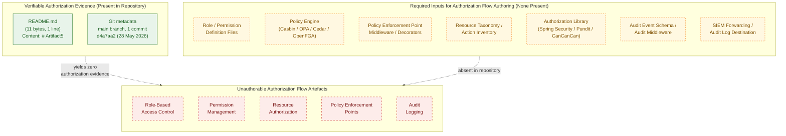

This diagram visualises that every authorization-system sub-component requested by the section prompt — RBAC, permission management, resource authorization, policy enforcement points, audit logging — is unauthorable in the absence of any role definition, policy engine, enforcement middleware, resource taxonomy, authorization library, audit-event schema, or SIEM destination. The absence is in direct continuity with §2.5.3 (Security Implications), §5.4.5 (Security Mechanism Status), §5.5.4 (Authentication and Authorisation Status), §6.2.4.4 (Audit Mechanisms), §6.2.4.5 (Access Controls), and §6.3.2.3 (Authorization Framework).

#### 6.4.5.3 Security Zone — Empty-State Diagram

```mermaid
flowchart TB
    subgraph SZPresent["Verifiable Security Zone Evidence (Present in Repository)"]
        direction TB
        SZP1["README.md<br/>(11 bytes, 1 line)<br/>Content: # Artifact5"]
        SZP2["Git metadata<br/>main branch, 1 commit<br/>d4a7aa2 (28 May 2026)"]
    end

    subgraph SZRequired["Required Inputs for Security Zone Authoring (None Present)"]
        direction TB
        SZR1["Network Topology /<br/>VPC / Subnet Manifests"]
        SZR2["Trust Boundary<br/>Declarations / DMZ Config"]
        SZR3["TLS / mTLS<br/>Configuration"]
        SZR4["KMS / HSM / Vault<br/>Bindings"]
        SZR5["Data Classification /<br/>Masking Rules"]
        SZR6["Compliance Control<br/>Mapping / Attestations"]
        SZR7["Cryptographic Library<br/>Dependencies"]
        SZR8["Security Group /<br/>Firewall / WAF Rules"]
    end

    subgraph SZAbsent["Unauthorable Security Zone Artefacts"]
        direction TB
        SZA1["Encryption<br/>Standards"]
        SZA2["Key<br/>Management"]
        SZA3["Data Masking<br/>Rules"]
        SZA4["Secure<br/>Communication"]
        SZA5["Compliance<br/>Controls"]
    end

    SZPresent -. "yields zero<br/>security-zone evidence" .-> SZAbsent
    SZRequired -. "absent in repository" .-> SZAbsent

    classDef presentNode fill:#e8f4ea,stroke:#2e7d32,color:#1b5e20;
    classDef requiredNode fill:#fff8e1,stroke:#f57f17,color:#7f4f00,stroke-dasharray: 3 3;
    classDef absentNode fill:#fdecea,stroke:#c62828,color:#7f1d1d,stroke-dasharray: 5 5;

    class SZP1,SZP2 presentNode;
    class SZR1,SZR2,SZR3,SZR4,SZR5,SZR6,SZR7,SZR8 requiredNode;
    class SZA1,SZA2,SZA3,SZA4,SZA5 absentNode;
```

This diagram visualises that every data-protection sub-component requested by the section prompt — encryption standards, key management, data masking rules, secure communication, compliance controls — is unauthorable in the absence of any network topology, trust-boundary declaration, TLS configuration, KMS/Vault binding, data classification, compliance attestation, cryptographic library, or perimeter-control configuration. The absence is in direct continuity with §2.5.3 (Data Protection at Rest / in Transit), §3.5.1 (no environment/secret configuration), §5.4.5 (Data Protection / Secret Management), §6.2.4.3 (Privacy Controls), and §6.2.4.1 (Data Retention Rules).

### 6.4.6 Security Control Matrix (Empty-State)

The section prompt requests a security control matrix. Because no security control is implemented in the repository, the matrix below is presented in its empty-state form, with each prompt sub-component mapped to its status and the cross-references that corroborate the absence. The matrix follows the four-column constraint imposed by the prompt and will be replaced by a populated control matrix when the first security artefact is committed (see §6.4.7).

#### 6.4.6.1 Authentication and Authorization Control Matrix

| Control Family | Sub-Component | Implementation Status | Corroborating Section |
|----------------|---------------|----------------------|------------------------|
| Authentication | Identity management | Not implemented | §2.5.3, §5.5.4 |
| Authentication | Multi-factor authentication | Not implemented | §2.5.3, §5.5.4 |
| Authentication | Session management | Not implemented | §5.5.4 |
| Authentication | Token handling | Not implemented | §5.4.5, §5.5.4 |
| Authentication | Password policies | Not implemented | §2.5.3, §5.5.4 |
| Authorization | Role-based access control | Not implemented | §5.4.5, §5.5.4 |
| Authorization | Permission management | Not implemented | §5.4.5, §6.2.4.5 |
| Authorization | Resource authorization | Not implemented | §6.2.4.5, §6.3.2.3 |
| Authorization | Policy enforcement points | Not implemented | §5.4.5, §6.3.2.3 |
| Authorization | Audit logging | Not implemented | §5.5.1, §5.5.2, §6.2.4.4 |

#### 6.4.6.2 Data Protection Control Matrix

| Control Family | Sub-Component | Implementation Status | Corroborating Section |
|----------------|---------------|----------------------|------------------------|
| Cryptography | Encryption standards (at rest, in transit, application-layer) | Not implemented | §2.5.3, §5.4.5 |
| Cryptography | Key management (KMS / HSM / Vault) | Not implemented | §2.5.3, §3.5.1, §5.4.5 |
| Privacy | Data masking / tokenisation / pseudonymisation | Not implemented | §6.2.4.3 |
| Transport | Secure communication (TLS / mTLS / HTTP headers) | Not implemented | §2.5.3, §5.4.5 |
| Compliance | Regulatory control mapping (GDPR / HIPAA / PCI-DSS / SOC 2 / ISO 27001) | Not implemented | §6.2.4.1, §6.2.4.3 |

#### 6.4.6.3 Compliance Requirement Matrix

The section prompt's instruction to "document compliance requirements" is honoured by recording the absence of every compliance-related artefact and the cross-reference that corroborates the absence. No compliance regime has been identified as binding on this repository because no functional capability has been implemented (§1.2.2). The matrix below is empty-state and will be populated when both (a) a functional capability is committed and (b) a regulatory binding is declared.

| Compliance Regime Class | Applicable to Repository? | Evidence Source | Treatment |
|--------------------------|---------------------------|------------------|-----------|
| Privacy regulations (GDPR, CCPA/CPRA, LGPD, PIPEDA) | Not determinable — no personal data processing identified | §6.2.4.3 | Empty-state; populated when first PII-handling artefact is committed |
| Healthcare regulations (HIPAA, HITECH) | Not determinable — no PHI processing identified | §6.2.4.3 | Empty-state; populated when first PHI-handling artefact is committed |
| Payment regulations (PCI-DSS) | Not determinable — no cardholder data identified | §6.2.4.3 | Empty-state; populated when first cardholder-data path is committed |
| Audit frameworks (SOC 2, ISO 27001, NIST SP 800-53) | Not determinable — no operational evidence to attest | §5.5, §6.1, §6.2 | Empty-state; populated when first attestation evidence is committed |

### 6.4.7 Forward-Looking Guidance

Consistent with the "living document" directive established in §1.3.3 and the trigger-event pattern established in §2.7.1, §3.9.1, §4.6.1, §5.7.1, §6.1.6.1, §6.2.7.1, and §6.3.6.1, this section must be re-authored — not merely amended — when implementation artefacts that bear on the security architecture are introduced to the repository.

#### 6.4.7.1 Triggering Conditions for Future Authoring

The table below identifies the conditions under which each subsection of §6.4 becomes authorable. The triggers are aligned with those in §5.7.1 and the prior §6.x sections to preserve cross-section consistency.

| Trigger Event | §6.4 Subsection(s) Activated |
|---------------|------------------------------|
| First identity-provider client configuration (Auth0, Okta, Cognito, Keycloak, Azure AD, OneLogin) committed | §6.4.2.1 (Identity Management) |
| First authentication library declaration in a package manifest (`passport.js`, Spring Security, MSAL, `python-social-auth`, `omniauth`, `devise`) | §6.4.2.1, §6.4.2.4 |
| First MFA / passkey / WebAuthn / FIDO2 / TOTP / OTP integration committed | §6.4.2.2 (Multi-Factor Authentication) |
| First session middleware or session store configuration (Redis sessions, signed cookies, JWT-in-cookie) committed | §6.4.2.3 (Session Management) |
| First token validation / issuance code or JWKS endpoint configuration committed | §6.4.2.4 (Token Handling) |
| First password-hashing library (`bcrypt`, `argon2`, `scrypt`, PBKDF2) or password policy document committed | §6.4.2.5 (Password Policies) |
| First RBAC role definition, ABAC attribute, OPA Rego policy, Casbin model, Cedar policy, or OpenFGA tuple committed | §6.4.3.1, §6.4.3.2 |
| First resource-level access check or policy enforcement point committed | §6.4.3.3, §6.4.3.4 |
| First audit log middleware, audit-event schema, or SIEM integration committed | §6.4.3.5 (Audit Logging) |
| First cryptographic library, encryption-at-rest configuration, or TLS certificate configuration committed | §6.4.4.1 (Encryption Standards), §6.4.4.4 (Secure Communication) |
| First secret-management binding (HashiCorp Vault, AWS Secrets Manager, Azure Key Vault, GCP Secret Manager, sealed-secrets, SOPS) committed | §6.4.4.2 (Key Management) |
| First KMS / HSM binding (AWS KMS, Azure Key Vault HSM, GCP KMS, CloudHSM) committed | §6.4.4.2 (Key Management) |
| First data masking / tokenisation / pseudonymisation / redaction code committed | §6.4.4.3 (Data Masking Rules) |
| First TLS / mTLS configuration, HSTS header, CSP directive, or HTTPS-only enforcement committed | §6.4.4.4 (Secure Communication) |
| First compliance attestation, GDPR / HIPAA / PCI-DSS / SOC 2 control mapping, or ISO 27001 ISMS document committed | §6.4.4.5 (Compliance Controls), §6.4.6.3 |
| First threat model (STRIDE, PASTA, DREAD, LINDDUN) or risk register committed | §6.4.7.2 (broader population), §6.4.1.1 |
| First security testing artefact (SAST/DAST/SCA reports, penetration test results, security policies as code) committed | §6.4.6 (Security Control Matrix) |

#### 6.4.7.2 Required Artifact Classes for Section Population

To populate §6.4 in a future revision, the repository should contain at minimum the artefact classes listed below. The mapping identifies which subsection each class informs and aligns with §5.7.2, §6.1.6.2, §6.2.7.2, and §6.3.6.2 to avoid duplication.

| Artefact Class | §6.4 Subsection(s) Informed |
|----------------|-----------------------------|
| Identity-provider client libraries and OAuth/OIDC/SAML configurations | §6.4.2.1, §6.4.2.4 |
| MFA configuration (TOTP libraries, WebAuthn registrations, SMS/email OTP services) | §6.4.2.2 |
| Session middleware and session-store configurations | §6.4.2.3 |
| Token validation/issuance code, JWKS endpoint configuration, token introspection | §6.4.2.4 |
| Password-hashing/validation libraries and password-policy artefacts | §6.4.2.5 |
| Authorization policy artefacts (Casbin, OPA Rego, Cedar, OpenFGA, AWS IAM, ABAC attribute definitions) | §6.4.3.1, §6.4.3.2 |
| Role and permission definition files | §6.4.3.1, §6.4.3.2 |
| Policy enforcement point middleware (request-time policy checks) | §6.4.3.4 |
| Audit logging middleware, audit-event schema, SIEM forwarding configuration | §6.4.3.5 |
| Cryptographic libraries (TLS, signing, encryption-at-rest) and algorithm configurations | §6.4.4.1, §6.4.4.4 |
| Key-management bindings (HashiCorp Vault, AWS KMS, Azure Key Vault, GCP KMS, HSM clients, secret-management bindings) | §6.4.4.2 |
| Data masking / tokenisation / pseudonymisation pipelines | §6.4.4.3 |
| TLS / mTLS certificate configurations, HSTS / CSP headers, security-group rules | §6.4.4.4 |
| Compliance documentation (GDPR DPAs, HIPAA BAAs, PCI-DSS attestations, SOC 2 reports, ISO 27001 SoA) | §6.4.4.5, §6.4.6.3 |
| Threat model (STRIDE, PASTA, DREAD, LINDDUN) and risk register | §6.4.1.1, §6.4.7.2 |

#### 6.4.7.3 Assumptions and Constraints for Future Revisions

The constraints listed in §5.7.3, §6.1.6.3, §6.2.7.3, and §6.3.6.3 apply in full to §6.4 and are summarised below with §6.4-specific emphasis.

| Item | Assumption / Constraint |
|------|-------------------------|
| Diagram notation | Future revisions will continue to use Mermaid.js for authentication-flow, authorization-flow, and security-zone diagrams, consistent with §1.2.2, §1.3.3, §2.4.1, §3.8, §4.5.2, §5.6, §6.1.5, and §6.2.6 |
| Empty-state styling | The `classDef presentNode` / `requiredNode` / `absentNode` styling will continue to denote evidence-based, required-input, and absent nodes respectively, until each of the three §6.4 diagrams converges into a fully populated form |
| Default technology stack | The default technology stack supplied in the section prompts (which would suggest Auth0 for identity, AWS KMS for key management, OAuth 2.0 / JWT for authentication, RBAC for authorisation, TLS 1.3 for transport) is **not** applied retroactively. No identity provider, authentication protocol, authorisation model, encryption scheme, key-management solution, or compliance control will be documented in §6.4 until the corresponding artefact is committed to the repository, in direct continuity with §3.1.2, §3.9.3, §5.7.3, §6.1.6.3, §6.2.7.3, and §6.3.6.3 |
| Security policy authoring discipline | No password complexity rule, no MFA enforcement rule, no session timeout, no token TTL, no audit retention period, no encryption key rotation cadence, no compliance commitment, and no SLA may be authored in §6.4.2, §6.4.3, or §6.4.4 absent a directly observed policy artefact in the repository, in direct continuity with §1.2.3, §2.5.2, §5.7.3, §6.1.6.3, and §6.2.7.3 |
| Cryptographic authoring discipline | No encryption algorithm, cipher mode, key length, IV/nonce strategy, MAC algorithm, signing algorithm, or hashing algorithm may be asserted in §6.4.4.1, §6.4.4.2, or §6.4.4.4 absent a directly observed library configuration or algorithm declaration |
| Compliance authoring discipline | No regulatory binding (GDPR, HIPAA, PCI-DSS, SOC 2, ISO 27001, NIST SP 800-53/CSF, FedRAMP, CCPA/CPRA) may be asserted in §6.4.4.5 or §6.4.6.3 absent a directly observed attestation, control mapping, contract artefact, or policy document |
| Empty-state diagrams | The three empty-state diagrams in §6.4.5 will be removed in the revision in which the first security artefact becomes documentable; they exist solely to visualise the current empty state, in direct continuity with §5.7.3, §6.1.6.3, §6.2.7.3, and §6.3.6.3 |
| Source of truth | Repository contents take precedence over external documents in case of conflict, consistent with §2.7.3, §3.9.3, §4.6.3, §5.7.3, §6.1.6.3, §6.2.7.3, and §6.3.6.3 |

### 6.4.8 Section Prompt Compliance Summary

The section prompt enumerates three high-level groups (Authentication Framework, Authorization System, Data Protection) with fifteen sub-components in total, plus three required diagram classes and four output-format requirements. The applicability of each to the current repository state is summarised below for traceability, mirroring the §6.1.7, §6.2.8, and §6.3.7 compliance patterns.

| Prompt Sub-Component / Diagram | Applicable to Current Repository? | Treatment in This Section |
|---------------------------------|-----------------------------------|---------------------------|
| Identity management | No — §2.5.3, §3.5.1, §5.5.4 | Documented as absent in §6.4.2.1 |
| Multi-factor authentication | No — §2.5.3, §5.5.4 | Documented as absent in §6.4.2.2 |
| Session management | No — §5.5.4 | Documented as absent in §6.4.2.3 |
| Token handling | No — §5.4.5, §5.5.4 | Documented as absent in §6.4.2.4 |
| Password policies | No — §2.5.3, §5.5.4 | Documented as absent in §6.4.2.5 |
| Role-based access control | No — §5.4.5, §5.5.4 | Documented as absent in §6.4.3.1 |
| Permission management | No — §5.4.5, §6.2.4.5 | Documented as absent in §6.4.3.2 |
| Resource authorization | No — §6.2.4.5, §6.3.2.3 | Documented as absent in §6.4.3.3 |
| Policy enforcement points | No — §5.4.5, §6.3.2.3 | Documented as absent in §6.4.3.4 |
| Audit logging | No — §5.5.1, §5.5.2, §6.2.4.4 | Documented as absent in §6.4.3.5 |
| Encryption standards | No — §2.5.3, §5.4.5 | Documented as absent in §6.4.4.1 |
| Key management | No — §2.5.3, §3.5.1, §5.4.5 | Documented as absent in §6.4.4.2 |
| Data masking rules | No — §6.2.4.3 | Documented as absent in §6.4.4.3 |
| Secure communication | No — §2.5.3, §5.4.5 | Documented as absent in §6.4.4.4 |
| Compliance controls | No — §6.2.4.1, §6.2.4.3 | Documented as absent in §6.4.4.5 |
| Authentication flow diagram | No — no auth flow to depict | Empty-state diagram in §6.4.5.1 |
| Authorization flow diagram | No — no authz flow to depict | Empty-state diagram in §6.4.5.2 |
| Security zone diagram | No — no zones to depict | Empty-state diagram in §6.4.5.3 |

#### 6.4.8.1 Treatment of Output-Format Requirements

The section prompt's output-format requirements (Markdown tables, four-column maximum, security control matrices, compliance requirement documentation) are honoured as follows under the current evidence base:

| Output Requirement | Treatment |
|--------------------|-----------|
| Use Markdown tables for security policies | Honoured — every status enumeration in §6.4.2, §6.4.3, §6.4.4, §6.4.6, §6.4.7, and §6.4.8 uses three- or four-column Markdown tables |
| Tables should never have more than four columns | Honoured — no table in §6.4 exceeds four columns |
| Include security control matrices | Substituted by the empty-state Authentication and Authorization Control Matrix in §6.4.6.1 and the empty-state Data Protection Control Matrix in §6.4.6.2; populated control matrices will replace them when the first security artefact is committed |
| Document compliance requirements | Documented as absent in §6.4.4.5 (Compliance Controls) and §6.4.6.3 (Compliance Requirement Matrix), with cross-references to §6.2.4.1 (Data Retention), §6.2.4.3 (Privacy Controls), and §6.2.4.4 (Audit Mechanisms) |

### 6.4.9 References

#### 6.4.9.1 Files Examined

- `README.md` — Confirmed sole content is the heading `# Artifact5` (11 bytes, 1 line). Establishes the absence of all source code, package manifests, configuration files, security artefacts, authentication modules, authorization policies, encryption libraries, key-management bindings, audit logging middleware, and compliance documentation that would otherwise inform §6.4.

#### 6.4.9.2 Folders Explored

- `` (repository root, depth 0) — Contains exactly one direct child (`README.md`) and zero subdirectories. Confirms the structural emptiness of the repository and the consequent inapplicability of every §6.4 sub-component. No deeper folders exist to explore.

#### 6.4.9.3 Filesystem Searches Performed

- `find / -name ".blitzyignore"` — Zero results, confirming no repository contents are excluded from analysis and that the empty security posture observed in §2.5.3, §3.5.1, §5.4.5, and §5.5.4 represents the true state of the repository.
- `find / -name "*.env*"` — Zero results within the project repository, confirming the absence of any environment-file-based secret declaration.
- `find / -name "auth*"` — Zero results within the project repository, confirming the absence of any authentication module, authorization handler, or auth-prefixed configuration file.

#### 6.4.9.4 Technical Specification Sections Cross-Referenced

- **§1.1 EXECUTIVE SUMMARY** — Establishes baseline: single commit, 1 file (`README.md`, 11 bytes), 0 source files, 0 subdirectories.
- **§1.2 SYSTEM OVERVIEW** — Confirms no capabilities, no components, no technology stack; §1.2.3 records no KPI catalogue, metrics definitions, or telemetry plan.
- **§1.3 SCOPE** — §1.3.2 explicitly places "Authentication / Authorization (Identity, access control, session management)" and "Security Controls (Cryptographic libraries, secret management, compliance tooling)" out-of-scope on the grounds that "No auth modules or policies present" and "No security artifacts present."
- **§2.4 FEATURE RELATIONSHIPS** — §2.4.2 confirms all four integration classes absent; §2.4.3 confirms "Common Services (auth, logging, persistence): None present" and "Cross-Cutting Concerns: None present."
- **§2.5 IMPLEMENTATION CONSIDERATIONS** — §2.5.3 records all four security dimensions ("Authentication / Authorisation Model," "Data Protection (at rest / in transit)," "Threat Model / Risk Register," "Secret Management") as "Not present."
- **§2.7 FORWARD-LOOKING GUIDANCE** — Established trigger-event pattern reused in §6.4.7.
- **§3.4 Open Source Dependencies** — Confirms no manifests, no auth libraries, no cryptographic libraries declared.
- **§3.5 Third-Party Services** — §3.5.1 confirms no identity-provider integration (OAuth/OIDC clients, SAML metadata, JWT validators, Auth0/Okta/Cognito SDKs) and no environment/secret configuration (`.env`, `config/`, Vault references, KMS bindings).
- **§3.6 Databases & Storage** — Records the absence of all storage targets, confirming there is nothing to encrypt at rest.
- **§4.4 Technical Implementation** — §4.4.1 confirms no state-management, no persistence points, no transaction boundaries; §4.4.2 confirms no error handling, supporting the absence of security-relevant exception handling and failure modes.
- **§4.5 Diagram Inventory and Empty-State Visualisation** — Provides the canonical empty-state diagram template inherited verbatim by §6.4.5.
- **§5.1 PREAMBLE: SYSTEM ARCHITECTURE DERIVABILITY STATEMENT** — Establishes the five governing rules for documenting absence (§5.1.2) inherited by §6.4. Rule 3 (no application of the default technology stack) and Rule 4 (no fabrication of SLAs / KPIs / security policies / operational procedures) are dispositive for the non-authoring of "standard security practices" in §6.4.
- **§5.2 HIGH-LEVEL ARCHITECTURE** — All architecture dimensions, including data-flow description, "Not specified."
- **§5.3 COMPONENT DETAILS** — All component dimensions "None."
- **§5.4 TECHNICAL DECISIONS** — §5.4.5 records all six security mechanism decision dimensions ("Authentication Mechanism," "Authorisation Model," "Data Protection at Rest," "Data Protection in Transit," "Threat Model / Risk Register," "Secret Management Solution") as "Not selected," "Not specified," or "Not present."
- **§5.5 CROSS-CUTTING CONCERNS** — §5.5.1 (Monitoring), §5.5.2 (Logging), and §5.5.4 (Authentication and Authorisation) directly underwrite the absence statements in §6.4.2, §6.4.3.5, and §6.4.3.
- **§5.6 EMPTY-STATE VISUALISATION** — Establishes the canonical three-subgraph Mermaid empty-state diagram template with `classDef presentNode` / `requiredNode` / `absentNode` styling, reused verbatim in §6.4.5.
- **§5.7 FORWARD-LOOKING GUIDANCE** — Establishes the trigger-event and constraint structure reused in §6.4.7, including the policy-authoring discipline (no SLA / KPI / security policy / operational procedure may be authored absent a directly observed artefact).
- **§6.1 CORE SERVICES ARCHITECTURE** — Establishes the "Applicability Statement" pattern that §6.4 follows. §6.1.2.2 has already recorded "Inter-Service Communication Patterns: Not applicable — no services to communicate," eliminating the secure-communication target.
- **§6.2 DATABASE DESIGN** — §6.2.4.3 (Privacy Controls), §6.2.4.4 (Audit Mechanisms), and §6.2.4.5 (Access Controls) directly underwrite the absence statements in §6.4.3.5, §6.4.4.3, and §6.4.4.5.
- **§6.3 INTEGRATION ARCHITECTURE** — §6.3.2.2 (Authentication Methods) and §6.3.2.3 (Authorization Framework) have already recorded the absence of integration-level authentication and authorisation.

#### 6.4.9.5 Negative-Result Searches Performed

- Semantic search for "security authentication authorization encryption" — 0 results, confirming the absence of any security-related artefact in the repository.
- Folder search for "security auth identity" — 0 results, confirming the absence of any security-, authentication-, or identity-related directory in the repository.
- Filesystem search for `.blitzyignore` files — 0 results, confirming no repository contents are hidden from analysis.
- Filesystem search for `*.env*` files — 0 results within the project repository, confirming the absence of environment-file-based secret declarations.
- Filesystem search for `auth*`-prefixed files — 0 results within the project repository, confirming the absence of authentication modules, authorization handlers, or auth-prefixed configuration files.

## 6.5 Monitoring and Observability

**Applicability Statement: Detailed Monitoring Architecture is not applicable for this system.**

The Artifact5 repository does not implement, configure, integrate with, or reference any metrics collection agent, logging framework, distributed-tracing library, alert manager, dashboard backend, health-check endpoint, probe definition, SLA artefact, runbook, post-mortem template, or any other monitoring- or observability-bearing component. As established in §1.1, §1.2, §1.3, §2.4, §2.5, §3.5, §4.4, §5.2, §5.3, §5.4, §5.5, §6.1, §6.2, and §6.3, the repository at the time of this specification holds a single 11-byte `README.md` file whose entire content is the heading `# Artifact5`, with zero subdirectories, zero source files, zero package manifests, and zero configuration files. No instrumentation library, telemetry exporter, log aggregator, tracing propagator, alert rule, paging integration, dashboard JSON, latency SLO, throughput target, availability commitment, error budget, capacity model, on-call schedule, escalation policy, runbook catalogue, or retrospective template can be derived from this evidence base. Per the controlling clause in the section prompt — *"If the system does not require specific monitoring beyond basic health checks, clearly state 'Detailed Monitoring Architecture is not applicable for this system' and explain which basic monitoring practices will be followed instead"* — this section faithfully documents the absence of monitoring and observability infrastructure rather than fabricating one.

In direct continuity with the "Methodology for Documenting Absence" defined in §2.1.2, §3.1.2, §4.1.2, and §5.1.2, and inheriting the exact pattern applied in §6.1 (Core Services Architecture), §6.2 (Database Design), and §6.3 (Integration Architecture), this section enumerates the absence of every monitoring and observability sub-component requested by the section prompt and records the cross-references that corroborate the absence. The five governing rules established in §5.1.2 — (1) no fabrication of architectural components, (2) no fabrication of integrations or data flows, (3) no application of the default technology stack as a fallback, (4) no fabrication of SLAs/KPIs/security policies/operational procedures, and (5) structured absence reporting with traceability preservation — apply in full to this section. The empty-state diagram pattern established in §5.6 and reused in §6.1.5, §6.2.6, and §6.3.5 (three subgraphs — Present / Required / Absent — with the `classDef presentNode` / `requiredNode` / `absentNode` styling inherited from §4.5.2) is reapplied here to visualise the gap for each of the three required diagram classes (Monitoring Architecture, Alert Flow, Dashboard Layouts).

### 6.5.1 Repository Evidence Underlying This Section

The artefacts enumerated below are the only artefacts present in the repository and are the sole evidentiary basis for the documentation in §6.5. No metrics source, log producer, trace span, alert rule, dashboard panel, health probe, SLO target, runbook, or post-mortem record can be derived beyond what these artefacts evidence. This table mirrors the structure of §5.1.1, §6.1.1, §6.2.1, and §6.3.1 to preserve cross-section traceability.

| Evidence Source | Observation | Cross-Reference |
|-----------------|-------------|-----------------|
| `README.md` content | Single line: `# Artifact5` (11 bytes, 1 line) | §1.1.1, §3.1.1, §6.1.1, §6.2.1, §6.3.1 |
| Repository root listing | One direct child (`README.md`), zero subdirectories | §1.2.2, §3.5.1, §6.1.1, §6.2.1 |
| Git commit metadata | One commit (`d4a7aa2…`), initial commit dated 28 May 2026 | §1.1.1, §6.1.1, §6.2.1, §6.3.1 |
| Filesystem search for `.blitzyignore` files | Zero matches — confirms no repository contents are excluded from analysis | §6.1.8.4, §6.2.9.3, §6.3.8.3 |
| Negative-result searches (metrics, logging, tracing, alerts, dashboards) | Zero matches in repository | §3.5.1, §5.5.1, §5.5.2 |
| Negative-result searches (SLO, SLA, RTO, RPO, KPI, error budget) | Zero matches in repository | §1.2.3, §5.5.5, §5.5.6 |

#### 6.5.1.1 Pre-conditions Required for Section Authoring

The section prompt presupposes a system that emits telemetry (metrics, logs, or traces), exposes health-check endpoints, has a defined SLA/SLO posture, or has an established incident-response capability. None of these pre-conditions is satisfied. §1.2.3 records "No KPI catalogue, metrics definitions, telemetry plan, or analytics specification is present in the repository." §1.3.2 explicitly places "Observability (Logging, metrics, tracing, alerting)" out-of-scope because "no instrumentation or telemetry configuration is present." §2.4.3 records "Cross-Cutting Concerns (caching, retries, telemetry): None present." §2.5.4 records all four maintenance dimensions — Observability (logs, metrics, traces), Deployment/Release Procedures, Backup/Recovery Procedures, Runbooks/Operational Documentation — as "Not present." §3.5.1 records "Monitoring/observability tool integration (e.g., Datadog, New Relic, Sentry, OpenTelemetry exporters, Prometheus scrape configs): None present." §4.4.2 records "Error Notification Flows: Not present — no alerting, paging, or notification channels configured" and "Recovery Procedures: Not present — no runbooks, backup/restore procedures, or disaster-recovery plan." §5.5.1 records all five monitoring/observability dimensions (Metrics Collection, Distributed Tracing, Health Checks / Liveness / Readiness Probes, Dashboards, Alerting/Paging Configuration) as "Not present." §5.5.2 records all six logging/tracing dimensions (Logging Framework, Log Format, Log Aggregation Backend, Log Retention Policy, Trace Propagation Strategy, Correlation/Request ID Strategy) as "Not selected" or "Not specified." §5.5.5 records all seven performance/SLA dimensions (Latency Targets p50/p95/p99, Throughput Targets, Availability Target, Resource Footprint Targets, Concurrency Targets, Error Budget Policy, External SLAs) as "Not specified" or "Not present." §5.5.6 records all eight disaster-recovery dimensions (RTO, RPO, Backup Strategy, Restore Procedure, Multi-Region/Multi-AZ Posture, Failover Strategy, Runbook Catalogue, Disaster Recovery Drill Cadence) as "Not specified" or "Not present."

### 6.5.2 Monitoring Infrastructure Status

The section prompt enumerates five monitoring-infrastructure dimensions: metrics collection, log aggregation, distributed tracing, alert management, and dashboard design. None can be authored. The table below records the status of each dimension with cross-references to the prior sections of this specification that corroborate the absence.

| Sub-Component | Status | Cross-Reference |
|---------------|--------|-----------------|
| Metrics collection | Not applicable — no instrumentation present | §5.5.1, §3.5.1, §2.5.4 |
| Log aggregation | Not applicable — no logging framework selected | §5.5.2, §3.3, §3.5.1 |
| Distributed tracing | Not applicable — no tracing library committed | §5.5.1, §5.5.2, §3.5.1 |
| Alert management | Not applicable — no alert rules configured | §5.5.1, §4.4.2 |
| Dashboard design | Not applicable — no dashboard artefacts present | §5.5.1, §1.2.3 |

#### 6.5.2.1 Metrics Collection

Metrics collection requires at minimum a client library declaration (Prometheus client, OpenTelemetry SDK, Micrometer, StatsD, Dropwizard Metrics, OpenCensus, application-performance-monitoring agent), an instrumentation strategy (RED — Rate/Errors/Duration; USE — Utilization/Saturation/Errors; the four golden signals; custom business counters), and a backend collector (Prometheus scrape configuration, Datadog Agent, New Relic infrastructure agent, CloudWatch Agent, OpenTelemetry Collector). §5.5.1 records "Metrics Collection (Prometheus, Datadog, New Relic, CloudWatch): Not present." §3.5.1 records "Monitoring/observability tool integration: None present." §2.5.4 records "Observability (logs, metrics, traces): Not present." Because no client library is referenced in any package manifest (no manifests exist), no scrape endpoint is exposed, and no collector configuration is committed, no metric inventory, no cardinality budget, no scrape interval, no exemplar-linking strategy, and no histogram-bucket layout can be authored.

#### 6.5.2.2 Log Aggregation

Log aggregation requires both a logging framework selection (logback, log4j2, slf4j, Serilog, NLog, Winston, Pino, Bunyan, zerolog, zap, structlog, Python `logging`, Ruby Logger, etc.) and an aggregation backend (Elasticsearch + Logstash + Kibana, Grafana Loki + Promtail, Splunk + Universal Forwarder, AWS CloudWatch Logs + agents, Azure Monitor Logs, Google Cloud Logging, Datadog Logs, Sumo Logic, Graylog, Fluentd/Fluent Bit pipelines). §5.5.2 records every logging dimension — Logging Framework/Library "Not selected," Log Format (structured JSON, plaintext, syslog) "Not specified," Log Aggregation Backend (ELK, Loki, Splunk, CloudWatch Logs) "Not selected," Log Retention Policy "Not specified," Trace Propagation Strategy (W3C TraceContext, B3, custom) "Not specified," Correlation/Request ID Strategy "Not specified." Because no framework, format, backend, retention policy, propagation header, or correlation-ID scheme has been selected, no log schema, no field taxonomy, no PII-redaction rule, no severity-level convention, no ingest pipeline, and no index-lifecycle management policy can be authored.

#### 6.5.2.3 Distributed Tracing

Distributed tracing requires an instrumentation library (OpenTelemetry SDK, Jaeger client, Zipkin Brave, AWS X-Ray SDK, Lightstep client, Honeycomb Beeline, Datadog APM tracer, New Relic Agent, Elastic APM Agent), a propagation format (W3C TraceContext, B3 single/multi-header, Jaeger UberCtx, AWS X-Ray header, custom), a sampling strategy (head-based probabilistic, tail-based, parent-based, rate-limiting), and a backend collector (Jaeger backend, Zipkin server, Tempo, AWS X-Ray, Datadog APM, Honeycomb, Lightstep). §5.5.1 records "Distributed Tracing (OpenTelemetry, Jaeger, Zipkin): Not present." §5.5.2 records "Trace Propagation Strategy (W3C TraceContext, B3, custom): Not specified" and "Correlation / Request ID Strategy: Not specified." Because no source code exists to be instrumented, no library is referenced, no propagation header is honoured, and no sampling rule is declared, no span taxonomy, no service-graph projection, no critical-path analysis, no tail-based-sampling rule, and no exemplar-to-metric linking strategy can be authored.

#### 6.5.2.4 Alert Management

Alert management requires both a rule-definition substrate (Prometheus AlertManager rules, Datadog monitors, New Relic alert conditions, CloudWatch alarms, Grafana alert rules, Sentry alert rules, Elastic Watcher, PagerDuty event rules, Opsgenie alert rules, Splunk alerts) and routing/notification configuration (PagerDuty services, Opsgenie teams, VictorOps escalation policies, Slack webhooks, Microsoft Teams connectors, email distribution lists, SMS gateways, voice-call APIs, ServiceNow incident integrations). §5.5.1 records "Alerting / Paging Configuration: Not present." §4.4.2 records "Error Notification Flows: Not present — no alerting, paging, or notification channels configured." Per the SLA/KPI authoring discipline established in §5.7.3 and reaffirmed in §6.1.6.3, §6.2.7.3, and §6.3.6.3, no alert threshold value, no severity classification, no notification channel selection, no on-call rotation, no de-duplication window, no grouping/inhibition rule, and no silence/maintenance-window policy can be authored absent a directly observed configuration artefact. Specifically, no threshold matrix (e.g., CPU saturation, memory pressure, request error rate, p95 latency, queue depth, replication lag) can be tabulated because no underlying metric, no measurement baseline, and no SLO budget exist.

#### 6.5.2.5 Dashboard Design

Dashboard design requires both a dashboarding tool (Grafana, Datadog dashboards, New Relic dashboards, CloudWatch dashboards, Azure Monitor Workbooks, Google Cloud Monitoring dashboards, Kibana visualisations, Splunk dashboards, Looker, Tableau, Power BI, Redash, Superset) and the underlying metrics/logs/traces that the dashboard would visualise. §5.5.1 records "Dashboards / Visualisation Layer: Not present." §1.2.3 records that no KPI catalogue, metrics definitions, telemetry plan, or analytics specification is present. Because no dashboard backend, no panel definition (time-series, gauge, heatmap, geomap, table, log-stream, trace-waterfall), no folder/organisation taxonomy, no template-variable scheme, no annotation/event-overlay strategy, and no shared-versus-private-dashboard governance is committed, no dashboard layout, no panel inventory, and no role-specific view (operator, developer, executive, customer-success) can be authored.

### 6.5.3 Observability Patterns Status

The section prompt enumerates five observability-pattern dimensions: health checks, performance metrics, business metrics, SLA monitoring, and capacity tracking. None can be authored. The table below records the status of each dimension.

| Sub-Component | Status | Cross-Reference |
|---------------|--------|-----------------|
| Health checks | Not applicable — no endpoints declared | §5.5.1, §2.5.4 |
| Performance metrics | Not applicable — no targets specified | §5.5.5, §1.2.3, §2.5.2 |
| Business metrics | Not applicable — no KPIs defined | §1.2.3, §1.2.1 |
| SLA monitoring | Not applicable — no SLAs/SLOs documented | §5.5.5, §1.2.3 |
| Capacity tracking | Not applicable — no workload baseline | §5.5.5, §2.5.2, §6.1.3.5 |

#### 6.5.3.1 Health Checks

Health-check definitions require an HTTP/gRPC endpoint or probe protocol declaration (`/health`, `/healthz`, `/ready`, `/readyz`, `/live`, `/livez`, `/status`, `/ping`, `/_info`, `/_ready`), a check implementation that exercises critical dependencies (database connectivity, cache connectivity, message-broker reachability, downstream-API availability, disk-space adequacy, certificate validity), and — for containerised workloads — orchestration manifests that bind these endpoints to liveness, readiness, and startup probes (Kubernetes `livenessProbe`/`readinessProbe`/`startupProbe`, Docker `HEALTHCHECK`, AWS ECS health-check definitions, Consul service health checks, Nomad health checks). §5.5.1 records "Health Checks / Liveness / Readiness Probes: Not present." §2.5.4 records "Observability (logs, metrics, traces): Not present." §3.7 (per §6.1.6.1) records the complete absence of any container, IaC, or orchestration artefact in which probe configurations would reside. Because no endpoint is declared, no dependency check is implemented, and no probe binding exists, no liveness contract, no readiness criteria, no startup grace period, no failure-threshold count, no probe-interval cadence, and no degraded-health classification scheme can be authored.

#### 6.5.3.2 Performance Metrics

Performance-metric documentation requires both a workload (whose latency, throughput, concurrency, resource utilisation can be measured) and an SLA/SLO artefact (against which observed values are compared). §5.5.5 records every performance dimension — Latency Targets (p50/p95/p99) "Not specified," Throughput Targets (requests/sec, events/sec) "Not specified," Availability Target (e.g., 99.9% uptime SLO) "Not specified," Resource Footprint Targets (CPU, memory, network) "Not specified," Concurrency Targets "Not specified," Error Budget Policy "Not specified," External SLAs/Customer-Facing Commitments "Not present." §2.5.2 records "Throughput / Latency Targets: Not present," "Concurrency Requirements: Not present," "Resource Footprint Targets: Not present," and "Horizontal / Vertical Scaling Plans: Not present." §1.2.3 records "no KPI catalogue, metrics definitions, telemetry plan." Per the SLA/KPI authoring discipline established in §5.7.3 and reaffirmed in §6.1.6.3, §6.2.7.3, and §6.3.6.3, no quantitative performance target may be authored absent a directly observed SLA/SLO/KPI artefact. No metric definition (counter, gauge, histogram, summary), no aggregation window, no percentile-computation algorithm (HDR-histograms, T-digest, GK-sketch, exact-percentile back-population), and no comparison threshold can be authored.

#### 6.5.3.3 Business Metrics

Business-metric documentation (north-star metrics, activation/retention/conversion funnels, revenue/ARR/MRR counters, daily/monthly active users, feature adoption rates, cohort analyses, A/B-test exposure counts, customer-satisfaction scores, Net Promoter Scores, time-to-value, customer-acquisition-cost-to-lifetime-value ratios) requires both a business-context narrative (defining what is being measured and why) and an event/metric instrumentation layer that captures the underlying signals. §1.2.1 records "No business context, market analysis, competitive positioning, or domain narrative is present in the repository. The single artifact (`README.md`) contains only the project name and no descriptive prose." §1.2.3 records "No KPI catalogue, metrics definitions, telemetry plan, or analytics specification is present in the repository." Because no business domain is defined and no event-capture mechanism exists, no business-metric catalogue, no funnel taxonomy, no segmentation dimension, no attribution model, and no executive-reporting cadence can be authored.

#### 6.5.3.4 SLA Monitoring

SLA monitoring (computing SLO compliance against an error budget, alerting on burn-rate exceedance, tracking SLA-credit accrual, surfacing SLO dashboards, computing apdex scores, calculating success-rate windows, reporting customer-facing availability) requires at minimum a written SLA/SLO contract (specifying availability, latency, throughput, durability, freshness, correctness commitments) and a measurement pipeline (raw-signal collection, success/failure classification, time-windowing, error-budget accounting). §5.5.5 records "Availability Target (e.g., 99.9% uptime SLO): Not specified" with cross-reference to §1.2.3 ("no KPI catalogue, metrics definitions, telemetry plan"). §5.5.5 also records "External SLAs / Customer-Facing Commitments: Not present" with cross-reference to §1.2.1 (no business context) and §1.2.3. Per the SLA/KPI authoring discipline established in §5.7.3, no availability SLO, no latency SLO, no error-budget percentage, no burn-rate alert threshold, no SLA credit schedule, no apdex tolerance window, and no customer-tier-specific commitment may be authored absent a directly observed SLA artefact in the repository.

#### 6.5.3.5 Capacity Tracking

Capacity tracking (utilisation trending, headroom monitoring, growth-rate extrapolation, exhaustion-date forecasting, peak-burst absorption modelling, cost-per-unit-of-work tracking, right-sizing recommendations) requires both a workload definition (against which utilisation is measured) and a capacity-planning model (defining a unit of capacity — request, event, transaction, user session, GB-hour, vCPU-hour). §5.5.5 records "Resource Footprint Targets (CPU, memory, network): Not specified" and "Concurrency Targets: Not specified." §2.5.2 records "Resource Footprint Targets: Not present" and "Concurrency Requirements: Not present." §6.1.3.5 has already documented this absence in the core-services context: "Capacity planning (peak-load modelling, headroom percentages, growth projections, burst-handling reservations) requires both a baseline demand curve and a defined unit-of-capacity (request, event, transaction, user session, etc.). Neither has been defined for the system." No capacity baseline, no headroom percentage, no growth-rate model, no exhaustion projection, and no cost-attribution scheme can be authored.

### 6.5.4 Incident Response Status

The section prompt enumerates five incident-response dimensions: alert routing, escalation procedures, runbooks, post-mortem processes, and improvement tracking. None can be authored. The table below records the status of each dimension.

| Sub-Component | Status | Cross-Reference |
|---------------|--------|-----------------|
| Alert routing | Not applicable — no notification channels | §4.4.2, §5.5.1 |
| Escalation procedures | Not applicable — no on-call roster | §4.4.2, §2.5.4 |
| Runbooks | Not applicable — no operational documentation | §2.5.4, §5.5.6 |
| Post-mortem processes | Not applicable — no retrospective templates | §2.5.4, §5.5.6 |
| Improvement tracking | Not applicable — no metrics to track against | §1.2.3, §2.5.4 |

#### 6.5.4.1 Alert Routing

Alert routing (severity-based fan-out to channels, on-call-engineer-of-record paging, team-based dispatch via PagerDuty services / Opsgenie teams / VictorOps escalation policies, ChatOps integration via Slack / Microsoft Teams / Discord webhooks, ticket creation in Jira / ServiceNow / Zendesk, email/SMS fallbacks, voice-call escalation for highest-severity events, suppression during maintenance windows, dedup-key strategies to prevent alert storms) requires both a notification platform integration and an explicit routing configuration. §5.5.1 records "Alerting / Paging Configuration: Not present." §4.4.2 records "Error Notification Flows: Not present — no alerting, paging, or notification channels configured." Because no platform integration is committed and no routing rule is declared, no severity taxonomy, no channel matrix, no dedup-key scheme, no suppression window, and no business-hours/after-hours differentiation can be authored.

#### 6.5.4.2 Escalation Procedures

Escalation procedures (primary/secondary/tertiary on-call rotations, time-based escalation thresholds, severity-based escalation paths, manager-of-engineering paging, executive-paging tiers, war-room convening protocols, customer-communication escalation, vendor-engagement procedures) require both a roster of on-call engineers and an escalation policy definition (PagerDuty escalation policies, Opsgenie escalation chains, custom playbooks). §4.4.2 records "Recovery Procedures: Not present — no runbooks, backup/restore procedures, or disaster-recovery plan." §2.5.4 records "Runbooks / Operational Documentation: Not present." Because no roster, no policy, and no operational documentation are committed, no escalation tier, no time-window threshold, no severity-to-tier mapping, no manager-paging trigger, and no executive-notification cadence can be authored.

#### 6.5.4.3 Runbooks

Runbooks (per-alert response procedures, per-service operational guides, common-incident playbooks, troubleshooting decision trees, diagnostic command catalogues, rollback procedures, traffic-shedding procedures, dependency-failover procedures, security-incident response procedures, data-recovery procedures) require operational knowledge documented against a running system. §2.5.4 records "Runbooks / Operational Documentation: Not present." §5.5.6 records "Runbook Catalogue: Not present." §6.1.4.2 has already documented this absence in the disaster-recovery context: "§2.5.4 confirms 'Backup / Recovery Procedures: Not present' and 'Runbooks / Operational Documentation: Not present.'" Because no system exists to operate and no operational practice has been formalised, no runbook template, no diagnostic flow, no escalation criterion, no rollback procedure, and no incident-classification guide can be authored.

#### 6.5.4.4 Post-mortem Processes

Post-mortem processes (blameless retrospective templates, timeline-reconstruction protocols, contributing-factor analysis, action-item assignment and tracking, severity classification, customer-impact quantification, mean-time-to-detect / mean-time-to-acknowledge / mean-time-to-resolve / mean-time-between-failures tracking, public/internal post-mortem publication, post-mortem review meetings) require a history of incidents to retrospect against and an organisational practice of conducting retrospectives. §2.5.4 records the absence of all operational documentation. §5.5.6 records "Disaster Recovery Drill Cadence: Not specified." Because no incidents have occurred (no system exists to incur incidents), no retrospective record exists, no template has been adopted, and no review cadence has been established, no post-mortem schema, no severity taxonomy, no MTTR/MTBF baseline, and no learning-publication policy can be authored.

#### 6.5.4.5 Improvement Tracking

Improvement tracking (action-item registries from post-mortems, reliability-engineering backlog management, error-budget burn tracking driving feature-freeze decisions, SLO target evolution over time, toil-reduction backlog, automation coverage growth, alert noise/false-positive-rate trending, on-call-load tracking, customer-reported-versus-internally-detected-incident ratios) requires both a baseline of metrics (MTTR, MTBF, change-failure rate, deployment frequency, lead time, alert volume) and a tracking system (project-management tooling, OKR systems, scorecards). §1.2.3 records "No KPI catalogue, metrics definitions, telemetry plan, or analytics specification is present in the repository." §2.5.4 records the absence of all operational documentation. Because no baseline metrics exist, no improvement signal can be measured, no backlog can be prioritised, and no trend can be tracked. No improvement-tracking taxonomy, no action-item lifecycle, no review cadence, and no reporting dashboard can be authored.

### 6.5.5 Empty-State Visualisations

Three diagrams are required by the section prompt: a Monitoring Architecture diagram, an Alert Flow diagram, and a Dashboard Layouts diagram. Because none of the three has any evidence base in the repository, each is rendered below as a focused empty-state diagram following the canonical three-subgraph (Present / Required / Absent) template established in §5.6 and reused in §6.1.5, §6.2.6, and §6.3.5. The `classDef presentNode` / `requiredNode` / `absentNode` styling is preserved for visual continuity across all empty-state diagrams in this specification.

#### 6.5.5.1 Monitoring Architecture — Empty-State Diagram

```mermaid
flowchart TB
    subgraph MAPresent["Verifiable Monitoring Evidence (Present in Repository)"]
        direction TB
        MAP1["README.md<br/>(11 bytes, 1 line)<br/>Content: # Artifact5"]
        MAP2["Git metadata<br/>main branch, 1 commit<br/>d4a7aa2 (28 May 2026)"]
    end

    subgraph MARequired["Required Inputs for Monitoring Architecture Authoring (None Present)"]
        direction TB
        MAR1["Metrics Instrumentation<br/>(OpenTelemetry SDK /<br/>Prometheus Client / StatsD)"]
        MAR2["Logging Framework<br/>(logback / log4j2 /<br/>Winston / Serilog)"]
        MAR3["Tracing Library &amp; Exporter<br/>(OTel Collector /<br/>Jaeger / Zipkin)"]
        MAR4["Metrics Backend Configuration<br/>(Prometheus / Datadog /<br/>New Relic / CloudWatch)"]
        MAR5["Log Aggregation Backend<br/>(ELK / Loki / Splunk /<br/>CloudWatch Logs)"]
        MAR6["Health-Check Endpoint<br/>Declarations<br/>(/health, /ready, /live)"]
        MAR7["Orchestration Probe Manifests<br/>(Kubernetes liveness /<br/>readiness probes)"]
        MAR8["Dashboard Definitions<br/>(Grafana JSON /<br/>Datadog dashboards)"]
    end

    subgraph MAAbsent["Unauthorable Monitoring Architecture Artefacts"]
        direction TB
        MAA1["Metrics<br/>Collection"]
        MAA2["Log<br/>Aggregation"]
        MAA3["Distributed<br/>Tracing"]
        MAA4["Health<br/>Checks"]
        MAA5["Performance<br/>Metrics"]
        MAA6["Dashboard<br/>Design"]
    end

    MAPresent -. "yields zero<br/>monitoring evidence" .-> MAAbsent
    MARequired -. "absent in repository" .-> MAAbsent

    classDef presentNode fill:#e8f4ea,stroke:#2e7d32,color:#1b5e20;
    classDef requiredNode fill:#fff8e1,stroke:#f57f17,color:#7f4f00,stroke-dasharray: 3 3;
    classDef absentNode fill:#fdecea,stroke:#c62828,color:#7f1d1d,stroke-dasharray: 5 5;

    class MAP1,MAP2 presentNode;
    class MAR1,MAR2,MAR3,MAR4,MAR5,MAR6,MAR7,MAR8 requiredNode;
    class MAA1,MAA2,MAA3,MAA4,MAA5,MAA6 absentNode;
```

This diagram conveys three facts simultaneously: (1) the only verifiable artefacts in the repository are `README.md` and the single initial Git commit; (2) the eight artefact classes required to author a monitoring architecture diagram (metrics instrumentation, logging framework, tracing library, metrics backend, log aggregation backend, health-check endpoints, probe manifests, dashboard definitions) are uniformly absent; and (3) every monitoring-infrastructure sub-component requested by the section prompt — metrics collection, log aggregation, distributed tracing, health checks, performance metrics, dashboard design — is therefore unauthorable against the current evidence base. The empty-state pattern visualised here is structurally identical to the observability-omission gap recorded in §3.5.1, §5.5.1, §5.5.2, and §2.5.4.

#### 6.5.5.2 Alert Flow — Empty-State Diagram

```mermaid
flowchart TB
    subgraph AFPresent["Verifiable Alert-Flow Evidence (Present in Repository)"]
        direction TB
        AFP1["README.md<br/>(11 bytes, 1 line)<br/>Content: # Artifact5"]
        AFP2["Git metadata<br/>main branch, 1 commit<br/>d4a7aa2 (28 May 2026)"]
    end

    subgraph AFRequired["Required Inputs for Alert-Flow Authoring (None Present)"]
        direction TB
        AFR1["Alert Rule Definitions<br/>(Prometheus AlertManager /<br/>Datadog Monitors / CloudWatch Alarms)"]
        AFR2["Severity Classification<br/>Schema (SEV-1, SEV-2,<br/>SEV-3, SEV-4)"]
        AFR3["Notification Channel<br/>Configuration<br/>(PagerDuty / Opsgenie / Slack)"]
        AFR4["On-Call Roster /<br/>Escalation Policy<br/>(Primary / Secondary / Manager)"]
        AFR5["Runbook Catalogue<br/>(Per-Alert Response<br/>Procedures)"]
        AFR6["Post-mortem Template /<br/>Retrospective<br/>Process"]
        AFR7["SLO / Error-Budget<br/>Definitions<br/>(Burn-Rate Thresholds)"]
        AFR8["Suppression / Maintenance-<br/>Window / Dedup-Key<br/>Configuration"]
    end

    subgraph AFAbsent["Unauthorable Alert-Flow Artefacts"]
        direction TB
        AFA1["Alert<br/>Management"]
        AFA2["Alert<br/>Routing"]
        AFA3["Escalation<br/>Procedures"]
        AFA4["Runbooks"]
        AFA5["Post-mortem<br/>Processes"]
        AFA6["Improvement<br/>Tracking"]
        AFA7["SLA<br/>Monitoring"]
    end

    AFPresent -. "yields zero<br/>alert-flow evidence" .-> AFAbsent
    AFRequired -. "absent in repository" .-> AFAbsent

    classDef presentNode fill:#e8f4ea,stroke:#2e7d32,color:#1b5e20;
    classDef requiredNode fill:#fff8e1,stroke:#f57f17,color:#7f4f00,stroke-dasharray: 3 3;
    classDef absentNode fill:#fdecea,stroke:#c62828,color:#7f1d1d,stroke-dasharray: 5 5;

    class AFP1,AFP2 presentNode;
    class AFR1,AFR2,AFR3,AFR4,AFR5,AFR6,AFR7,AFR8 requiredNode;
    class AFA1,AFA2,AFA3,AFA4,AFA5,AFA6,AFA7 absentNode;
```

This diagram visualises that every alert-management and incident-response sub-component requested by the section prompt — alert management, alert routing, escalation procedures, runbooks, post-mortem processes, improvement tracking, SLA monitoring — is unauthorable in the absence of any alert rule, severity schema, notification channel binding, on-call roster, runbook, post-mortem template, SLO definition, or suppression/dedup configuration. The absence is in direct continuity with the absence statements in §4.4.2 ("Error Notification Flows: Not present," "Recovery Procedures: Not present"), §5.5.1 ("Alerting/Paging Configuration: Not present"), §5.5.5 (all SLA dimensions "Not specified"), and §5.5.6 ("Runbook Catalogue: Not present," "Disaster Recovery Drill Cadence: Not specified").

#### 6.5.5.3 Dashboard Layouts — Empty-State Diagram

```mermaid
flowchart TB
    subgraph DLPresent["Verifiable Dashboard Evidence (Present in Repository)"]
        direction TB
        DLP1["README.md<br/>(11 bytes, 1 line)<br/>Content: # Artifact5"]
        DLP2["Git metadata<br/>main branch, 1 commit<br/>d4a7aa2 (28 May 2026)"]
    end

    subgraph DLRequired["Required Inputs for Dashboard Layout Authoring (None Present)"]
        direction TB
        DLR1["Dashboard Tool Selection<br/>(Grafana / Datadog /<br/>CloudWatch / Kibana)"]
        DLR2["Metric Source Inventory<br/>(time-series metrics /<br/>log queries / trace exemplars)"]
        DLR3["Dashboard JSON / YAML<br/>Definitions<br/>(panel layouts, queries)"]
        DLR4["KPI Catalogue /<br/>Business-Metric<br/>Definitions"]
        DLR5["SLO / SLA<br/>Specifications<br/>(targets, error budgets)"]
        DLR6["Capacity-Planning Model /<br/>Resource Baseline<br/>Documentation"]
        DLR7["Template-Variable /<br/>Multi-Tenant<br/>Scoping Schemes"]
        DLR8["Role-Based-Access /<br/>Sharing-Governance<br/>Policy"]
    end

    subgraph DLAbsent["Unauthorable Dashboard Layout Artefacts"]
        direction TB
        DLA1["Dashboard<br/>Design"]
        DLA2["Performance<br/>Metrics Panels"]
        DLA3["Business<br/>Metrics Panels"]
        DLA4["SLA Monitoring<br/>Panels"]
        DLA5["Capacity Tracking<br/>Panels"]
        DLA6["Health-Check<br/>Status Panels"]
        DLA7["Role-Specific<br/>Views"]
    end

    DLPresent -. "yields zero<br/>dashboard evidence" .-> DLAbsent
    DLRequired -. "absent in repository" .-> DLAbsent

    classDef presentNode fill:#e8f4ea,stroke:#2e7d32,color:#1b5e20;
    classDef requiredNode fill:#fff8e1,stroke:#f57f17,color:#7f4f00,stroke-dasharray: 3 3;
    classDef absentNode fill:#fdecea,stroke:#c62828,color:#7f1d1d,stroke-dasharray: 5 5;

    class DLP1,DLP2 presentNode;
    class DLR1,DLR2,DLR3,DLR4,DLR5,DLR6,DLR7,DLR8 requiredNode;
    class DLA1,DLA2,DLA3,DLA4,DLA5,DLA6,DLA7 absentNode;
```

This diagram visualises that every dashboard- and observability-pattern sub-component requested by the section prompt — dashboard design, performance-metrics panels, business-metrics panels, SLA-monitoring panels, capacity-tracking panels, health-check status panels, role-specific views — is unauthorable in the absence of any dashboard tool selection, metric source inventory, panel/query definition, KPI catalogue, SLO/SLA specification, capacity model, template-variable scheme, or access-governance policy. The absence is in direct continuity with §1.2.3 ("no KPI catalogue, metrics definitions, telemetry plan"), §5.5.1 ("Dashboards / Visualisation Layer: Not present"), §5.5.5 (all performance/SLA dimensions "Not specified"), and §6.1.3.5 (capacity-planning absence).

### 6.5.6 Treatment of Output-Format Requirements

The section prompt's output-format requirements (Markdown tables for metrics definitions, tables limited to four columns, inclusion of alert threshold matrices, documentation of SLA requirements) are addressed below under the binding constraints established by §5.7.3 (SLA/KPI authoring discipline), §6.1.6.3, §6.2.7.3, and §6.3.6.3. The treatment mirrors §6.2.8.1 and §6.3.7.1.

| Output Requirement | Treatment Under Current Evidence Base |
|--------------------|---------------------------------------|
| Use Markdown tables for metrics definitions | Honoured — every status enumeration in §6.5.2, §6.5.3, §6.5.4 uses three-column Markdown tables (Sub-Component / Status / Cross-Reference); no metric is defined because no instrumentation exists (§5.5.1) |
| Tables should never have more than four columns | Honoured — no table in §6.5 exceeds four columns |
| Include alert threshold matrices | Documented as unauthorable in §6.5.2.4 and §6.5.6.1 below; per §5.7.3, no threshold value may be authored absent a directly observed SLA/SLO/KPI artefact, in direct continuity with §6.1.6.3, §6.2.7.3, §6.3.6.3 |
| Document SLA requirements | Documented as absent in §6.5.3.4 (SLA Monitoring); §5.5.5 records every SLA dimension as "Not specified" or "Not present"; no SLA contract, SLO commitment, or error-budget policy is present in the repository (§1.2.3) |

#### 6.5.6.1 Alert Threshold Matrix — Empty State

The section prompt mandates inclusion of an alert threshold matrix. Per the SLA/KPI authoring discipline established in §5.7.3 and reaffirmed in §6.1.6.3 ("No latency, throughput, availability, RTO, RPO, or capacity-planning value may be authored absent a directly observed SLA/SLO/KPI artefact in the repository"), §6.2.7.3, and §6.3.6.3, no concrete threshold value may be authored. The matrix below preserves the requested structure while recording every threshold as unauthorable, in continuity with the empty-schema preservation pattern applied in §5.2.2 (Core Components Table) and §5.2.4 (External Integration Points table).

| Signal Class | Warning Threshold | Critical Threshold | Cross-Reference |
|--------------|-------------------|--------------------|-----------------|
| Request latency (p95 / p99) | Not authorable — no SLO defined | Not authorable — no SLO defined | §5.5.5, §5.7.3 |
| Request error rate | Not authorable — no SLO defined | Not authorable — no SLO defined | §5.5.5, §5.7.3 |
| Availability / uptime | Not authorable — no SLO defined | Not authorable — no SLO defined | §5.5.5, §5.7.3 |
| Throughput (RPS / EPS) | Not authorable — no baseline defined | Not authorable — no baseline defined | §5.5.5, §2.5.2 |
| Resource saturation (CPU / memory) | Not authorable — no target defined | Not authorable — no target defined | §5.5.5, §2.5.2 |
| Queue depth / consumer lag | Not authorable — no broker present | Not authorable — no broker present | §5.5.1, §6.3.3.2 |
| Replication lag | Not authorable — no replica topology | Not authorable — no replica topology | §5.5.6, §6.2.2.5 |
| Error-budget burn rate | Not authorable — no error budget | Not authorable — no error budget | §5.5.5, §5.7.3 |

#### 6.5.6.2 SLA Requirements Documentation — Empty State

The section prompt mandates documentation of SLA requirements. Per the SLA/KPI authoring discipline, no SLA value may be authored. The table below preserves the requested structure while recording every SLA dimension as unauthorable.

| SLA Dimension | Target / Commitment | Measurement Window | Cross-Reference |
|---------------|---------------------|--------------------|-----------------|
| Availability SLO (uptime %) | Not specified | Not specified | §5.5.5, §1.2.3 |
| Latency SLO (p95 / p99) | Not specified | Not specified | §5.5.5, §2.5.2 |
| Throughput SLO | Not specified | Not specified | §5.5.5, §2.5.2 |
| Error Budget Policy | Not specified | Not specified | §5.5.5, §5.7.3 |
| Recovery Time Objective (RTO) | Not specified | Not applicable | §5.5.6, §6.1.4.2 |
| Recovery Point Objective (RPO) | Not specified | Not applicable | §5.5.6, §6.1.4.2 |
| External SLA / Customer Commitment | Not present | Not present | §5.5.5, §1.2.1 |
| Mean Time to Detect (MTTD) / Acknowledge (MTTA) / Resolve (MTTR) | Not specified | Not specified | §5.5.5, §6.5.4.5 |

### 6.5.7 Basic Monitoring Practices Statement

The section prompt's controlling clause — *"If the system does not require specific monitoring beyond basic health checks, clearly state 'Detailed Monitoring Architecture is not applicable for this system' and explain which basic monitoring practices will be followed instead"* — requires an explicit treatment of "basic monitoring practices." Under the current evidence base, even basic monitoring practices cannot be authored because the artefacts on which they would operate are themselves absent. Specifically:

1. **Basic health checks** cannot be authored because no service exposes an endpoint (§5.5.1 records "Health Checks / Liveness / Readiness Probes: Not present"; §6.1.2.2 records "Inter-Service Communication Patterns: Not applicable — no services to communicate"; §6.3.2.1 records "Protocol Specifications: Not applicable — no endpoints exist"). A `/health` probe presupposes a running process bound to a network port; no such process is committed.
2. **Basic logging** cannot be authored because no logging framework, log format, or log destination is selected (§5.5.2 records every logging dimension as "Not selected" or "Not specified"). Even a default `print`/`console.log` strategy presupposes source code that emits such statements; no source code exists.
3. **Basic uptime tracking** cannot be authored because no deployable artefact exists (§3.7, per §6.1.6.1, records the absence of all container/IaC/orchestration artefacts). Uptime presupposes a running instance whose availability can be observed; no instance exists.
4. **Basic error reporting** cannot be authored because no error-handling code is present (§4.4.2 records all six error-handling dimensions as "Not present"; §5.5.3 mirrors this state).
5. **Basic capacity awareness** cannot be authored because no workload baseline exists (§2.5.2, §5.5.5).

Per the no-default-stack discipline established in §3.1.2 and reaffirmed in §5.7.3, §6.1.6.3, §6.2.7.3, and §6.3.6.3, no default monitoring tool (Prometheus, Datadog, Grafana, ELK, CloudWatch, New Relic, Sentry, OpenTelemetry, etc.) may be designated as a "basic practice" absent a directly observed artefact in the repository selecting that tool. When the first instrumentation artefact is committed, the "basic practices" enumeration will be replaced by the concrete practices that the committed artefacts evidence; until then, the basic-practice enumeration is empty for the same reasons that the detailed monitoring architecture is unauthorable.

The single basic practice that **is** authorable against the current evidence base is the version-control hygiene already in effect: a single-branch (`main`) repository, with a single initial commit (`d4a7aa2…` dated 28 May 2026) attributable to a single author. Git itself provides minimal observability into repository state (commit history, blame, log), and this observability is preserved by §1.1.1, §1.4.3, §5.1.1, §6.1.1, §6.2.1, and §6.3.1. No further "basic monitoring" can be asserted.

### 6.5.8 Forward-Looking Guidance

Consistent with the "living document" directive established in §1.3.3 and the trigger-event pattern established in §2.7.1, §3.9.1, §4.6.1, §5.7.1, §6.1.6.1, §6.2.7.1, and §6.3.6.1, this section must be re-authored — not merely amended — when implementation artefacts that bear on monitoring and observability are introduced to the repository.

#### 6.5.8.1 Triggering Conditions for Future Authoring

The table below identifies the conditions under which each subsection of §6.5 becomes authorable. The triggers are aligned with those in §5.7.1, §6.1.6.1, §6.2.7.1, and §6.3.6.1 to preserve cross-section consistency.

| Trigger Event | §6.5 Subsection(s) Activated |
|---------------|------------------------------|
| First instrumentation library (Prometheus client, OpenTelemetry SDK, Micrometer, StatsD) committed | §6.5.2.1 (Metrics Collection), §6.5.3.2 (Performance Metrics) |
| First logging framework configuration (logback.xml, log4j2.xml, Winston config, Serilog setup) committed | §6.5.2.2 (Log Aggregation) |
| First log-aggregation backend configuration (Fluentd/Fluent Bit pipeline, ELK/Loki/Splunk ingest) committed | §6.5.2.2 (Log Aggregation) |
| First distributed-tracing library and propagation configuration (OTel SDK, B3/W3C TraceContext) committed | §6.5.2.3 (Distributed Tracing) |
| First alert rule (Prometheus AlertManager rule, Datadog monitor, CloudWatch alarm) committed | §6.5.2.4 (Alert Management), §6.5.4.1 (Alert Routing) |
| First dashboard definition (Grafana JSON, Datadog dashboard, CloudWatch dashboard) committed | §6.5.2.5 (Dashboard Design) |
| First health-check endpoint declaration (`/health`, `/ready`, `/live`) committed | §6.5.3.1 (Health Checks) |
| First orchestration probe manifest (Kubernetes liveness/readiness/startup probe) committed | §6.5.3.1 (Health Checks) |
| First SLA/SLO/KPI artefact committed | §6.5.3.2 (Performance Metrics), §6.5.3.4 (SLA Monitoring), §6.5.6.2 (SLA Requirements) |
| First business-metric definition or KPI catalogue committed | §6.5.3.3 (Business Metrics) |
| First capacity-model artefact (load test baseline, capacity-planning spreadsheet, headroom doc) committed | §6.5.3.5 (Capacity Tracking) |
| First notification-channel configuration (PagerDuty service, Opsgenie team, Slack webhook) committed | §6.5.4.1 (Alert Routing) |
| First on-call schedule or escalation policy committed | §6.5.4.2 (Escalation Procedures) |
| First runbook committed | §6.5.4.3 (Runbooks) |
| First post-mortem template or retrospective record committed | §6.5.4.4 (Post-mortem Processes) |
| First MTTR/MTBF tracking artefact or improvement-backlog record committed | §6.5.4.5 (Improvement Tracking) |
| First alert-threshold-defining artefact (any threshold value with a directly attested signal) committed | §6.5.6.1 (Alert Threshold Matrix) |

#### 6.5.8.2 Required Artefact Classes for Section Population

To populate §6.5 in a future revision, the repository should contain at minimum the artefact classes listed below. The mapping identifies which subsection each class informs and aligns with §5.7.2, §6.1.6.2, §6.2.7.2, and §6.3.6.2 to avoid duplication.

| Artefact Class | §6.5 Subsection(s) Informed |
|----------------|-----------------------------|
| Metrics instrumentation libraries and exporter configurations | §6.5.2.1, §6.5.3.2 |
| Logging framework configurations and structured-log schemas | §6.5.2.2 |
| Distributed-tracing libraries, propagation rules, and sampling configurations | §6.5.2.3 |
| Alert rule definitions (AlertManager YAML, Datadog monitors, CloudWatch alarms) | §6.5.2.4, §6.5.4.1, §6.5.6.1 |
| Dashboard JSON/YAML definitions and panel queries | §6.5.2.5 |
| Health-check endpoint declarations and orchestration probe manifests | §6.5.3.1 |
| SLA/SLO/KPI documentation, error-budget policies, capacity-planning models | §6.5.3.2, §6.5.3.4, §6.5.3.5, §6.5.6.2 |
| Business-metric definitions and KPI catalogues | §6.5.3.3 |
| Notification-channel integrations (PagerDuty, Opsgenie, Slack, Teams) | §6.5.4.1 |
| On-call rosters and escalation policies | §6.5.4.2 |
| Runbook catalogue with per-alert and per-service procedures | §6.5.4.3 |
| Post-mortem templates, retrospective records, action-item registries | §6.5.4.4, §6.5.4.5 |

#### 6.5.8.3 Assumptions and Constraints for Future Revisions

The constraints listed in §5.7.3, §6.1.6.3, §6.2.7.3, and §6.3.6.3 apply in full to §6.5 and are summarised below with §6.5-specific emphasis.

| Item | Assumption / Constraint |
|------|-------------------------|
| Diagram notation | Future revisions will continue to use Mermaid.js for monitoring-architecture, alert-flow, and dashboard-layout diagrams, consistent with §1.2.2, §1.3.3, §2.4.1, §3.8, §4.5.2, §5.6, §6.1.5, §6.2.6, and §6.3.5 |
| Empty-state styling | The `classDef presentNode` / `requiredNode` / `absentNode` styling will continue to denote evidence-based, required-input, and absent nodes respectively, until each of the three §6.5 diagrams converges into a fully populated form |
| Default technology stack | The default technology stack supplied in the section prompts (which includes monitoring-adjacent technologies typically associated with AWS, Datadog, OpenTelemetry, Prometheus, ELK, etc.) is **not** applied retroactively. No metrics agent, logging framework, tracing exporter, alert manager, or dashboarding tool will be documented in §6.5 until the corresponding instrumentation, configuration, or rule artefact is committed to the repository, in direct continuity with §3.1.2, §3.9.3, §5.7.3, §6.1.6.3, §6.2.7.3, and §6.3.6.3 |
| SLA / KPI authoring discipline | No latency target, throughput target, availability SLO, error budget, alert threshold, MTTR/MTBF baseline, on-call response-time commitment, or capacity ceiling may be authored in §6.5.2.4, §6.5.3.2, §6.5.3.4, §6.5.3.5, §6.5.4.5, §6.5.6.1, or §6.5.6.2 absent a directly observed SLA/SLO/KPI/policy artefact in the repository, in direct continuity with §1.2.3, §2.5.2, §5.7.3, §6.1.6.3, §6.2.7.3, and §6.3.6.3 |
| Runbook / post-mortem authoring discipline | No runbook content, no post-mortem template, no severity taxonomy, and no escalation chain may be asserted in §6.5.4.2, §6.5.4.3, or §6.5.4.4 absent a directly observed operational-documentation artefact, in direct continuity with §2.5.4 and §5.5.6 |
| Basic-practice authoring discipline | The "basic monitoring practices" enumeration mandated by the section prompt remains empty until at least one instrumentation, probe, or operational-documentation artefact is committed; default practices are not retroactively inserted, in direct continuity with §3.1.2 and §5.7.3 |
| Empty-state diagrams | The three empty-state diagrams in §6.5.5 will be removed in the revision in which the first monitoring or observability component becomes documentable; they exist solely to visualise the current empty state, in direct continuity with §5.7.3, §6.1.6.3, §6.2.7.3, and §6.3.6.3 |
| Source of truth | Repository contents take precedence over external documents in case of conflict, consistent with §2.7.3, §3.9.3, §4.6.3, §5.7.3, §6.1.6.3, §6.2.7.3, and §6.3.6.3 |

### 6.5.9 Section Prompt Compliance Summary

The section prompt enumerates three high-level groups (Monitoring Infrastructure, Observability Patterns, Incident Response) with fifteen sub-components in total, plus three required diagram classes and four output-format requirements. The applicability of each to the current repository state is summarised below for traceability, mirroring the §6.1.7, §6.2.8, and §6.3.7 compliance pattern.

| Prompt Sub-Component / Diagram | Applicable to Current Repository? | Treatment in This Section |
|---------------------------------|-----------------------------------|---------------------------|
| Metrics collection | No — §5.5.1, §3.5.1, §2.5.4 | Documented as absent in §6.5.2.1 |
| Log aggregation | No — §5.5.2, §3.3, §3.5.1 | Documented as absent in §6.5.2.2 |
| Distributed tracing | No — §5.5.1, §5.5.2, §3.5.1 | Documented as absent in §6.5.2.3 |
| Alert management | No — §5.5.1, §4.4.2 | Documented as absent in §6.5.2.4 |
| Dashboard design | No — §5.5.1, §1.2.3 | Documented as absent in §6.5.2.5 |
| Health checks | No — §5.5.1, §2.5.4 | Documented as absent in §6.5.3.1 |
| Performance metrics | No — §5.5.5, §1.2.3, §2.5.2 | Documented as absent in §6.5.3.2 |
| Business metrics | No — §1.2.3, §1.2.1 | Documented as absent in §6.5.3.3 |
| SLA monitoring | No — §5.5.5, §1.2.3 | Documented as absent in §6.5.3.4 |
| Capacity tracking | No — §5.5.5, §2.5.2 | Documented as absent in §6.5.3.5 |
| Alert routing | No — §4.4.2, §5.5.1 | Documented as absent in §6.5.4.1 |
| Escalation procedures | No — §4.4.2, §2.5.4 | Documented as absent in §6.5.4.2 |
| Runbooks | No — §2.5.4, §5.5.6 | Documented as absent in §6.5.4.3 |
| Post-mortem processes | No — §2.5.4, §5.5.6 | Documented as absent in §6.5.4.4 |
| Improvement tracking | No — §1.2.3, §2.5.4 | Documented as absent in §6.5.4.5 |
| Monitoring architecture diagram | No — no system to monitor | Empty-state diagram in §6.5.5.1 |
| Alert flow diagram | No — no alerts to route | Empty-state diagram in §6.5.5.2 |
| Dashboard layouts diagram | No — no panels to lay out | Empty-state diagram in §6.5.5.3 |
| Markdown tables for metrics definitions | Yes — three-column tables used throughout | Honoured in §6.5.2, §6.5.3, §6.5.4 |
| Tables limited to four columns | Yes | Honoured throughout §6.5 |
| Alert threshold matrix | No threshold values authorable — §5.7.3 | Empty-schema preserved in §6.5.6.1 |
| SLA requirements documentation | No SLA values authorable — §5.5.5, §5.7.3 | Empty-schema preserved in §6.5.6.2 |
| Basic monitoring practices statement | No basic practices authorable — §3.1.2, §5.7.3 | Documented in §6.5.7 |

### 6.5.10 References

#### 6.5.10.1 Files Examined

- `README.md` — Confirmed sole content is the heading `# Artifact5` (11 bytes, 1 line). Establishes the absence of all source code, package manifests, configuration files, instrumentation libraries, logging frameworks, tracing exporters, alert rules, dashboard definitions, health-check endpoints, probe manifests, SLA documents, runbooks, post-mortem templates, and any other monitoring- or observability-bearing artefact that would otherwise inform §6.5.

#### 6.5.10.2 Folders Explored

- `` (repository root, depth 0) — Contains exactly one direct child (`README.md`) and zero subdirectories. Confirms the structural emptiness of the repository and the consequent inapplicability of every §6.5 sub-component. No deeper folders exist to explore.

#### 6.5.10.3 Filesystem Searches Performed

- `find / -name ".blitzyignore"` — Zero results, confirming no repository contents are excluded from analysis and that the empty observability surface area observed in §3.5.1, §5.5.1, and §5.5.2 represents the true state of the repository.
- Directory listing (`ls -la`) of repository root — Confirms only `README.md` (11 bytes) and `.git` metadata exist; no `monitoring/`, `observability/`, `dashboards/`, `runbooks/`, `alerts/`, or `slo/` directory is present.

#### 6.5.10.4 Technical Specification Sections Cross-Referenced

- **§1.1 EXECUTIVE SUMMARY** — Establishes baseline: single commit, 1 file (`README.md`, 11 bytes), 0 source files, 0 subdirectories.
- **§1.2 SYSTEM OVERVIEW** — §1.2.1 records "No business context, market analysis, competitive positioning, or domain narrative is present in the repository," underwriting the absence of business metrics; §1.2.3 records "No KPI catalogue, metrics definitions, telemetry plan, or analytics specification is present in the repository," directly underwriting the absence of every observability sub-component.
- **§1.3 SCOPE** — §1.3.2 explicitly places "Observability (Logging, metrics, tracing, alerting)" out-of-scope on the grounds that "No instrumentation or telemetry configuration [is] present."
- **§2.4 FEATURE RELATIONSHIPS** — §2.4.3 confirms "Cross-Cutting Concerns (caching, retries, telemetry): None present."
- **§2.5 IMPLEMENTATION CONSIDERATIONS** — §2.5.2 records every performance dimension as "Not present"; §2.5.4 records all four maintenance dimensions (Observability, Deployment/Release, Backup/Recovery, Runbooks) as "Not present."
- **§3.1 Preamble: Technology Stack Derivability Statement** — Establishes the no-default-stack rule that forbids invoking Prometheus, Datadog, OpenTelemetry, etc. without evidence.
- **§3.3 Frameworks & Libraries** — Underwrites the absence of any logging or instrumentation library declaration.
- **§3.5 Third-Party Services** — §3.5.1 records "Monitoring/observability tool integration (e.g., Datadog, New Relic, Sentry, OpenTelemetry exporters, Prometheus scrape configs): None present"; §3.5.2 confirms "no specific provider can be attributed to the system at the present revision."
- **§3.7 Development & Deployment** — Records the absence of all container, IaC, orchestration, and CI/CD artefacts — the locations in which probe configurations and observability sidecars would reside.
- **§4.4 Technical Implementation** — §4.4.2 records all six error-handling dimensions including "Error Notification Flows: Not present — no alerting, paging, or notification channels configured" and "Recovery Procedures: Not present — no runbooks, backup/restore procedures, or disaster-recovery plan."
- **§4.5 Diagram Inventory and Empty-State Visualisation** — Establishes the canonical empty-state diagram template with `classDef presentNode`/`requiredNode`/`absentNode` styling, reused verbatim in §6.5.5.
- **§5.1 PREAMBLE: SYSTEM ARCHITECTURE DERIVABILITY STATEMENT** — §5.1.2 establishes the five governing rules for documenting absence inherited by §6.5.
- **§5.2 HIGH-LEVEL ARCHITECTURE** — All architecture dimensions "Not specified."
- **§5.4 TECHNICAL DECISIONS** — Records every cross-cutting technical decision as "Not selected."
- **§5.5 CROSS-CUTTING CONCERNS** — **The most directly relevant prior section.** §5.5.1 records all five monitoring/observability dimensions (Metrics Collection, Distributed Tracing, Health Checks/Liveness/Readiness Probes, Dashboards, Alerting/Paging Configuration) as "Not present." §5.5.2 records all six logging/tracing dimensions (Logging Framework, Log Format, Log Aggregation Backend, Log Retention Policy, Trace Propagation Strategy, Correlation/Request ID Strategy) as "Not selected" or "Not specified." §5.5.5 records all seven performance/SLA dimensions (Latency Targets p50/p95/p99, Throughput Targets, Availability Target, Resource Footprint Targets, Concurrency Targets, Error Budget Policy, External SLAs) as "Not specified" or "Not present." §5.5.6 records all eight disaster-recovery dimensions (RTO, RPO, Backup Strategy, Restore Procedure, Multi-Region/Multi-AZ Posture, Failover Strategy, Runbook Catalogue, Disaster Recovery Drill Cadence) as "Not specified" or "Not present."
- **§5.6 EMPTY-STATE VISUALISATION** — Establishes the canonical three-subgraph Mermaid empty-state diagram template with `classDef presentNode`/`requiredNode`/`absentNode` styling, reused verbatim in §6.5.5.
- **§5.7 FORWARD-LOOKING GUIDANCE** — Establishes the trigger-event and constraint structure reused in §6.5.8; §5.7.3 establishes the SLA/KPI authoring discipline and the non-application of the default technology stack.
- **§6.1 Core Services Architecture** — Establishes the "Applicability Statement: X is not applicable for this system" opening pattern that §6.5 follows; §6.1.3.5 (Capacity Planning Guidelines) has already documented capacity-tracking absence in the core-services context; §6.1.4.2 (Disaster Recovery Procedures) has already documented runbook absence; §6.1.5 establishes the canonical three-diagram empty-state visualisation pattern reused in §6.5.5.
- **§6.2 Database Design** — Confirms the pattern; §6.2.4.4 (Audit Mechanisms) has already documented the absence of audit logging which would feed into monitoring; §6.2.6 reapplies the three-diagram empty-state pattern reused in §6.5.5.
- **§6.3 Integration Architecture** — Confirms the pattern; §6.3.3.5 (Error Handling Strategy) has already documented the absence of DLQ routing, retry policies, circuit breakers, and alert-routing flows; §6.3.4.4 (External Service Contracts) has already documented SLA-contract absence; §6.3.5 reapplies the three-diagram empty-state pattern reused in §6.5.5.

#### 6.5.10.5 Negative-Result Searches Performed

- Semantic search for "metrics collection Prometheus Datadog OpenTelemetry" — 0 results, confirming the absence of any metrics-instrumentation artefact.
- Semantic search for "logging framework log aggregation ELK Loki Splunk" — 0 results, confirming the absence of any logging artefact.
- Semantic search for "distributed tracing Jaeger Zipkin trace propagation" — 0 results, confirming the absence of any tracing artefact.
- Semantic search for "alert rules AlertManager PagerDuty Opsgenie" — 0 results, confirming the absence of any alerting artefact.
- Semantic search for "dashboard Grafana visualisation panel" — 0 results, confirming the absence of any dashboard artefact.
- Semantic search for "SLO SLA error budget RTO RPO KPI" — 0 results, confirming the absence of any SLA/SLO/KPI artefact.
- Semantic search for "health check liveness readiness probe" — 0 results, confirming the absence of any health-check artefact.
- Semantic search for "runbook post-mortem incident retrospective MTTR MTBF" — 0 results, confirming the absence of any incident-response artefact.
- Filesystem search for `.blitzyignore` files — 0 results, confirming no repository contents are hidden from analysis.

## 6.6 Testing Strategy

**Applicability Statement: Detailed Testing Strategy is not applicable for this system.**

The Artifact5 repository does not implement, configure, integrate with, or reference any test file, test framework, test runner, assertion library, mocking library, fixture file, test data factory, snapshot artefact, contract-test specification, end-to-end automation harness, performance test script, security testing tool, code-coverage configuration, continuous-integration workflow, or test reporting artefact. As established in §1.1, §1.2, §1.3, §2.4, §2.5, §3.3, §3.4, §3.7, §4.4, §5.2, §5.3, §5.4, §5.5, §6.1, §6.2, §6.3, §6.4, and §6.5, the repository at the time of this specification holds a single 11-byte `README.md` file whose entire content is the heading `# Artifact5`, with zero subdirectories, zero source files, zero package manifests, and zero configuration files. No production code exists to be exercised by tests, no service exists to receive integration tests, no user interface exists to drive end-to-end tests, no SLA exists to be validated by performance tests, no CI/CD platform is bound to receive automated test triggers, and no quality metric exists to be tracked by a coverage tool.

The section prompt's controlling clause directs: *"If the system is a simple library, tool, or does not require comprehensive testing, clearly state 'Detailed Testing Strategy is not applicable for this system' and explain why, then document only the basic unit testing approach that will be used."* This clause is directly invoked by the present repository state — the system at this revision is neither a library nor a tool nor a comprehensive system, but rather an initialization repository containing only a project-name heading. However, in direct continuity with the five governing rules established in §5.1.2 — and the precedent established in §6.4.1.2 and §6.5.7 — the softer fallback clause cannot be exercised either, because the "basic unit testing approach" itself presupposes (a) the existence of a programming language selection, (b) source code units to be tested, and (c) at least one observed test-framework artefact in the repository. §6.6.1.2 below documents the non-authoring of the basic unit testing fallback with full traceability.

This section accordingly enumerates the absence of every testing sub-component requested by the section prompt and records the cross-references that corroborate the absence. The five governing rules established in §5.1.2 — (1) no fabrication of architectural components, (2) no fabrication of integrations or data flows, (3) no application of the default technology stack as a fallback, (4) no fabrication of SLAs/KPIs/security policies/operational procedures, and (5) structured absence reporting with traceability preservation — apply in full to this section. The empty-state diagram pattern established in §5.6 and reused in §6.1.5, §6.2.6, §6.3.5, §6.4.5, and §6.5.5 (three subgraphs — Present / Required / Absent — with the `classDef presentNode` / `requiredNode` / `absentNode` styling inherited from §4.5.2) is reapplied here to visualise the gap for each of the three required diagram classes (Test Execution Flow, Test Environment Architecture, Test Data Flow).

### 6.6.1 Repository Evidence Underlying This Section

The artefacts enumerated below are the only artefacts present in the repository and are the sole evidentiary basis for the documentation in §6.6. No unit test, integration test, end-to-end test, performance test, security test, test framework, mocking library, fixture artefact, CI/CD workflow, coverage configuration, quality gate, or test-reporting binding can be derived beyond what these artefacts evidence. This table mirrors the structure of §5.1.1, §6.1.1, §6.2.1, §6.3.1, §6.4.1, and §6.5.1 to preserve cross-section traceability.

| Evidence Source | Observation | Cross-Reference |
|-----------------|-------------|-----------------|
| `README.md` content | Single line: `# Artifact5` (11 bytes, 1 line) | §1.1.1, §6.1.1, §6.2.1, §6.3.1, §6.4.1, §6.5.1 |
| Repository root listing | One direct child (`README.md`), zero subdirectories | §1.2.2, §3.5.1, §6.1.1, §6.2.1 |
| Git commit metadata | One commit (`d4a7aa2…`), initial commit dated 28 May 2026 | §1.1.1, §6.1.1, §6.2.1, §6.3.1 |
| Filesystem search for `.blitzyignore` files | Zero matches — confirms no repository contents are excluded from analysis | §6.1.8.4, §6.2.9.3, §6.3.8.3, §6.4.9.3, §6.5.10.3 |
| Negative-result searches (test files, test directories, CI/CD configurations, coverage tools) | Zero matches in repository | §1.3.2 ("Testing"), §3.7.1, §3.7.3 |
| Negative-result searches (test framework dependencies in any package manifest format) | Zero matches in repository — no manifest exists | §3.3, §3.4 |

#### 6.6.1.1 Pre-conditions Required for Section Authoring

The section prompt presupposes a system that is composed of testable units (functions, classes, modules), exposes interfaces that can be exercised by integration tests (HTTP endpoints, database connections, message queues, file I/O), provides a runnable form that can be driven by end-to-end tests (user interface, command-line interface, public API), targets quantitative quality thresholds (coverage percentages, latency budgets, error-rate ceilings), and runs in a continuous-integration substrate that can automatically execute and report on test outcomes. None of these pre-conditions is satisfied.

§1.3.2 explicitly places "Testing: Unit, integration, end-to-end, performance tests" out-of-scope on the grounds that "No test files or test framework configuration present" and places "Build & Deployment: Build pipelines, container images, infrastructure-as-code" out-of-scope on the grounds that "No build scripts, Dockerfiles, or CI definitions present." §2.5.2 records every quantitative quality dimension (Throughput / Latency Targets, Concurrency Requirements, Resource Footprint Targets, Horizontal / Vertical Scaling Plans) as "Not present." §2.5.4 records all four maintenance dimensions (Observability, Deployment / Release Procedures, Backup / Recovery Procedures, Runbooks / Operational Documentation) as "Not present." §3.2.1 records "Programming Language / Runtime: Not specified," eliminating the basis for selecting any language-specific test framework. §3.3 records all framework-and-library dimensions as "Not present — no package manifests or import declarations." §3.4 records every open-source dependency manifest (`package.json`, `requirements.txt`, `pyproject.toml`, `Gemfile`, `composer.json`, `go.mod`, `Cargo.toml`, `pom.xml`, `build.gradle`, etc.) as "None present," eliminating the possibility of inferring a test-framework dependency. §3.7.1 records every development-tooling file (`.editorconfig`, linter configurations, pre-commit hooks) as "None present." §3.7.3 records every CI/CD provider configuration (GitHub Actions workflows in `.github/workflows/*.yml`, GitLab CI `.gitlab-ci.yml`, Jenkins `Jenkinsfile`, CircleCI `.circleci/config.yml`, Azure Pipelines, Travis, Drone, Bitbucket Pipelines, Buildkite) as "None present" — eliminating any substrate for automated test execution. §4.4.1 records every state-management dimension as "Not present," eliminating the possibility of identifying transaction boundaries or data fixtures. §4.4.2 records every error-handling dimension as "Not present," eliminating the possibility of identifying failure modes that tests would assert against. §5.5.5 records every performance/SLA dimension (Latency Targets p50/p95/p99, Throughput Targets, Availability Target, Resource Footprint Targets, Concurrency Targets, Error Budget Policy, External SLAs) as "Not specified" or "Not present," eliminating the basis for any performance test threshold. §6.1.2.2 records "Inter-Service Communication Patterns: Not applicable — no services to communicate," eliminating the integration-test target. §6.2.3.4 records the absence of all storage and retrieval mechanisms, eliminating the database-integration-test target. §6.3.4.4 specifically records the absence of "consumer-driven contract test suites via Pact" and similar contract-test frameworks. §6.4.6 records the absence of all security control evidence, eliminating the security-testing target. §6.5 records the absence of all monitoring/observability evidence, eliminating the test-telemetry and quality-tracking substrate.

#### 6.6.1.2 Non-Authoring of the "Basic Unit Testing Approach" Fallback

The section prompt's softer fallback — to "document only the basic unit testing approach that will be used" — cannot be exercised under the established methodology of this specification. The reasoning is enumerated below and is in direct continuity with §6.4.1.2 (which non-authored the "standard security practices" fallback) and §6.5.7 (which non-authored the "basic monitoring practices" fallback).

| Reason | Cross-Reference |
|--------|-----------------|
| Rule 3 of §5.1.2 (no application of the default technology stack as a fallback) prohibits asserting any "default" test framework (Jest, Mocha, Vitest, Jasmine, pytest, unittest, nose2, JUnit 5, TestNG, NUnit, xUnit, RSpec, Minitest, Go testing, Cargo test, PHPUnit, Pest) absent a directly observed artefact in a package manifest | §5.1.2, §3.1.2, §3.9.3, §6.1.6.3, §6.2.7.3, §6.4.1.2, §6.5.7 |
| Rule 4 of §5.1.2 (no fabrication of SLAs/KPIs/security policies/operational procedures) prohibits authoring code coverage thresholds, test success-rate targets, performance test thresholds, flakiness budgets, or quality gates absent a directly observed policy artefact | §5.1.2, §5.7.3, §6.1.6.3, §6.2.7.3, §6.4.7.3, §6.5.8.3 |
| No programming language has been selected (§3.2.1 records "Programming Language / Runtime: Not specified"), so no language-specific test framework, no language-specific assertion idiom, no language-specific mocking convention, and no language-specific test naming convention can be selected | §3.2.1, §3.3 |
| No source code exists to be unit tested (§1.1.1 records "Total Source Files: 0"; §1.2.2 records "Components Not Present in Repository" includes "Test Suites" and "Source Code"); there is no function, class, module, or unit to which a "basic unit test" could be applied | §1.1.1, §1.2.2 |
| §6.1, §6.2, §6.3, §6.4, and §6.5 have all established the precedent of documenting absence rather than asserting "to be followed" practices when their respective controlling clauses invited a softer fallback | §6.1, §6.2, §6.3, §6.4.1.2, §6.5.7 |

Section 6.6 therefore documents the absence of every testing sub-component requested by the prompt — including the "basic unit testing approach" — and defers all authoring of concrete test frameworks, conventions, thresholds, and automation to future revisions in which the corresponding artefacts are committed (see §6.6.7). The single testing-adjacent practice that **is** authorable against the current evidence base is the version-control hygiene already in effect: a single-branch (`main`) repository, with a single initial commit (`d4a7aa2…` dated 28 May 2026) attributable to a single author, providing minimal change-history observability via `git log`, `git blame`, and `git diff`. No further "basic testing" can be asserted.

### 6.6.2 Testing Approach Status

The section prompt enumerates three testing-approach groups — Unit Testing (six sub-components), Integration Testing (five sub-components), and End-to-End Testing (five sub-components). None can be authored. The table below records the high-level status of each testing approach, with cross-references to the prior sections of this specification that corroborate the absence.

| Testing Approach | Status | Cross-Reference |
|------------------|--------|-----------------|
| Unit Testing | Not applicable — no source code, no test framework, no language selected | §1.3.2, §3.2.1, §3.3, §3.4 |
| Integration Testing | Not applicable — no services, no data tier, no integration points | §6.1.2.2, §6.2.3.4, §6.3.2.1 |
| End-to-End Testing | Not applicable — no UI, no public API, no runnable artefact | §1.3.2, §3.7, §6.1.5.1 |

#### 6.6.2.1 Unit Testing

The section prompt enumerates six unit-testing sub-components: testing frameworks and tools, test organisation structure, mocking strategy, code coverage requirements, test naming conventions, and test data management. None can be authored. The table below records the status of each sub-component, followed by a narrative explanation.

| Sub-Component | Status | Cross-Reference |
|---------------|--------|-----------------|
| Testing frameworks and tools | Not applicable — no language selected, no test framework declared | §3.2.1, §3.3, §3.4 |
| Test organisation structure | Not applicable — no source tree to mirror or co-locate against | §1.1.1, §1.2.2 |
| Mocking strategy | Not applicable — no components, dependencies, or collaborators to mock | §2.4.3, §5.2.2, §6.1.2.1 |
| Code coverage requirements | Not applicable — no SLA/KPI artefact; §5.7.3 forbids fabricated targets | §1.2.3, §5.5.5, §5.7.3 |
| Test naming conventions | Not applicable — no language convention adopted, no test files extant | §3.2.1, §3.3 |
| Test data management | Not applicable — no data tier, no fixtures, no factories | §3.6, §6.2.3.4 |

Unit testing presupposes (a) a selected programming language whose ecosystem provides a test framework (e.g., Jest / Vitest / Mocha for JavaScript, pytest / unittest / nose2 for Python, JUnit / TestNG for Java, NUnit / xUnit for .NET, RSpec / Minitest for Ruby, the Go `testing` package, `cargo test` for Rust, PHPUnit / Pest for PHP, ScalaTest / Specs2 for Scala, Kotest for Kotlin, Quick / Nimble for Swift), (b) source code organised into units that bound testable behaviour, (c) a test directory or file-naming convention recognised by the framework (`*.test.ts`, `*.spec.js`, `test_*.py`, `*_test.go`, `*Test.java`, `*Tests.cs`, `*_spec.rb`, etc.), (d) a mocking library or framework primitive for double-creation (`jest.mock`, `sinon`, `unittest.mock`, `pytest-mock`, Mockito, Moq, RSpec mocks, `gomock`, `mockery`), (e) a code coverage tool (Istanbul/nyc, c8, `coverage.py`, JaCoCo, Cobertura, OpenCover, SimpleCov, gcov), and (f) a test-data strategy (inline literals, factory libraries such as `factory_bot` / `factory-boy` / Faker, snapshot fixtures, JSON fixtures, database seeds). §3.2.1 records "Programming Language / Runtime: Not specified," precluding the selection of any of the above. §3.3 records all framework-and-library dimensions as "Not present — no package manifests or import declarations," precluding the declaration of any test framework dependency. §3.4 records every package manifest format as "None present," precluding the introduction of a dev-dependency on a test framework. §1.1.1 records "Total Source Files: 0," precluding the existence of any unit to test. §1.2.3 records "no KPI catalogue, metrics definitions, telemetry plan, or analytics specification," precluding the authoring of a code-coverage target. Per the policy-authoring discipline established in §5.7.3, §6.1.6.3, §6.2.7.3, §6.4.7.3, and §6.5.8.3, no coverage threshold (statement, branch, function, line), no minimum acceptable percentage, no per-module coverage floor, and no coverage trend gate may be authored absent a directly observed policy artefact.

#### 6.6.2.2 Integration Testing

The section prompt enumerates five integration-testing sub-components: service integration test approach, API testing strategy, database integration testing, external service mocking, and test environment management. None can be authored. The table below records the status of each sub-component.

| Sub-Component | Status | Cross-Reference |
|---------------|--------|-----------------|
| Service integration test approach | Not applicable — no services exist | §6.1.2.1, §6.1.2.2 |
| API testing strategy | Not applicable — no protocols, endpoints, or contracts | §6.3.2.1, §1.3.2 |
| Database integration testing | Not applicable — no data tier, no schema, no driver | §3.6, §6.2.3.4 |
| External service mocking | Not applicable — no third-party services integrated | §3.5.1, §6.3.4 |
| Test environment management | Not applicable — no environment, container, or IaC | §3.7.2, §3.7.4 |

Integration testing presupposes (a) at least two cooperating components (services, modules, layers) whose interaction can be exercised against a real or near-real boundary, (b) a contract for that interaction (HTTP route, gRPC method, GraphQL operation, message-broker topic, file-handoff convention), (c) a data tier or external dependency that the integration test stands up (real or containerised — via `testcontainers`, Docker Compose for tests, in-memory databases such as H2 / SQLite, embedded message brokers, ephemeral cloud sandboxes), (d) a mocking or virtualisation layer for external dependencies that are not safe or feasible to exercise in tests (WireMock, Pact, Mountebank, MSW, nock, VCR, `responses`, Hoverfly), and (e) a test-environment management strategy (per-test database, snapshot-and-restore, shared dev tier, ephemeral container per pipeline run, golden-image VM). §6.1.2.1 has already recorded the absence of service boundaries and §6.1.2.2 the absence of inter-service communication patterns, eliminating the service-integration target. §6.3.2.1 records "Protocol Specifications: Not applicable — no endpoints exist," eliminating the API testing target. §3.6 records "the data tier of the system is, at the present revision, undefined," and §6.2.3.4 records the absence of all storage and retrieval mechanisms, eliminating the database integration testing target. §3.5.1 records that no third-party service integration is present, eliminating the external-service-mocking target. §3.7.2 records the absence of all container build definitions, multi-container orchestration definitions, container ignore files, and Kubernetes manifests/Helm charts; §3.7.4 records the absence of all infrastructure-as-code definitions (Terraform, CloudFormation, Pulumi, CDK, Ansible, Bicep). Without a container substrate or IaC source, no test-environment provisioning strategy can be authored. §6.3.4.4 specifically records the absence of contract-test suites (Pact and equivalent consumer-driven contract testing tools).

#### 6.6.2.3 End-to-End Testing

The section prompt enumerates five end-to-end testing sub-components: E2E test scenarios, UI automation approach, test data setup/teardown, performance testing requirements, and cross-browser testing strategy. None can be authored. The table below records the status of each sub-component.

| Sub-Component | Status | Cross-Reference |
|---------------|--------|-----------------|
| E2E test scenarios | Not applicable — no features, no user workflows | §2.2, §1.3.1, §1.3.2 |
| UI automation approach | Not applicable — no UI, no front-end framework | §1.3.2 ("User Interfaces"), §3.3 |
| Test data setup/teardown | Not applicable — no data tier, no fixtures, no environments | §3.6, §6.2.3.4, §3.7 |
| Performance testing requirements | Not applicable — no SLA/SLO/throughput/latency targets | §2.5.2, §5.5.5, §5.7.3 |
| Cross-browser testing strategy | Not applicable — no UI, no browsers targeted | §1.3.2 ("User Interfaces") |

End-to-end testing presupposes (a) a complete, runnable system exercisable via its user-facing or public interface (web UI, mobile app, public API, CLI), (b) a UI-automation framework when a UI is present (Cypress, Playwright, Selenium WebDriver, Puppeteer, TestCafe, WebdriverIO, Appium for mobile, XCTest UI for iOS, Espresso for Android, Detox for React Native), (c) a test-scenario corpus capturing user journeys (BDD with Cucumber / SpecFlow / Behave, scenario scripts, page-object models), (d) a controlled test environment with deterministic data setup and teardown (per-scenario seed data, snapshot-restore, isolated tenants, ephemeral environments per pipeline run), (e) a performance testing harness when latency/throughput requirements exist (k6, JMeter, Gatling, Locust, Artillery, Vegeta, `wrk`, Tsung, NBomber), and (f) for browser-based UIs, a cross-browser strategy (BrowserStack, Sauce Labs, LambdaTest grids, headless Chromium / Firefox / WebKit matrices, Playwright's built-in multi-engine support). §1.3.2 places "All web, mobile, or desktop UIs" out-of-scope on the grounds that "No UI assets, frameworks, or markup present," eliminating the UI automation and cross-browser targets. §1.3.2 also places "All HTTP, gRPC, GraphQL, or messaging endpoints" out-of-scope, eliminating the headless public-API E2E target. §2.2 contains no feature catalogue, and §1.3.1 records the in-scope catalogue as containing only the README documentation artefact, the project name, and the Git repository — eliminating the user-journey corpus from which E2E scenarios would derive. §2.5.2 and §5.5.5 record every performance dimension as "Not present" or "Not specified," and per the SLA/KPI authoring discipline established in §5.7.3 and reaffirmed in §6.1.6.3, §6.2.7.3, §6.4.7.3, and §6.5.8.3, no performance test threshold (p50/p95/p99 latency budget, requests-per-second target, error-rate ceiling, concurrency goal, resource-headroom target) may be authored absent a directly observed SLA/SLO/KPI artefact.

### 6.6.3 Test Automation Status

The section prompt enumerates six test-automation dimensions: CI/CD integration, automated test triggers, parallel test execution, test reporting requirements, failed test handling, and flaky test management. None can be authored. The table below records the status of each dimension.

| Sub-Component | Status | Cross-Reference |
|---------------|--------|-----------------|
| CI/CD integration | Not applicable — no CI provider configuration of any kind | §3.7.3, §1.3.2 ("Build & Deployment") |
| Automated test triggers | Not applicable — no CI substrate, no Git hooks | §3.7.1, §3.7.3 |
| Parallel test execution | Not applicable — no tests, no runner, no shard scheme | §3.7.3, §6.6.2 |
| Test reporting requirements | Not applicable — no test results, no reporter, no surface | §3.7.3, §5.5.1 |
| Failed test handling | Not applicable — no failing path defined, no policy | §4.4.2, §5.5.3 |
| Flaky test management | Not applicable — no tests, no flakiness budget, no quarantine | §3.7.3, §5.7.3 |

#### 6.6.3.1 CI/CD Integration

CI/CD integration documentation requires at minimum one continuous-integration workflow definition (GitHub Actions `.github/workflows/*.yml`, GitLab CI `.gitlab-ci.yml`, Jenkins `Jenkinsfile`, CircleCI `.circleci/config.yml`, Azure Pipelines `azure-pipelines.yml`, Travis `.travis.yml`, Drone `.drone.yml`, Bitbucket `bitbucket-pipelines.yml`, Buildkite `.buildkite/pipeline.yml`, Tekton `Pipeline` / `PipelineRun` resources, ArgoCD `Workflow` resources, AWS CodePipeline buildspecs). §3.7.3 records every CI/CD provider configuration as "None present" with the specific notation "(no `.github/` directory)" for GitHub Actions. §1.3.2 places "Build & Deployment: Build pipelines, container images, infrastructure-as-code" out-of-scope on the grounds that "No build scripts, Dockerfiles, or CI definitions present." With no CI provider selected and no workflow file committed, no pipeline topology (sequential stages, parallel jobs, matrix builds, fan-out/fan-in, conditional gates), no runner type (cloud-hosted, self-hosted, ARC, BuildJet, Cirun, GPU-enabled), no caching strategy (dependency cache, build cache, test cache, container layer cache), no artefact propagation, and no secrets/credentials binding can be authored.

#### 6.6.3.2 Automated Test Triggers

Automated test triggers presuppose both a CI/CD substrate (absent — §3.7.3) and a triggering surface (Git hooks, pull-request events, branch protection rules, scheduled cron jobs, manual workflow dispatch, repository dispatch, label-based triggers, merge-queue events, release-tag events). §3.7.1 records "Pre-commit / git hooks configuration (`.pre-commit-config.yaml`, `.husky/`, `lefthook.yml`): None present" — eliminating the client-side trigger path. §3.7.3 records every CI provider configuration as "None present" — eliminating the server-side trigger path. Without either path, no trigger taxonomy (commit-push trigger, PR-open trigger, PR-update trigger, PR-merge trigger, nightly/weekly cron, on-demand manual trigger), no path-filter rules (`paths:` / `paths-ignore:` selectors), no branch-filter rules, no concurrency cancellation policy, and no required-status-check binding can be authored.

#### 6.6.3.3 Parallel Test Execution

Parallel test execution documentation requires both a test runner that supports parallelism (Jest `--maxWorkers`, Vitest `--threads`, pytest-xdist, JUnit 5 parallel execution, RSpec `--profile` with `parallel_tests`, Go `testing.T.Parallel()`, Cargo `--test-threads`) and a sharding/orchestration substrate (CI matrix jobs, dynamic test splitting via Knapsack/Buildkite Test Engine, balanced sharding via tooling such as `playwright --shard`, `pytest-split`, `nx affected --parallel`). Neither prerequisite is present. With no test framework declared (§3.3, §3.4) and no CI substrate (§3.7.3), no parallel-execution topology (worker pool, process-per-test, container-per-shard, runner-pool fan-out), no shard-balancing algorithm (time-based, file-count-based, historical-runtime-based), no isolation guarantee (per-shard database, per-shard temp directory, per-shard port allocation), and no aggregation surface for sharded results can be authored.

#### 6.6.3.4 Test Reporting Requirements

Test reporting documentation requires both a reporter format (JUnit XML, TAP, NUnit XML, TRX, JSON, HTML, allure-report, mochawesome, pytest-html, GitHub Actions checks/summaries, GitLab MR test reports, Azure Pipelines test tabs) and a destination (CI provider artefact store, third-party dashboard such as Codecov / Coveralls / Allure TestOps / TestRail / Xray / qTest / ReportPortal). §3.7.3 records every CI provider configuration as "None present" — eliminating the reporter binding. §5.5.1 records every monitoring dimension as "Not present" — eliminating the dashboard surface on which test outcomes would be visualised. With neither reporter nor destination, no report-format selection, no result-publication endpoint, no historical-trend retention, no failure-attribution scheme, no PR-comment summary template, and no notification channel for test outcomes can be authored.

#### 6.6.3.5 Failed Test Handling

Failed test handling documentation requires both a test runtime that can distinguish failure modes (assertion failure, error/exception, timeout, setup/teardown failure, flake) and a downstream policy for each mode (immediate fail-fast vs. continue-on-error, automatic retry-on-failure with exponential backoff, screenshot/video/log capture on failure, artefact upload, ticket auto-creation in Jira/Linear/GitHub Issues, on-call paging for failures of critical paths). §4.4.2 records every error-handling dimension as "Not present — no fallback paths, circuit breakers, or degraded-mode behaviour documented," and §5.5.3 mirrors this state for the system at large. With no tests to fail, no runner to classify failures, and no policy to govern them, no failure-classification taxonomy, no retry budget, no artefact-capture-on-failure procedure, and no failure-routing rule can be authored.

#### 6.6.3.6 Flaky Test Management

Flaky test management presupposes a corpus of historical test executions against which flakiness can be detected (pass-then-fail-then-pass patterns, environment-correlated failures, time-of-day-correlated failures), a detection tool (GitHub Actions test reporter with flaky detection, Buildkite Test Engine, Datadog Test Visibility, Launchable, CircleCI Test Insights, custom dashboards over JUnit XML history), a quarantine mechanism (test tags such as `@flaky`, exclusion files, opt-out lists, framework-level retry such as `pytest-rerunfailures` or Jest's `jest.retryTimes`), and a flakiness budget (maximum acceptable flake rate, time-to-fix SLA for newly-detected flakes). §3.7.3 records no CI substrate to retain execution history. §1.2.3, §2.5.2, §5.5.5, and §5.7.3 collectively forbid the authoring of any quality target absent a directly observed SLA/SLO/KPI artefact. With no history, no detector, no quarantine, and no budget, no flake-rate threshold, no quarantine-then-fix protocol, no auto-retry policy, and no flake-attribution dashboard can be authored.

### 6.6.4 Quality Metrics Status

The section prompt enumerates five quality-metrics dimensions: code coverage targets, test success rate requirements, performance test thresholds, quality gates, and documentation requirements. None can be authored. The table below records the status of each dimension.

| Sub-Component | Status | Cross-Reference |
|---------------|--------|-----------------|
| Code coverage targets | Not applicable — no coverage tool, no policy artefact | §1.2.3, §5.5.5, §5.7.3 |
| Test success rate requirements | Not applicable — no test corpus, no SLA artefact | §5.5.5, §5.7.3 |
| Performance test thresholds | Not applicable — no SLO/latency/throughput target | §2.5.2, §5.5.5 |
| Quality gates | Not applicable — no CI/CD, no gate substrate | §3.7.3, §5.7.3 |
| Documentation requirements | Not applicable — only `README.md` (title only) exists | §1.1.1, §2.5.4 |

#### 6.6.4.1 Code Coverage Targets

Code coverage documentation requires both a coverage tool configuration (Istanbul / nyc / c8 for JavaScript, `coverage.py` for Python, JaCoCo / Cobertura for JVM languages, OpenCover / Coverlet for .NET, SimpleCov for Ruby, gcov / lcov for C/C++, `tarpaulin` for Rust, `go test -cover` and `gocov` for Go, PHPUnit-Code-Coverage for PHP) and a policy artefact stating the target (statement coverage minimum, branch coverage minimum, function coverage minimum, per-package floor, no-regression rule). Neither prerequisite is present. §3.4 records every package manifest as "None present" — eliminating the dev-dependency declaration. §3.7.3 records every CI provider as "None present" — eliminating the gate enforcement surface (Codecov status checks, Coveralls comments, SonarCloud quality gates). Per the SLA/KPI authoring discipline established in §5.7.3 and reaffirmed in §6.1.6.3, §6.2.7.3, §6.4.7.3, and §6.5.8.3, no coverage percentage (e.g., 70%, 80%, 90%, 100%), no per-component floor, no diff-coverage rule, and no regression-tolerance window may be authored absent a directly observed policy artefact in the repository.

#### 6.6.4.2 Test Success Rate Requirements

Test success-rate requirements (e.g., 100% green required for merge, 99% green allowed with documented exceptions, defect escape rate ceilings, customer-reported-defect-to-internally-found-defect ratios) require both a measurement substrate (CI history, defect tracker, customer feedback channel) and a policy artefact stating the target. With no CI substrate (§3.7.3), no test corpus (§6.6.2), no defect tracker (§2.5.4 records all operational documentation as "Not present"), and no policy artefact (§5.7.3 forbids fabricating one), no success-rate threshold, no defect-escape budget, no measurement window, and no escalation criterion for exceedance can be authored.

#### 6.6.4.3 Performance Test Thresholds

Performance test thresholds (load test pass criteria, stress test breakpoints, soak test stability windows, spike test recovery times, throughput floors, latency budgets at p50/p95/p99, error-rate ceilings under load, resource-saturation limits) require both an SLA/SLO artefact specifying the contract and a load-testing harness that exercises it. §2.5.2 records "Throughput / Latency Targets: Not present," "Concurrency Requirements: Not present," "Resource Footprint Targets: Not present," and "Horizontal / Vertical Scaling Plans: Not present." §5.5.5 records every performance/SLA dimension (Latency Targets p50/p95/p99, Throughput Targets, Availability Target, Resource Footprint Targets, Concurrency Targets, Error Budget Policy, External SLAs) as "Not specified" or "Not present." §6.5.6.1 has already recorded the alert-threshold matrix as empty-state on the grounds that no SLO is defined. Per the SLA/KPI authoring discipline established in §5.7.3, no performance-test pass criterion may be authored absent a directly observed SLO/SLA/KPI artefact.

#### 6.6.4.4 Quality Gates

Quality gates require both a gate substrate (CI workflow conditional logic, branch protection rules, code-review tooling such as SonarQube / CodeClimate / Codacy quality gates, Snyk policy checks, Trivy/Grype severity ceilings, GitHub required status checks, GitLab merge-request approval rules, Bitbucket merge checks, mergify rules) and a policy artefact stating the gating criteria. §3.7.3 records every CI provider as "None present" — eliminating the gate substrate. §5.7.3 forbids the fabrication of quality criteria. With neither substrate nor policy, no gate inventory (build-must-pass, coverage-must-exceed-X%, no-new-vulnerabilities, no-new-code-smells, license-compatibility, dependency-freshness, secret-scan-clean), no gate ordering, no override-and-justification flow, and no quality-gate dashboard can be authored.

#### 6.6.4.5 Documentation Requirements

Test documentation requirements (test plan documents, test case catalogues with traceability to requirements, BDD scenario libraries with Gherkin features, test strategy ADRs, runbooks for test environment provisioning, on-call test-failure response guides) require both a documentation surface and a tested-against artefact (functional requirements, acceptance criteria, user stories). §1.1.1 records `README.md` as the sole file in the repository (11 bytes, content `# Artifact5`). §2.5.4 records "Runbooks / Operational Documentation: Not present." §2.6 (Traceability Matrix) is empty because no requirements have been authored against which test cases would link. §2.7.2 explicitly identifies "Test files with assertion logic" as a required future artefact class for populating the traceability matrix. With no requirements to trace to, no acceptance criteria to validate, and no documentation surface beyond the title heading, no test plan, no test-case template, no Gherkin feature file, no test ADR, and no traceability scheme can be authored.

### 6.6.5 Empty-State Visualisations

Three diagrams are required by the section prompt: a Test Execution Flow diagram, a Test Environment Architecture diagram, and a Test Data Flow diagram. Because none of the three has any evidence base in the repository, each is rendered below as a focused empty-state diagram following the canonical three-subgraph (Present / Required / Absent) template established in §5.6 and reused in §6.1.5, §6.2.6, §6.3.5, §6.4.5, and §6.5.5. The `classDef presentNode` / `requiredNode` / `absentNode` styling is preserved for visual continuity across all empty-state diagrams in this specification.

#### 6.6.5.1 Test Execution Flow — Empty-State Diagram

```mermaid
flowchart TB
    subgraph TEPresent["Verifiable Test Execution Evidence (Present in Repository)"]
        direction TB
        TEP1["README.md<br/>(11 bytes, 1 line)<br/>Content: # Artifact5"]
        TEP2["Git metadata<br/>main branch, 1 commit<br/>d4a7aa2 (28 May 2026)"]
    end

    subgraph TERequired["Required Inputs for Test Execution Flow Authoring (None Present)"]
        direction TB
        TER1["Test Files with<br/>Assertion Logic<br/>(*.test.* / *_test.* / *.spec.*)"]
        TER2["Test Framework Declaration<br/>in Package Manifest<br/>(Jest / pytest / JUnit / Go test)"]
        TER3["Test Runner Configuration<br/>(jest.config / pytest.ini /<br/>karma.conf / vitest.config)"]
        TER4["Mocking / Stubbing Library<br/>(jest-mock / unittest.mock /<br/>Mockito / Sinon)"]
        TER5["CI/CD Workflow Definition<br/>(.github/workflows / .gitlab-ci.yml /<br/>Jenkinsfile)"]
        TER6["Coverage Tool Configuration<br/>(Istanbul / coverage.py /<br/>JaCoCo / SimpleCov)"]
        TER7["Test Reporter Configuration<br/>(JUnit XML / allure /<br/>mochawesome / pytest-html)"]
        TER8["Quality Gate Policy<br/>(SonarQube / Codecov /<br/>required status checks)"]
    end

    subgraph TEAbsent["Unauthorable Test Execution Artefacts"]
        direction TB
        TEA1["Unit Test<br/>Execution"]
        TEA2["Integration Test<br/>Execution"]
        TEA3["E2E Test<br/>Execution"]
        TEA4["CI/CD Trigger<br/>&amp; Automation"]
        TEA5["Parallel<br/>Execution"]
        TEA6["Test Reporting<br/>&amp; Notifications"]
        TEA7["Failed Test<br/>Handling"]
        TEA8["Quality Gate<br/>Enforcement"]
    end

    TEPresent -. "yields zero<br/>test execution evidence" .-> TEAbsent
    TERequired -. "absent in repository" .-> TEAbsent

    classDef presentNode fill:#e8f4ea,stroke:#2e7d32,color:#1b5e20;
    classDef requiredNode fill:#fff8e1,stroke:#f57f17,color:#7f4f00,stroke-dasharray: 3 3;
    classDef absentNode fill:#fdecea,stroke:#c62828,color:#7f1d1d,stroke-dasharray: 5 5;

    class TEP1,TEP2 presentNode;
    class TER1,TER2,TER3,TER4,TER5,TER6,TER7,TER8 requiredNode;
    class TEA1,TEA2,TEA3,TEA4,TEA5,TEA6,TEA7,TEA8 absentNode;
```

This diagram conveys three facts simultaneously: (1) the only verifiable artefacts in the repository are `README.md` and the single initial Git commit; (2) the eight artefact classes required to author a test execution flow diagram (test files, test framework, runner configuration, mocking library, CI/CD workflow, coverage tool, reporter, quality gate policy) are uniformly absent; and (3) every test-execution stage requested by the section prompt — unit, integration, E2E, automation triggers, parallel execution, reporting, failed-test handling, quality gate enforcement — is therefore unauthorable against the current evidence base. The empty-state pattern visualised here is structurally identical to the test-omission gap recorded in §1.3.2, §3.3, §3.4, §3.7.1, and §3.7.3.

#### 6.6.5.2 Test Environment Architecture — Empty-State Diagram

```mermaid
flowchart TB
    subgraph TVPresent["Verifiable Test Environment Evidence (Present in Repository)"]
        direction TB
        TVP1["README.md<br/>(11 bytes, 1 line)<br/>Content: # Artifact5"]
        TVP2["Git metadata<br/>main branch, 1 commit<br/>d4a7aa2 (28 May 2026)"]
    end

    subgraph TVRequired["Required Inputs for Test Environment Architecture Authoring (None Present)"]
        direction TB
        TVR1["Container Build<br/>Definitions<br/>(Dockerfile / Containerfile)"]
        TVR2["Multi-Container Orchestration<br/>(docker-compose.yml /<br/>docker-compose.test.yml)"]
        TVR3["Test Environment IaC<br/>(Terraform / CloudFormation /<br/>Pulumi / CDK / Ansible)"]
        TVR4["Test Database / Broker<br/>Configurations<br/>(testcontainers / H2 / SQLite)"]
        TVR5["External Service Virtualisation<br/>(WireMock / Mountebank /<br/>MSW / Pact stubs)"]
        TVR6["Local Development Tooling<br/>(devcontainer / Vagrantfile /<br/>tilt.yaml / skaffold.yaml)"]
        TVR7["Ephemeral Environment<br/>Provisioning Scripts<br/>(per-PR sandboxes)"]
        TVR8["CI Runner Definitions<br/>(self-hosted runners /<br/>cloud-hosted runner labels)"]
    end

    subgraph TVAbsent["Unauthorable Test Environment Artefacts"]
        direction TB
        TVA1["Local Dev<br/>Test Environment"]
        TVA2["CI Test<br/>Environment"]
        TVA3["Staging /<br/>Pre-Prod Test Env"]
        TVA4["Dedicated<br/>E2E Cluster"]
        TVA5["Performance<br/>Test Environment"]
        TVA6["Security Test<br/>Environment"]
        TVA7["External Service<br/>Mock Layer"]
        TVA8["Resource Footprint<br/>Specifications"]
    end

    TVPresent -. "yields zero<br/>environment evidence" .-> TVAbsent
    TVRequired -. "absent in repository" .-> TVAbsent

    classDef presentNode fill:#e8f4ea,stroke:#2e7d32,color:#1b5e20;
    classDef requiredNode fill:#fff8e1,stroke:#f57f17,color:#7f4f00,stroke-dasharray: 3 3;
    classDef absentNode fill:#fdecea,stroke:#c62828,color:#7f1d1d,stroke-dasharray: 5 5;

    class TVP1,TVP2 presentNode;
    class TVR1,TVR2,TVR3,TVR4,TVR5,TVR6,TVR7,TVR8 requiredNode;
    class TVA1,TVA2,TVA3,TVA4,TVA5,TVA6,TVA7,TVA8 absentNode;
```

This diagram visualises that every test-environment stratum requested by the section prompt — local development, CI, staging/pre-prod, dedicated E2E cluster, performance, security, external-service mocks, and resource footprint specifications — is unauthorable in the absence of any container build, orchestration manifest, IaC source, test database/broker configuration, service virtualisation layer, local development tooling, ephemeral environment provisioning script, or CI runner definition. The absence is in direct continuity with §1.3.2 ("Build & Deployment" out-of-scope), §3.7.1 (no development tooling), §3.7.2 (no containerisation artefacts), §3.7.3 (no CI/CD provider configurations), and §3.7.4 (no IaC source).

#### 6.6.5.3 Test Data Flow — Empty-State Diagram

```mermaid
flowchart TB
    subgraph TDPresent["Verifiable Test Data Evidence (Present in Repository)"]
        direction TB
        TDP1["README.md<br/>(11 bytes, 1 line)<br/>Content: # Artifact5"]
        TDP2["Git metadata<br/>main branch, 1 commit<br/>d4a7aa2 (28 May 2026)"]
    end

    subgraph TDRequired["Required Inputs for Test Data Flow Authoring (None Present)"]
        direction TB
        TDR1["Database Schema /<br/>Migration Files<br/>(against which data is shaped)"]
        TDR2["Fixture Files<br/>(JSON / YAML / SQL /<br/>language-specific)"]
        TDR3["Data Factory / Builder<br/>Libraries<br/>(factory_bot / Faker / Bogus)"]
        TDR4["Seed Scripts /<br/>Setup Hooks<br/>(beforeAll / setUp / global setup)"]
        TDR5["Teardown / Cleanup<br/>Scripts<br/>(afterAll / tearDown / global teardown)"]
        TDR6["Snapshot / Golden<br/>File Artefacts<br/>(*.snap / __snapshots__)"]
        TDR7["Synthetic / Anonymised<br/>Production Data<br/>(masked dumps / generators)"]
        TDR8["Data Classification /<br/>PII Handling Policy<br/>for Test Data"]
    end

    subgraph TDAbsent["Unauthorable Test Data Flow Artefacts"]
        direction TB
        TDA1["Test Data<br/>Setup"]
        TDA2["Test Data<br/>Teardown"]
        TDA3["Fixture<br/>Management"]
        TDA4["Snapshot /<br/>Golden Files"]
        TDA5["Test Data<br/>Refresh Cadence"]
        TDA6["PII / Sensitive Data<br/>Handling in Tests"]
        TDA7["Test Data<br/>Versioning"]
        TDA8["Test Data<br/>Isolation Strategy"]
    end

    TDPresent -. "yields zero<br/>test data evidence" .-> TDAbsent
    TDRequired -. "absent in repository" .-> TDAbsent

    classDef presentNode fill:#e8f4ea,stroke:#2e7d32,color:#1b5e20;
    classDef requiredNode fill:#fff8e1,stroke:#f57f17,color:#7f4f00,stroke-dasharray: 3 3;
    classDef absentNode fill:#fdecea,stroke:#c62828,color:#7f1d1d,stroke-dasharray: 5 5;

    class TDP1,TDP2 presentNode;
    class TDR1,TDR2,TDR3,TDR4,TDR5,TDR6,TDR7,TDR8 requiredNode;
    class TDA1,TDA2,TDA3,TDA4,TDA5,TDA6,TDA7,TDA8 absentNode;
```

This diagram visualises that every test-data-flow concern requested by the section prompt — setup, teardown, fixture management, snapshot/golden files, refresh cadence, PII/sensitive data handling, versioning, isolation — is unauthorable in the absence of any schema/migration, fixture file, data factory library, seed/setup hook, teardown script, snapshot artefact, synthetic-data generator, or data-classification policy. The absence is in direct continuity with §3.6 (no data tier), §6.2.3.4 (no storage or retrieval), §6.2.4.3 (no privacy controls), and §6.4.4.3 (no data masking rules).

### 6.6.6 Treatment of Output-Format Requirements and Note-Driven Concerns

The section prompt's output-format requirements (Markdown tables for test requirements, tables limited to four columns, test strategy matrices, documentation of all testing tools and frameworks, example test patterns) and the prompt's notes (consistency with technology choices, testing implications for all system components, security testing requirements, test environment needs, resource requirements for test execution) are addressed below under the binding constraints established by §5.1.2 and reaffirmed in §5.7.3, §6.1.6.3, §6.2.7.3, §6.4.7.3, and §6.5.8.3. The treatment mirrors §6.4.8.1 and §6.5.6.

| Output Requirement | Treatment Under Current Evidence Base |
|--------------------|---------------------------------------|
| Use Markdown tables for test requirements | Honoured — every status enumeration in §6.6.2, §6.6.3, §6.6.4 uses three-column Markdown tables (Sub-Component / Status / Cross-Reference) |
| Tables should never have more than four columns | Honoured — no table in §6.6 exceeds four columns |
| Include test strategy matrices | Substituted by the empty-state Test Strategy Matrix in §6.6.6.1 |
| Document all testing tools and frameworks | Documented as absent — §3.3, §3.4 record no test framework dependencies; the Testing Tools and Frameworks Inventory is empty-state in §6.6.6.2 |
| Provide example test patterns | Cannot be authored absent a language selection (§3.2.1); empty-state pattern in §6.6.6.3 |
| Maintain consistency with technology choices | Honoured — no technology choices have been made (§3.1, §3.3, §3.4); §6.6 introduces none |
| Consider testing implications for all system components | Honoured — §6.1, §6.2, §6.3, §6.4, §6.5 record no system components, so no testing implication exists |
| Include security testing requirements | Documented as absent in §6.6.6.4; §6.4 records no security artefacts; §6.4.7.1 identifies security-testing artefacts as a future trigger |
| Document test environment needs | Documented as absent in §6.6.5.2 (Test Environment Architecture empty-state diagram) and §6.6.6.5 |
| Specify resource requirements for test execution | Documented as absent in §6.6.6.5; §5.5.5 records all resource-footprint dimensions as "Not specified" |

#### 6.6.6.1 Test Strategy Matrix — Empty State

The section prompt mandates inclusion of a test strategy matrix. Per the SLA/KPI authoring discipline established in §5.7.3 and reaffirmed in §6.1.6.3, §6.2.7.3, §6.4.7.3, and §6.5.8.3, no quantitative target may be authored. The matrix below preserves the requested structure while recording every cell as unauthorable, in continuity with the empty-schema preservation pattern applied in §5.2.2 (Core Components Table), §5.2.4 (External Integration Points table), §6.5.6.1 (Alert Threshold Matrix), and §6.5.6.2 (SLA Requirements Documentation).

| Test Layer | Target Coverage / Scope | Tooling | Trigger |
|------------|--------------------------|---------|---------|
| Unit | Not authorable — §6.6.4.1, §5.7.3 | Not selected — §3.3, §3.4 | Not authorable — §3.7.3 |
| Integration | Not authorable — no services/data tier | Not selected — §3.3, §3.4 | Not authorable — §3.7.3 |
| Contract | Not authorable — §6.3.4.4 | Not selected (no Pact, etc.) | Not authorable — §3.7.3 |
| End-to-End | Not authorable — no UI/API | Not selected — §3.3, §3.4 | Not authorable — §3.7.3 |
| Performance | Not authorable — §5.5.5, §5.7.3 | Not selected — §3.3, §3.4 | Not authorable — §3.7.3 |
| Security (SAST/DAST/SCA) | Not authorable — §6.4 | Not selected — §3.3, §3.4 | Not authorable — §3.7.3 |
| Acceptance | Not authorable — §2.2 (no features) | Not selected — §3.3, §3.4 | Not authorable — §3.7.3 |
| Smoke / Sanity | Not authorable — no runnable artefact | Not selected — §3.3, §3.4 | Not authorable — §3.7.3 |

#### 6.6.6.2 Testing Tools and Frameworks Inventory — Empty State

The section prompt mandates documentation of all testing tools and frameworks. Per Rule 3 of §5.1.2, no default tool may be asserted. The inventory below records every tool category as absent and identifies the cross-reference that corroborates the absence.

| Tool Category | Examples (Not Selected) | Status | Cross-Reference |
|---------------|--------------------------|--------|-----------------|
| Unit test framework | Jest, Vitest, Mocha, pytest, unittest, JUnit, TestNG, NUnit, xUnit, RSpec, Minitest, Go testing, Cargo test, PHPUnit | Not selected | §3.2.1, §3.3, §3.4 |
| Assertion library | Chai, Jest matchers, AssertJ, Hamcrest, FluentAssertions, Hamcrest-Python | Not selected | §3.3, §3.4 |
| Mocking library | Sinon, Jest mocks, unittest.mock, pytest-mock, Mockito, Moq, RSpec mocks, gomock, mockery | Not selected | §3.3, §3.4 |
| Code coverage | Istanbul/nyc, c8, coverage.py, JaCoCo, Cobertura, OpenCover, Coverlet, SimpleCov, gcov/lcov, tarpaulin | Not selected | §3.3, §3.4 |
| Integration test framework | Testcontainers, Spring Boot Test, pytest-integration, Supertest, REST Assured, Karate | Not selected | §3.3, §3.4 |
| Contract testing | Pact, Spring Cloud Contract, Postman/Newman, Schemathesis | Not selected | §6.3.4.4 |
| E2E / UI automation | Cypress, Playwright, Selenium WebDriver, Puppeteer, TestCafe, WebdriverIO, Appium, XCTest UI, Espresso, Detox | Not selected | §1.3.2, §3.3, §3.4 |
| BDD framework | Cucumber, SpecFlow, Behave, Gauge, JBehave | Not selected | §3.3, §3.4 |
| Performance / load | k6, JMeter, Gatling, Locust, Artillery, Vegeta, wrk, Tsung, NBomber | Not selected | §3.3, §3.4 |
| Security testing | OWASP ZAP, Burp Suite, Nuclei, Snyk, Trivy, Grype, SonarQube SAST, Semgrep, GitHub CodeQL | Not selected | §6.4 |
| Visual regression | Percy, Chromatic, BackstopJS, Applitools | Not selected | §3.3, §3.4 |
| Mutation testing | Stryker, PIT, mutmut, mutpy | Not selected | §3.3, §3.4 |
| Test reporting | Allure, ReportPortal, mochawesome, pytest-html, JUnit XML processors | Not selected | §3.3, §3.4 |
| CI/CD substrate | GitHub Actions, GitLab CI, Jenkins, CircleCI, Azure Pipelines, Travis, Drone, Bitbucket Pipelines, Buildkite | None configured | §3.7.3 |

#### 6.6.6.3 Example Test Patterns — Empty State

The section prompt mandates the provision of example test patterns. Per Rule 3 of §5.1.2 and the no-language-selection state recorded in §3.2.1, no concrete example pattern (Arrange-Act-Assert, Given-When-Then, table-driven tests, property-based tests, golden-file comparisons, snapshot tests, contract verification, page-object E2E patterns) may be authored, because the choice of pattern is downstream of the choice of language and framework. When the first test file is committed to the repository, this subsection will be replaced by an enumeration of the test patterns actually observed in the committed test suite. Until then, the example-test-pattern surface is empty for the same reasons that the test framework selection is unauthorable (§3.2.1, §3.3, §3.4) and the basic unit testing approach is unauthorable (§6.6.1.2).

#### 6.6.6.4 Security Testing Requirements — Empty State

The section prompt's note "Include security testing requirements" is honoured by documenting the absence of every security-testing dimension and cross-referencing §6.4 (Security Architecture), where the full security-posture absence has already been documented. The matrix below summarises the dimensions and confirms the absence of evidence.

| Security Testing Dimension | Examples (Not Configured) | Status | Cross-Reference |
|----------------------------|----------------------------|--------|-----------------|
| Static Application Security Testing (SAST) | SonarQube, Semgrep, CodeQL, Bandit, Brakeman, ESLint security plugins | Not configured | §6.4, §3.3, §3.7.3 |
| Dynamic Application Security Testing (DAST) | OWASP ZAP, Burp Suite, Nuclei, Acunetix, Netsparker | Not configured | §6.4, §3.7.3 |
| Software Composition Analysis (SCA) | Snyk, Dependabot, Renovate, OWASP Dependency-Check, npm audit, pip-audit, bundle-audit, govulncheck | Not configured | §3.4, §6.4 |
| Container image scanning | Trivy, Grype, Clair, Anchore, Snyk Container, Docker Scout | Not configured | §3.7.2, §6.4 |
| Secret scanning | gitleaks, TruffleHog, GitHub secret scanning, GitGuardian | Not configured | §3.7.1, §6.4 |
| Infrastructure-as-code scanning | Checkov, tfsec, terrascan, KICS, Snyk IaC | Not configured | §3.7.4, §6.4 |
| License compliance scanning | FOSSA, Black Duck, ScanCode, license-checker | Not configured | §3.4, §6.4 |
| Penetration testing | Manual pen-tests, bug-bounty programs, red-team engagements | Not conducted | §6.4 |

Per §6.4.7.1, "First security testing artefact (SAST/DAST/SCA reports, penetration test results, security policies as code) committed" is identified as a trigger for re-authoring §6.4.6 (Security Control Matrix); the same trigger activates this subsection.

#### 6.6.6.5 Test Environment and Resource Requirements — Empty State

The section prompt's notes "Document test environment needs" and "Specify resource requirements for test execution" are honoured by documenting the absence of every environment and resource dimension and cross-referencing §3.7 (Development & Deployment) and §5.5.5 (Performance & SLAs). The matrix below summarises the dimensions.

| Resource Dimension | Required Specification | Status | Cross-Reference |
|--------------------|------------------------|--------|-----------------|
| Compute (vCPU per CI runner / parallel shard) | Not specified — no runner declared | Not authorable | §3.7.3, §5.5.5 |
| Memory (RAM per CI runner / test environment) | Not specified — no environment declared | Not authorable | §3.7.3, §5.5.5 |
| Ephemeral storage (per-job scratch space) | Not specified — no job declared | Not authorable | §3.7.3 |
| Network egress / ingress quotas | Not specified — no test-data movement | Not authorable | §3.7.3 |
| Test-database resource ceiling | Not specified — no database declared | Not authorable | §3.6, §6.2 |
| Container image registry quotas | Not specified — no images declared | Not authorable | §3.7.2 |
| CI minutes budget / cost ceiling | Not specified — no CI provider | Not authorable | §3.7.3, §5.7.3 |
| Test execution time budget (e.g., maximum suite wall-clock) | Not specified — no SLA artefact | Not authorable | §5.5.5, §5.7.3 |

Per the SLA/KPI authoring discipline established in §5.7.3, no concrete resource value may be authored absent a directly observed SLA/SLO/KPI/policy artefact in the repository.

### 6.6.7 Forward-Looking Guidance

Consistent with the "living document" directive established in §1.3.3 and the trigger-event pattern established in §2.7.1, §3.9.1, §4.6.1, §5.7.1, §6.1.6.1, §6.2.7.1, §6.3.6.1, §6.4.7.1, and §6.5.8.1, this section must be re-authored — not merely amended — when implementation artefacts that bear on testing are introduced to the repository.

#### 6.6.7.1 Triggering Conditions for Future Authoring

The table below identifies the conditions under which each subsection of §6.6 becomes authorable. The triggers are aligned with those in §2.7.1, §5.7.1, and the prior §6.x sections to preserve cross-section consistency.

| Trigger Event | §6.6 Subsection(s) Activated |
|---------------|------------------------------|
| First test file with assertion logic (e.g., `*.test.js`, `*.test.ts`, `*.spec.ts`, `test_*.py`, `*_test.go`, `*Test.java`, `*Tests.cs`, `*_spec.rb`) committed | §6.6.2.1 (Unit Testing — all six sub-components) |
| First test framework dependency declared in any package manifest (Jest / Vitest / Mocha / pytest / unittest / JUnit 5 / TestNG / NUnit / xUnit / RSpec / Minitest / Go testing / Cargo test / PHPUnit / Pest) | §6.6.2.1, §6.6.6.2 |
| First mocking library committed (Sinon / Jest mocks / unittest.mock / pytest-mock / Mockito / Moq / gomock / mockery) | §6.6.2.1 (Mocking Strategy) |
| First integration test directory, test fixture, or testcontainers configuration committed | §6.6.2.2 (Integration Testing — all five sub-components) |
| First contract-test specification committed (Pact / Spring Cloud Contract / Schemathesis) | §6.6.2.2, §6.3 cross-section |
| First E2E test framework declaration (Cypress / Playwright / Selenium / Puppeteer / Appium / WebdriverIO / TestCafe / Detox) | §6.6.2.3 (End-to-End Testing) |
| First performance test artefact (k6 / JMeter / Gatling / Locust / Artillery / Vegeta / wrk / NBomber) | §6.6.2.3 (Performance Testing), §6.6.4.3 |
| First CI/CD workflow committed (`.github/workflows/*.yml`, `.gitlab-ci.yml`, `Jenkinsfile`, `.circleci/config.yml`, `azure-pipelines.yml`, `.travis.yml`, `.drone.yml`, `bitbucket-pipelines.yml`, `.buildkite/pipeline.yml`) | §6.6.3 (Test Automation — all six sub-components) |
| First code coverage tool configured (Istanbul / nyc / c8 / coverage.py / JaCoCo / Cobertura / Coverlet / SimpleCov / gcov / tarpaulin) | §6.6.4.1 (Code Coverage Targets) |
| First test reporter configuration committed (JUnit XML, allure, mochawesome, pytest-html, ReportPortal) | §6.6.3.4 (Test Reporting Requirements) |
| First retry / flakiness-handling artefact committed (`pytest-rerunfailures`, `jest.retryTimes`, `@flaky` tags, Buildkite Test Engine config) | §6.6.3.6 (Flaky Test Management) |
| First quality gate configured (SonarQube quality gate, Codecov status check, Snyk policy, required GitHub status checks, GitLab MR approval rules) | §6.6.4.4 (Quality Gates) |
| First test fixture, factory, or seed file committed | §6.6.5.3 (Test Data Flow), §6.6.2.1 (Test Data Management) |
| First security testing artefact (SAST/DAST/SCA scanner configuration, container image scanner, secret scanner) committed | §6.6.6.4 (Security Testing Requirements), §6.4.6 cross-section |
| First test environment configuration (`docker-compose.test.yml`, testcontainers usage, ephemeral environment script, devcontainer, IaC for test infrastructure) | §6.6.5.2 (Test Environment Architecture), §6.6.6.5 |
| First SLA/SLO/KPI document with test quality targets | §6.6.4 (Quality Metrics — all five sub-components), §6.6.6.5 |
| First Gherkin feature file (`*.feature`) or BDD scenario document committed | §6.6.2.3, §6.6.4.5 (Documentation Requirements) |
| First test plan, test strategy ADR, or test traceability matrix committed | §6.6.4.5 (Documentation Requirements), §2.6 cross-section |

#### 6.6.7.2 Required Artifact Classes for Section Population

To populate §6.6 in a future revision, the repository should contain at minimum the artefact classes listed below. The mapping identifies which subsection each class informs and aligns with §2.7.2, §5.7.2, §6.1.6.2, §6.2.7.2, §6.3.6.2, §6.4.7.2, and §6.5.8.2 to avoid duplication.

| Artefact Class | §6.6 Subsection(s) Informed |
|----------------|------------------------------|
| Test framework dependencies declared in a package manifest | §6.6.2.1, §6.6.6.2 |
| Test files with assertion logic (across unit, integration, E2E layers) | §6.6.2.1, §6.6.2.2, §6.6.2.3 |
| Mocking and stubbing library configurations and usages | §6.6.2.1 (Mocking Strategy) |
| Test runner configuration files (jest.config, vitest.config, pytest.ini, karma.conf, mocharc) | §6.6.2.1, §6.6.3.3 |
| Integration test fixtures, testcontainers usages, embedded-database configurations | §6.6.2.2 |
| Contract test specifications (Pact provider/consumer pacts, Spring Cloud Contract YAML) | §6.6.2.2 |
| E2E test scripts, page-object models, scenario files | §6.6.2.3 |
| Performance test scripts (k6, JMeter, Gatling, Locust, Artillery) | §6.6.2.3, §6.6.4.3 |
| CI/CD workflow definitions across one or more providers | §6.6.3 (all sub-components), §6.6.6.5 |
| Code coverage tool configurations and historical coverage reports | §6.6.4.1, §6.6.6.1 |
| Test reporter configurations (JUnit XML output, allure-results, HTML reports) | §6.6.3.4 |
| Retry/flake-handling configurations (auto-retry plugins, quarantine tags) | §6.6.3.5, §6.6.3.6 |
| Quality gate policies (SonarQube quality gates, Codecov rules, branch-protection required checks) | §6.6.4.4 |
| Test data fixtures, factories, seed scripts, snapshot files | §6.6.5.3, §6.6.2.1 |
| Security testing tool configurations (SAST/DAST/SCA, container/secret/IaC scanners) | §6.6.6.4 |
| Test environment configurations (docker-compose.test, devcontainer, IaC for test infra) | §6.6.5.2, §6.6.6.5 |
| SLA/SLO documents specifying test quality and performance targets | §6.6.4, §6.6.6.5 |
| BDD feature files, test plans, test strategy ADRs | §6.6.4.5 |

#### 6.6.7.3 Assumptions and Constraints for Future Revisions

The constraints listed in §5.7.3, §6.1.6.3, §6.2.7.3, §6.3.6.3, §6.4.7.3, and §6.5.8.3 apply in full to §6.6 and are summarised below with §6.6-specific emphasis.

| Item | Assumption / Constraint |
|------|-------------------------|
| Diagram notation | Future revisions will continue to use Mermaid.js for test-execution-flow, test-environment-architecture, and test-data-flow diagrams, consistent with §1.2.2, §1.3.3, §2.4.1, §3.8, §4.5.2, §5.6, §6.1.5, §6.2.6, §6.3.5, §6.4.5, and §6.5.5 |
| Empty-state styling | The `classDef presentNode` / `requiredNode` / `absentNode` styling will continue to denote evidence-based, required-input, and absent nodes respectively, until each of the three §6.6 diagrams converges into a fully populated form |
| Default technology stack | The default technology stack supplied in the section prompts (which includes testing-adjacent technologies such as Jest, pytest, JUnit, Selenium, Cypress, Playwright, k6, JMeter, GitHub Actions test runners, etc.) is **not** applied retroactively. No test framework, runner, mocking library, coverage tool, E2E framework, performance tool, security scanner, or CI substrate will be documented in §6.6 until the corresponding artefact is committed to the repository, in direct continuity with §3.1.2, §3.9.3, §5.7.3, §6.1.6.3, §6.2.7.3, §6.4.7.3, and §6.5.8.3 |
| SLA/KPI authoring discipline | No coverage threshold, no test success-rate target, no performance test threshold, no flake budget, no quality gate criterion, no MTTD/MTTR-for-test-failure target, and no test-execution time budget may be authored in §6.6.4 or §6.6.6 absent a directly observed SLA/SLO/KPI/policy artefact in the repository, in direct continuity with §1.2.3, §2.5.2, §5.5.5, §5.7.3, §6.1.6.3, §6.2.7.3, §6.4.7.3, and §6.5.8.3 |
| Basic-unit-testing-approach authoring discipline | The "basic unit testing approach" enumeration mandated by the softer fallback clause of the section prompt remains empty until at least one test framework artefact is committed; default frameworks are not retroactively inserted, in direct continuity with §3.1.2, §6.4.1.2, and §6.5.7 |
| Security testing authoring discipline | No SAST/DAST/SCA tool, container scanner, secret scanner, IaC scanner, license-compliance scanner, or penetration-test scope may be asserted in §6.6.6.4 absent a directly observed configuration artefact, in direct continuity with §6.4.7.1 (which identifies security-testing artefacts as a trigger for §6.4.6) |
| Test-environment authoring discipline | No container test environment, IaC-provisioned test cluster, ephemeral per-PR sandbox, or external-service-virtualisation layer may be asserted in §6.6.5.2 or §6.6.6.5 absent a directly observed configuration artefact, in direct continuity with §3.7.2, §3.7.4, §6.1.6.3, and §6.5.8.3 |
| Test data authoring discipline | No fixture, factory, seed, snapshot, or anonymised-production-data strategy may be asserted in §6.6.5.3 absent a directly observed artefact, in direct continuity with §6.2.7.3 (no data tier discipline) and §6.4.7.3 (no data masking discipline) |
| Empty-state diagrams | The three empty-state diagrams in §6.6.5 will be removed in the revision in which the first test artefact becomes documentable; they exist solely to visualise the current empty state, in direct continuity with §5.7.3, §6.1.6.3, §6.2.7.3, §6.4.7.3, and §6.5.8.3 |
| Source of truth | Repository contents take precedence over external documents in case of conflict, consistent with §2.7.3, §3.9.3, §4.6.3, §5.7.3, §6.1.6.3, §6.2.7.3, §6.3.6.3, §6.4.7.3, and §6.5.8.3 |

### 6.6.8 Section Prompt Compliance Summary

The section prompt enumerates three high-level groups (Testing Approach, Test Automation, Quality Metrics) with twenty-seven sub-components in total, plus three required diagram classes, five output-format requirements, and five notes-derived concerns. The applicability of each to the current repository state is summarised below for traceability, mirroring the §6.1.7, §6.2.8, §6.3.7, §6.4.8, and §6.5.9 compliance patterns.

| Prompt Sub-Component / Diagram | Applicable to Current Repository? | Treatment in This Section |
|---------------------------------|-----------------------------------|---------------------------|
| Unit testing — testing frameworks and tools | No — §3.2.1, §3.3, §3.4 | Documented as absent in §6.6.2.1 |
| Unit testing — test organisation structure | No — §1.1.1, §1.2.2 | Documented as absent in §6.6.2.1 |
| Unit testing — mocking strategy | No — §2.4.3, §5.2.2, §6.1.2.1 | Documented as absent in §6.6.2.1 |
| Unit testing — code coverage requirements | No — §1.2.3, §5.5.5, §5.7.3 | Documented as absent in §6.6.2.1, §6.6.4.1 |
| Unit testing — test naming conventions | No — §3.2.1, §3.3 | Documented as absent in §6.6.2.1 |
| Unit testing — test data management | No — §3.6, §6.2.3.4 | Documented as absent in §6.6.2.1, §6.6.5.3 |
| Integration testing — service integration approach | No — §6.1.2.1, §6.1.2.2 | Documented as absent in §6.6.2.2 |
| Integration testing — API testing strategy | No — §6.3.2.1, §1.3.2 | Documented as absent in §6.6.2.2 |
| Integration testing — database integration testing | No — §3.6, §6.2.3.4 | Documented as absent in §6.6.2.2 |
| Integration testing — external service mocking | No — §3.5.1, §6.3.4 | Documented as absent in §6.6.2.2 |
| Integration testing — test environment management | No — §3.7.2, §3.7.4 | Documented as absent in §6.6.2.2, §6.6.5.2 |
| E2E testing — test scenarios | No — §2.2, §1.3.1, §1.3.2 | Documented as absent in §6.6.2.3 |
| E2E testing — UI automation approach | No — §1.3.2, §3.3 | Documented as absent in §6.6.2.3 |
| E2E testing — test data setup/teardown | No — §3.6, §6.2.3.4, §3.7 | Documented as absent in §6.6.2.3, §6.6.5.3 |
| E2E testing — performance testing requirements | No — §2.5.2, §5.5.5, §5.7.3 | Documented as absent in §6.6.2.3, §6.6.4.3 |
| E2E testing — cross-browser testing strategy | No — §1.3.2 | Documented as absent in §6.6.2.3 |
| Test automation — CI/CD integration | No — §3.7.3, §1.3.2 | Documented as absent in §6.6.3.1 |
| Test automation — automated test triggers | No — §3.7.1, §3.7.3 | Documented as absent in §6.6.3.2 |
| Test automation — parallel test execution | No — §3.7.3 | Documented as absent in §6.6.3.3 |
| Test automation — test reporting requirements | No — §3.7.3, §5.5.1 | Documented as absent in §6.6.3.4 |
| Test automation — failed test handling | No — §4.4.2, §5.5.3 | Documented as absent in §6.6.3.5 |
| Test automation — flaky test management | No — §3.7.3, §5.7.3 | Documented as absent in §6.6.3.6 |
| Quality metrics — code coverage targets | No — §1.2.3, §5.5.5, §5.7.3 | Documented as absent in §6.6.4.1 |
| Quality metrics — test success rate requirements | No — §5.5.5, §5.7.3 | Documented as absent in §6.6.4.2 |
| Quality metrics — performance test thresholds | No — §2.5.2, §5.5.5 | Documented as absent in §6.6.4.3 |
| Quality metrics — quality gates | No — §3.7.3, §5.7.3 | Documented as absent in §6.6.4.4 |
| Quality metrics — documentation requirements | No — §1.1.1, §2.5.4 | Documented as absent in §6.6.4.5 |
| Test execution flow diagram | No — no flow to depict | Empty-state diagram in §6.6.5.1 |
| Test environment architecture diagram | No — no environment to depict | Empty-state diagram in §6.6.5.2 |
| Test data flow diagram | No — no data flow to depict | Empty-state diagram in §6.6.5.3 |
| Markdown tables for test requirements | Yes — three- and four-column tables used throughout | Honoured in §6.6.2, §6.6.3, §6.6.4, §6.6.6 |
| Tables limited to four columns | Yes | Honoured throughout §6.6 |
| Test strategy matrices | No matrix values authorable — §5.7.3 | Empty-schema preserved in §6.6.6.1 |
| Document all testing tools and frameworks | No tools selected — §3.3, §3.4 | Empty-state inventory in §6.6.6.2 |
| Example test patterns | No patterns authorable — §3.2.1 | Documented as unauthorable in §6.6.6.3 |
| Security testing requirements (note) | No security testing artefact — §6.4 | Documented as absent in §6.6.6.4 |
| Test environment needs (note) | No environment artefact — §3.7 | Documented as absent in §6.6.5.2, §6.6.6.5 |
| Resource requirements for test execution (note) | No resource specification — §5.5.5 | Documented as absent in §6.6.6.5 |
| Basic unit testing approach (softer fallback clause) | No basic approach authorable — §6.6.1.2 | Documented in §6.6.1.2 with five corroborating reasons |

### 6.6.9 References

#### 6.6.9.1 Files Examined

- `README.md` — Confirmed sole content is the heading `# Artifact5` (11 bytes, 1 line). Establishes the absence of all source code, package manifests, configuration files, test files, test framework dependencies, mocking libraries, fixture files, CI/CD workflow definitions, coverage tool configurations, test reporting bindings, quality gate policies, and any other testing-bearing artefact that would otherwise inform §6.6.

#### 6.6.9.2 Folders Explored

- `` (repository root, depth 0) — Contains exactly one direct child (`README.md`) and zero subdirectories. Confirms the structural emptiness of the repository and the consequent inapplicability of every §6.6 sub-component. No `tests/`, `test/`, `__tests__/`, `spec/`, `__test__/`, `e2e/`, `it/`, `integration/`, `acceptance/`, `cypress/`, `playwright/`, `selenium/`, `.github/`, `ci/`, `.ci/`, `coverage/`, `__snapshots__/`, `fixtures/`, or any other test-related directory exists.

#### 6.6.9.3 Filesystem Searches Performed

- `find / -name ".blitzyignore"` — Zero results, confirming no repository contents are excluded from analysis and that the empty test surface area observed in §3.3, §3.4, §3.7.1, and §3.7.3 represents the true state of the repository.
- `find / -type f -name "*.test.*"` — All results were system-level (Python site-packages, npm modules, OS-level files); none reside in the project repository at `/tmp/blitzy/Artifact5/main_0d6e40/`.
- `find / -type f -name "*test*.py"` — All results system-level; zero results in the project repository.
- `find / -type f -name "*.spec.*"` — All results system-level; zero results in the project repository.
- `find / -type d -name "test*"` — All results system-level; zero results in the project repository.
- `find / -type d -name "__tests__"` — Zero results.
- Directory listing (`ls -la`) of repository root — Confirms only `README.md` (11 bytes) and `.git` metadata exist; no `tests/`, `test/`, `spec/`, `e2e/`, `__tests__/`, `.github/`, or any other test-related directory is present.

#### 6.6.9.4 Technical Specification Sections Cross-Referenced

- **§1.1 EXECUTIVE SUMMARY** — Establishes baseline: single commit, 1 file (`README.md`, 11 bytes), 0 source files, 0 subdirectories; underwrites the impossibility of authoring any test against non-existent source code.
- **§1.2 SYSTEM OVERVIEW** — §1.2.2 explicitly lists "Test Suites" and "CI/CD Definitions" under "Components Not Present in Repository"; §1.2.3 records "no KPI catalogue, metrics definitions, telemetry plan, or analytics specification," directly underwriting the absence of every quality-metric sub-component.
- **§1.3 SCOPE** — §1.3.2 explicitly places "Testing: Unit, integration, end-to-end, performance tests" out-of-scope on the grounds that "No test files or test framework configuration present"; also places "Build & Deployment" and "Observability" out-of-scope, eliminating the CI substrate and the test-telemetry surface.
- **§2.1 PREAMBLE: REQUIREMENTS DERIVABILITY STATEMENT** — Establishes the "Methodology for Documenting Absence" foundation reused throughout §6.6.
- **§2.2 FEATURE CATALOG** — Records no features, eliminating the basis for E2E test scenarios.
- **§2.4 FEATURE RELATIONSHIPS** — §2.4.3 confirms "Cross-Cutting Concerns (caching, retries, telemetry): None present" and "Shared Libraries / Modules: None present," eliminating the unit-of-test surface.
- **§2.5 IMPLEMENTATION CONSIDERATIONS** — §2.5.2 records every quantitative quality dimension as "Not present"; §2.5.4 records all four maintenance dimensions (Observability, Deployment/Release, Backup/Recovery, Runbooks) as "Not present."
- **§2.6 TRACEABILITY MATRIX** — Empty matrix; §2.7.1 identifies "First test suite added → Populate §2.6 Traceability Matrix with test-case linkages" as a future trigger, directly aligned with §6.6.7.1 triggers.
- **§2.7 FORWARD-LOOKING GUIDANCE** — §2.7.2 explicitly identifies "Test files with assertion logic" as a required future artefact class, reinforcing §6.6.7.2.
- **§3.1 Preamble: Technology Stack Derivability Statement** — Establishes Rule 3 (no application of the default technology stack as a fallback), dispositive for the non-authoring of any default test framework in §6.6.1.2 and §6.6.6.2.
- **§3.2 Programming Languages** — §3.2.1 confirms "Programming Language / Runtime: Not specified," eliminating the basis for selecting any language-specific test framework or conventions.
- **§3.3 Frameworks & Libraries** — Records all framework-and-library dimensions as "Not present — no package manifests or import declarations," eliminating the declaration of any test framework dependency.
- **§3.4 Open Source Dependencies** — Records every package manifest format as "None present," precluding the introduction of a dev-dependency on a test framework, mocking library, coverage tool, or any other testing-related artefact.
- **§3.5 Third-Party Services** — §3.5.1 records no third-party service integration, eliminating the external-service-mocking target in integration tests.
- **§3.6 Databases & Storage** — Records "the data tier of the system is, at the present revision, undefined," eliminating the database-integration-test target.
- **§3.7 Development & Deployment** — §3.7.1 records absence of all development tooling, linter, and pre-commit hook configurations; §3.7.2 records absence of all containerisation artefacts; §3.7.3 records every CI/CD provider configuration as "None present" with the explicit notation "(no `.github/` directory)" — the most directly relevant prior section for §6.6.3 (Test Automation); §3.7.4 records absence of all infrastructure-as-code definitions, eliminating the test-environment provisioning surface.
- **§4.4 Technical Implementation** — §4.4.1 records all state-management dimensions as "Not present," eliminating transaction boundaries and fixtures; §4.4.2 records all error-handling dimensions as "Not present," eliminating failure modes that tests would assert against.
- **§4.5 Diagram Inventory and Empty-State Visualisation** — Establishes the canonical empty-state diagram template with `classDef presentNode` / `requiredNode` / `absentNode` styling, reused verbatim in §6.6.5.
- **§5.1 PREAMBLE: SYSTEM ARCHITECTURE DERIVABILITY STATEMENT** — §5.1.2 establishes the five governing rules for documenting absence inherited by §6.6. Rule 3 (no default technology stack) and Rule 4 (no fabrication of SLAs / KPIs / security policies / operational procedures) are dispositive for the non-authoring of the "basic unit testing approach" fallback in §6.6.1.2.
- **§5.5 CROSS-CUTTING CONCERNS** — §5.5.1 (Monitoring) and §5.5.2 (Logging) underwrite the absence of test-telemetry surfaces; §5.5.3 (Error Handling) underwrites the absence of failed-test-handling policies; §5.5.5 (Performance & SLAs) records every performance/SLA dimension as "Not specified" or "Not present," directly underwriting the absence of performance test thresholds and code coverage targets; §5.5.6 (Disaster Recovery) underwrites the absence of test-environment recovery procedures.
- **§5.6 EMPTY-STATE VISUALISATION** — Establishes the canonical three-subgraph Mermaid empty-state diagram template with `classDef presentNode` / `requiredNode` / `absentNode` styling, reused verbatim in §6.6.5.
- **§5.7 FORWARD-LOOKING GUIDANCE** — Establishes the trigger-event and constraint structure reused in §6.6.7; §5.7.3 establishes the SLA/KPI authoring discipline that forbids fabricating coverage thresholds, success-rate targets, performance budgets, and quality-gate criteria in §6.6.4.
- **§6.1 Core Services Architecture** — Establishes the "Applicability Statement: X is not applicable for this system" opening pattern that §6.6 follows; §6.1.2.1 has already documented the absence of service boundaries (eliminating integration-test targets); §6.1.2.2 has already documented the absence of inter-service communication patterns (eliminating service-integration tests).
- **§6.2 Database Design** — §6.2.3.4 records the absence of all storage and retrieval mechanisms, eliminating database-integration tests; §6.2.6 reapplies the three-diagram empty-state pattern reused in §6.6.5.
- **§6.3 Integration Architecture** — §6.3.2.1 records "Protocol Specifications: Not applicable — no endpoints exist," eliminating API-integration tests; §6.3.4.4 specifically records the absence of consumer-driven contract test suites via Pact; §6.3.5 reapplies the three-diagram empty-state pattern reused in §6.6.5.
- **§6.4 Security Architecture** — §6.4.1.2 establishes the precedent for non-authoring the softer-fallback clause, reused in §6.6.1.2; §6.4.6 records the absence of all security control evidence; §6.4.7.1 identifies "First security testing artefact (SAST/DAST/SCA reports, penetration test results, security policies as code)" as a future trigger, aligned with §6.6.7.1.
- **§6.5 Monitoring and Observability** — The most directly analogous precedent; §6.5.7 (Basic Monitoring Practices Statement) establishes the canonical approach for non-authoring the softer-fallback clause, reused in §6.6.1.2; §6.5.6.1 (Alert Threshold Matrix) and §6.5.6.2 (SLA Requirements Documentation) establish the empty-schema preservation pattern reused in §6.6.6.1 and §6.6.6.5; §6.5.8 reapplies the trigger-event and constraint structure reused in §6.6.7.

#### 6.6.9.5 Negative-Result Searches Performed

- Semantic search for "testing frameworks unit tests integration tests" — 0 results in the repository, confirming the absence of any testing artefact.
- Semantic search for "test configuration test runner jest pytest mocha" — 0 results in the repository, confirming the absence of any test framework configuration.
- Semantic search for "CI/CD pipeline GitHub Actions workflow" — 0 results in the repository, confirming the absence of any CI/CD substrate.
- Semantic search for "code coverage Istanbul JaCoCo coverage.py" — 0 results, confirming the absence of any coverage tool.
- Semantic search for "E2E end-to-end Cypress Playwright Selenium" — 0 results, confirming the absence of any E2E testing artefact.
- Semantic search for "performance test k6 JMeter Gatling Locust" — 0 results, confirming the absence of any performance testing artefact.
- Semantic search for "SAST DAST SCA security scanner" — 0 results, confirming the absence of any security testing artefact.
- Filesystem search for `.blitzyignore` files — 0 results, confirming no repository contents are hidden from analysis.
- Filesystem search for test-file globbing patterns (`*.test.*`, `*.spec.*`, `*_test.*`, `test_*.*`) — 0 results within the project repository at `/tmp/blitzy/Artifact5/main_0d6e40/`.
- Filesystem search for test-directory naming patterns (`test/`, `tests/`, `__tests__/`, `spec/`, `e2e/`) — 0 results within the project repository.

# 7. User Interface Design

**No user interface required.**

**Applicability Statement: User Interface Design is not applicable for this system.**

The Artifact5 repository does not define, implement, configure, or reference any user interface — web, mobile, desktop, terminal/TUI, voice, or otherwise. The section prompt's controlling clause — *"If the project doesn't define a user interface (UI), leave the section empty with the note 'No user interface required'"* — is directly invoked by the evidence base summarised below. This section therefore declares the absence of a user interface, in direct continuity with the "Methodology for Documenting Absence" established in §2.1.2, §3.1.2, §4.1.2, §5.1.2, and reapplied in the sibling Applicability-Statement sections §6.1 (Core Services Architecture), §6.2 (Database Design), and §6.3 (Integration Architecture). No core UI technologies, UI use cases, UI/backend interaction boundaries, UI schemas, screens, user interactions, or visual design considerations can be authored against the current evidence base.

## 7.1 APPLICABILITY DETERMINATION AND REPOSITORY EVIDENCE

This subsection records the determination that User Interface Design is not applicable to the present revision of the Artifact5 system and enumerates the repository evidence underlying that determination. The format follows §6.1.1, §6.2.1, and §6.3.1 verbatim to preserve cross-section traceability.

### 7.1.1 Repository Evidence Underlying This Section

The artefacts enumerated below are the only artefacts present in the repository and are the sole evidentiary basis for the determination recorded in this section. No UI component, screen, schema, interaction, or visual design directive can be derived beyond what these artefacts evidence.

| Evidence Source | Observation | Cross-Reference |
|-----------------|-------------|-----------------|
| `README.md` content | Single line: `# Artifact5` (11 bytes, 1 line) — no HTML, no markup, no view templates, no asset references | §1.1.1, §3.1.1, §6.1.1, §6.2.1, §6.3.1 |
| Repository root listing | One direct child (`README.md`), zero subdirectories — no `src/`, `components/`, `pages/`, `views/`, `screens/`, `public/`, `static/`, `assets/`, `styles/`, `theme/`, `i18n/`, or equivalent UI-bearing directories | §1.2.2, §1.4.2, §6.1.1, §6.3.1 |
| Git commit metadata | One commit (`d4a7aa2…`), initial commit dated 28 May 2026 — no UI iteration history present | §1.1.1, §6.1.1, §6.3.1 |
| Filesystem search for UI markup files (`*.html`, `*.htm`, `*.jsx`, `*.tsx`, `*.vue`, `*.svelte`, `*.xaml`, `*.xib`, `*.storyboard`, `*.fxml`) | Zero matches | New search |
| Filesystem search for stylesheet files (`*.css`, `*.scss`, `*.sass`, `*.less`, `*.styl`, `*.pcss`) | Zero matches | New search |
| Filesystem search for UI asset files (`*.svg`, `*.png`, `*.jpg`, `*.jpeg`, `*.gif`, `*.webp`, `*.ico`, `*.ttf`, `*.woff`, `*.woff2`) | Zero matches | New search |
| Semantic search for "user interface frontend HTML CSS JavaScript components screens" | Zero results | New search |
| Semantic search for "UI frontend client web application views templates" | Zero results | New search |
| Filesystem search for `.blitzyignore` files | Zero matches — confirms no UI contents are hidden from analysis | §6.1.8.4, §6.3.8.3 |

### 7.1.2 Cross-Sectional Confirmation of UI Absence

The absence of every prerequisite for a documented user interface has already been recorded across the prior sections of this specification. The table below consolidates those records to substantiate the determination of inapplicability without restating their evidentiary basis.

| Required Pre-condition for UI Documentation | Status (Confirming Section) |
|----------------------------------------------|------------------------------|
| In-scope user interface elements | Out-of-scope per §1.3.2 — *"All web, mobile, or desktop UIs"* listed as out-of-scope with reason *"No UI assets, frameworks, or markup present"* |
| Programming languages capable of expressing a UI | Absent per §3.2 — no source files in any identifiable programming language |
| Frontend frameworks or libraries (React, Vue, Angular, Svelte, SwiftUI, Jetpack Compose, Flutter, etc.) | Absent per §3.3 — no package manifests, no import declarations, no lockfiles |
| Application of default UI technology stack (React, TailwindCSS, React-Native, Swift, Kotlin, Objective-C, ElectronJS) | Explicitly forbidden by §3.1.2 — *"The default technology stack supplied as a fallback in the prompt … is not applied"* |
| Defined end users or personas who would consume a UI | Absent per §1.1.3 — *"End Users: Not specified"* |
| User-facing features or capabilities | Absent per §1.2.1, §2.2 — *"no source code, no user-facing functionality, no service capabilities"* |
| End-to-end user journeys / use cases | Absent per §4.2.1 — *"no user personas, use cases, or UI assets defined"* |
| Core components to which a UI layer could be attached | Absent per §5.2.2 — Core Components Table empty |
| Schema or data-model definitions a UI could render | Absent per §5.3.3 — *"Schema / Data Model Definitions: None"* |
| Backend endpoints with which a UI would communicate | Absent per §6.3.2 — protocol specifications, authentication, authorisation, rate limiting, versioning, documentation all *"Not applicable"* |

### 7.1.3 Governing Authoring Discipline

The five governing rules established in §5.1.2 — (1) no fabrication of architectural components, (2) no fabrication of integrations or data flows, (3) no application of the default technology stack as a fallback, (4) no fabrication of SLAs/KPIs/security policies/operational procedures, and (5) structured absence reporting with traceability preservation — apply in full to this section. In addition, the Section 7 prompt's own controlling clause supersedes any sub-component enumeration that would otherwise mandate authored content. No screen mockup, no wireframe, no information architecture, no design system, no accessibility statement, no responsive-design strategy, no internationalisation plan, no animation/motion specification, and no usability heuristic may be authored against the current evidence base.

## 7.2 UI SUB-COMPONENT STATUS

The section prompt enumerates seven UI dimensions. Their applicability to the current repository state is summarised below in continuity with the §6.1.2/§6.1.3/§6.1.4 and §6.3.2/§6.3.3/§6.3.4 status-table patterns.

### 7.2.1 Status Matrix for UI Sub-Components

| Sub-Component (from §7 prompt) | Status | Cross-Reference |
|-------------------------------|--------|-----------------|
| Core UI technologies involved | Not applicable — no UI framework, runtime, or markup committed | §3.1.2, §3.2, §3.3 |
| UI use cases | Not applicable — no user personas, journeys, or use cases defined | §1.1.3, §2.2, §4.2.1 |
| UI / backend interaction boundaries | Not applicable — no backend endpoints, no API contracts, no UI client | §5.2.4, §6.1.2, §6.3.2 |
| UI schemas | Not applicable — no data-model definitions, no rendering schemas | §5.3.3, §6.2 |
| Screens required | Not applicable — no view templates, no screen inventory, no routing declarations | §1.3.2, §2.2 |
| User interactions | Not applicable — no event handlers, no input controls, no interaction flows | §4.2.1, §4.2.2 |
| Visual design considerations | Not applicable — no style guides, no design tokens, no asset library | §1.3.2, §3.3 |

### 7.2.2 Per-Dimension Justification of Inapplicability

#### Core UI Technologies

UI technology selection (React, Vue, Angular, Svelte, SolidJS, Qwik, Lit, Stencil, Ember; React Native, Flutter, Ionic, NativeScript, Capacitor; SwiftUI, UIKit, Jetpack Compose, XML layouts; Electron, Tauri, Wails; HTMX, Alpine.js; vanilla HTML/CSS/JavaScript; terminal UI frameworks such as Ink, Bubble Tea, Textual; PWA toolchains; design-system component libraries such as Material UI, Ant Design, Chakra UI, Radix UI, shadcn/ui, Carbon, Polaris) requires at minimum a package manifest entry, an import declaration in source code, or a runtime configuration file. §3.3 has confirmed the absence of every such artefact. §3.1.2 has explicitly forbidden the application of the default UI technology stack (React, TailwindCSS, React-Native, Swift, Kotlin, Objective-C, ElectronJS) as a fallback because no repository artefact supports any of those selections. No core UI technology may therefore be documented in this section.

#### UI Use Cases

UI use cases (sign-in/sign-up flows, profile management, search-and-browse, content creation/editing, dashboard viewing, transactional workflows, administrative tooling, settings management, onboarding sequences, conversational/chat interactions, data-visualisation interactions, multi-step wizards, real-time collaboration, notification-centre interactions) presuppose at minimum a defined user persona and an articulated user journey. §1.1.3 records "End Users: Not specified." §4.2.1 records "End-to-End User Journeys: Not present — no user personas, use cases, or UI assets defined." §2.2 records the complete absence of features. No UI use case may therefore be documented.

#### UI / Backend Interaction Boundaries

UI/backend interaction boundaries (REST API calls via `fetch`/`axios`/RTK Query/SWR/TanStack Query, GraphQL queries via Apollo/Relay/urql, gRPC-Web/Connect-Web RPCs, WebSocket subscriptions, Server-Sent Events streams, BFF aggregation layers, GraphQL Federation gateways, tRPC end-to-end-typed RPCs, optimistic UI patterns with cache invalidation, polling/long-polling strategies, request/response payload shapes, error-shape contracts, loading/error/empty-state coordination) require both a UI client and a backend surface to call. §6.3.2 records every API-design dimension as "Not applicable." §5.2.4 records the External Integration Points table as empty. §6.1.2.2 records "Inter-Service Communication Patterns: Not applicable — no services to communicate." No UI/backend interaction boundary may therefore be documented.

#### UI Schemas

UI schemas (form schemas such as JSON Schema, Zod, Yup, Joi, Valibot, Vest; view-model interfaces in TypeScript or Flow; component-prop type declarations; route parameter schemas; state-shape definitions in Redux/Zustand/Pinia/MobX stores; GraphQL fragment definitions; OpenAPI-derived client types; design-token schemas; theme-configuration schemas; internationalisation message catalogues) presuppose either a UI framework that consumes them or a backend contract from which they are derived. §5.3.3 records "Schema / Data Model Definitions: None." §6.2 records "Database Design is not applicable to this system." With no schemas, no models, no contracts, and no UI runtime to consume them, no UI schema may be documented.

#### Screens Required

Screens (full-page views, modal dialogs, drawers, sheets, popovers, tooltips, toasts, snack-bars, splash screens, error boundaries, 404/500 pages, loading skeletons, empty states, onboarding overlays, in-app tutorials, settings panels, profile pages, dashboards, list views, detail views, edit views, wizard steps, payment flows, authentication screens) require at minimum a routing declaration (e.g., React Router routes, Next.js file-based routes, Vue Router paths, SwiftUI `NavigationStack` destinations, Jetpack Compose `NavHost` composables, Flutter `MaterialApp.routes`) or an explicit view-template file. The repository contains no routing artefact and no view template. The screen inventory is therefore empty.

#### User Interactions

User interactions (click/tap handlers, form submission flows, drag-and-drop interactions, keyboard navigation, focus management, gesture handling on touch surfaces, voice-input dispatchers, scroll-triggered behaviours, hover-based affordances, copy/paste/cut handling, file upload/download flows, multi-select operations, undo/redo stacks, real-time collaboration cursors, accessibility announcements via ARIA live regions) require event-handler code, input controls, and an interactive runtime. §4.2.1 records "Not present" for every user-journey dimension; §4.2.2 records "Not present" for every system-workflow dimension that would carry interaction semantics. No user interaction may therefore be documented.

#### Visual Design Considerations

Visual design considerations (colour systems and palettes, typographic scales and font stacks, spacing/sizing tokens, elevation/shadow rules, motion/animation guidelines, iconography systems, illustration styles, responsive breakpoint strategies, dark-mode/high-contrast theming, internationalisation and right-to-left support, accessibility contrast ratios and WCAG conformance levels, brand identity guidelines, voice and tone in microcopy) require at minimum a design-token file, a theme configuration, a style guide document, or an asset library. The repository contains no style guide, no design-token file, no theme configuration, no asset directory, and no brand-identity reference. No visual design consideration may therefore be documented.

## 7.3 SCREEN INVENTORY

The section prompt directs the author to "Find and reference actual UI screens in the repository." This subsection records the result of that search.

### 7.3.1 Repository UI Screen Search Results

A systematic search of the repository for UI screens, view templates, routing declarations, and screen-bearing artefacts produced zero results. The search covered the following artefact classes:

| Artefact Class Searched | Result |
|--------------------------|--------|
| HTML/XHTML markup files (`*.html`, `*.htm`, `*.xhtml`) | Zero matches |
| Single-file component formats (`*.vue`, `*.svelte`, `*.astro`) | Zero matches |
| JSX/TSX React component files (`*.jsx`, `*.tsx`) | Zero matches |
| Native mobile view files (`*.xib`, `*.storyboard`, layout XML, `*.xaml`) | Zero matches |
| Templating languages (`*.ejs`, `*.pug`, `*.hbs`, `*.mustache`, `*.liquid`, `*.erb`, `*.jinja`, `*.j2`, `*.twig`, `*.blade.php`) | Zero matches |
| Stylesheet files (`*.css`, `*.scss`, `*.sass`, `*.less`, `*.styl`, `*.pcss`) | Zero matches |
| Image / icon / font assets | Zero matches |
| Subdirectories that conventionally host UI artefacts (`src/`, `app/`, `pages/`, `views/`, `screens/`, `components/`, `public/`, `static/`, `assets/`, `styles/`, `theme/`, `i18n/`, `locales/`) | Zero matches — none of these directories exist in the repository |
| Routing manifests (Next.js `pages/`, Nuxt `pages/`, React Router declarations, SwiftUI `NavigationStack`, Compose `NavHost`) | Zero matches |
| Design / mockup files (`*.fig`, `*.sketch`, `*.xd`, `*.psd`) | Zero matches |

### 7.3.2 Screen Catalogue

| Screen Name | Type | Route / Path | Purpose | Source File |
|-------------|------|--------------|---------|-------------|
| *(no screens defined)* | — | — | — | — |

The screen catalogue is empty because the repository contains zero screen-bearing artefacts. In direct continuity with §3.1.2's prohibition on fabrication, no representative screen is authored for documentation symmetry.

## 7.4 EMPTY-STATE VISUALISATION

The section prompt requests documentation of UI technologies, use cases, interaction boundaries, schemas, screens, interactions, and visual design considerations. Because none of the seven has any evidence base in the repository, the gap is visualised below using the canonical three-subgraph (Present / Required / Absent) template established in §5.6 and reused in §6.1.5, §6.2.6, and §6.3.5. The `classDef presentNode` / `requiredNode` / `absentNode` styling is preserved for visual continuity across all empty-state diagrams in this specification.

### 7.4.1 User Interface Design — Empty-State Diagram

```mermaid
flowchart TB
    subgraph UIPresent["Verifiable UI Evidence (Present in Repository)"]
        direction TB
        UIP1["README.md<br/>(11 bytes, 1 line)<br/>Content: # Artifact5"]
        UIP2["Git metadata<br/>main branch, 1 commit<br/>d4a7aa2 (28 May 2026)"]
    end

    subgraph UIRequired["Required Inputs for UI Authoring (None Present)"]
        direction TB
        UIR1["UI Framework Declarations<br/>(React / Vue / SwiftUI / etc.)"]
        UIR2["View Templates /<br/>Component Files"]
        UIR3["Routing Declarations /<br/>Screen Manifests"]
        UIR4["Style Sheets /<br/>Design Tokens / Theme"]
        UIR5["Asset Library<br/>(images, icons, fonts)"]
        UIR6["UI Schemas<br/>(form / state / prop types)"]
        UIR7["Backend API Contracts<br/>for UI Consumption"]
        UIR8["User Personas /<br/>Use-Case Definitions"]
        UIR9["Accessibility &amp; i18n<br/>Configuration"]
    end

    subgraph UIAbsent["Unauthorable UI Design Artefacts"]
        direction TB
        UIA1["Core UI<br/>Technologies"]
        UIA2["UI<br/>Use Cases"]
        UIA3["UI / Backend<br/>Interaction Boundaries"]
        UIA4["UI<br/>Schemas"]
        UIA5["Screens<br/>Required"]
        UIA6["User<br/>Interactions"]
        UIA7["Visual Design<br/>Considerations"]
    end

    UIPresent -. "yields zero<br/>UI evidence" .-> UIAbsent
    UIRequired -. "absent in repository" .-> UIAbsent

    classDef presentNode fill:#e8f4ea,stroke:#2e7d32,color:#1b5e20;
    classDef requiredNode fill:#fff8e1,stroke:#f57f17,color:#7f4f00,stroke-dasharray: 3 3;
    classDef absentNode fill:#fdecea,stroke:#c62828,color:#7f1d1d,stroke-dasharray: 5 5;

    class UIP1,UIP2 presentNode;
    class UIR1,UIR2,UIR3,UIR4,UIR5,UIR6,UIR7,UIR8,UIR9 requiredNode;
    class UIA1,UIA2,UIA3,UIA4,UIA5,UIA6,UIA7 absentNode;
```

This diagram conveys three facts simultaneously: (1) the only verifiable artefacts in the repository are `README.md` and the single initial Git commit; (2) the nine artefact classes required to author a User Interface Design section (UI framework declarations, view templates, routing declarations, style sheets, asset library, UI schemas, backend API contracts, user personas, accessibility/i18n configuration) are uniformly absent; and (3) every UI sub-component requested by the section prompt — core UI technologies, UI use cases, UI/backend interaction boundaries, UI schemas, screens required, user interactions, visual design considerations — is therefore unauthorable against the current evidence base.

## 7.5 FORWARD-LOOKING GUIDANCE

Consistent with the "living document" directive established in §1.3.3 and the trigger-event pattern established in §2.7.1, §3.9.1, §4.6.1, §5.7.1, §6.1.6.1, §6.2.7.1, and §6.3.6.1, this section must be re-authored — not merely amended — when implementation artefacts that bear on user interface design are introduced to the repository.

### 7.5.1 Triggering Conditions for Future Authoring

The table below identifies the conditions under which each subsection of §7 becomes authorable. The triggers are aligned with the equivalent tables in §6.1.6.1, §6.2.7.1, and §6.3.6.1 to preserve cross-section consistency.

| Trigger Event | §7 Subsection(s) Activated |
|---------------|-----------------------------|
| First package manifest declaring a UI framework dependency (React, Vue, Angular, Svelte, SwiftUI, Compose, Flutter, Electron, etc.) | §7.2.2 *Core UI Technologies* |
| First view-template, single-file component, JSX/TSX, or native layout file committed | §7.2.2 *Core UI Technologies*, §7.3 *Screen Inventory* |
| First routing declaration (React Router, Next.js `pages/`, Vue Router, SwiftUI `NavigationStack`, Compose `NavHost`) committed | §7.3 *Screen Inventory* |
| First user persona, journey map, or use-case document committed | §7.2.2 *UI Use Cases* |
| First UI-consumed backend contract (OpenAPI client, GraphQL document, tRPC router, gRPC-Web stub) committed | §7.2.2 *UI / Backend Interaction Boundaries* |
| First form/state/prop schema (Zod, Yup, JSON Schema, TypeScript interfaces) committed | §7.2.2 *UI Schemas* |
| First event handler, input control, or interaction-flow specification committed | §7.2.2 *User Interactions* |
| First style sheet, design-token file, theme configuration, or asset directory committed | §7.2.2 *Visual Design Considerations* |
| First accessibility-conformance statement, ARIA-bearing template, or WCAG audit record committed | §7.2.2 *Visual Design Considerations*, §7.2.2 *User Interactions* |
| First internationalisation (i18n) message catalogue or locale file committed | §7.2.2 *Visual Design Considerations* |

### 7.5.2 Required Artefact Classes for Section Population

To populate §7 in a future revision, the repository should contain at minimum the artefact classes listed below. The mapping identifies which subsection each class informs.

| Artefact Class | §7 Subsection(s) Informed |
|----------------|----------------------------|
| UI framework dependency declarations and runtime configuration | §7.2.2 *Core UI Technologies* |
| User-persona, journey-map, and use-case definitions | §7.2.2 *UI Use Cases* |
| OpenAPI / GraphQL / tRPC client artefacts and request-shape declarations | §7.2.2 *UI / Backend Interaction Boundaries* |
| Form schemas, view-model interfaces, state-shape definitions | §7.2.2 *UI Schemas* |
| Routing manifests, view-template files, component libraries | §7.3 *Screen Inventory* |
| Event handlers, input controls, gesture handlers, keyboard-navigation maps | §7.2.2 *User Interactions* |
| Style sheets, design-token files, theme configurations, asset libraries, i18n catalogues, accessibility statements | §7.2.2 *Visual Design Considerations* |

### 7.5.3 Assumptions and Constraints for Future Revisions

The constraints listed in §5.7.3, §6.1.6.3, §6.2.7.3, and §6.3.6.3 apply in full to §7 and are summarised below with §7-specific emphasis.

| Item | Assumption / Constraint |
|------|-------------------------|
| Diagram notation | Future revisions will continue to use Mermaid.js for UI-architecture, screen-map, and interaction-flow diagrams, consistent with §1.2.2, §1.3.3, §2.4.1, §3.8, §4.5.2, §5.6, §6.1.5, §6.2.6, and §6.3.5 |
| Empty-state styling | The `classDef presentNode` / `requiredNode` / `absentNode` styling will continue to denote evidence-based, required-input, and absent nodes respectively, until the §7.4.1 diagram converges into a fully populated form |
| Default UI technology stack | The default UI technology stack supplied in the section prompts (React, TailwindCSS, React-Native, Swift, Kotlin, Objective-C, ElectronJS) is **not** applied retroactively. No framework, no design system, no asset library, and no screen will be documented in §7 until the corresponding manifest, template, or asset is committed to the repository, in direct continuity with §3.1.2, §3.9.3, §5.7.3, §6.1.6.3, §6.2.7.3, and §6.3.6.3 |
| Accessibility / usability authoring discipline | No accessibility-conformance level (WCAG 2.1 AA, AAA, WAI-ARIA conformance, Section 508), no usability heuristic, no contrast-ratio target, and no keyboard-navigation guarantee may be authored absent a directly observed accessibility statement, automated-audit report, or ARIA-bearing template in the repository, in direct continuity with the SLA / KPI authoring discipline established in §5.7.3 |
| Empty-state diagram | The empty-state diagram in §7.4.1 will be removed in the revision in which the first UI component becomes documentable; it exists solely to visualise the current empty state, in direct continuity with §5.7.3, §6.1.6.3, §6.2.7.3, and §6.3.6.3 |
| Source of truth | Repository contents take precedence over external documents in case of conflict, consistent with §2.7.3, §3.9.3, §4.6.3, §5.7.3, §6.1.6.3, §6.2.7.3, and §6.3.6.3 |

## 7.6 SECTION PROMPT COMPLIANCE SUMMARY

The section prompt enumerates seven UI dimensions and directs that "If the project doesn't define a user interface (UI), leave the section empty with the note 'No user interface required'." Compliance is summarised below for traceability, mirroring the §6.1.7, §6.2.8, and §6.3.7 compliance pattern.

### 7.6.1 Compliance Matrix

| Prompt Directive | Applicable to Current Repository? | Treatment in This Section |
|------------------|-----------------------------------|---------------------------|
| Controlling clause: *"If the project doesn't define a user interface (UI), leave the section empty with the note 'No user interface required'."* | Triggered — repository defines no UI | Honoured — note rendered prominently at the top of §7 |
| Core UI technologies involved | No — §3.1.2, §3.2, §3.3 | Documented as absent in §7.2 |
| UI use cases | No — §1.1.3, §2.2, §4.2.1 | Documented as absent in §7.2 |
| UI / backend interaction boundaries | No — §5.2.4, §6.1.2, §6.3.2 | Documented as absent in §7.2 |
| UI schemas | No — §5.3.3, §6.2 | Documented as absent in §7.2 |
| Screens required | No — no view templates, no routing | Documented as absent in §7.2 / §7.3 |
| User interactions | No — §4.2.1, §4.2.2 | Documented as absent in §7.2 |
| Visual design considerations | No — §1.3.2, §3.3 | Documented as absent in §7.2 |
| Find and reference actual UI screens in the repository | No screens exist | Screen Inventory in §7.3 is empty; search results in §7.3.1 enumerate the zero matches |
| Format using markdown code blocks for proper rendering | Honoured | Section rendered in Markdown with code-fenced Mermaid diagram |

## 7.7 REFERENCES

### 7.7.1 Files Examined

- `README.md` — Confirmed sole content is the heading `# Artifact5` (11 bytes, 1 line). Establishes the absence of all UI markup, components, screens, stylesheets, assets, schemas, routing declarations, and accessibility statements that would otherwise inform §7.

### 7.7.2 Folders Explored

- `` (repository root, depth 0) — Contains exactly one direct child (`README.md`) and zero subdirectories. Confirms the absence of every UI-bearing directory convention (`src/`, `app/`, `pages/`, `views/`, `screens/`, `components/`, `public/`, `static/`, `assets/`, `styles/`, `theme/`, `i18n/`) and the consequent inapplicability of every §7 sub-component. No deeper folders exist to explore.

### 7.7.3 Technical Specification Sections Cross-Referenced

- **§1.1 EXECUTIVE SUMMARY** — Establishes the baseline (single commit, 1 file, 11 bytes, 0 source files, 0 subdirectories). §1.1.3 records "End Users: Not specified," confirming the absence of personas who would consume a UI.
- **§1.2 SYSTEM OVERVIEW** — §1.2.1 confirms the absence of "no source code, no user-facing functionality, no service capabilities" — the implementation surface that would carry a UI.
- **§1.3 SCOPE** — §1.3.2 records the *single most directly applicable* out-of-scope row: *"User Interfaces | All web, mobile, or desktop UIs | No UI assets, frameworks, or markup present."*
- **§2.2 FEATURE CATALOG** — Records the complete absence of features, user-facing functionality, and UI behaviours.
- **§3.1 Preamble: Technology Stack Derivability Statement** — §3.1.2 *explicitly forbids* application of the default UI technology stack (React, TailwindCSS, React-Native, Swift, Kotlin, Objective-C, ElectronJS) as a fallback. Critical evidence underwriting the no-fabrication discipline of §7.
- **§3.2 Programming Languages** — Records the absence of source files in any identifiable programming language. Markdown is explicitly *not* classified as a programming language.
- **§3.3 Frameworks & Libraries** — Records the absence of all package manifests, lockfiles, and import declarations from which a UI framework could be derived.
- **§4.2 System Workflows** — §4.2.1 records "End-to-End User Journeys: Not present — no user personas, use cases, or UI assets defined."
- **§5.2 HIGH-LEVEL ARCHITECTURE** — §5.2.2 records the Core Components Table as empty; §5.2.4 records the External Integration Points table as empty.
- **§5.3 COMPONENT DETAILS** — §5.3.3 records "Schema / Data Model Definitions: None" — confirming that no UI schema can be derived.
- **§6.1 Core Services Architecture** — Provides the canonical "Applicability Statement: X is not applicable for this system" opening pattern, the §6.1.1 evidence-table structure, the §6.1.5 three-diagram empty-state visualisation, and the §6.1.6 forward-looking guidance structure all reused in §7.
- **§6.2 Database Design** — Reinforces the Applicability-Statement pattern and confirms the absence of any backend data model a UI could render.
- **§6.3 Integration Architecture** — Records that "API gateway configuration," "Protocol specifications," "Authentication methods," and every other API-design dimension is "Not applicable," confirming that no UI/backend interaction boundary can be authored.

### 7.7.4 Filesystem and Semantic Searches Performed

- Filesystem search for HTML/markup files (`*.html`, `*.htm`, `*.xhtml`, `*.jsx`, `*.tsx`, `*.vue`, `*.svelte`, `*.astro`) — Zero matches.
- Filesystem search for templating files (`*.ejs`, `*.pug`, `*.hbs`, `*.mustache`, `*.liquid`, `*.erb`, `*.jinja`, `*.j2`, `*.twig`, `*.blade.php`) — Zero matches.
- Filesystem search for native UI layout files (`*.xib`, `*.storyboard`, `*.xaml`, `*.fxml`, Android layout XML) — Zero matches.
- Filesystem search for stylesheet files (`*.css`, `*.scss`, `*.sass`, `*.less`, `*.styl`, `*.pcss`) — Zero matches.
- Filesystem search for image / icon / font assets (`*.svg`, `*.png`, `*.jpg`, `*.jpeg`, `*.gif`, `*.webp`, `*.ico`, `*.ttf`, `*.woff`, `*.woff2`) — Zero matches.
- Filesystem search for design files (`*.fig`, `*.sketch`, `*.xd`, `*.psd`) — Zero matches.
- Filesystem search for UI-bearing subdirectories (`src/`, `app/`, `pages/`, `views/`, `screens/`, `components/`, `public/`, `static/`, `assets/`, `styles/`, `theme/`, `i18n/`, `locales/`) — Zero matches; none of these directories exist in the repository.
- Semantic search for "user interface frontend HTML CSS JavaScript components screens" — Zero results.
- Semantic search for "UI frontend client web application views templates" — Zero results.
- Filesystem search for `.blitzyignore` files — Zero matches, confirming no UI contents are hidden from analysis.

# 8. Infrastructure

**Applicability Statement: Detailed Infrastructure Architecture is not applicable for this system.**

The Artifact5 repository does not implement, configure, integrate with, or reference any deployment environment, cloud provider, container build artefact, orchestration manifest, CI/CD workflow, infrastructure-as-code source, network topology, monitoring target, capacity baseline, or any other infrastructure-bearing component. As established in §1.1, §1.2, §1.3, §2.5, §3.5, §3.7, §5.2, §5.4, §5.5, §6.1, §6.2, §6.3, §6.4, §6.5, and §6.6, the repository at the time of this specification holds a single 11-byte `README.md` file whose entire content is the heading `# Artifact5`, with zero subdirectories, zero source files, zero package manifests, zero configuration files, zero container definitions, zero CI/CD workflow files, and zero infrastructure-as-code artefacts. No deployable artefact, no runtime selection, no cloud account binding, no Dockerfile, no Kubernetes manifest, no Terraform module, no GitHub Actions workflow, no environment promotion overlay, no VPC definition, no security group rule, no monitoring target, no SLA contract, no resource sizing baseline, no cost budget, and no disaster-recovery posture can be derived from this evidence base.

Per the controlling clause in the section prompt — *"If the system is a standalone application or library that does not require deployment infrastructure, clearly state 'Detailed Infrastructure Architecture is not applicable for this system' and explain why, then document only the minimal build and distribution requirements"* — this section faithfully documents the absence of infrastructure rather than fabricating one. A further finding, documented in §8.1.2 below, is that even the softer "minimal build and distribution requirements" fallback is itself unauthorable under the current evidence base, in direct analogy with the non-authoring of the "standard security practices" fallback in §6.4.1.2, the "basic monitoring practices" fallback in §6.5.7, and the "basic unit testing approach" fallback in §6.6.1.2.

In direct continuity with the "Methodology for Documenting Absence" defined in §2.1.2, §3.1.2, §4.1.2, and §5.1.2, and inheriting the exact pattern applied in §6.1 (Core Services Architecture), §6.2 (Database Design), §6.3 (Integration Architecture), §6.4 (Security Architecture), §6.5 (Monitoring and Observability), and §6.6 (Testing Strategy), this section enumerates the absence of every infrastructure sub-component requested by the section prompt and records the cross-references that corroborate the absence. The five governing rules established in §5.1.2 — (1) no fabrication of architectural components, (2) no fabrication of integrations or data flows, (3) no application of the default technology stack as a fallback, (4) no fabrication of SLAs/KPIs/security policies/operational procedures, and (5) structured absence reporting with traceability preservation — apply in full to this section. The empty-state diagram pattern established in §5.6 and reused in §6.1.5, §6.2.6, §6.3.5, §6.4.5, §6.5.5, and §6.6.5 (three subgraphs — Present / Required / Absent — with `classDef presentNode` / `requiredNode` / `absentNode` styling inherited from §4.5.2) is reapplied here to visualise the gap for each of the four required diagram classes (Infrastructure Architecture, Deployment Workflow, Environment Promotion Flow, Network Architecture).

## 8.1 REPOSITORY EVIDENCE UNDERLYING THIS SECTION

The artefacts enumerated below are the only artefacts present in the repository and are the sole evidentiary basis for the documentation in §8. No deployment target, container image, orchestration manifest, CI/CD workflow, IaC source, network definition, capacity baseline, cost budget, or any other infrastructure-bearing element can be derived beyond what these artefacts evidence. This table mirrors the structure of §5.1.1, §6.1.1, §6.2.1, §6.3.1, §6.4.1, §6.5.1, and §6.6.1 to preserve cross-section traceability.

| Evidence Source | Observation | Cross-Reference |
|-----------------|-------------|-----------------|
| `README.md` content | Single line: `# Artifact5` (11 bytes, 1 line) | §1.1.1, §3.1.1, §6.1.1, §6.5.1 |
| Repository root listing | One direct child (`README.md`), zero subdirectories | §1.2.2, §3.7.1, §6.1.1, §6.5.1 |
| Git commit metadata | One commit (`d4a7aa2…`), initial commit dated 28 May 2026 | §1.1.1, §1.4.3, §5.1.1 |
| Filesystem search for `.blitzyignore` files | Zero matches — confirms no repository contents are excluded from analysis | §6.1.8.4, §6.5.10.3 |
| Negative-result searches (Dockerfile, docker-compose, K8s manifests) | Zero matches in repository | §3.7.2 |
| Negative-result searches (CI/CD workflow files) | Zero matches in repository | §3.7.3 |
| Negative-result searches (Terraform, CloudFormation, Pulumi, CDK, Ansible) | Zero matches in repository | §3.7.4 |
| Negative-result searches (cloud-provider SDKs, IAM bindings, service principals) | Zero matches in repository | §3.5.1 |

### 8.1.1 Pre-conditions Required for Section Authoring

The section prompt presupposes a system that has a defined deployment target (on-premises/cloud/hybrid/multi-cloud), packaging artefact (container image, OS package, language-specific bundle), an automated build/release pipeline, and a quantified resource/cost/SLA posture. None of these pre-conditions is satisfied. §1.3.2 explicitly places "Build & Deployment (Build pipelines, container images, infrastructure-as-code)" out-of-scope on the grounds that "No build scripts, Dockerfiles, or CI definitions are present." §1.3.2 likewise places "Observability," "Configuration Management," "Data Persistence," and "Security Controls" out-of-scope on the equivalent grounds that no corresponding artefacts are present. §2.5.2 records all four scalability dimensions — Throughput/Latency Targets, Concurrency Requirements, Resource Footprint Targets, Horizontal/Vertical Scaling Plans — as "Not present." §2.5.4 records all four maintenance dimensions — Observability (logs, metrics, traces), Deployment/Release Procedures, Backup/Recovery Procedures, Runbooks/Operational Documentation — as "Not present." §3.5.1 records "Cloud service configuration (AWS/GCP/Azure SDK initialisation, service principals, IAM bindings): None present" and "Environment/secret configuration (`.env`, `.env.example`, `config/`, Vault references, KMS bindings): None present." §3.7.1 records the absence of all build system files, local development tooling, editor/IDE configuration, linters/formatters configuration, and pre-commit/git hooks configuration. §3.7.2 records the absence of all container build definitions, multi-container orchestration definitions, container ignore files, and Kubernetes manifests/Helm charts. §3.7.3 records the absence of all GitHub Actions workflows, GitLab CI configuration, Jenkins pipelines, CircleCI configuration, Travis/Drone/Bitbucket/Azure/Buildkite pipelines, and release automation. §3.7.4 records the absence of all Terraform, CloudFormation, Pulumi, AWS CDK, Ansible, and Bicep/ARM artefacts. §5.5.5 records all seven performance/SLA dimensions (Latency Targets p50/p95/p99, Throughput Targets, Availability Target, Resource Footprint Targets, Concurrency Targets, Error Budget Policy, External SLAs) as "Not specified" or "Not present." §5.5.6 records all eight disaster-recovery dimensions (RTO, RPO, Backup Strategy, Restore Procedure, Multi-Region/Multi-AZ Posture, Failover Strategy, Runbook Catalogue, Disaster Recovery Drill Cadence) as "Not specified" or "Not present."

### 8.1.2 Non-Authoring of the "Minimal Build and Distribution Requirements" Fallback

The section prompt offers a softer fallback to authoring detailed infrastructure architecture: *"document only the minimal build and distribution requirements."* Under the current evidence base, even this softer fallback is unauthorable, for the same compounding reasons that defeat the detailed architecture. Authoring a "minimal build and distribution" statement requires at minimum (a) a chosen programming language, (b) at least one source file to build, (c) a package manifest in which the build configuration would reside, and (d) a bound distribution channel (package registry, container registry, artefact store, app store, download site). None of these pre-conditions is satisfied. §3.2.1 records that no programming language has been selected. §1.1.1 records "Total Source Files: 0." §3.4 records that no package manifest is present. §3.7.1 records that no build system file (`Makefile`, `build.gradle`, `pom.xml`, `setup.py`, `pyproject.toml`, `Rakefile`, `webpack.config.js`, `vite.config.ts`) is present. §3.5.1 records that no environment configuration, secret reference, or external integration is bound. Consequently, the "minimal build and distribution requirements" fallback is treated under the same five governing rules of §5.1.2 as the detailed fallback: no default toolchain (Make/Gradle/Maven/npm/pip/cargo/go-build), no default registry (npm registry, PyPI, Maven Central, Docker Hub, GHCR, ECR/GCR/ACR), and no default distribution channel may be designated as a "minimal requirement" absent a directly observed artefact in the repository selecting that toolchain or channel. This treatment is in direct analogy with §6.4.1.2 (non-authoring of "standard security practices"), §6.5.7 (non-authoring of "basic monitoring practices"), and §6.6.1.2 (non-authoring of "basic unit testing approach").

## 8.2 DEPLOYMENT ENVIRONMENT STATUS

The section prompt enumerates two deployment-environment dimension groups: Target Environment Assessment (environment type, geographic distribution, resource requirements, compliance/regulatory) and Environment Management (IaC approach, configuration management strategy, environment promotion strategy, backup/disaster recovery). Neither group can be authored. The tables below record the status of each dimension with cross-references to prior sections that corroborate the absence.

### 8.2.1 Target Environment Assessment

| Sub-Component | Status | Cross-Reference |
|---------------|--------|-----------------|
| Environment type (on-prem / cloud / hybrid / multi-cloud) | Not applicable — no environment selected | §3.5.1, §3.5.2, §5.4 |
| Geographic distribution requirements | Not applicable — no region/AZ posture | §5.5.6, §2.5.2 |
| Resource requirements (compute / memory / storage / network) | Not applicable — no workload baseline | §2.5.2, §5.5.5 |
| Compliance and regulatory requirements | Not applicable — no compliance regime declared | §2.5.3, §6.4 |

#### 8.2.1.1 Environment Type

Selecting an environment type (on-premises data centre, public cloud, hybrid colocation, multi-cloud) requires at minimum a deployment target attestation in code, configuration, or infrastructure-as-code: cloud-provider SDK initialisation (`boto3`, `google-cloud-sdk`, `azure-sdk-for-net`/`azure-identity`, `oci-sdk`), service principal/IAM binding (AWS IAM role/policy JSON, GCP service-account key/binding, Azure managed-identity assignment), Kubernetes context (`KUBECONFIG`, cluster endpoint), virtualisation manifest (Vagrantfile, Packer template), or bare-metal provisioning script. §3.5.1 records "Cloud service configuration: None present." §3.5.2 confirms "no specific [cloud] provider can be attributed to the system at the present revision." §5.4 records all technical decisions including infrastructure decisions as "Not decided/Not selected." Per Rule 3 of §5.1.2 (no application of the default technology stack), no cloud provider, on-premises target, hybrid model, or multi-cloud topology may be designated absent a directly observed artefact selecting that target.

#### 8.2.1.2 Geographic Distribution Requirements

Geographic distribution (multi-region active-active, active-passive, pilot-light, follow-the-sun, data-sovereignty-driven placement, edge/CDN footprint) requires both an availability/durability SLA defining the geographic posture and an infrastructure artefact that realises it (Terraform `aws_region`/`google_compute_region`/`azurerm_resource_group_location` declarations, multi-region Kubernetes federations, CloudFront/Cloud CDN/Front Door distributions, Route 53/Cloud DNS/Azure DNS geo-routing rules). §5.5.5 records "Availability Target (e.g., 99.9% uptime SLO): Not specified." §5.5.6 records "Multi-Region / Multi-AZ Posture: Not specified" and "Failover Strategy (active-active, active-passive, pilot-light): Not specified." §2.5.2 records "Horizontal / Vertical Scaling Plans: Not present." No geographic distribution can be authored.

#### 8.2.1.3 Resource Requirements

Resource requirements (compute: vCPU count, instance class, GPU type; memory: GB/vCPU ratio, hugepages; storage: GB/IOPS/throughput, durability class, retention; network: bandwidth, packets-per-second, transit-gateway capacity) require both a workload definition (against which usage is measured) and a sizing artefact (load-test result, capacity-planning spreadsheet, cloud-provider sizing recommendation). §2.5.2 records "Resource Footprint Targets: Not present" and "Concurrency Requirements: Not present." §5.5.5 records "Resource Footprint Targets (CPU, memory, network): Not specified" and "Concurrency Targets: Not specified." §6.1.3.5 (Capacity Planning Guidelines) has already documented this absence in the core-services context. Per Rule 4 of §5.1.2 (no fabrication of SLAs, KPIs, security policies, or operational procedures), no vCPU count, no GB-memory figure, no GB-storage figure, no IOPS/throughput figure, and no Mbps/Gbps figure can be authored.

#### 8.2.1.4 Compliance and Regulatory Requirements

Compliance and regulatory requirements (PCI-DSS, HIPAA, HITRUST, SOC 2 Type I/II, ISO/IEC 27001/27017/27018, FedRAMP, GDPR, CCPA, LGPD, PDPA, GLBA, FERPA, NIST 800-53/171, CMMC, NERC CIP) require both a stated regime (in a compliance attestation document, in a corporate policy, in a customer contract) and a technical control mapping (control catalogue, evidence registry, audit-log retention policy). §2.5.3 records the absence of all security and compliance dimensions. §6.4 (Security Architecture) has already documented the complete absence of compliance regime declarations. No regulatory regime can be asserted.

### 8.2.2 Environment Management

| Sub-Component | Status | Cross-Reference |
|---------------|--------|-----------------|
| Infrastructure as Code (IaC) approach | Not applicable — no IaC artefacts present | §3.7.4 |
| Configuration management strategy | Not applicable — no configuration files present | §1.3.2, §3.5.1 |
| Environment promotion strategy (dev / staging / prod) | Not applicable — no environment overlays defined | §3.7.3, §5.5 |
| Backup and disaster recovery plans | Not applicable — no DR artefacts present | §5.5.6, §6.1.4.2 |

#### 8.2.2.1 Infrastructure as Code Approach

§3.7.4 records the absence of all IaC artefacts: Terraform (`*.tf`, `*.tfvars`, `terraform.lock.hcl`), AWS CloudFormation, Pulumi (`Pulumi.yaml`), AWS CDK (`cdk.json`), Ansible playbooks (`inventories/`, `roles/`), and Bicep/ARM templates. Per Rule 3 of §5.1.2, no default IaC framework may be designated absent a directly observed artefact selecting that framework. No state-management strategy (S3+DynamoDB lock, Terraform Cloud, Pulumi Service, Spacelift, env0, Atlantis), no module taxonomy, no workspace/stack model, no drift-detection cadence, and no provider-version-pinning policy can be authored.

#### 8.2.2.2 Configuration Management Strategy

Configuration management (Ansible, Chef, Puppet, SaltStack, ConfigCat, LaunchDarkly, Unleash, AWS AppConfig, Azure App Configuration, GCP Runtime Config; or runtime configuration via environment variables, ConfigMaps, Secrets, Parameter Store, Vault, AWS Secrets Manager, GCP Secret Manager, Azure Key Vault) requires either a configuration tool artefact or a runtime-configuration declaration. §1.3.2 places "Configuration Management (Environment configs, feature flags, runtime parameters)" out-of-scope on the grounds that "no configuration files are present." §3.5.1 records "Environment/secret configuration (`.env`, `.env.example`, `config/`, Vault references, KMS bindings): None present." No configuration tool, secret store, feature-flag platform, or runtime-parameter scheme can be authored.

#### 8.2.2.3 Environment Promotion Strategy

Environment promotion (dev → test → staging → preprod → prod; trunk-based with feature flags; GitOps via ArgoCD/Flux; release trains; branch-environment mapping) requires both environment-specific configuration overlays (Kustomize overlays, Helm value files per environment, Terraform workspace/stack files per environment) and a promotion automation (CI/CD workflow with environment gates, GitOps application/Kustomization). §3.7.3 records the absence of all CI/CD workflow files. §3.7.4 records the absence of all IaC overlays. §5.5 records that no cross-cutting concern has been instantiated. No environment promotion strategy can be authored.

#### 8.2.2.4 Backup and Disaster Recovery Plans

§5.5.6 records all eight disaster-recovery dimensions — Recovery Time Objective (RTO), Recovery Point Objective (RPO), Backup Strategy, Restore Procedure, Multi-Region/Multi-AZ Posture, Failover Strategy (active-active, active-passive, pilot-light), Runbook Catalogue, Disaster Recovery Drill Cadence — as "Not specified" or "Not present." §6.1.4.2 (Disaster Recovery Procedures) has already documented this absence in the core-services context. §2.5.4 records "Backup / Recovery Procedures: Not present." Per Rule 4 of §5.1.2, no RTO/RPO value, no backup cadence, no retention policy, no restore procedure, no failover model, and no DR drill cadence can be authored.

## 8.3 CLOUD SERVICES STATUS — SKIP WITH JUSTIFICATION

Per the controlling clause in the section prompt — *"If the system does not use cloud services, clearly state why and skip this section"* — the Cloud Services subsection is skipped under the following justification. §3.5.1 records "Cloud service configuration (AWS/GCP/Azure SDK initialisation, service principals, IAM bindings): None present" alongside the absence of all other external integration classes (External API clients, Authentication provider integration, Monitoring/observability tool integration, Environment/secret configuration, SDK declarations within dependency manifests). §3.5.2 confirms that "no specific [cloud] provider can be attributed to the system at the present revision." Per Rule 3 of §5.1.2, the default cloud provider supplied as a fallback in the section prompt (AWS) is **not** applied; no cloud provider selection, no core-services inventory (compute, storage, networking, database, identity, observability), no high-availability design, no cost-optimisation strategy, and no security/compliance posture may be authored absent a directly observed artefact selecting a cloud provider and binding services to it. The Cloud Services subsection is therefore skipped in full, consistent with the prompt's controlling clause and the no-default-stack discipline established in §3.1.2 and reaffirmed in §5.7.3, §6.1.6.3, §6.2.7.3, §6.3.6.3, §6.4.7.3, §6.5.8.3, and §6.6.7.3.

## 8.4 CONTAINERIZATION STATUS — SKIP WITH JUSTIFICATION

Per the controlling clause in the section prompt — *"If the system does not use containers, clearly state why and skip this section"* — the Containerization subsection is skipped under the following justification. §3.7.2 records the absence of all containerisation artefacts: Container build definitions (`Dockerfile`, `Containerfile`, `*.Dockerfile`), Multi-container orchestration definitions (`docker-compose.yml`, `docker-compose.override.yml`), Container ignore files (`.dockerignore`), and Kubernetes manifests or Helm charts (`k8s/`, `charts/`, `*.yaml` with `apiVersion`/`kind`). Per Rule 3 of §5.1.2, the default container platform supplied as a fallback in the section prompt (Docker) is **not** applied; no container platform selection (Docker, containerd, Podman, CRI-O, Buildah, BuildKit), no base image strategy (distroless, Alpine, Ubuntu LTS, RHEL UBI, Wolfi, scratch), no image versioning approach (semver tags, immutable SHA digests, calver), no build optimisation technique (multi-stage builds, layer caching, BuildKit cache mounts, image pruning), and no security scanning requirement (Trivy, Grype, Snyk Container, AWS Inspector, GCR Vulnerability Scanning, ACR Defender) may be authored absent a directly observed Dockerfile/Containerfile or container-build script. The Containerization subsection is therefore skipped in full.

## 8.5 ORCHESTRATION STATUS — SKIP WITH JUSTIFICATION

Per the controlling clause in the section prompt — *"If the system does not require orchestration, clearly state why and skip this section"* — the Orchestration subsection is skipped under the following justification. §3.7.2 records the absence of all orchestration manifests: Kubernetes manifests, Helm charts, and equivalent ECS/Nomad/Mesos task definitions. §6.1 (Core Services Architecture) records that no services exist to orchestrate; §6.1.2 records all four service-architecture dimensions ("Service Components," "Inter-Service Communication Patterns," "Service Discovery Mechanisms," "Load Balancing Strategies") as "Not applicable — no services to orchestrate." Per Rule 3 of §5.1.2, the default orchestration platform supplied as a fallback in the section prompt (Kubernetes) is **not** applied; no orchestration platform selection (Kubernetes, ECS, Nomad, Docker Swarm, Mesos/Marathon, Cloud Run, AKS, GKE, EKS), no cluster architecture (control-plane topology, node-pool taxonomy, multi-tenancy model, namespace strategy), no service deployment strategy (Deployment, StatefulSet, DaemonSet, Job, CronJob), no auto-scaling configuration (HPA, VPA, KEDA, Cluster Autoscaler, Karpenter), and no resource-allocation policy (requests/limits, PriorityClass, ResourceQuota, LimitRange, PodDisruptionBudget) may be authored absent a directly observed orchestration manifest. The Orchestration subsection is therefore skipped in full.

## 8.6 CI/CD PIPELINE STATUS

The section prompt enumerates two CI/CD dimension groups: Build Pipeline (source control triggers, build environment requirements, dependency management, artifact generation/storage, quality gates) and Deployment Pipeline (deployment strategy, environment promotion workflow, rollback procedures, post-deployment validation, release management process). Neither group can be authored. The tables below record the status of each dimension.

### 8.6.1 Build Pipeline

| Sub-Component | Status | Cross-Reference |
|---------------|--------|-----------------|
| Source control triggers | Not applicable — no CI/CD workflow files | §3.7.3 |
| Build environment requirements | Not applicable — no build system files | §3.7.1, §3.2.1 |
| Dependency management | Not applicable — no package manifest | §3.4 |
| Artifact generation and storage | Not applicable — no artifact registry binding | §3.7.3, §3.5.1 |
| Quality gates | Not applicable — no linters/tests/scanners configured | §3.7.1, §6.6 |

#### 8.6.1.1 Source Control Triggers

Source-control triggers (push to branch, pull-request open/sync/close, tag push, scheduled cron, manual workflow dispatch, repository_dispatch, webhook from external system) require a CI/CD workflow file binding the trigger to a build job. §3.7.3 records the absence of all CI/CD workflow definitions: GitHub Actions workflows (`.github/workflows/*.yml`) — with the explicit notation "no `.github/` directory" — GitLab CI configuration (`.gitlab-ci.yml`), Jenkins pipelines (`Jenkinsfile`, `Jenkinsfile.*`), CircleCI configuration (`.circleci/config.yml`), and all other CI providers (Travis, Drone, Bitbucket Pipelines, Azure Pipelines, Buildkite). The Git repository state observed in §1.1.1 (single `main` branch, single initial commit `d4a7aa2…` dated 28 May 2026, author `shalini690@blitzy.io`) is the only source-control event in the repository, and no trigger is bound to it. No branch protection rule, no required-status-check policy, no merge-queue configuration, no PR-template/CODEOWNERS file, and no auto-merge rule can be authored.

#### 8.6.1.2 Build Environment Requirements

Build-environment requirements (runner OS image, CPU/RAM tier, ephemeral vs. self-hosted runners, container-in-container/Docker-in-Docker enablement, GPU enablement, network egress allowlist, secret injection scope, build-cache backend) require both a CI/CD workflow declaring the runner and a build script declaring the toolchain. §3.7.1 records the absence of all build system files. §3.2.1 records that no programming language has been selected, so no language-specific toolchain (JDK, Node.js, Python, Go, Rust, Ruby, .NET, PHP, Swift, Kotlin) version can be pinned. No runner image, no tier sizing, no cache scheme, and no secret-injection scope can be authored.

#### 8.6.1.3 Dependency Management

Dependency management (lockfile policy, vulnerability scanning, license scanning, Software-Bill-of-Materials generation, dependency-update automation, transitive-dependency pinning, private-registry authentication) requires a package manifest and an associated lockfile. §3.4 records that no package manifest is present (no `package.json`/`package-lock.json`/`yarn.lock`/`pnpm-lock.yaml`, no `requirements.txt`/`Pipfile.lock`/`poetry.lock`, no `pom.xml`/`build.gradle`/`build.gradle.kts`, no `Cargo.toml`/`Cargo.lock`, no `go.mod`/`go.sum`, no `Gemfile`/`Gemfile.lock`, no `composer.json`/`composer.lock`, no `*.csproj`/`packages.lock.json`, no `Package.swift`/`Package.resolved`). Per Rule 3 of §5.1.2, no default package ecosystem may be designated. No SBOM-format selection (SPDX, CycloneDX), no scanner (Snyk, Dependabot, Renovate, OWASP Dependency-Check, GitHub Advanced Security), no license-policy enforcement, and no private-registry binding can be authored.

#### 8.6.1.4 Artifact Generation and Storage

Artifact generation (container images, OS packages — `.deb`/`.rpm`/`.apk`/`.pkg`/`.msi`, language-specific bundles — `.jar`/`.war`/`.ear`/`.whl`/`.tar.gz`/`.zip`/`.gem`/`.nupkg`, native binaries, mobile bundles — `.apk`/`.aab`/`.ipa`) and artifact storage (Docker Hub, GHCR, ECR, GCR, ACR, Quay, JFrog Artifactory, Sonatype Nexus, GitHub Releases, GitLab Package Registry, S3/GCS/Azure Blob, npm/PyPI/Maven Central/RubyGems/crates.io/NuGet) require both a build script generating the artefact and a publishing step targeting a registry. §3.7.3 records the absence of all CI/CD workflows and release-automation tools (`release-please`, `semantic-release`, `goreleaser`). §3.5.1 records the absence of all external service bindings. No artefact format, no provenance/attestation mechanism (in-toto, SLSA, Sigstore Cosign, GitHub Attestations), no signing key infrastructure, and no registry binding can be authored.

#### 8.6.1.5 Quality Gates

Quality gates (unit-test threshold, integration-test threshold, coverage threshold, static-analysis violation threshold, dependency-vulnerability severity threshold, license-policy compliance, secret-scan clean state, SAST/DAST clean state, performance-regression threshold, accessibility-audit threshold, code-review approval rule) require both a tool emitting a signal and a CI/CD workflow consuming the signal at a gate. §3.7.1 records the absence of all linters/formatters configuration. §3.7.3 records the absence of all CI/CD workflows. §6.6 (Testing Strategy) has already documented the complete absence of unit, integration, and end-to-end testing artefacts. §6.4 (Security Architecture) has already documented the absence of all security-scanning artefacts. No gate, no threshold value, no signal source, and no failure policy can be authored.

### 8.6.2 Deployment Pipeline

| Sub-Component | Status | Cross-Reference |
|---------------|--------|-----------------|
| Deployment strategy (blue-green / canary / rolling) | Not applicable — no deployment workflow | §3.7.3 |
| Environment promotion workflow | Not applicable — no environment overlays | §3.7.3, §3.7.4 |
| Rollback procedures | Not applicable — no release process | §2.5.4, §5.5.6 |
| Post-deployment validation | Not applicable — no health checks or smoke tests | §5.5.1, §6.6 |
| Release management process | Not applicable — no release-automation tools | §3.7.3 |

#### 8.6.2.1 Deployment Strategy

Deployment strategies (recreate, rolling, blue-green, canary, A/B, shadow/dark-launch, feature-flag-controlled) require both a target runtime (orchestrator, serverless platform, VM fleet, edge platform) and a deployment-automation configuration (Argo Rollouts, Spinnaker, Harness, Octopus Deploy, AWS CodeDeploy DeploymentGroup, GCP Cloud Deploy delivery pipeline, Azure DevOps release pipeline). §8.5 (above) records the absence of all orchestration; §3.7.3 records the absence of all CI/CD workflows. No deployment strategy can be authored.

#### 8.6.2.2 Environment Promotion Workflow

Environment promotion workflow (manual approval gate, automated promotion on green tests, time-based bake period, percentage-based canary progression, GitOps pull-request-to-promote, ChatOps `/promote` command) requires both the underlying environment overlays (§8.2.2.3 above) and the promotion automation. Neither is present. No promotion workflow can be authored.

#### 8.6.2.3 Rollback Procedures

Rollback procedures (auto-rollback on health-check failure, auto-rollback on SLO burn, manual rollback via runbook, traffic-shifting reversal, image-tag pinning to last-known-good, database-migration reversal) require both a release process (against which rollbacks operate) and runbooks/automation that execute the rollback. §2.5.4 records "Deployment / Release Procedures: Not present" and "Runbooks / Operational Documentation: Not present." §5.5.6 records "Restore Procedure: Not specified." §6.5.4.3 (Runbooks) has already documented this absence. No rollback procedure can be authored.

#### 8.6.2.4 Post-Deployment Validation

Post-deployment validation (smoke tests, synthetic monitors, canary analysis, SLO-burn monitoring, performance baseline comparison, security re-scan, drift-detection sweep) requires both a target environment to validate and a test/probe inventory. §5.5.1 records "Health Checks / Liveness / Readiness Probes: Not present." §6.6 records the absence of all testing artefacts. §6.5.3.1 (Health Checks) has already documented this absence. No post-deployment validation can be authored.

#### 8.6.2.5 Release Management Process

Release-management processes (semantic versioning policy, changelog generation, release-notes templating, version-tag automation, release-branch governance, hotfix-branch workflow, release-train cadence, support-window policy) require release-automation tooling. §3.7.3 records the absence of all release automation (`release-please`, `semantic-release`, `goreleaser`). No release process can be authored.

## 8.7 INFRASTRUCTURE MONITORING STATUS

The section prompt enumerates five infrastructure-monitoring dimensions: resource monitoring, performance metrics collection, cost monitoring and optimisation, security monitoring, and compliance auditing. None can be authored. The table below records the status of each dimension with cross-references; §6.5 (Monitoring and Observability) has already documented in full the absence of all metrics collection, log aggregation, distributed tracing, alert management, dashboard design, health checks, performance metrics, business metrics, SLA monitoring, capacity tracking, alert routing, escalation procedures, runbooks, post-mortem processes, and improvement tracking. This subsection cross-references §6.5 rather than duplicating its content.

| Sub-Component | Status | Cross-Reference |
|---------------|--------|-----------------|
| Resource monitoring approach | Not applicable — no monitoring agent / target | §6.5.2.1, §5.5.1 |
| Performance metrics collection | Not applicable — no instrumentation present | §6.5.3.2, §5.5.5 |
| Cost monitoring and optimization | Not applicable — no cloud account / billing source | §3.5.1, §5.5.5 |
| Security monitoring | Not applicable — no audit logging or SIEM bindings | §6.4, §6.5.2.4 |
| Compliance auditing | Not applicable — no compliance regime declared | §8.2.1.4, §2.5.3 |

### 8.7.1 Resource Monitoring, Performance Metrics, Security Monitoring

Resource monitoring (CPU utilisation, memory pressure, disk I/O, network throughput, file-descriptor usage, GC pause distribution), performance-metrics collection (RED — Rate/Errors/Duration; USE — Utilization/Saturation/Errors; the four golden signals), and security monitoring (audit-log shipping to SIEM, IDS/IPS event streams, WAF event streams, anomaly-detection feeds, threat-intelligence enrichment) all presuppose a deployed system instrumented with an observability agent. §6.5.2.1 (Metrics Collection), §6.5.2.2 (Log Aggregation), §6.5.2.3 (Distributed Tracing), and §6.5.2.4 (Alert Management) have already documented the absence of every required input. §6.4 (Security Architecture) has already documented the absence of all security controls including audit logging. No monitoring approach can be authored.

### 8.7.2 Cost Monitoring and Optimisation

Cost monitoring (cloud-billing data ingestion, tagged-cost attribution, anomaly-detection on spend, budget alerts, FinOps showback/chargeback reports, rightsizing recommendations, reserved-instance/savings-plan utilisation, spot-instance interruption handling) requires both a cloud-provider account binding (whose billing-export feed is the cost source) and a cost-management tool (AWS Cost Explorer/Cost & Usage Reports, GCP Billing/BigQuery exports, Azure Cost Management, Apptio Cloudability, Vantage, CloudHealth, Finout, Kubecost). §3.5.1 records "Cloud service configuration: None present." §3.5.2 confirms no cloud provider is attributable. Per Rule 4 of §5.1.2, no cost figure (monthly $/year, $/transaction, $/GB-month) may be authored absent a directly observed pricing artefact in the repository. The "infrastructure cost estimates" output requirement is treated under this rule in §8.9.2 below.

### 8.7.3 Compliance Auditing

Compliance auditing (control-evidence collection, audit-log retention for the regime-specified window, immutable-log storage, evidence-package generation for SOC 2/ISO 27001/PCI-DSS audits, continuous-controls-monitoring tooling, attestation-letter management) presupposes a declared regime (§8.2.1.4 above) and an evidence-collection pipeline. Neither is present. No compliance-auditing approach can be authored.

## 8.8 EMPTY-STATE VISUALISATIONS

Four diagrams are required by the section prompt: an Infrastructure Architecture diagram, a Deployment Workflow diagram, an Environment Promotion Flow diagram, and a Network Architecture diagram. Because none of the four has any evidence base in the repository, each is rendered below as a focused empty-state diagram following the canonical three-subgraph (Present / Required / Absent) template established in §5.6 and reused in §6.1.5, §6.2.6, §6.3.5, §6.4.5, §6.5.5, and §6.6.5. The `classDef presentNode` / `requiredNode` / `absentNode` styling is preserved for visual continuity across all empty-state diagrams in this specification.

### 8.8.1 Infrastructure Architecture — Empty-State Diagram

```mermaid
flowchart TB
    subgraph IAPresent["Verifiable Infrastructure Evidence (Present in Repository)"]
        direction TB
        IAP1["README.md<br/>(11 bytes, 1 line)<br/>Content: # Artifact5"]
        IAP2["Git metadata<br/>main branch, 1 commit<br/>d4a7aa2 (28 May 2026)"]
    end

    subgraph IARequired["Required Inputs for Infrastructure Architecture Authoring (None Present)"]
        direction TB
        IAR1["Cloud-Provider SDK /<br/>Account Binding<br/>(AWS / GCP / Azure)"]
        IAR2["Container Build Definition<br/>(Dockerfile / Containerfile)"]
        IAR3["Orchestration Manifest<br/>(Kubernetes / Helm /<br/>ECS / Nomad)"]
        IAR4["Infrastructure-as-Code Source<br/>(Terraform / CloudFormation /<br/>Pulumi / CDK / Ansible / Bicep)"]
        IAR5["Compute / Memory / Storage /<br/>Network Sizing Specification"]
        IAR6["Multi-Region / Multi-AZ<br/>Topology Definition"]
        IAR7["Identity &amp; Access<br/>Bindings (IAM Roles /<br/>Service Principals)"]
        IAR8["Compliance Regime<br/>Attestation"]
    end

    subgraph IAAbsent["Unauthorable Infrastructure Architecture Artefacts"]
        direction TB
        IAA1["Deployment<br/>Environment"]
        IAA2["Cloud<br/>Services"]
        IAA3["Containerization"]
        IAA4["Orchestration"]
        IAA5["Resource<br/>Sizing"]
        IAA6["Geographic<br/>Distribution"]
    end

    IAPresent -. "yields zero<br/>infrastructure evidence" .-> IAAbsent
    IARequired -. "absent in repository" .-> IAAbsent

    classDef presentNode fill:#e8f4ea,stroke:#2e7d32,color:#1b5e20;
    classDef requiredNode fill:#fff8e1,stroke:#f57f17,color:#7f4f00,stroke-dasharray: 3 3;
    classDef absentNode fill:#fdecea,stroke:#c62828,color:#7f1d1d,stroke-dasharray: 5 5;

    class IAP1,IAP2 presentNode;
    class IAR1,IAR2,IAR3,IAR4,IAR5,IAR6,IAR7,IAR8 requiredNode;
    class IAA1,IAA2,IAA3,IAA4,IAA5,IAA6 absentNode;
```

This diagram conveys three facts simultaneously: (1) the only verifiable artefacts in the repository are `README.md` and the single initial Git commit; (2) the eight artefact classes required to author an infrastructure architecture diagram (cloud-provider binding, container build definition, orchestration manifest, IaC source, sizing specification, multi-region topology, IAM bindings, compliance attestation) are uniformly absent; and (3) every infrastructure-architecture sub-component requested by the section prompt — deployment environment, cloud services, containerization, orchestration, resource sizing, geographic distribution — is therefore unauthorable against the current evidence base. The empty-state pattern visualised here is structurally identical to the infrastructure-omission gap recorded in §3.5.1, §3.7.2, §3.7.3, §3.7.4, §5.5.5, and §5.5.6.

### 8.8.2 Deployment Workflow — Empty-State Diagram

```mermaid
flowchart TB
    subgraph DWPresent["Verifiable Deployment-Workflow Evidence (Present in Repository)"]
        direction TB
        DWP1["README.md<br/>(11 bytes, 1 line)<br/>Content: # Artifact5"]
        DWP2["Git metadata<br/>main branch, 1 commit<br/>d4a7aa2 (28 May 2026)"]
    end

    subgraph DWRequired["Required Inputs for Deployment Workflow Authoring (None Present)"]
        direction TB
        DWR1["CI/CD Workflow Definition<br/>(GitHub Actions / GitLab CI /<br/>Jenkins / CircleCI)"]
        DWR2["Build Script / Makefile /<br/>Build Manifest<br/>(language-specific)"]
        DWR3["Artifact Registry Configuration<br/>(Container Registry /<br/>Package Registry)"]
        DWR4["Deployment Strategy Specification<br/>(Blue-Green / Canary /<br/>Rolling)"]
        DWR5["Quality Gates / Approval Gates<br/>(test thresholds /<br/>security scans)"]
        DWR6["Rollback Automation<br/>(Argo Rollouts /<br/>CodeDeploy / Spinnaker)"]
        DWR7["Release Automation<br/>(release-please /<br/>semantic-release / goreleaser)"]
        DWR8["Post-Deploy Validation<br/>(smoke tests /<br/>synthetic monitors)"]
    end

    subgraph DWAbsent["Unauthorable Deployment Workflow Artefacts"]
        direction TB
        DWA1["Source Control<br/>Triggers"]
        DWA2["Build<br/>Pipeline"]
        DWA3["Artifact<br/>Generation"]
        DWA4["Deployment<br/>Strategy"]
        DWA5["Rollback<br/>Procedures"]
        DWA6["Post-Deploy<br/>Validation"]
        DWA7["Release<br/>Management"]
    end

    DWPresent -. "yields zero<br/>deployment evidence" .-> DWAbsent
    DWRequired -. "absent in repository" .-> DWAbsent

    classDef presentNode fill:#e8f4ea,stroke:#2e7d32,color:#1b5e20;
    classDef requiredNode fill:#fff8e1,stroke:#f57f17,color:#7f4f00,stroke-dasharray: 3 3;
    classDef absentNode fill:#fdecea,stroke:#c62828,color:#7f1d1d,stroke-dasharray: 5 5;

    class DWP1,DWP2 presentNode;
    class DWR1,DWR2,DWR3,DWR4,DWR5,DWR6,DWR7,DWR8 requiredNode;
    class DWA1,DWA2,DWA3,DWA4,DWA5,DWA6,DWA7 absentNode;
```

This diagram visualises that every CI/CD and deployment sub-component requested by the section prompt — source-control triggers, build pipeline, artefact generation, deployment strategy, rollback procedures, post-deploy validation, release management — is unauthorable in the absence of any CI/CD workflow file, build script, artifact-registry configuration, deployment-strategy specification, quality-gate definition, rollback-automation binding, release-automation tool, or post-deploy validation harness. The absence is in direct continuity with §3.7.1, §3.7.3, §2.5.4, §5.5.6, and §6.6.

### 8.8.3 Environment Promotion Flow — Empty-State Diagram

```mermaid
flowchart TB
    subgraph EPPresent["Verifiable Environment-Promotion Evidence (Present in Repository)"]
        direction TB
        EPP1["README.md<br/>(11 bytes, 1 line)<br/>Content: # Artifact5"]
        EPP2["Git metadata<br/>main branch, 1 commit<br/>d4a7aa2 (28 May 2026)"]
    end

    subgraph EPRequired["Required Inputs for Environment Promotion Authoring (None Present)"]
        direction TB
        EPR1["Environment-Specific<br/>Configuration Overlays<br/>(dev / staging / prod)"]
        EPR2["Kustomize Overlays /<br/>Helm Value Files<br/>(per environment)"]
        EPR3["Terraform Workspaces /<br/>Pulumi Stacks<br/>(per environment)"]
        EPR4["GitOps Application /<br/>Kustomization<br/>(ArgoCD / Flux)"]
        EPR5["Promotion Approval Gates<br/>(manual / automated /<br/>bake period)"]
        EPR6["Branch Strategy /<br/>Merge Policy<br/>Documentation"]
        EPR7["Release-Management<br/>Tooling Configuration"]
        EPR8["Secret-Store Bindings<br/>(per environment scope)"]
    end

    subgraph EPAbsent["Unauthorable Environment Promotion Artefacts"]
        direction TB
        EPA1["Dev<br/>Environment"]
        EPA2["Staging<br/>Environment"]
        EPA3["Production<br/>Environment"]
        EPA4["Promotion<br/>Workflow"]
        EPA5["Approval<br/>Gates"]
        EPA6["Per-Env<br/>Config"]
    end

    EPPresent -. "yields zero<br/>promotion evidence" .-> EPAbsent
    EPRequired -. "absent in repository" .-> EPAbsent

    classDef presentNode fill:#e8f4ea,stroke:#2e7d32,color:#1b5e20;
    classDef requiredNode fill:#fff8e1,stroke:#f57f17,color:#7f4f00,stroke-dasharray: 3 3;
    classDef absentNode fill:#fdecea,stroke:#c62828,color:#7f1d1d,stroke-dasharray: 5 5;

    class EPP1,EPP2 presentNode;
    class EPR1,EPR2,EPR3,EPR4,EPR5,EPR6,EPR7,EPR8 requiredNode;
    class EPA1,EPA2,EPA3,EPA4,EPA5,EPA6 absentNode;
```

This diagram visualises that every environment-promotion sub-component — development environment, staging environment, production environment, promotion workflow, approval gates, per-environment configuration — is unauthorable in the absence of any environment-specific configuration overlay, GitOps application, branch-strategy documentation, release-management tooling, or per-environment secret-store binding. The absence is in direct continuity with §1.3.2 (Configuration Management out-of-scope), §3.5.1 (no environment/secret configuration), §3.7.3 (no CI/CD workflows), and §3.7.4 (no IaC overlays).

### 8.8.4 Network Architecture — Empty-State Diagram

```mermaid
flowchart TB
    subgraph NAPresent["Verifiable Network Evidence (Present in Repository)"]
        direction TB
        NAP1["README.md<br/>(11 bytes, 1 line)<br/>Content: # Artifact5"]
        NAP2["Git metadata<br/>main branch, 1 commit<br/>d4a7aa2 (28 May 2026)"]
    end

    subgraph NARequired["Required Inputs for Network Architecture Authoring (None Present)"]
        direction TB
        NAR1["VPC / VNet / Subnet<br/>Definitions<br/>(CIDR allocations)"]
        NAR2["Security Group /<br/>Firewall / NACL Rules"]
        NAR3["Load Balancer /<br/>Ingress / API Gateway<br/>Configurations"]
        NAR4["DNS Zone / Record /<br/>Service Discovery<br/>Definitions"]
        NAR5["VPN / Direct Connect /<br/>Transit Gateway<br/>Definitions"]
        NAR6["WAF Rules /<br/>DDoS Protection<br/>Configurations"]
        NAR7["Egress Allowlist /<br/>NAT / Proxy<br/>Configuration"]
        NAR8["Service Mesh<br/>Configuration<br/>(Istio / Linkerd / Consul)"]
    end

    subgraph NAAbsent["Unauthorable Network Architecture Artefacts"]
        direction TB
        NAA1["Network<br/>Topology"]
        NAA2["Subnet<br/>Layout"]
        NAA3["Firewall<br/>Rules"]
        NAA4["Load<br/>Balancing"]
        NAA5["DNS /<br/>Discovery"]
        NAA6["WAF /<br/>DDoS"]
        NAA7["Service<br/>Mesh"]
    end

    NAPresent -. "yields zero<br/>network evidence" .-> NAAbsent
    NARequired -. "absent in repository" .-> NAAbsent

    classDef presentNode fill:#e8f4ea,stroke:#2e7d32,color:#1b5e20;
    classDef requiredNode fill:#fff8e1,stroke:#f57f17,color:#7f4f00,stroke-dasharray: 3 3;
    classDef absentNode fill:#fdecea,stroke:#c62828,color:#7f1d1d,stroke-dasharray: 5 5;

    class NAP1,NAP2 presentNode;
    class NAR1,NAR2,NAR3,NAR4,NAR5,NAR6,NAR7,NAR8 requiredNode;
    class NAA1,NAA2,NAA3,NAA4,NAA5,NAA6,NAA7 absentNode;
```

This diagram visualises that every network-architecture sub-component — network topology, subnet layout, firewall rules, load balancing, DNS/discovery, WAF/DDoS, service mesh — is unauthorable in the absence of any VPC/VNet/subnet definition, security-group/firewall rule, load-balancer/ingress configuration, DNS/service-discovery declaration, VPN/transit-gateway binding, WAF/DDoS rule, egress configuration, or service-mesh declaration. The absence is in direct continuity with §3.5.1 (no external integration), §3.7.2 (no orchestration manifests), §3.7.4 (no IaC), and §6.3 (Integration Architecture — all integration dimensions absent).

## 8.9 TREATMENT OF OUTPUT-FORMAT REQUIREMENTS

The section prompt's output-format requirements (Markdown tables for configuration details, tables limited to four columns, inclusion of infrastructure cost estimates, documentation of all external dependencies, provision of resource sizing guidelines) are addressed below under the binding constraints established by §5.1.2 (the five governing rules), §5.7.3 (SLA/KPI authoring discipline), §6.1.6.3, §6.2.7.3, §6.3.6.3, §6.4.7.3, §6.5.8.3, and §6.6.7.3. The treatment mirrors §6.5.6.

| Output Requirement | Treatment Under Current Evidence Base |
|--------------------|---------------------------------------|
| Use Markdown tables for configuration details | Honoured — every status enumeration in §8.2, §8.6, §8.7 uses three-column Markdown tables (Sub-Component / Status / Cross-Reference) |
| Tables should never have more than four columns | Honoured — no table in §8 exceeds four columns |
| Include infrastructure cost estimates | Documented as unauthorable in §8.9.2 below; per Rule 4 of §5.1.2, no cost figure may be authored absent a directly observed pricing artefact |
| Document all external dependencies | Documented as absent in §8.9.3 below; §3.4 records no dependency manifest, §3.5 records no external services |
| Provide resource sizing guidelines | Documented as unauthorable in §8.9.1 below; §2.5.2 records "Resource Footprint Targets: Not present"; §5.5.5 records all resource targets "Not specified" |

### 8.9.1 Resource Sizing Guidelines — Empty State

The section prompt mandates provision of resource sizing guidelines. Per the SLA/KPI authoring discipline established in §5.7.3 and reaffirmed in §6.1.6.3 ("No latency, throughput, availability, RTO, RPO, or capacity-planning value may be authored absent a directly observed SLA/SLO/KPI artefact in the repository"), no concrete sizing value may be authored. The matrix below preserves the requested structure while recording every sizing dimension as unauthorable, in continuity with the empty-schema preservation pattern applied in §5.2.2, §5.2.4, §6.5.6.1, and §6.5.6.2.

| Resource Class | Baseline Sizing | Peak Sizing | Cross-Reference |
|----------------|-----------------|-------------|-----------------|
| Compute (vCPU count, instance class) | Not authorable — no workload defined | Not authorable — no workload defined | §2.5.2, §5.5.5 |
| Memory (GB, GB/vCPU ratio) | Not authorable — no workload defined | Not authorable — no workload defined | §2.5.2, §5.5.5 |
| Storage (GB, IOPS, throughput) | Not authorable — no data tier | Not authorable — no data tier | §3.6, §6.2 |
| Network (Mbps, packets/sec) | Not authorable — no traffic baseline | Not authorable — no traffic baseline | §5.5.5, §6.3 |
| Concurrency (concurrent users / RPS) | Not authorable — no concurrency target | Not authorable — no concurrency target | §2.5.2, §5.5.5 |
| Auto-scaling thresholds (min / max / target utilisation) | Not authorable — no scaling plan | Not authorable — no scaling plan | §2.5.2, §6.1.3 |

### 8.9.2 Infrastructure Cost Estimates — Empty State

The section prompt mandates inclusion of infrastructure cost estimates. Per Rule 4 of §5.1.2 (no fabrication of SLAs, KPIs, security policies, or operational procedures) and the no-default-stack rule of §5.1.2 Rule 3, no concrete cost value may be authored absent (a) a selected cloud provider with a known pricing surface, (b) a sized workload (§8.9.1 above), and (c) a region/zone selection. None is present. The table below preserves the requested structure while recording every cost line item as unauthorable.

| Cost Line Item | Monthly Estimate | Annual Estimate | Cross-Reference |
|----------------|------------------|-----------------|-----------------|
| Compute (instances / serverless invocations) | Not authorable — no provider selected | Not authorable — no provider selected | §3.5, §8.3 |
| Storage (block / object / archive) | Not authorable — no data tier | Not authorable — no data tier | §3.6, §6.2 |
| Network egress / cross-region transfer | Not authorable — no traffic baseline | Not authorable — no traffic baseline | §5.5.5 |
| Managed services (database / cache / queue) | Not authorable — no services selected | Not authorable — no services selected | §3.5, §6.2, §6.3 |
| Observability (metrics / logs / traces ingest) | Not authorable — no instrumentation | Not authorable — no instrumentation | §6.5 |
| Security & compliance (WAF / KMS / Secret Manager) | Not authorable — no security stack | Not authorable — no security stack | §6.4 |
| CI/CD runner minutes / build infrastructure | Not authorable — no CI/CD platform | Not authorable — no CI/CD platform | §3.7.3 |
| Disaster-recovery overhead (multi-region replication) | Not authorable — no DR posture | Not authorable — no DR posture | §5.5.6 |
| **Total Estimated Monthly Cost** | **Not authorable** | **Not authorable** | All of the above |

### 8.9.3 External Dependencies — Empty State

The section prompt mandates documentation of all external dependencies. §3.4 records that no package manifest exists, and consequently no application-level external dependency can be enumerated. §3.5.1 records that all six external-integration classes (External API client code / HTTP client configuration; Authentication provider integration; Monitoring/observability tool integration; Cloud service configuration; Environment/secret configuration; SDK declarations within dependency manifests) are "None present." The table below preserves the requested structure while recording every external-dependency category as absent.

| Dependency Category | Provider / Version | Binding Mechanism | Cross-Reference |
|---------------------|---------------------|-------------------|-----------------|
| Application package dependencies | None present | None present (no manifest) | §3.4 |
| Container base images | None present | None present (no Dockerfile) | §3.7.2 |
| Operating-system packages | None present | None present (no provisioning script) | §3.7.1, §3.7.4 |
| Cloud-provider managed services | None present | None present (no SDK / IAM binding) | §3.5.1, §3.5.2 |
| Third-party SaaS integrations | None present | None present (no API client) | §3.5.1 |
| Identity-provider integrations | None present | None present (no OAuth/OIDC/SAML config) | §3.5.1, §6.4 |
| Observability backends | None present | None present (no exporter / agent) | §3.5.1, §6.5 |
| Secret-management backends | None present | None present (no Vault/KMS binding) | §3.5.1, §6.4 |

## 8.10 FORWARD-LOOKING GUIDANCE

Consistent with the "living document" directive established in §1.3.3 and the trigger-event pattern established in §2.7.1, §3.9.1, §4.6.1, §5.7.1, §6.1.6.1, §6.2.7.1, §6.3.6.1, §6.4.7.1, §6.5.8.1, and §6.6.7.1, this section must be re-authored — not merely amended — when implementation artefacts that bear on infrastructure are introduced to the repository.

### 8.10.1 Triggering Conditions for Future Authoring

The table below identifies the conditions under which each subsection of §8 becomes authorable. The triggers are aligned with those in §5.7.1, §6.1.6.1, §6.2.7.1, §6.3.6.1, §6.4.7.1, §6.5.8.1, and §6.6.7.1 to preserve cross-section consistency.

| Trigger Event | §8 Subsection(s) Activated |
|---------------|-----------------------------|
| First `Dockerfile`, `Containerfile`, or `docker-compose.yml` committed | §8.4 (Containerization) |
| First Kubernetes manifest, Helm chart, or Nomad job spec committed | §8.5 (Orchestration), §8.6.2 (Deployment Pipeline) |
| First Terraform, CloudFormation, Pulumi, CDK, or Ansible artefact committed | §8.2.2.1 (IaC), §8.8.1 (Infrastructure Architecture) |
| First `.github/workflows/*.yml`, `.gitlab-ci.yml`, `Jenkinsfile`, `.circleci/config.yml` committed | §8.6.1 (Build Pipeline), §8.6.2 (Deployment Pipeline) |
| First cloud-provider SDK declaration, IAM role/policy, or service-principal binding committed | §8.3 (Cloud Services), §8.2.1.1 (Environment Type) |
| First environment-specific configuration overlay (Kustomize/Helm/Workspace) committed | §8.2.2.3 (Environment Promotion), §8.8.3 (Environment Promotion Flow) |
| First VPC/subnet/security-group definition committed | §8.8.4 (Network Architecture), §8.2.1.2 (Geographic Distribution) |
| First load-balancer/ingress/API-gateway configuration committed | §8.8.4 (Network Architecture), §8.6.2 (Deployment Pipeline) |
| First DNS/service-discovery configuration committed | §8.8.4 (Network Architecture) |
| First sizing artefact (load-test baseline, capacity-planning spreadsheet) committed | §8.2.1.3 (Resource Requirements), §8.9.1 (Resource Sizing) |
| First SLA/SLO/cost-budget artefact committed | §8.9.1 (Resource Sizing), §8.9.2 (Cost Estimates) |
| First cost-management tool binding (CUR, Billing Export, Kubecost) committed | §8.7.2 (Cost Monitoring), §8.9.2 (Cost Estimates) |
| First compliance regime attestation (SOC 2, ISO 27001, PCI-DSS, HIPAA, FedRAMP) committed | §8.2.1.4 (Compliance), §8.7.3 (Compliance Auditing) |
| First DR-related artefact (backup schedule, restore runbook, RTO/RPO declaration) committed | §8.2.2.4 (Backup & DR) |
| First release-automation configuration (`release-please`, `semantic-release`, `goreleaser`) committed | §8.6.2.5 (Release Management) |
| First package manifest (`package.json`, `pyproject.toml`, `go.mod`, etc.) committed | §8.1.2 ("Minimal Build" fallback) reactivates, §8.6.1.3 (Dependency Management) |

### 8.10.2 Required Artefact Classes for Section Population

To populate §8 in a future revision, the repository should contain at minimum the artefact classes listed below. The mapping identifies which subsection each class informs and aligns with §5.7.2, §6.1.6.2, §6.2.7.2, §6.3.6.2, §6.4.7.2, §6.5.8.2, and §6.6.7.2 to avoid duplication.

| Artefact Class | §8 Subsection(s) Informed |
|----------------|----------------------------|
| Cloud-provider account bindings, IAM policies, service-principal definitions | §8.2.1.1, §8.3 |
| Container build definitions (Dockerfile, Containerfile, BuildKit/Buildah scripts) | §8.4 |
| Orchestration manifests (Kubernetes Deployments/StatefulSets/Services, Helm charts, Nomad jobs, ECS task definitions) | §8.5, §8.6.2 |
| Infrastructure-as-Code modules (Terraform, CloudFormation, Pulumi, CDK, Ansible, Bicep) | §8.2.2.1, §8.8.1, §8.8.4 |
| Environment-specific configuration overlays and secret-store bindings | §8.2.2.2, §8.2.2.3, §8.8.3 |
| CI/CD workflow definitions (GitHub Actions, GitLab CI, Jenkins, CircleCI, Azure Pipelines) | §8.6.1, §8.6.2 |
| Build scripts, Makefiles, language-specific build manifests | §8.1.2, §8.6.1.2 |
| Artifact-registry configurations (container registry, package registry, artefact store) | §8.6.1.4 |
| Deployment-strategy specifications (Argo Rollouts, Spinnaker, CodeDeploy, Cloud Deploy) | §8.6.2.1 |
| Network definitions (VPC, subnet, security group, load balancer, DNS, WAF) | §8.8.4 |
| Sizing artefacts (load-test results, capacity-planning models, headroom documents) | §8.2.1.3, §8.9.1 |
| Cost budgets, pricing artefacts, FinOps reports | §8.7.2, §8.9.2 |
| Compliance attestations, control catalogues, audit-evidence policies | §8.2.1.4, §8.7.3 |
| DR artefacts (backup schedule, restore runbook, failover playbook, RTO/RPO declaration) | §8.2.2.4 |

### 8.10.3 Assumptions and Constraints for Future Revisions

The constraints listed in §5.7.3, §6.1.6.3, §6.2.7.3, §6.3.6.3, §6.4.7.3, §6.5.8.3, and §6.6.7.3 apply in full to §8 and are summarised below with §8-specific emphasis.

| Item | Assumption / Constraint |
|------|-------------------------|
| Diagram notation | Future revisions will continue to use Mermaid.js for infrastructure-architecture, deployment-workflow, environment-promotion, and network-architecture diagrams, consistent with §1.2.2, §1.3.3, §2.4.1, §3.8, §4.5.2, §5.6, §6.1.5, §6.2.6, §6.3.5, §6.4.5, §6.5.5, and §6.6.5 |
| Empty-state styling | The `classDef presentNode` / `requiredNode` / `absentNode` styling will continue to denote evidence-based, required-input, and absent nodes respectively, until each of the four §8 diagrams converges into a fully populated form |
| Default technology stack | The default technology stack supplied in the section prompt (AWS, Docker, Terraform, GitHub Actions, etc.) is **not** applied retroactively. No cloud provider, container platform, orchestrator, IaC framework, CI/CD platform, or any other infrastructure tool will be documented in §8 until the corresponding configuration artefact is committed to the repository, in direct continuity with §3.1.2, §3.9.3, §5.7.3, §6.1.6.3, §6.2.7.3, §6.3.6.3, §6.4.7.3, §6.5.8.3, and §6.6.7.3 |
| SLA / KPI / cost authoring discipline | No latency target, throughput target, availability SLO, RTO, RPO, capacity ceiling, vCPU count, GB-memory figure, IOPS figure, Mbps figure, or monetary cost figure may be authored in §8.2.1.3, §8.2.2.4, §8.9.1, or §8.9.2 absent a directly observed SLA/SLO/KPI/pricing artefact in the repository, in direct continuity with §1.2.3, §2.5.2, §5.7.3, §6.1.6.3, §6.2.7.3, §6.3.6.3, §6.4.7.3, §6.5.8.3, and §6.6.7.3 |
| Compliance posture authoring discipline | No regulatory regime (PCI-DSS, HIPAA, SOC 2, ISO 27001, FedRAMP, GDPR, etc.) may be asserted in §8.2.1.4 or §8.7.3 absent a directly observed attestation or control-mapping artefact, in direct continuity with §6.4.7.3 |
| Minimal-build fallback authoring discipline | The "minimal build and distribution requirements" fallback mandated by the section prompt remains empty until at least one programming-language source file, package manifest, build script, or distribution-channel binding is committed; default toolchains and registries are not retroactively inserted, in direct continuity with §3.1.2 and §5.7.3 |
| Empty-state diagrams | The four empty-state diagrams in §8.8 will be removed in the revision in which the first infrastructure component becomes documentable; they exist solely to visualise the current empty state, in direct continuity with §5.7.3, §6.1.6.3, §6.2.7.3, §6.3.6.3, §6.4.7.3, §6.5.8.3, and §6.6.7.3 |
| Source of truth | Repository contents take precedence over external documents in case of conflict, consistent with §2.7.3, §3.9.3, §4.6.3, §5.7.3, §6.1.6.3, §6.2.7.3, §6.3.6.3, §6.4.7.3, §6.5.8.3, and §6.6.7.3 |

## 8.11 SECTION PROMPT COMPLIANCE SUMMARY

The section prompt enumerates six high-level groups (Deployment Environment, Cloud Services, Containerization, Orchestration, CI/CD Pipeline, Infrastructure Monitoring) with numerous sub-components, plus four required diagram classes and five output-format requirements. The applicability of each to the current repository state is summarised below for traceability, mirroring the §6.1.7, §6.2.8, §6.3.7, §6.4.8, §6.5.9, and §6.6.8 compliance pattern.

| Prompt Sub-Component / Diagram | Applicable to Current Repository? | Treatment in This Section |
|---------------------------------|-----------------------------------|---------------------------|
| Environment type (on-prem / cloud / hybrid / multi-cloud) | No — §3.5.1, §5.4 | Documented as absent in §8.2.1.1 |
| Geographic distribution requirements | No — §5.5.5, §5.5.6 | Documented as absent in §8.2.1.2 |
| Resource requirements (compute / memory / storage / network) | No — §2.5.2, §5.5.5 | Documented as absent in §8.2.1.3 |
| Compliance and regulatory requirements | No — §2.5.3, §6.4 | Documented as absent in §8.2.1.4 |
| Infrastructure as Code (IaC) approach | No — §3.7.4 | Documented as absent in §8.2.2.1 |
| Configuration management strategy | No — §1.3.2, §3.5.1 | Documented as absent in §8.2.2.2 |
| Environment promotion strategy | No — §3.7.3, §3.7.4 | Documented as absent in §8.2.2.3 |
| Backup and disaster recovery plans | No — §5.5.6, §6.1.4.2 | Documented as absent in §8.2.2.4 |
| Cloud provider selection | No — §3.5.1, §3.5.2 | Skipped with justification in §8.3 |
| Core cloud services with versions | No — §3.5.1 | Skipped with justification in §8.3 |
| High availability design | No — §5.5.6 | Skipped with justification in §8.3 |
| Cost optimization strategy | No — §3.5.1, §5.5.5 | Skipped with justification in §8.3 |
| Cloud security and compliance | No — §6.4 | Skipped with justification in §8.3 |
| Container platform selection | No — §3.7.2 | Skipped with justification in §8.4 |
| Base image strategy | No — §3.7.2 | Skipped with justification in §8.4 |
| Image versioning approach | No — §3.7.2, §3.7.3 | Skipped with justification in §8.4 |
| Build optimization techniques | No — §3.7.2, §3.7.3 | Skipped with justification in §8.4 |
| Security scanning requirements | No — §6.4, §3.7.3 | Skipped with justification in §8.4 |
| Orchestration platform selection | No — §3.7.2, §6.1 | Skipped with justification in §8.5 |
| Cluster architecture | No — §3.7.2 | Skipped with justification in §8.5 |
| Service deployment strategy | No — §3.7.2, §6.1 | Skipped with justification in §8.5 |
| Auto-scaling configuration | No — §2.5.2, §6.1.3 | Skipped with justification in §8.5 |
| Resource allocation policies | No — §2.5.2, §5.5.5 | Skipped with justification in §8.5 |
| Source control triggers | No — §3.7.3 | Documented as absent in §8.6.1.1 |
| Build environment requirements | No — §3.7.1, §3.2.1 | Documented as absent in §8.6.1.2 |
| Dependency management | No — §3.4 | Documented as absent in §8.6.1.3 |
| Artifact generation and storage | No — §3.7.3, §3.5.1 | Documented as absent in §8.6.1.4 |
| Quality gates | No — §3.7.1, §6.6 | Documented as absent in §8.6.1.5 |
| Deployment strategy (blue-green / canary / rolling) | No — §3.7.3 | Documented as absent in §8.6.2.1 |
| Environment promotion workflow | No — §3.7.3, §3.7.4 | Documented as absent in §8.6.2.2 |
| Rollback procedures | No — §2.5.4, §5.5.6 | Documented as absent in §8.6.2.3 |
| Post-deployment validation | No — §5.5.1, §6.6 | Documented as absent in §8.6.2.4 |
| Release management process | No — §3.7.3 | Documented as absent in §8.6.2.5 |
| Resource monitoring approach | No — §6.5.2.1, §5.5.1 | Documented as absent in §8.7.1 |
| Performance metrics collection | No — §6.5.3.2, §5.5.5 | Documented as absent in §8.7.1 |
| Cost monitoring and optimization | No — §3.5.1, §5.5.5 | Documented as absent in §8.7.2 |
| Security monitoring | No — §6.4, §6.5.2.4 | Documented as absent in §8.7.1 |
| Compliance auditing | No — §8.2.1.4, §2.5.3 | Documented as absent in §8.7.3 |
| Infrastructure architecture diagram | No — no system to diagram | Empty-state diagram in §8.8.1 |
| Deployment workflow diagram | No — no deployment to diagram | Empty-state diagram in §8.8.2 |
| Environment promotion flow diagram | No — no environments to diagram | Empty-state diagram in §8.8.3 |
| Network architecture diagram | No — no network to diagram | Empty-state diagram in §8.8.4 |
| Markdown tables for configuration details | Yes — three-column tables used throughout | Honoured in §8.2, §8.6, §8.7, §8.9 |
| Tables limited to four columns | Yes | Honoured throughout §8 |
| Infrastructure cost estimates | No cost values authorable — §5.1.2 Rule 4 | Empty-schema preserved in §8.9.2 |
| Document all external dependencies | No dependencies present — §3.4, §3.5 | Empty-schema preserved in §8.9.3 |
| Resource sizing guidelines | No sizing values authorable — §5.7.3 | Empty-schema preserved in §8.9.1 |
| Minimal build and distribution requirements (fallback) | Not authorable — §3.2.1, §3.4, §3.7.1 | Documented as unauthorable in §8.1.2 |

## 8.12 REFERENCES

### 8.12.1 Files Examined

- `README.md` — Confirmed sole content is the heading `# Artifact5` (11 bytes, 1 line). Establishes the absence of all source code, package manifests, configuration files, container definitions, orchestration manifests, CI/CD workflow files, infrastructure-as-code artefacts, network definitions, sizing/capacity artefacts, cost budgets, SLA documents, compliance attestations, and any other infrastructure-bearing artefact that would otherwise inform §8.

### 8.12.2 Folders Explored

- `` (repository root, depth 0) — Contains exactly one direct child (`README.md`) and zero subdirectories. Confirms the structural emptiness of the repository and the consequent inapplicability of every §8 sub-component. No deeper folders exist to explore; specifically, no `infra/`, `infrastructure/`, `terraform/`, `cloudformation/`, `pulumi/`, `cdk/`, `ansible/`, `helm/`, `charts/`, `k8s/`, `kubernetes/`, `manifests/`, `deploy/`, `deployment/`, `ci/`, `.github/`, `.gitlab/`, `.circleci/`, `pipelines/`, `scripts/`, `bin/`, `build/`, `dist/`, `release/`, `environments/`, `envs/`, `config/`, `configs/`, `secrets/`, `vault/`, `kms/`, `network/`, `networking/`, `vpc/`, `dns/`, `compliance/`, `audit/`, `policies/`, `runbooks/`, `playbooks/`, `dr/`, `backup/`, or `monitoring/` directory is present.

### 8.12.3 Filesystem Searches Performed

- `find / -name ".blitzyignore"` — Zero results, confirming no repository contents are excluded from analysis and that the empty infrastructure surface area observed in §3.5.1, §3.7.1, §3.7.2, §3.7.3, and §3.7.4 represents the true state of the repository.
- Directory listing (`ls -la`) of repository root — Confirms only `README.md` (11 bytes) and `.git` metadata exist.

### 8.12.4 Technical Specification Sections Cross-Referenced

- **§1.1 EXECUTIVE SUMMARY** — Establishes baseline: single commit (`d4a7aa2…`, 28 May 2026), 1 file (`README.md`, 11 bytes), 0 source files, 0 subdirectories, author `shalini690@blitzy.io`.
- **§1.2 SYSTEM OVERVIEW** — §1.2.1 records "No business context, market analysis, competitive positioning, or domain narrative is present in the repository"; §1.2.3 records "no KPI catalogue, metrics definitions, telemetry plan, or analytics specification is present in the repository," directly underwriting the absence of every infrastructure-monitoring sub-component.
- **§1.3 SCOPE** — §1.3.2 explicitly places "Build & Deployment (Build pipelines, container images, infrastructure-as-code)," "Observability," "Configuration Management," "Data Persistence," and "Security Controls" out-of-scope on the grounds that no corresponding artefacts are present. §1.3.3 establishes the "living document" directive.
- **§2.5 IMPLEMENTATION CONSIDERATIONS** — §2.5.2 records every scalability dimension as "Not present"; §2.5.3 records every security/compliance dimension as "Not present"; §2.5.4 records every maintenance dimension (Observability, Deployment/Release, Backup/Recovery, Runbooks) as "Not present."
- **§3.1 Preamble: Technology Stack Derivability Statement** — Establishes the no-default-stack rule that forbids invoking AWS, Docker, Kubernetes, Terraform, GitHub Actions, etc. without evidence.
- **§3.2 Programming Languages** — §3.2.1 records that no programming language has been selected, foreclosing the "minimal build" fallback.
- **§3.4 Open Source Dependencies** — Records absence of all package manifests, foreclosing dependency-management documentation.
- **§3.5 Third-Party Services** — §3.5.1 records "Cloud service configuration: None present" alongside the absence of all other external integration classes; §3.5.2 confirms "no specific [cloud] provider can be attributed to the system at the present revision."
- **§3.6 Databases & Storage** — Records absence of all data-tier artefacts, foreclosing storage-sizing documentation.
- **§3.7 Development & Deployment** — **The most directly relevant prior section.** §3.7.1 records absence of all build system files, local development tooling, editor/IDE configuration, linters/formatters configuration, and pre-commit/git hooks configuration. §3.7.2 records absence of all containerisation artefacts (Dockerfile, docker-compose, .dockerignore, Kubernetes manifests/Helm charts). §3.7.3 records absence of all CI/CD workflows (GitHub Actions, GitLab CI, Jenkins, CircleCI, Travis, Drone, Bitbucket, Azure, Buildkite) and release-automation tools (release-please, semantic-release, goreleaser). §3.7.4 records absence of all IaC artefacts (Terraform, CloudFormation, Pulumi, CDK, Ansible, Bicep).
- **§4.4 Technical Implementation** — §4.4.2 records "Error Notification Flows: Not present" and "Recovery Procedures: Not present — no runbooks, backup/restore procedures, or disaster-recovery plan."
- **§4.5 Diagram Inventory and Empty-State Visualisation** — Establishes the canonical empty-state diagram template with `classDef presentNode`/`requiredNode`/`absentNode` styling, reused verbatim in §8.8.
- **§5.1 PREAMBLE: SYSTEM ARCHITECTURE DERIVABILITY STATEMENT** — §5.1.2 establishes the five governing rules for documenting absence inherited by §8.
- **§5.4 TECHNICAL DECISIONS** — Records every cross-cutting technical decision (architecture style, communication, storage, caching, security) as "Not decided/Not selected."
- **§5.5 CROSS-CUTTING CONCERNS** — §5.5.5 records all seven performance/SLA dimensions as "Not specified" or "Not present"; §5.5.6 records all eight disaster-recovery dimensions as "Not specified" or "Not present."
- **§5.6 EMPTY-STATE VISUALISATION** — Establishes the canonical three-subgraph Mermaid empty-state diagram template, reused in §8.8.
- **§5.7 FORWARD-LOOKING GUIDANCE** — Establishes the trigger-event and constraint structure reused in §8.10; §5.7.3 establishes the SLA/KPI authoring discipline and the non-application of the default technology stack.
- **§6.1 Core Services Architecture** — Establishes the "Applicability Statement: X is not applicable for this system" opening pattern that §8 follows; §6.1.3 records all scalability dimensions as "Not applicable"; §6.1.4.2 documents disaster-recovery absence.
- **§6.2 Database Design** — Confirms the pattern; underwrites storage-sizing absence.
- **§6.3 Integration Architecture** — Confirms the pattern; §6.3.4.3 (API Gateway Configuration) directly relevant to infrastructure network architecture.
- **§6.4 Security Architecture** — Confirms the pattern; §6.4.1.2 establishes the non-authoring of "standard security practices" fallback that §8.1.2 mirrors for the "minimal build and distribution" fallback.
- **§6.5 Monitoring and Observability** — **The most directly relevant prior section for §8.7.** Documents all five monitoring dimensions and all five observability patterns as absent; §6.5.6.1 (Alert Threshold Matrix) and §6.5.6.2 (SLA Requirements) establish the empty-schema preservation pattern reused in §8.9.
- **§6.6 Testing Strategy** — Confirms the pattern; §6.6.1.2 establishes non-authoring of the "basic unit testing approach" fallback directly analogous to §8.1.2.

### 8.12.5 Negative-Result Searches Performed

- Filesystem search for container build definitions (`Dockerfile`, `Containerfile`, `*.Dockerfile`, `docker-compose*.yml`, `.dockerignore`) — Zero results.
- Filesystem search for orchestration manifests (`*.yaml`/`*.yml` with `apiVersion`/`kind`, `Chart.yaml`, `values.yaml`, `kustomization.yaml`, Nomad job specs) — Zero results.
- Filesystem search for CI/CD workflow definitions (`.github/workflows/`, `.gitlab-ci.yml`, `Jenkinsfile*`, `.circleci/`, `.travis.yml`, `.drone.yml`, `bitbucket-pipelines.yml`, `azure-pipelines.yml`, `.buildkite/`) — Zero results.
- Filesystem search for IaC artefacts (`*.tf`, `*.tfvars`, `terraform.lock.hcl`, `*AWSTemplateFormatVersion*`, `Pulumi.yaml`, `cdk.json`, `playbook.yml`, `*.bicep`) — Zero results.
- Filesystem search for cloud SDK declarations and IAM bindings (`*.policy.json`, `iam-policy*`, `role-trust*`, `serviceAccount*.json`, `*sa.json`, AWS/GCP/Azure CLI configs) — Zero results.
- Filesystem search for environment/secret configuration (`.env`, `.env.example`, `config/`, `configs/`, `secrets/`, `vault/`, `*.tfvars`) — Zero results.
- Filesystem search for build system files (`Makefile`, `build.gradle*`, `pom.xml`, `setup.py`, `pyproject.toml`, `Rakefile`, `webpack.config.js`, `vite.config.ts`, `package.json`, `go.mod`, `Cargo.toml`) — Zero results.
- Filesystem search for release-automation tools (`.release-please*`, `.releaserc*`, `.goreleaser*`, `CHANGELOG.md`, `RELEASE_NOTES.md`) — Zero results.
- Filesystem search for network/security artefacts (`vpc*`, `subnet*`, `security-group*`, `nacl*`, `waf*`, `cdn*`, `dns*`) — Zero results.
- Filesystem search for `.blitzyignore` files — Zero results, confirming no repository contents are hidden from analysis.

# 9. Appendices

## 9.1 PREAMBLE: APPENDICES DERIVABILITY STATEMENT

In direct continuity with the "Methodology for Documenting Absence" defined in §2.1.2, §3.1.2, §4.1.2, and §5.1.2, and reapplied across §6.1, §6.2, §6.3, §6.4, §6.5, §6.6, §7, and §8, this Appendices section adheres to the same five governing rules. The glossary (§9.3) and acronym inventory (§9.4) enumerate **only those terms that appear in this specification** — predominantly within absence-cataloguing tables, methodology preambles, and forward-looking-guidance trigger events. **No technology, pattern, protocol, framework, or methodology is asserted to be present in the Artifact5 repository by virtue of its appearance in this appendix.** Inclusion of a term in §9.3 or §9.4 signals that the term is referenced elsewhere in this document — typically as an absent capability, an unauthored artefact class, or a future-revision trigger event — and not that the term denotes a present implementation.

### 9.1.1 Scope of This Appendix

| Subsection | Purpose | Source Discipline |
|------------|---------|---------------------|
| §9.2 Additional Technical Information | Captures repository provenance, diagram conventions, and inheritance maps not surfaced verbatim in prior sections | Evidence-based; cross-referenced to prior sections |
| §9.3 Glossary | Defines terms used elsewhere in this specification | Definition-only; no presence assertion |
| §9.4 Acronyms | Expands acronyms appearing in this specification | Expansion-only; no presence assertion |
| §9.5 References | Cross-references and source attribution | Inherited from §1.4, §2.8, §3.10, §4.7, §5.8, §7.7, §8.12 |

### 9.1.2 Inheritance of the Five Governing Rules

The five rules established in §5.1.2 and re-asserted in §6.1, §6.2, §6.3, §6.4, §6.5, §6.6, §7, and §8 apply in full to this appendix:

1. **No fabrication of architectural components** — No definition or acronym in §9.3 or §9.4 implies the presence of the named component in the repository.
2. **No fabrication of integrations or data flows** — No glossary entry establishes a relationship between Artifact5 and any external system.
3. **No application of the default technology stack as a fallback** — The default stack enumerated in §3.1.2 (AWS, Docker, Terraform, GitHub Actions, Python, Flask, Auth0, MongoDB, Langchain, React, TailwindCSS, React-Native, Swift, Kotlin, Objective-C, ElectronJS) is **not** retroactively asserted to be present by virtue of appearing in §9.3 or §9.4.
4. **No fabrication of SLAs, KPIs, security policies, or operational procedures** — Numerical thresholds (e.g., RTO, RPO, p99 latency) referenced in the glossary remain definitional; no quantitative value is asserted to apply to Artifact5.
5. **Structured absence reporting with traceability preservation** — Each glossary and acronym row is traceable to its first appearance in the specification.

---

## 9.2 ADDITIONAL TECHNICAL INFORMATION

This subsection captures technical details that arose during authoring of prior sections but warrant explicit consolidation in one place. Each entry is corroborated by direct evidence from the repository or by a verbatim cross-reference to a prior section of this specification.

### 9.2.1 Repository Provenance (Verified Verbatim)

The Artifact5 repository state captured by this specification is uniquely identifiable by the metadata below. These values are recorded once here and inherited by every other section that references repository state.

| Provenance Dimension | Recorded Value | Source |
|----------------------|----------------|--------|
| Repository name | `Artifact5` | `README.md` heading, §1.1 |
| Sole tracked artefact | `README.md` (11 bytes, 1 line) | Root folder listing, §1.1 |
| Sole artefact content | `# Artifact5` (Markdown H1) | `README.md` body, §1.1 |
| Subdirectory count | 0 | Root folder listing, §1.2.2 |
| Source-file count | 0 | §1.1, §1.2.2 |
| Package-manifest count | 0 | §1.2.2, §3.3, §3.10 |
| Git commit hash | `d4a7aa2720f123db7a3051b49869b2fe448389a2` | Git log, §1.1 |
| Short commit hash | `d4a7aa2` | Git log, §1.1 |
| Commit message | `Initial commit` | Git log, §1.1 |
| Commit date | 28 May 2026 | Git log, §1.1 |
| Commit author | `shalini690 <shalini@blitzy.io>` | Git log, §1.1 |
| Active branch | `main` | Git status, §1.3 |
| Upstream tracking | `origin/main` | Git status, §1.3 |
| `.blitzyignore` files | 0 (absent) | Filesystem search, §7.7.4, §8.12.3 |

### 9.2.2 Mermaid Empty-State Diagram Conventions

A single Mermaid empty-state diagram pattern is reused across §1.2.2, §1.3.3, §2.4.1, §3.8, §4.5.2, §5.6, §6.1.5, §6.2.6, §6.3.5, §6.4.5, §6.5.5, §6.6.5, and §8.8. The pattern uses three subgraphs (Present / Required / Absent) and three `classDef` styles. Consolidating the convention here avoids re-specification in every section.

```mermaid
flowchart TB
    subgraph Present["Verifiable State (Present in Repository)"]
        P1["README.md<br/>(11 bytes, 1 line)<br/>Content: # Artifact5"]
        P2["Git metadata<br/>main branch, 1 commit<br/>d4a7aa2 (28 May 2026)"]
    end

    subgraph RequiredInputs["Required Inputs for Authoring (None Present)"]
        R1["Source Code<br/>Artefacts"]
        R2["Package / Build<br/>Manifests"]
        R3["Configuration /<br/>IaC / CI/CD Files"]
    end

    subgraph AbsentArtefacts["Resulting Documentation State"]
        A1["All Subsections<br/>Documented as Absent"]
    end

    P1 -. "yields zero<br/>implementation evidence" .-> A1
    P2 -. "yields zero<br/>implementation evidence" .-> A1
    R1 -. "absent in repository" .-> A1
    R2 -. "absent in repository" .-> A1
    R3 -. "absent in repository" .-> A1

    classDef presentNode fill:#e8f4ea,stroke:#2e7d32,color:#1b5e20;
    classDef requiredNode fill:#fff8e1,stroke:#f57f17,color:#7f4f00,stroke-dasharray: 3 3;
    classDef absentNode fill:#fdecea,stroke:#c62828,color:#7f1d1d,stroke-dasharray: 5 5;

    class P1,P2 presentNode;
    class R1,R2,R3 requiredNode;
    class A1 absentNode;
```

**Style legend (inherited verbatim from §4.5.2):**

| Class | Fill / Stroke / Text | Stroke-Dasharray | Semantic |
|-------|----------------------|------------------|----------|
| `presentNode` | `#e8f4ea` / `#2e7d32` / `#1b5e20` | (solid) | Evidence-based, verifiable present |
| `requiredNode` | `#fff8e1` / `#f57f17` / `#7f4f00` | `3 3` | Required input, currently absent |
| `absentNode` | `#fdecea` / `#c62828` / `#7f1d1d` | `5 5` | Documentation node currently unauthorable |

### 9.2.3 The Five Governing Rules (Consolidated from §5.1.2)

The five rules below are inherited by every section that documents an absent capability. They are reproduced here for ease of reference.

| Rule # | Rule | Primary Effect |
|--------|------|----------------|
| 1 | No fabrication of architectural components | Empty inventories rather than invented modules |
| 2 | No fabrication of integrations or data flows | No external relationships absent evidence |
| 3 | No application of the default technology stack as a fallback | The §3.1.2 default stack is never retroactively asserted |
| 4 | No fabrication of SLAs, KPIs, security policies, or operational procedures | Numerical thresholds left blank rather than imagined |
| 5 | Structured absence reporting with traceability preservation | Every absence cross-referenced to prior sections |

### 9.2.4 Cross-Section Methodological Inheritance Map

The "documenting absence" methodology established in §2.1.2 is inherited by every subsequent section. The table below summarises the inheritance chain in a single view.

| Section Establishing Pattern | Sections Inheriting the Pattern |
|------------------------------|----------------------------------|
| §2.1.2 (Requirements Derivability Statement) | §3.1.2, §4.1.2, §5.1.2, §6.1.1, §6.2.1, §6.3.1, §6.4.1, §6.5.1, §6.6.1, §7.1, §8.1, §9.1 |
| §3.1.2 (No Default Technology Stack) | §5.7.3, §6.1.6.3, §6.2.7.3, §6.3.6.3, §6.4.7.3, §6.5.8.3, §6.6.7.3, §7.5, §8.10.3, §9.1.2 |
| §5.1.2 (Five Governing Rules) | §6.1, §6.2, §6.3, §6.4, §6.5, §6.6, §7, §8, §9 |
| §5.6 / §4.5.2 (Empty-State Diagram Style) | §6.1.5, §6.2.6, §6.3.5, §6.4.5, §6.5.5, §6.6.5, §8.8, §9.2.2 |
| §2.7.1 (Trigger-Event Pattern) | §3.9.1, §4.6.1, §5.7.1, §6.1.6.1, §6.2.7.1, §6.3.6.1, §6.4.7.1, §6.5.8.1, §6.6.7.1, §8.10.1 |

### 9.2.5 README.md Byte-Level Inventory

For completeness, the entire content of the sole tracked artefact is reproduced below — it is 11 bytes long, one line, terminated by a single newline character.

| Offset | Bytes | Decoded |
|--------|-------|---------|
| 0–10 | `# Artifact5` | Markdown level-1 heading (no body, no metadata) |
| 11 | `\n` | Terminating newline |

No other file, configuration entry, or hidden artefact exists. Filesystem searches for HTML/JSX/TSX/Vue/Svelte markup, CSS/SCSS/SASS/LESS stylesheets, image/font assets, package manifests (`package.json`, `pom.xml`, `requirements.txt`, `Cargo.toml`, `go.mod`, `Gemfile`, `composer.json`, `build.gradle`, `pyproject.toml`), Dockerfiles/Containerfiles, Kubernetes manifests, Helm charts, Terraform/CloudFormation/Pulumi/CDK/Ansible/Bicep files, CI/CD workflow files (GitHub Actions, GitLab CI, Jenkins, CircleCI, Azure Pipelines, Travis, Drone, Buildkite), and `.blitzyignore` files all return zero matches (recorded across §1.4, §3.10, §7.7.4, §8.12).

### 9.2.6 "Living Document" Directive

A "living document" directive is established in §1.3.3 and inherited by §2.7, §3.9, §4.6, §5.7, §6.1.6, §6.2.7, §6.3.6, §6.4.7, §6.5.8, §6.6.7, and §8.10. The directive prescribes that each affected section is to be **re-authored** — not merely amended — once a triggering artefact is committed to the repository. This appendix inherits the same directive: the glossary (§9.3) and acronym list (§9.4) will need to be regenerated rather than incrementally extended once the first source file, package manifest, configuration overlay, or CI/CD workflow is committed.

### 9.2.7 Document-Wide Diagram Notation

Mermaid.js is the single diagram notation used across this specification. The choice is established in §1.2.2 and reaffirmed in §1.3.3, §2.4.1, §3.8, §4.5.2, §5.6, §6.1.5, §6.2.6, §6.3.5, §6.4.5, §6.5.5, §6.6.5, §8.8, and §9.2.2. No alternative notation (PlantUML, draw.io XML, Graphviz DOT, structurizr DSL, C4 model PlantUML, ArchiMate, BPMN 2.0, SysML, ERD-specific tooling) is used, and selection of an alternative would require explicit re-authoring under the trigger-event regime described in §9.2.6.

### 9.2.8 Authoring Discipline Notes

| Discipline | Applied In | Effect |
|-----------|------------|--------|
| Maximum table width = 4 columns | All sections per section-prompt directive | Tables in §9.3 and §9.4 are kept ≤ 4 columns |
| No fabricated numerical SLAs/KPIs | §1.2.3, §2.5.2, §5.7.3, §6.1.6.3, §6.5.5, §8.10.3 | Latency, throughput, RTO, RPO, MTTR figures are not authored |
| Repository contents as source of truth | §2.7.3, §3.9.3, §4.6.3, §5.7.3, §6.x.6.3/7.3, §8.10.3 | External documents do not override repository evidence |
| Markdown not classified as a programming language | §3.2, §7.7.3 | `README.md` does not establish a programming-language presence |

---

## 9.3 GLOSSARY

Each entry below defines a term that appears in this specification. Domain groupings keep tables to four columns and preserve readability. **Definitions are normative for this document only; presence in this glossary does not assert presence of the named concept in the Artifact5 repository.**

### 9.3.1 Methodology and Documentation Terms

| Term | Definition | First Appearance |
|------|------------|------------------|
| Absence (Documenting) | The authoring discipline of recording the verifiable non-existence of a capability or artefact rather than inferring or fabricating its presence | §2.1.2 |
| Applicability Statement | The canonical "X is not applicable for this system" opening clause used at the head of §6.1, §6.2, §6.3, §6.4, §6.5, §6.6, §7, and §8 | §6.1 |
| Empty-State Diagram | A Mermaid diagram comprising three subgraphs (Present / Required / Absent) used to visualise gaps when no positive evidence exists | §1.2.2, §4.5.2 |
| Evidence-Based Reporting | The principle that every statement must reference a specific retrieved file, folder, or Git metadata field | §2.1.2 |
| Fabrication (No-Fabrication Rule) | The prohibition on authoring components, flows, SLAs, KPIs, or policies absent direct repository evidence | §5.1.2 (Rule 1, 2, 4) |
| Initial-Commit Placeholder State | A repository state consisting of exactly one initial commit containing only a `README.md` (or comparable seed file) | §1.1 |
| Living Document | A specification that is re-authored — not merely amended — when triggering artefacts are committed | §1.3.3 |
| Methodology for Documenting Absence | The five-rule discipline established in §2.1.2 and consolidated in §5.1.2 | §2.1.2 |
| Negative-Result Search | A semantic or filesystem search that returns zero results, recorded explicitly to corroborate an absence | §1.4, §7.7.4, §8.12.5 |
| Repository Evidence | Any directly verifiable artefact in the repository (file content, folder listing, Git metadata) | §1.4, §5.1, §8.1 |
| Section Prompt | The instruction set that defines the contents required for each section of this specification | §5.1, §6.x |
| Skip with Justification | A section disposition in which a sub-component is omitted with a documented rationale grounded in repository evidence | §8.3, §8.4, §8.5 |
| Structured Absence Reporting | The presentation of "Absent" findings in evidence tables with explicit cross-references rather than free-form prose | §5.1.2 (Rule 5) |
| Traceability Preservation | The requirement that each absence be cross-referenced to the prior section(s) that corroborate it | §5.1.2 (Rule 5) |
| Trigger Event | A specific repository artefact whose commit re-activates a previously empty section for authoring | §2.7.1, §3.9.1, §4.6.1, §5.7.1, §8.10.1 |

### 9.3.2 Architecture and Component Terms

| Term | Definition | First Appearance |
|------|------------|------------------|
| Anti-Corruption Layer | A boundary component that isolates a model from an upstream legacy or third-party model | §6.3 |
| Backend-for-Frontend (BFF) | A façade service tailored to the consumption needs of a specific UI client | §6.3 |
| Bulkhead | A resilience pattern that isolates resource pools to contain failure | §5.5, §6.1 |
| Circuit Breaker | A resilience pattern that interrupts calls to a failing dependency after a configured threshold | §5.5, §6.1 |
| Component Decomposition | A breakdown of a system into named components with explicit responsibilities and dependencies | §1.2.2, §5.2.2 |
| Core Components Table | The structured inventory of named components, recorded as empty in §5.2.2 | §5.2.2 |
| Dependency Graph | A directed graph in which nodes are features or modules and edges are required-dependency relationships | §2.4.1 |
| External Integration Point | A boundary at which the system interacts with an external API, message broker, file feed, or third-party service | §2.4.2, §5.2.4 |
| Service Boundary | The delimitation of responsibilities between two services in a service-oriented architecture | §6.1, §6.3 |
| Service Discovery | The mechanism by which a client locates an available instance of a service | §6.1 |
| Service Mesh | An infrastructure layer that mediates service-to-service communication (e.g., mTLS, retries, observability) | §6.4 |
| Strangler-Fig Pattern | A migration pattern in which a legacy system is incrementally replaced by routing traffic through a façade | §6.3 |

### 9.3.3 Data and Persistence Terms

| Term | Definition | First Appearance |
|------|------------|------------------|
| Caching Strategy | The choice of cache-aside, read-through, write-through, write-behind, refresh-ahead, TTL, LRU, LFU, or similar policy | §6.2 |
| Change Data Capture (CDC) | A technique that streams row-level changes from a database to downstream consumers | §6.2, §6.4 |
| Connection Pooling | The reuse of a limited pool of database connections across many requests (e.g., PgBouncer, RDS Proxy) | §6.2 |
| Data Masking | A privacy technique that replaces sensitive field values with non-sensitive surrogates | §6.4 |
| Database Migration | A versioned, reversible schema change managed by a migration tool (Flyway, Liquibase, Alembic, Knex, Prisma Migrate) | §6.2 |
| Dead Letter Queue (DLQ) | A queue that stores messages that cannot be processed successfully after retries | §5.5, §6.3 |
| Entity-Relationship Diagram (ERD) | A diagram that depicts entities, attributes, and relationships in a relational schema | §6.2 |
| Indexing | The creation of B-tree, hash, GIN, GiST, BRIN, R-tree, full-text, or vector indexes to accelerate query plans | §6.2 |
| Partitioning | The horizontal split of a table by range, hash, or list to improve performance or manage retention | §6.2 |
| Read/Write Splitting | The routing of read traffic to replicas and write traffic to a primary database | §6.2 |
| Replication | The maintenance of database copies via synchronous, asynchronous, log-shipping, quorum, or multi-master mechanisms | §6.2 |
| Row-Level Security (RLS) | A database feature that enforces access policies at the individual row level | §6.4 |
| Schema Migration | See "Database Migration" | §6.2 |
| Tokenisation | The substitution of sensitive values with non-sensitive tokens, optionally format-preserving | §6.4 |

### 9.3.4 Integration, Messaging, and API Terms

| Term | Definition | First Appearance |
|------|------------|------------------|
| API Gateway | An ingress component that fronts upstream services and applies cross-cutting concerns (Kong, AWS API Gateway, Apigee, Tyk, Envoy, NGINX, Traefik) | §6.3 |
| AsyncAPI | A specification for documenting asynchronous, message-driven APIs | §6.3 |
| Choreography | A saga style in which services react to each other's events without a central coordinator | §6.3 |
| CQRS (Command-Query Responsibility Segregation) | A pattern that separates read and write models | §6.3 |
| Consumer-Driven Contract Testing | A contract test style in which consumers define expectations that providers must honour (e.g., Pact) | §6.3, §6.6 |
| Event Sourcing | A persistence pattern in which state is derived from an append-only log of events | §6.3 |
| GraphQL | A query language and runtime for APIs, with schema-first or code-first variants | §6.3 |
| Idempotency Key | A client-supplied identifier that prevents duplicate side effects when a request is retried | §6.3 |
| Inbox Pattern | A reliability pattern that deduplicates incoming messages by recording processed IDs | §6.3 |
| Message Broker | An intermediary that decouples producers and consumers (Kafka, RabbitMQ, SQS, NATS, Pulsar, ActiveMQ, IBM MQ) | §6.3 |
| Orchestration (Workflow) | A saga style in which a central coordinator drives the workflow (Temporal, Cadence, Argo Workflows, Step Functions) | §6.3 |
| Outbox Pattern | A reliability pattern in which database writes and message publishes share a transactional boundary | §6.3 |
| Pub-Sub | A messaging style in which publishers emit events that any number of subscribers may consume | §6.3 |
| Rate Limiting | The throttling of requests by fixed window, sliding window, token bucket, leaky bucket, GCRA, or AIMD algorithms | §6.3 |
| Saga | A long-running distributed transaction split into local transactions with compensating actions | §6.3 |
| Stream Processing | The continuous processing of unbounded event streams (Kafka Streams, Flink, Spark Structured Streaming, Kinesis, Dataflow, Beam) | §6.3 |
| Webhook | A user-defined HTTP callback invoked by an external system on event occurrence | §6.3 |

### 9.3.5 Security, Identity, and Cryptography Terms

| Term | Definition | First Appearance |
|------|------------|------------------|
| ABAC (Attribute-Based Access Control) | An authorization model that evaluates attributes of subject, action, resource, and environment | §5.5, §6.3, §6.4 |
| Audit Logging | The recording of security-relevant events for forensic and compliance review | §6.4 |
| Bearer Token | An access credential that confers authority by mere possession | §6.4 |
| Identity Provider (IdP) | A service that authenticates users and asserts identity to relying parties (Auth0, Okta, Cognito, Keycloak) | §5.5, §6.4 |
| JWT (JSON Web Token) | A signed (and optionally encrypted) JSON-based token format | §5.5, §6.3, §6.4 |
| Key Management Service (KMS) | A service that stores and exercises cryptographic keys (AWS KMS, Azure Key Vault, GCP KMS, HashiCorp Vault Transit, CloudHSM) | §6.4 |
| Magic Link | A passwordless authentication mechanism in which a one-time URL is emailed to the user | §6.3 |
| MFA (Multi-Factor Authentication) | An authentication discipline requiring two or more factors (knowledge, possession, inherence) | §5.5, §6.4 |
| mTLS (Mutual TLS) | A TLS variant in which both client and server present X.509 certificates | §5.5, §6.3, §6.4 |
| OAuth 2.0 | A delegated authorisation framework with authorization-code, PKCE, client-credentials, and device-code flows | §5.5, §6.3, §6.4 |
| OIDC (OpenID Connect) | An identity layer on top of OAuth 2.0 that issues ID tokens | §5.5, §6.3, §6.4 |
| OPA (Open Policy Agent) | A general-purpose policy engine evaluated against Rego policies | §6.3, §6.4 |
| PASETO | Platform-Agnostic Security Tokens — an alternative to JWT with stricter algorithm constraints | §5.5, §6.3, §6.4 |
| Passkey | A FIDO2/WebAuthn credential that replaces passwords with public-key cryptography | §6.3, §6.4 |
| PDP/PEP/PIP | Policy Decision Point / Policy Enforcement Point / Policy Information Point — the canonical authorisation-architecture triple | §6.4 |
| RBAC (Role-Based Access Control) | An authorization model that grants permissions to roles, which are assigned to subjects | §5.5, §6.3, §6.4 |
| ReBAC (Relationship-Based Access Control) | A Zanzibar-style authorisation model in which permissions arise from object relationships | §5.5, §6.3, §6.4 |
| SAML 2.0 | An XML-based single-sign-on protocol with assertions, requests, and responses | §5.5, §6.3, §6.4 |
| Secrets Management | The discipline of storing and distributing sensitive configuration via dedicated services (Vault, Secrets Manager, Key Vault, sealed-secrets, SOPS) | §6.4 |
| Session Management | The discipline of tracking authenticated client state via cookies, server-side stores, or tokens | §5.5, §6.4 |
| SSO (Single Sign-On) | An authentication discipline that allows one credential to access multiple systems | §6.4 |
| Threat Model | A structured analysis of potential threats (STRIDE, PASTA, DREAD, LINDDUN) | §2.5.3, §6.4 |
| TOTP (Time-Based One-Time Password) | An RFC 6238 OTP algorithm used by Google Authenticator and Authy | §6.4 |
| WebAuthn | The W3C credential API underpinning FIDO2 and passkeys | §6.3, §6.4 |

### 9.3.6 Observability and Reliability Terms

| Term | Definition | First Appearance |
|------|------------|------------------|
| Alert Routing | The discipline of mapping alerts to on-call rotations and escalation paths | §6.5 |
| Apdex (Application Performance Index) | A composite user-satisfaction score derived from latency thresholds | §6.5 |
| Burn-Rate | The rate at which an error budget is being consumed against an SLO | §6.5 |
| Dashboard | A curated visualisation of metrics, logs, or traces (Grafana, Datadog, Kibana, Splunk, Looker, Tableau, Power BI) | §6.5 |
| Distributed Tracing | The instrumentation discipline that correlates spans across services to reconstruct a request path (OpenTelemetry, Jaeger, Zipkin, X-Ray) | §5.5, §6.5 |
| Error Budget | The complement of an SLO, expressing acceptable failure during a window | §5.5, §6.5 |
| Four Golden Signals | Latency, traffic, errors, saturation — the canonical SRE observability quartet | §6.5 |
| Health Check | An endpoint or probe (e.g., `/health`, `/ready`, `/live`) used to assess service readiness | §5.5, §6.5 |
| HDR-Histogram | A high-dynamic-range histogram structure for accurate latency percentile recording | §6.5 |
| Liveness Probe | A Kubernetes probe that restarts a container if it stops responding | §5.5, §6.5 |
| Log Aggregation | The discipline of centralising logs into a query-able store (ELK, Loki, Splunk, CloudWatch Logs, Sumo Logic, Graylog) | §5.5, §6.5 |
| MTTR / MTTD / MTTA / MTBF | Mean Time to Recover / Detect / Acknowledge / Between Failures | §6.5 |
| Post-Mortem (Blameless) | A retrospective review of an incident that focuses on systemic causes rather than individual fault | §6.5 |
| Readiness Probe | A Kubernetes probe that withholds traffic until the container is ready | §5.5, §6.5 |
| RED Metrics | Rate, Errors, Duration — a metric triad commonly used for request-driven services | §6.5 |
| Runbook | A documented operational procedure for diagnosing or remediating an incident | §5.5, §6.5 |
| SLI / SLO / SLA | Service Level Indicator / Objective / Agreement — the quantitative reliability hierarchy | §5.5, §6.5 |
| T-Digest | A sketch data structure for streaming quantile computation | §6.5 |
| USE Method | Utilisation, Saturation, Errors — a metric triad commonly used for resource-driven analysis | §6.5 |
| W3C TraceContext | The W3C-standard HTTP headers (`traceparent`, `tracestate`) for distributed-tracing propagation | §5.5, §6.5 |

### 9.3.7 Resilience, Performance, and Disaster-Recovery Terms

| Term | Definition | First Appearance |
|------|------------|------------------|
| Auto-Scaling | The automatic adjustment of capacity by triggers such as CPU, memory, or queue depth (HPA, VPA, KEDA, ASG, Cluster Autoscaler) | §6.1 |
| Backup Strategy | The documented choice of full, incremental, differential, snapshot, or point-in-time backup mechanisms | §5.5, §6.2 |
| Capacity Planning | The forward-looking sizing of infrastructure against forecast demand | §6.1 |
| Disaster Recovery (DR) | The discipline of restoring service after a catastrophic failure, with RTO and RPO targets | §5.5 |
| Failover | The automatic or manual redirection of traffic to a standby resource | §5.5, §6.1 |
| Fault Tolerance | A system's capacity to continue operating in the presence of component failures | §6.1 |
| Horizontal Scaling | The addition of more instances of a service to handle additional load | §6.1 |
| Multi-AZ | A deployment topology that spans multiple availability zones within a region | §5.5 |
| Multi-Region | A deployment topology that spans multiple regions for higher availability or data sovereignty | §5.5 |
| Retry with Jitter | A retry strategy that adds randomness to back-off intervals to avoid synchronised retries | §6.1, §6.3 |
| RPO (Recovery Point Objective) | The maximum tolerable data loss measured in time | §5.5 |
| RTO (Recovery Time Objective) | The maximum tolerable downtime measured in time | §5.5 |
| Service Degradation | A controlled reduction of functionality under load (graceful degradation, brownout) | §6.1 |
| Vertical Scaling | The increase of resources (CPU, memory, storage) allocated to an existing instance | §6.1 |

### 9.3.8 Testing-Strategy Terms

| Term | Definition | First Appearance |
|------|------------|------------------|
| Arrange-Act-Assert (AAA) | The canonical three-phase structure of a unit-test body | §6.6 |
| Behaviour-Driven Development (BDD) | A test-discipline style expressed in Given-When-Then scenarios (Cucumber, SpecFlow, Behave) | §6.6 |
| Contract Testing | A testing discipline that verifies interface conformance between producer and consumer (Pact, Spring Cloud Contract) | §6.6 |
| End-to-End (E2E) Testing | Testing that drives the system through its outermost interface (Cypress, Playwright, Selenium, Puppeteer) | §6.6 |
| Integration Testing | Testing that exercises multiple components together, often with testcontainers, WireMock, or MSW | §6.6 |
| Mutation Testing | A test-quality discipline that introduces faults to verify that tests detect them (Stryker, PIT, mutmut) | §6.6 |
| Page-Object Model (POM) | A UI-test design pattern that encapsulates page interactions behind objects | §6.6 |
| Service Virtualization | The simulation of dependencies for testing (WireMock, Mountebank, MSW, nock, VCR, Hoverfly) | §6.6 |
| Test Coverage | The proportion of code exercised by tests, measured via Istanbul, JaCoCo, Cobertura, gcov, etc. | §6.6 |
| Test-Driven Development (TDD) | A discipline in which tests are written before the production code | §6.6 |
| Unit Test | A test that exercises a single unit of behaviour in isolation, typically via mocks | §6.6 |
| Visual Regression Testing | Snapshot-based UI testing (Percy, Chromatic, BackstopJS, Applitools) | §6.6 |

### 9.3.9 Infrastructure, Build, and Deployment Terms

| Term | Definition | First Appearance |
|------|------------|------------------|
| Artifact Registry | A store for built artefacts: container registries (Docker Hub, GHCR, ECR, GCR, ACR, Quay) and package registries (Artifactory, Nexus) | §8.6 |
| Blue/Green Deployment | A release strategy that maintains two environments and cuts traffic over atomically | §8.6 |
| Canary Deployment | A release strategy that exposes a new version to a small fraction of traffic first | §8.6 |
| CI/CD Pipeline | An automated pipeline performing continuous integration and continuous delivery/deployment | §8.6 |
| Container | A standardised packaging of an application and its dependencies (OCI image format) | §8.4 |
| Containerization | The discipline of packaging applications as containers via Docker, Podman, or BuildKit | §8.4 |
| Environment Promotion | The progression of an artefact through dev → staging → prod environments | §8.10 |
| Helm Chart | A package format for Kubernetes manifests | §8.10 |
| Infrastructure-as-Code (IaC) | The expression of infrastructure as version-controlled code (Terraform, CloudFormation, Pulumi, CDK, Ansible, Bicep) | §8.2, §8.10 |
| Kustomize | A Kubernetes manifest overlay tool | §8.10 |
| Orchestration | The lifecycle management of containers across hosts (Kubernetes, Nomad, ECS) | §8.5 |
| Provenance / Attestation | Cryptographically signed claims about how an artefact was built (in-toto, SLSA, Sigstore Cosign, GitHub Attestations) | §8.6 |
| Rolling Deployment | A release strategy that replaces instances incrementally | §8.6 |
| Service Principal | A non-human identity used by an application to call cloud APIs | §8.3, §8.10 |
| Software Bill of Materials (SBOM) | A machine-readable inventory of components in a build (SPDX, CycloneDX) | §6.6 |

### 9.3.10 Compliance Terms

| Term | Definition | First Appearance |
|------|------------|------------------|
| CCPA / CPRA | The California Consumer Privacy Act / California Privacy Rights Act | §6.4 |
| Data Processing Agreement (DPA) | A contract between data controller and processor required by GDPR Article 28 | §6.3, §6.4 |
| Business Associate Agreement (BAA) | A HIPAA-required contract between covered entities and business associates | §6.3, §6.4 |
| FedRAMP | The US Federal Risk and Authorization Management Program for cloud-service authorisation | §6.4, §8.10 |
| GDPR | The EU General Data Protection Regulation | §6.4 |
| HIPAA | The US Health Insurance Portability and Accountability Act | §6.4 |
| ISO 27001 | The international standard for information-security management systems | §6.4, §8.10 |
| ISMS | Information Security Management System (defined by ISO 27001) | §6.4 |
| NIST SP 800-53 / CSF | NIST Special Publication 800-53 controls catalogue / Cybersecurity Framework | §6.4 |
| PCI-DSS | The Payment Card Industry Data Security Standard | §6.4, §8.10 |
| PHI / PII | Protected Health Information / Personally Identifiable Information | §6.4 |
| SOC 2 | The AICPA Service Organization Control 2 attestation | §6.3, §6.4 |
| Trust Services Criteria | The SOC 2 control categories (Security, Availability, Processing Integrity, Confidentiality, Privacy) | §6.4 |

---

## 9.4 ACRONYMS

The acronym inventory below expands every acronym that appears in this specification. Tables are grouped by domain and kept to four columns. **Inclusion of an acronym here does not assert that the named concept is present in the Artifact5 repository**; acronyms predominantly appear inside absence-cataloguing tables and forward-looking-guidance trigger events.

### 9.4.1 Architecture, Patterns, and Design

| Acronym | Expansion | Context |
|---------|-----------|---------|
| ABAC | Attribute-Based Access Control | §5.5, §6.3, §6.4 |
| ACL | Access Control List | §6.3 |
| ADR | Architecture Decision Record | §5.4 |
| BFF | Backend-for-Frontend | §6.3 |
| CDC | Change Data Capture | §6.2, §6.4 |
| CEP | Complex Event Processing | §6.3 |
| CQRS | Command Query Responsibility Segregation | §6.3 |
| DAC | Discretionary Access Control | §6.3 |
| DAO | Data Access Object | §6.2 |
| DDL | Data Definition Language | §6.2 |
| DFD | Data Flow Diagram | §6.2 |
| DLQ | Dead Letter Queue | §5.5, §6.3 |
| DTO | Data Transfer Object | §6.3 |
| ELT | Extract, Load, Transform | §6.2 |
| ERD | Entity-Relationship Diagram | §6.2 |
| ETL | Extract, Transform, Load | §6.2 |
| HATEOAS | Hypermedia as the Engine of Application State | §6.3 |
| IdP | Identity Provider | §5.5, §6.4 |
| MAC | Mandatory Access Control | §6.3 |
| ORM | Object-Relational Mapping | §6.2 |
| PDP | Policy Decision Point | §6.4 |
| PEP | Policy Enforcement Point | §6.4 |
| PIP | Policy Information Point | §6.4 |
| RBAC | Role-Based Access Control | §5.5, §6.3, §6.4 |
| ReBAC | Relationship-Based Access Control | §5.5, §6.3, §6.4 |
| SDK | Software Development Kit | §6.3, §8.10 |
| UML | Unified Modeling Language | §6.2 |

### 9.4.2 Security, Identity, and Cryptography

| Acronym | Expansion | Context |
|---------|-----------|---------|
| AES | Advanced Encryption Standard | §6.4 |
| BAA | Business Associate Agreement (HIPAA) | §6.3, §6.4 |
| CBC | Cipher Block Chaining (mode) | §6.4 |
| CSP | Content Security Policy | §6.4 |
| DPA | Data Processing Agreement (GDPR Article 28) | §6.3, §6.4 |
| ECDH | Elliptic-Curve Diffie–Hellman | §6.4 |
| ECDH-ES | Elliptic-Curve Diffie–Hellman Ephemeral Static | §6.4 |
| FIDO2 | Fast IDentity Online v2 | §6.3, §6.4 |
| GCM | Galois/Counter Mode (AEAD cipher mode) | §6.4 |
| HKDF | HMAC-based Key Derivation Function | §6.4 |
| HMAC | Hash-based Message Authentication Code | §6.3, §6.4 |
| HSM | Hardware Security Module | §6.4 |
| HSTS | HTTP Strict Transport Security | §6.4 |
| IAM | Identity and Access Management | §6.3, §6.4, §8.10 |
| JWE | JSON Web Encryption | §6.4 |
| JWKS | JSON Web Key Set | §6.4 |
| JWS | JSON Web Signature | §6.4 |
| JWT | JSON Web Token | §5.5, §6.3, §6.4 |
| KMS | Key Management Service | §6.4 |
| MFA | Multi-Factor Authentication | §5.5, §6.4 |
| mTLS | Mutual Transport Layer Security | §5.5, §6.3, §6.4 |
| OAuth | Open Authorization | §5.5, §6.3, §6.4 |
| OIDC | OpenID Connect | §5.5, §6.3, §6.4 |
| OPA | Open Policy Agent | §6.3, §6.4 |
| OTP | One-Time Password | §6.3, §6.4 |
| PASETO | Platform-Agnostic Security Tokens | §5.5, §6.3, §6.4 |
| PBKDF2 | Password-Based Key Derivation Function 2 | §6.4 |
| PHI | Protected Health Information | §6.4 |
| PII | Personally Identifiable Information | §6.4 |
| PKCE | Proof Key for Code Exchange | §6.3 |
| RSA | Rivest–Shamir–Adleman | §6.4 |
| SAML | Security Assertion Markup Language | §5.5, §6.3, §6.4 |
| SCIM | System for Cross-domain Identity Management | §6.4 |
| SPNEGO | Simple and Protected GSSAPI Negotiation Mechanism | §6.3 |
| SSO | Single Sign-On | §6.4 |
| TLS | Transport Layer Security | §6.3, §6.4 |
| TOTP | Time-Based One-Time Password (RFC 6238) | §6.4 |
| WAF | Web Application Firewall | §8.10 |
| WebAuthn | Web Authentication (W3C) | §6.3, §6.4 |

### 9.4.3 Compliance, Privacy, and Standards

| Acronym | Expansion | Context |
|---------|-----------|---------|
| CCPA | California Consumer Privacy Act | §6.4 |
| CPRA | California Privacy Rights Act | §6.4 |
| DPIA | Data Protection Impact Assessment | §6.4 |
| FedRAMP | Federal Risk and Authorization Management Program (US) | §6.4, §8.10 |
| GDPR | General Data Protection Regulation (EU) | §6.4 |
| HIPAA | Health Insurance Portability and Accountability Act (US) | §6.4 |
| HITECH | Health Information Technology for Economic and Clinical Health Act | §6.4 |
| ISMS | Information Security Management System | §6.4 |
| ISO 27001 | International Organization for Standardization 27001 | §6.4, §8.10 |
| LGPD | Lei Geral de Proteção de Dados (Brazilian data-protection law) | §6.4 |
| NIST | National Institute of Standards and Technology | §6.4 |
| NIST CSF | NIST Cybersecurity Framework | §6.4 |
| PCI-DSS | Payment Card Industry Data Security Standard | §6.4, §8.10 |
| PIPEDA | Personal Information Protection and Electronic Documents Act (Canada) | §6.4 |
| SoA | Statement of Applicability (ISO 27001) | §6.4 |
| SOC 2 | Service Organization Control 2 (AICPA) | §6.3, §6.4 |

### 9.4.4 Operations, Reliability, and Capacity

| Acronym | Expansion | Context |
|---------|-----------|---------|
| APM | Application Performance Monitoring | §6.5 |
| ASG | Auto Scaling Group | §6.1 |
| BCP | Business Continuity Plan | §5.5 |
| DR | Disaster Recovery | §5.5, §8.10 |
| EPS | Events Per Second | §6.5 |
| HPA | Horizontal Pod Autoscaler | §6.1 |
| IOPS | Input/Output Operations Per Second | §8.10 |
| KEDA | Kubernetes Event-Driven Autoscaling | §6.1 |
| KPI | Key Performance Indicator | §1.2.3, §5.5 |
| MTBF | Mean Time Between Failures | §6.5 |
| MTTA | Mean Time To Acknowledge | §6.5 |
| MTTD | Mean Time To Detect | §6.5 |
| MTTR | Mean Time To Recover | §6.5 |
| OKR | Objectives and Key Results | §6.5 |
| OTel | OpenTelemetry | §5.5, §6.5 |
| QPS | Queries Per Second | §6.5 |
| RPO | Recovery Point Objective | §5.5 |
| RPS | Requests Per Second | §6.5 |
| RTO | Recovery Time Objective | §5.5 |
| RUM | Real User Monitoring | §6.5 |
| SIEM | Security Information and Event Management | §6.4 |
| SLA | Service Level Agreement | §5.5, §6.5 |
| SLI | Service Level Indicator | §6.5 |
| SLO | Service Level Objective | §5.5, §6.5 |
| SRE | Site Reliability Engineering | §6.5 |
| VPA | Vertical Pod Autoscaler | §6.1 |

### 9.4.5 Integration, Protocols, and Messaging

| Acronym | Expansion | Context |
|---------|-----------|---------|
| AMQP | Advanced Message Queuing Protocol | §6.3 |
| API | Application Programming Interface | §1.3.2, §6.3 |
| B3 | B3 Trace Headers (Zipkin propagation format) | §5.5, §6.5 |
| CDN | Content Delivery Network | §8.10 |
| DNS | Domain Name System | §8.10 |
| EDI | Electronic Data Interchange | §6.3 |
| FTP / SFTP | File Transfer Protocol / SSH File Transfer Protocol | §6.3 |
| GCRA | Generic Cell Rate Algorithm | §6.3 |
| gRPC | gRPC Remote Procedure Calls | §1.3.2, §6.3 |
| HTTP | HyperText Transfer Protocol | §1.3.2, §6.3 |
| JSON-RPC | JavaScript Object Notation Remote Procedure Call | §6.3 |
| MIME | Multipurpose Internet Mail Extensions | §6.3 |
| MQTT | Message Queuing Telemetry Transport | §6.3 |
| REST | Representational State Transfer | §6.3 |
| SDL | Schema Definition Language (GraphQL) | §6.3 |
| SOAP | Simple Object Access Protocol | §6.3 |
| SSE | Server-Sent Events | §6.3 |
| STOMP | Simple Text Oriented Messaging Protocol | §6.3 |
| URI | Uniform Resource Identifier | §6.3 |
| W3C | World Wide Web Consortium | §5.5, §6.5 |
| WSDL | Web Services Description Language | §6.3 |
| XSD | XML Schema Definition | §6.3 |
| XML-RPC | XML Remote Procedure Call | §6.3 |

### 9.4.6 Testing and Quality

| Acronym | Expansion | Context |
|---------|-----------|---------|
| AAA | Arrange-Act-Assert | §6.6 |
| BDD | Behaviour-Driven Development | §6.6 |
| CDC | Consumer-Driven Contract (testing) | §6.6 |
| DAST | Dynamic Application Security Testing | §6.6 |
| IAST | Interactive Application Security Testing | §6.6 |
| MSW | Mock Service Worker | §6.6 |
| POM | Page-Object Model | §6.6 |
| SAST | Static Application Security Testing | §6.6 |
| SBOM | Software Bill of Materials | §6.6 |
| SCA | Software Composition Analysis | §6.6 |
| TDD | Test-Driven Development | §6.6 |
| VCR | HTTP-recording library (proper noun, not an expansion) | §6.6 |

### 9.4.7 Infrastructure, Build, and Deployment

| Acronym | Expansion | Context |
|---------|-----------|---------|
| ACR | Azure Container Registry | §8.6 |
| ARM | Azure Resource Manager | §8.10 |
| AZ | Availability Zone | §5.5 |
| CD | Continuous Delivery / Continuous Deployment | §8.6 |
| CDK | Cloud Development Kit (AWS) | §8.10 |
| CI | Continuous Integration | §8.6 |
| ECR | Elastic Container Registry (Amazon) | §8.6 |
| ECS | Elastic Container Service (Amazon) | §8.10 |
| FinOps | Financial Operations (cloud cost management) | §8.10 |
| GCR | Google Container Registry | §8.6 |
| GHCR | GitHub Container Registry | §8.6 |
| GitOps | Git-as-source-of-truth operations | §8.10 |
| IaC | Infrastructure-as-Code | §8.2, §8.10 |
| OCI | Open Container Initiative | §8.4 |
| RoC | Report on Compliance (PCI-DSS) | §6.4 |
| SAQ | Self-Assessment Questionnaire (PCI-DSS) | §6.4 |
| SLSA | Supply-chain Levels for Software Artifacts | §8.6 |
| VPC | Virtual Private Cloud | §8.10 |

### 9.4.8 Observability Tooling

| Acronym | Expansion | Context |
|---------|-----------|---------|
| ELK | Elasticsearch, Logstash, Kibana | §5.5, §6.5 |
| RED | Rate, Errors, Duration (metrics method) | §6.5 |
| USE | Utilisation, Saturation, Errors (metrics method) | §6.5 |

### 9.4.9 Threat-Modeling Methodologies

| Acronym | Expansion | Context |
|---------|-----------|---------|
| DREAD | Damage, Reproducibility, Exploitability, Affected users, Discoverability | §6.4 |
| LINDDUN | Linkability, Identifiability, Non-repudiation, Detectability, Disclosure, Unawareness, Non-compliance | §6.4 |
| PASTA | Process for Attack Simulation and Threat Analysis | §6.4 |
| STRIDE | Spoofing, Tampering, Repudiation, Information disclosure, Denial of service, Elevation of privilege | §6.4 |

---

## 9.5 REFERENCES

This appendix inherits the file-and-folder evidence base catalogued in §1.4, §2.8, §3.10, §4.7, §5.8, §7.7, and §8.12. No additional files or folders were consulted in authoring §9.

### 9.5.1 Files Examined

- `README.md` — Confirmed sole content is the heading `# Artifact5` (11 bytes, 1 line). The sole repository artefact underpins every cross-reference in §9.2.1 and §9.2.5.

### 9.5.2 Folders Explored

- `` (repository root, depth 0) — Contains exactly one direct child (`README.md`) and zero subdirectories. Confirms the absence of every artefact class enumerated in §9.2.5 and §9.4.

### 9.5.3 Technical Specification Sections Cross-Referenced

| Section | Contribution to §9 |
|---------|--------------------|
| §1.1 EXECUTIVE SUMMARY | Repository provenance (§9.2.1) |
| §1.2 SYSTEM OVERVIEW | Component-decomposition vocabulary (§9.3.2) |
| §1.3 SCOPE | Out-of-scope catalogue informing glossary domain coverage |
| §1.4 REFERENCES | Negative-result search pattern (§9.5.4) |
| §2.1 PREAMBLE | Methodology terminology (§9.3.1) |
| §2.4 FEATURE RELATIONSHIPS | Dependency-graph and integration-point vocabulary (§9.3.2) |
| §2.5 IMPLEMENTATION CONSIDERATIONS | Performance / scalability / security / maintenance vocabulary |
| §2.7 FORWARD-LOOKING GUIDANCE | Trigger-event vocabulary (§9.3.1) |
| §3.1 Preamble (Tech Stack) | "No default technology stack" rule (§9.1.2) |
| §3.6 Databases & Storage | Persistence / driver / migration vocabulary (§9.3.3) |
| §3.8 Technology Stack Visualisation | Empty-state styling reference (§9.2.2) |
| §3.9 Forward-Looking Guidance | Trigger-event mapping (§9.2.4) |
| §3.10 References | Package-manifest vocabulary |
| §4.1 Preamble (Process Flowchart) | Process-vocabulary terminology |
| §4.5 Diagram Inventory and Empty-State | Empty-state diagram convention (§9.2.2) |
| §5.1 PREAMBLE | The five governing rules (§9.2.3, §9.1.2) |
| §5.5 CROSS-CUTTING CONCERNS | Monitoring / logging / error-handling / auth / performance / DR vocabulary (§9.3.5–§9.3.7) |
| §5.6 EMPTY-STATE VISUALISATION | Empty-state diagram convention (§9.2.2) |
| §5.7 FORWARD-LOOKING GUIDANCE | Trigger-event vocabulary (§9.2.4) |
| §6.1 Core Services Architecture | Service-boundary / scalability / resilience vocabulary (§9.3.2, §9.3.7) |
| §6.2 Database Design | Persistence / migration / caching / partitioning vocabulary (§9.3.3) |
| §6.3 Integration Architecture | Integration / messaging / API-gateway / external-systems vocabulary (§9.3.4) |
| §6.4 Security Architecture | Identity / cryptography / compliance vocabulary (§9.3.5, §9.3.10) |
| §6.5 Monitoring and Observability | Observability / SLO / incident-response vocabulary (§9.3.6) |
| §6.6 Testing Strategy | Testing-tool and methodology vocabulary (§9.3.8) |
| §7 USER INTERFACE DESIGN | UI-asset vocabulary (markup, stylesheet, asset, design-file) |
| §8.1 REPOSITORY EVIDENCE | Infrastructure-absence baseline |
| §8.6 CI/CD PIPELINE STATUS | Build / deployment / release-automation vocabulary (§9.3.9) |
| §8.10 FORWARD-LOOKING GUIDANCE | Trigger-event mapping (§9.2.4) |
| §8.12 REFERENCES | Comprehensive filesystem-search vocabulary |

### 9.5.4 Filesystem and Semantic Searches Performed (Inherited)

All filesystem and semantic searches catalogued in §1.4, §3.10, §7.7.4, and §8.12.3/§8.12.5 were inherited without re-execution because their findings are conclusive: zero source files, zero package manifests, zero configuration files, zero container definitions, zero CI/CD workflows, zero IaC modules, and zero `.blitzyignore` files exist in the repository. These negative results corroborate every "First Appearance" cross-reference in §9.3 and every "Context" cross-reference in §9.4 as definitional rather than implementation-bearing.

### 9.5.5 Closing Note

This appendix completes the Technical Specification for the Artifact5 repository at commit `d4a7aa2` (28 May 2026, branch `main`, author `shalini690 <shalini@blitzy.io>`). Consistent with the "living document" directive of §1.3.3 and the trigger-event regime of §9.2.6, the glossary and acronym lists should be regenerated — rather than incrementally amended — once the first source file, package manifest, configuration overlay, infrastructure-as-code artefact, or CI/CD workflow definition is committed to the repository. At that point, terms that currently appear only as absence cross-references will gain operative meaning, and the documentation discipline that has governed every prior section will yield its first set of positively documented capabilities.

---

**End of Section 9. Appendices.**